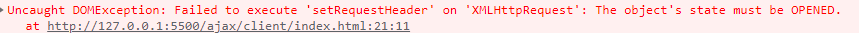

# Ajax

## 关于 readyState 状态值

全部 readyState 状态值都在 [XMLHTTPRequest.readyState](https://developer.mozilla.org/zh-CN/docs/Web/API/XMLHttpRequest#properties)，如下也是：

- 0 (未初始化) or (**请求还未初始化**)
- 1 (正在加载) or (**已建立服务器链接**)
- 2 (加载成功) or **(请求已接受**)
- 3 (交互) or (**正在处理请求**)
- 4 (完成) or (**请求已完成并且响应已准备好**)

XMLHttpRequest.readyState 属性返回一个 XMLHttpRequest 代理当前所处的状态。一个 XHR 代理总是处于下列状态中的一个：

| 值  | 状态             | 描述                                              |
| --- | ---------------- | ------------------------------------------------- |
| 0   | UNSENT           | 代理被创建，但尚未调用 open() 方法。              |
| 1   | OPENED           | open() 方法已经被调用。                           |
| 2   | HEADERS_RECEIVED | send() 方法已经被调用，并且头部和状态已经可获得。 |
| 3   | LOADING          | 下载中；responseText 属性已经包含部分数据。       |
| 4   | DONE             | 下载操作已完成。                                  |

进一步解释：

`readyState === 0`： 表示未初始化完成，也就是 open 方法还没有执行

`readyState === 1`： 表示配置信息已经完成，也就是执行完 open 之后

`readyState === 2`： 表示 send 方法已经执行完成

`readyState === 3`： 表示正在解析响应内容

`readyState === 4`： 表示响应内容已经解析完毕，可以在客户端使用了

作者：陆荣涛 链接：https://juejin.cn/post/6862882556145041416 来源：稀土掘金 著作权归作者所有。商业转载请联系作者获得授权，非商业转载请注明出处。

## 同比 axios

> [Axios 和 Ajax 的区别是什么](https://blog.csdn.net/qq_45037155/article/details/126829429)

## 介绍

> AJAX 全称为 Asynchronous JavaScript And XML，就是异步的 JS 和 XML。通过 AJAX 可以在浏览器中向服务器发送异步请求，最大的优势：无刷新获取数据。AJAX 不是新的编程语言，而是一种将现有的标准组合在一起使用的新方式。
>
> 摘录自：https://juejin.cn/post/6997333407583862814

## 特点

- 无需刷新页面与服务器端进行通信
- 允许你根据用户事件来更新部门页面的内容

## 缺点

- 没有浏览器历史，不能回退
- 存在跨域问题
- SEO 不友好

## 使用

> 创建 XMLHttpRequest 对象 --> 执行 open,创建连接 --> 发送请求到服务器(send) --> 响应结果
>
> 下述代码还包含了：超时，网络异常处理
>
> 其中，关于超时，这里设置的超时只是针对客户端，当超过给定的时间后，客户端将不再处理该请求了，但是服务端还是在执行这个请求，还是会去做相应的处理；

```JavaScript
  // 创建XMLHttpRequest
      const xhr = new XMLHttpRequest();
      // 设置超时时间
      xhr.timeout = 2000;
      // 超时回调
      xhr.addEventListener('timeout', function () {
        alert('网络超时');
      });

      // 网络异常
      xhr.addEventListener('error', function() {
          alert("网络异常");
      })

      xhr.open('get', 'http://localhost:8080');
      xhr.send();
      xhr.addEventListener('readystatechange', function () {
        // readystate值
        console.log('readyState=', xhr.readyState);
        console.log('status=', xhr.status);
        console.log('response=', xhr.response);
        if(xhr.readyState === 4) {
            if(xhr.status >= 200 && xhr.status < 300) {
                console.log(xhr.response);
            }
        }
      });
```

### 设置请求头

```JavaScript
xhr.setRequestHeader(key, value);
```

注意，在设置自定义请求头的时候，需要在后端那里设置： ‘Access-Control-Allow-Headers: '\*' ’否则会报错


同时还要注意，必须在 xhr 执行 open 之后才能设置对应的请求头，不然也会报错



### 服务端响应 JSON 数据

方式一：

在接收数据的时候进行 JSON 解析

```JavaScript
JSON.parse(xhr.response)
```

方式二：

设置响应体类型

```JavaScript
xhr.responseType = 'json'
```

### 关于 IE 缓存问题

在 IE 浏览器中，发送 Ajax 请求回来的数据会被缓存，导致在某些时效性比较强的场景下会得到错误的数据。因此需要在`url`中携带一个表示时间戳的参数，使得 IE 浏览器认为每次都在发送不同的请求：

```JavaScript
 xhr.open('get', 'http://127.0.0.1:8282/json-data?t='+Date.now())
```

### 取消请求

同超时一样，虽然客户端取消了请求，不再接收返回的内容，但是在服务端，请求还是被处理，还是回去执行对应的代码

```JavaScript
xhr.abort();
```

Ps:

https://blog.csdn.net/qq_43842093/article/details/127469514

在实际使用过程中，我们会发现浏览器中发送了一个预检请求：OPTIONS；

- 发送预检请求的条件：

w3c 规范要求，对**复杂请求**，浏览器必须先使用 options 发起一个预检请求，从而获知服务器是否允许该跨域请求，服务器确认以后才能发起实际的 HTTP 请求，否则停止第二次正式请求

- 复杂请求
  - 请求方法不是 **get head post**
  - post 的 content-type 不是 **application/x-www-form-urlencode**, **multipart/form-data**, text/plain [也就是把 content-type 设置成"**application/json**"]
  - 请求设置了自定义的 header 字段: 比如业务需求，传一个字段，方便后端获取，不需要每个接口都传
- 注意简单请求是不会发送预检请求的

## 请求类型

可能在我们的印象中，前端发起网络请求，都是被认为是一个异步任务的，但是查看 MDN 文档之后，发现事实并非如此：

> 通过 `XMLHttpRequest` 生成的请求可以有两种方式来获取数据，异步模式或同步模式。请求的类型是由这个 `XMLHttpRequest` 对象的 [open()](https://developer.mozilla.org/zh-CN/docs/Web/API/XMLHttpRequest/open) 方法的第三个参数`async`的值决定的。如果该参数的值为 `false`，则该 `XMLHttpRequest`请求以同步模式进行，否则该过程将以异步模式完成。这两种类型请求的详细讨论和指南可以在[同步和异步请求](https://developer.mozilla.org/zh-CN/docs/Web/API/XMLHttpRequest/Synchronous_and_Asynchronous_Requests)页找到。

```JavaScript
xhr.open(requestMethod, url, async: Boolean) // 默认为异步请求（async: true）
```

但是，MDN 还是给出一个注意事项：

备注： **由于对用户体验的负面影响，从 Gecko 30.0 版本开始，在主线程上的同步请求已经被弃用**。

一个简单的 ajax 封装

```JavaScript
// 封装一个ajax请求

const METHODS = {
  GET: 'GET',
  POST: 'POST',
  PUT: 'PUT',
  DELETE: 'DELETE'
};

function request(options) {
  // 定义一些默认值
  let defaultOptions = {
    url: '',
    type: METHODS.GET, // 默认设置为GET请求
    async: true, // 默认设置为异步， sync 表示同步，async表示异步
    data: '',
    dataType: 'string', // 默认不需要执行json.parse
    success: () => {}
  };

  // url必选
  if (options && !isEmpty(options.url)) {
    throw new Error('url must not be empty');
  }

  // 合并defaultOptions和customOptions
  const activeOptions = mergeOptions(defaultOptions, options);

  if (
    !(
      (typeof defaultOptions.data === 'string' &&
        /^(\w+=\w+&?)*$/.test(defaultOptions.data)) ||
      isObject(defaultOptions.data)
    ) &&
    (toUpperCase(activeOptions.type) === METHODS.POST ||
      toUpperCase(activeOptions.type) === METHODS.PUT)
  ) {
    throw new TypeError('data type must be string or object');
  }

  // 对于async这个属性值，也是只能为Boolean类型，可以做一个校验，此处省略

  // 判断type
  if (isEmpty(activeOptions.type)) {
    throw new Error('type must not be empty');
  }
  if (
    toUpperCase(activeOptions.type) === METHODS.GET ||
    toUpperCase(activeOptions.type) === METHODS.DELETE
  ) {
    activeOptions.data = null;
  }

  // 判断sucess是否为函数
  if (!isFunction(activeOptions.success)) {
    throw new TypeError('success must be a function');
  }

  // 处理data为Object时
  if (isObject(activeOptions.data)) {
    activeOptions.data = JSON.stringify(activeOptions.data);
  }

  // 创建一个ajax实例
  function createAjax() {
    if (XMLHttpRequest) {
      return new XMLHttpRequest();
    }
    return new ActiveXObject('Microsoft.XMLHTTP');
  }

  const xhr = createAjax();

  // 这里可以设置一些超时，异常处理等

  // open
  xhr.open(activeOptions.type, activeOptions.url, activeOptions.async);

  // 这里可以设置一些自定义的请求头，注意设置自定义的请求头，需要放到open之后

  // send
  xhr.send(activeOptions.data);

  xhr.onreadystatechange = function () {
    if (xhr.readyState === 4) {
      if (xhr.status === 200) {
        //成功回调
        activeOptions.success();
      } else if (xhr.status === 'otherCode') {
        // 其他的处理
      } else {
        // 或者一些异常处理
      }
    }
  };

  return xhr; // 返回对应的实例
}

// 合并
function mergeOptions(defaultOptions, options) {
  let activeOptions = Object.assign({}, defaultOptions); // 这里还是一个浅拷贝，对于defaultOptions如果存在引用类型，那么修改这个，还是会影响defaultOptions
  if (isObject(options)) {
    for (let key in options) {
      activeOptions[key] = options;
    }
  }
  return activeOptions;
}

// 判断对象类型
function isObject(option) {
  if (Object.prototype.toString.call(option) === '[object Object]') {
    return true;
  }
  return false;
}

// 判断是否为函数
function isFunction(option) {
  if (Object.prototype.toString.call(option) === '[object Function]') {
    return true;
  }
  return false;
}

// 判断值是否为空
function isEmpty(value) {
  if (value === '' || value === null || value === undefined) {
    return true;
  }
  return false;
}

// 大写字母
function toUpperCase(value) {
  if (typeof value === 'string') {
    return value.toUpperCase();
  }
  return value;
}
```
