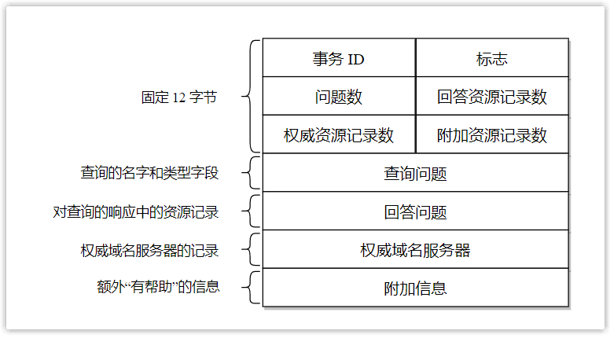
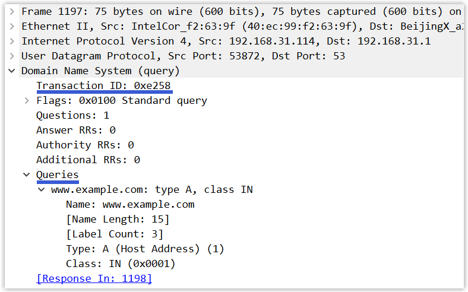
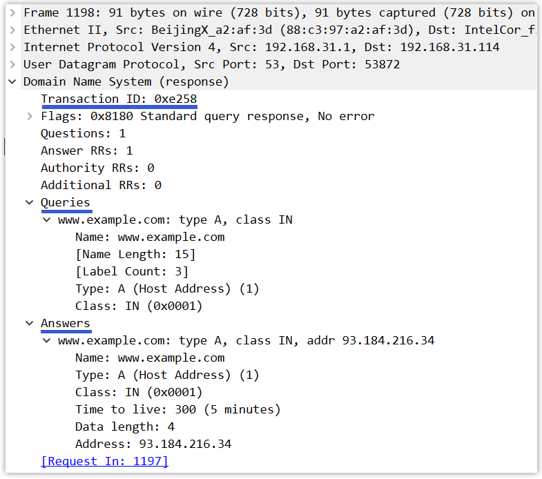
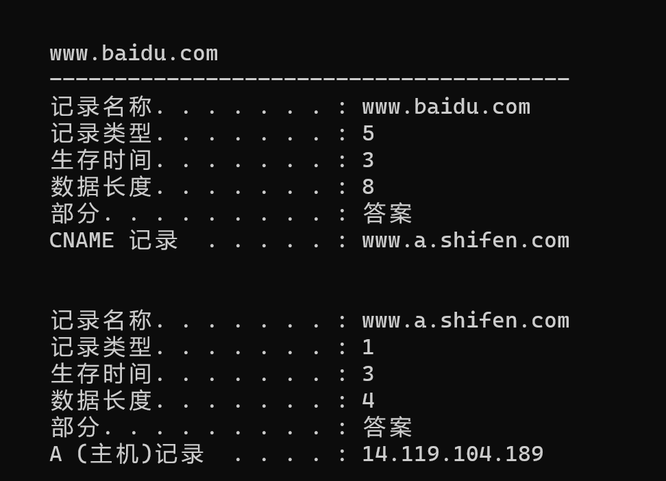

# DNS

## **DNS 协议的概念**

**概念**： DNS 是域名系统 (Domain Name System) 的缩写，提供的是**一种主机名到 IP 地址的转换服务**，就是我们常说的域名系统。它是一个**由分层的 DNS 服务器组成的分布式数据库**，是定义了主机如何查询这个分布式数据库的方式的**应用层协议**。能够使人更方便的访问互联网，而不用去记住能够被机器直接读取的 IP 数串。 **作用**： 将域名解析为 IP 地址，客户端向 DNS 服务器（DNS 服务器有自己的 IP 地址）发送域名查询请求，DNS 服务器告知客户机 Web 服务器的 IP 地址。

由于域名非常非常多，如果都存放在一台域名服务器中，那么不仅查询速度慢，服务器压力大，而且难以保证服务的可靠性。因此，**DNS 采用了分布式的设计方案，大量的域名服务器之间通过\*\***`层次`\***\*方式组织，分布在全世界范围内。**

一般而言，域名服务器可以分为以下四类：

- `根域名服务器`：最高层级的域名服务器，因特网上一共有 13 个根域名服务器（以英文字母 A 到 M 依序命名，格式为[a~m].root-servers.net），**每个根域名服务器都知道所有顶级域名服务器的 IP 地址**，比如知道负责 com 域的顶级域名服务器的 IP 地址。
- `顶级域名服务器`：对于每个顶级域名，如 com、org、edu 等，都有对应的顶级域名服务器。**顶级域名服务器知道其所管理的所有权威域名服务器的 IP 地址**，比如负责 com 域的顶级域名服务器知道负责 baidu.com 域的权威域名服务器的 IP 地址。
- `权威域名服务器`：一个网站需要将其域名和 IP 地址注册到相应的权威域名服务器中，比如网站 [www.baidu.com](https://hd.nowcoder.com/link.html?target=http://www.baidu.com) 的域名和 IP 地址就存储在负责 baidu.com 域的权威域名服务器中。
- `本地域名服务器`：本地域名服务器不属于上述域名服务器的层次结构，但是它对域名系统非常重要。每个 ISP（如一个大学、一个公司）都有一个本地域名服务器（也叫默认域名服务器）。

## **DNS 同时使用 TCP 和 UDP 协议**

**DNS 占用 53 号端口，同时使用 TCP 和 UDP 协议。**

（1）在区域传输的时候使用 TCP 协议 ● 辅域名服务器会定时（一般 3 小时）向主域名服务器进行查询以便了解数据是否有变动。如有变动，会执行一次区域传送，进行数据同步。区域传送使用 TCP 而不是 UDP，因为数据同步传送的数据量比一个请求应答的数据量要多得多。 ●TCP 是一种可靠连接，保证了数据的准确性。

（2）在域名解析的时候使用 UDP 协议 ● 客户端向 DNS 服务器查询域名，一般返回的内容都不超过 512 字节，用 UDP 传输即可。不用经过三次握手，这样 DNS 服务器负载更低，响应更快。理论上说，客户端也可以指定向 DNS 服务器查询时用 TCP，但事实上，很多 DNS 服务器进行配置的时候，仅支持 UDP 查询包。

## **DNS 完整的查询过程**

DNS 服务器解析域名的过程：

- 首先会在**浏览器的缓存**中查找对应的 IP 地址，如果查找到直接返回，若找不到继续下一步；
- 将请求发送给**本地 DNS 服务器**，在本地域名服务器缓存中查询，如果查找到，就直接将查找结果返回，若找不到继续下一步；
- 本地 DNS 服务器向**根域名服务器**发送请求，根域名服务器会返回一个所查询域的顶级域名服务器地址；
- 本地 DNS 服务器向**顶级域名服务器**发送请求，接受请求的服务器查询自己的缓存，如果有记录，就返回查询结果，如果没有就返回相关的下一级的权威域名服务器的地址；
- 本地 DNS 服务器向**权威域名服务器**发送请求，域名服务器返回对应的结果；
- 本地 DNS 服务器将返回结果保存在缓存中，便于下次使用；
- 本地 DNS 服务器将返回结果返回给浏览器；

比如我们如果想要查询 [www.baidu.com](http://www.baidu.com/) 的 IP 地址，我们首先会在浏览器的缓存中查找是否有该域名的缓存，如果不存在就将请求发送到本地的 DNS 服务器中，本地 DNS 服务器会判断是否存在该域名的缓存，如果不存在，则向根域名服务器发送一个请求，根域名服务器返回负责 .com 的顶级域名服务器的 IP 地址的列表。然后本地 DNS 服务器再向其中一个负责 .com 的顶级域名服务器发送一个请求，负责 .com 的顶级域名服务器返回负责 .baidu 的权威域名服务器的 IP 地址列表。然后本地 DNS 服务器再向其中一个权威域名服务器发送一个请求，最后权威域名服务器返回一个对应的主机名的 IP 地址列表。

## **迭代查询与递归查询**

- **递归查询**指的是查询请求发出后，域名服务器代为向下一级域名服务器发出请求，最后向用户返回查询的最终结果。使用递归 查询，用户只需要发出一次查询请求。
- **迭代查询**指的是查询请求后，域名服务器返回单次查询的结果。下一级的查询由用户自己请求。使用迭代查询，用户需要发出 多次的查询请求。

一般我们向本地 DNS 服务器发送请求的方式就是递归查询，因为我们只需要发出一次请求，然后本地 DNS 服务器返回给我 们最终的请求结果。而本地 DNS 服务器向其他域名服务器请求的过程是迭代查询的过程，因为每一次域名服务器只返回单次 查询的结果，下一级的查询由本地 DNS 服务器自己进行。

## **DNS 记录和报文**

DNS 服务器中以资源记录的形式存储信息，每一个 DNS 响应报文一般包含多条资源记录。一条资源记录的具体的格式为 （Name，Value，Type，TTL） 其中 TTL 是资源记录的生存时间，它定义了资源记录能够被其他的 DNS 服务器缓存多长时间。 常用的一共有四种 Type 的值，分别是 A、NS、CNAME 和 MX ，不同 Type 的值，对应资源记录代表的意义不同。

- 如果 Type = A，则 Name 是主机名，Value 是主机名对应的 IP 地址。因此一条记录为 A 的资源记录，提供了标 准的主机名到 IP 地址的映射。
- 如果 Type = NS，则 Name 是个域名，Value 是负责该域名的 DNS 服务器的主机名。这个记录主要用于 DNS 链式 查询时，返回下一级需要查询的 DNS 服务器的信息。
- 如果 Type = CNAME，则 Name 为别名，Value 为该主机的规范主机名。该条记录用于向查询的主机返回一个主机名 对应的规范主机名，从而告诉查询主机去查询这个主机名的 IP 地址。主机别名主要是为了通过给一些复杂的主机名提供 一个便于记忆的简单的别名。
- 如果 Type = MX，则 Name 为一个邮件服务器的别名，Value 为邮件服务器的规范主机名。它的作用和 CNAME 是一 样的，都是为了解决规范主机名不利于记忆的缺点。

如果一台域名服务器是用于某特定域名的权威域名服务器，那么其将会有一条包含该域名的 A 记录。

如果一台域名服务器不是用于某特定域名的权威域名服务器，那么其将包含一条 NS 记录，该记录用来指定该域名由哪个域名服务器来进行解析；除此之外，它还将包含一条 A 记录，该记录提供了在 NS 记录中 Value 字段中的域名服务器的 IP 地址。

接下来介绍一下 DNS 报文的具体内容。DNS 报文分为两类：**查询报文**和**回答报文**，二者有着相同的格式，如下图所示：

- `事务 ID`：用于标识 DNS 查询的标识符。查询报文和其对应的回答报文有着相同的事务 ID，因此通过它可以区分 DNS 回答报文是对哪个请求进行响应的。
- `标志`：此字段中含有若干标志，比如有一个『QR』标志位用于指出此报文是查询报文（0）还是回答报文（1），再比如有一个『TC』标志位用于指出此报文长度是否大于 512 字节。
- `问题数`：对应于下面查询问题的数量（支持同时查询多个域名，通常为一个）。
- `回答资源记录数`：对应于下面回答问题相关资源记录的数量（一个域名可能有多个 IP 对应，那么将会有多个回答记录）。
- `权威资源记录数`：对应于下面权威域名服务器相关资源记录的数量。
- `附加资源记录数`：对应于下面附加信息相关资源记录的数量。
- `查询问题`：此区域为查询内容，包含查询域名和查询类型（如 _[www.example.com，A_）。](https://hd.nowcoder.com/link.html?target=http://www.example.com，A*）。)
- `回答问题`：此区域为查询结果，包含一到多条资源记录（如 _[www.example.com，93.184.216.34，](https://hd.nowcoder.com/link.html?target=http://www.example.com，93.184.216.34，)_ _A，300_）。
- `权威域名服务器`：此区域为其他权威域名服务器的记录，即含有指向权威域名服务器的资源记录，用以继续解析过程。（如 _baidu.com**，**ns1.baidu.com\*\*，NS，172800_）。
- `附加信息`：此区域为其他有帮助的信息，比如提供权威域名服务器所对应的 IP 地址。

最后，使用 Wireshark 抓一个 DNS 查询报文和回答报文：

**查询报文：**

**回答报文：**

## 提升域名解析速度

### TCP or UDP

TCP 相比于 UDP 更可靠，但是速度会更慢。

DNS 应该采用哪个传输层协议：

- 如果采用 TCP 协议，不仅需要进行三次握手建立连接，而且需要进行拥塞控制等，那么域名解析速度将特别慢，不利于用户体验；
- 如果采用 UDP 协议，存在丢包问题，如果解析不出来 IP，无法正常访问网站，不利于用户体验。

实际上，**DNS 主要使用 UDP，在特殊情况下，也会使用 TCP，端口号都是 53。**

一般情况下，DNS 报文都比较小，**只需要一个包就能承载所有信息**。既然只有一个包，就无需考虑哪个包未送达，直接重发一个包即可，因此无需使用 TCP 那样复杂的协议，直接使用 UDP 协议，DNS 协议自己处理超时和重传问题，以提供可靠性服务。

当然有的时候 DNS 报文比较大，比如响应报文中可能一个域名包含有很多 IP 记录。当服务器响应时，会将报文中的 TC 标志位设置为 1，表示响应长度超过了 512 字节，此报文仅仅返回前 512 字节。当我们的主机收到响应后，就会使用 TCP 协议重发原来的查询请求，以获取完整报文。

**（数据包较小时，一般采用 UDP 协议，当数据包过大，会采用 TCP 协议）**

此外，为了**防止本地域名服务器（主域名服务器）宕机而导致无法对域名进行解析**，本机还需要设置一个**辅助域名服务器**。当主域名服务器宕机时，由辅助域名服务器继续提供域名解析的服务。辅助域名服务器会定时（通常是每隔 3 个小时）向主域名服务器发送查询请求以实现同步，此时传输数据较多，因而**使用 TCP 协议**。

### DNS 缓存

即使采用 UDP 协议，但是如果每次都需要从根服务器开始一层一层的查询，仍然很慢，且处于层级结构中的域名服务器将会接收到大量的请求，处理速度进一步降低！

为了提升域名解析速度并减轻域名服务器的压力，DNS 广泛使用了**缓存**技术。

当用户访问了某个网站后，本地域名服务器会将解析出的域名和 IP 地址的映射关系缓存一定时间。**在缓存过期前，用户再访问相同网站时，本地域名服务器就可以直接返回查询结果**，而无需再去询问根域名服务器、顶级域名服务器等，这样就能大大减少传输的 DNS 报文数量！

实际上，不仅在本地域名服务器中设置了高度缓存，用户主机也有缓存。对于 Windows 电脑，可以通过命令`ipconfig/displaydns`**查询当前 DNS 缓存**，比如当我访问了百度后，本机就会缓存以下信息：

缓存虽然提升了 DNS 解析速度，但并不能保证一致性，因为一个网站的域名和 IP 地址的映射关系并不是永久不变的，可能缓存的解析结果已失效，因而 DNS 缓存时间不能设置太大！

Windows 电脑也可以通过命令`ipconfig/flushdns`**清空本机缓存**。

### 切换本地域名服务器

在进行域名解析时，主机会向本地域名服务器发起`递归查询`，如果本地域名服务器的性能较差，或者未正确配置缓存，那么我们上网的速度将会变得非常慢，因此**选择一个好的本地域名服务器将有助于提升冲浪速度**！

默认情况下，本机在联网时会通过 DHCP 协议自动获得一个 DNS 服务器地址，那么如果此服务器性能不好，该如何更换呢？

以 Windows 为例，可以通过`控制面板`—>`网络和 Internet`—>`网络连接`—>`Internet 协议版本4(TCP/IPv4)`修改本地域名服务器的 IP 地址。

互联网上常见的**公共 DNS 服务器**的 IP 地址如下：

|        | 首选 DNS 服务器地址 | 备用 DNS 服务器地址 |
| ------ | ------------------- | ------------------- |
| 阿里   | 223.5.5.5           | 223.6.6.6           |
| 腾讯   | 119.29.29.29        | 182.254.116.116     |
| 百度   | 180.76.76.76        | 114.114.114.114     |
| 谷歌   | 8.8.8.8             | 8.8.4.4             |
| 114DNS | 114.114.114.114     | 114.114.115.115     |

一般情况下，自动获取的本地域名服务器与主机位于同一个子网中，速度都挺快的。但是如果在上网过程中，发现打开网页的速度很慢，也可以尝试使用上面的公共 DNS 服务器，说不定速度会有所改善。
