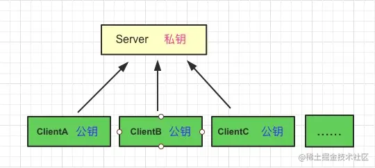

# HTTPS

## HTTP 是什么样的？

HTTP 是属于应用层的协议，它是基于 TCP/IP 的，所以它只是规定一些要传输的内容，以及头部信息，然后通过 TCP 协议进行传输，依靠 IP 协议进行寻址，通过一幅最简单的图来描述：

客户端发出请求，服务端响应请求。整个过程没有任何加密处理，所有都是不安全的，中间人可以进行拦截，获取传输和响应的数据，造成数据泄漏。

## 加密处理

由于上述的过程中，在传输数据时，是通过明文方式传输的，所以我们能想到的最简单的提高安全性的方法就是在传输前对数据进行加密。

#### 对称加密

##### 概念

上图展示的是一个典型的：**对称加密**方式，**加密和解密都是用的同一个密钥**。

一般我们的网站都是会被很多人浏览的，那么会有来自四面八方的主机向我们的服务器发送数据，那么此时我们为了保证每个主机的数据不被其他主机窃取，首先就要保证不同主机持有的加密密钥不一致。

但是这种处理方式，相信大家都能知道这样会增加服务器的处理压力。在密码学中，这也是对称加密存在的一个缺点之一。

##### 对称加密密钥如何传输

我们对每个客户端应用不同的对称加密秘钥，那么这个秘钥客户端或者服务端是如何知道的呢，只能是在一端生成一个秘钥，然后通过 HTTP 传输给另一端.

那么这个传输秘钥的过程，又如何保证加密？如果被中间人拦截，密钥也会被获取。也许你会说，对秘钥再进行加密，那又如何保证对秘钥加密的过程，是加密的呢？

好像我们走入了 **while(1)**，出不来了。

#### 非对称加密

在对称加密无法实现有效传输密钥时，我们可以换个思路，也就是使用**非对称加密，**比如 RSA。

非对称加密：采用一对**公钥**和**私钥**。公钥加密的内容，只有私钥可以解开。私钥加密的内容，所有的公钥都可以解开（当然是指和私钥是一对的公钥）。

私钥只保存在服务器端，公钥可以发送给所有的客户端。

在传输公钥的过程中，肯定也会有被中间人获取的风险，但在目前的情况下，至少可以保证客户端通过公钥加密的内容，中间人是无法破解的，因为私钥只保存在服务器端，只有私钥可以破解公钥加密的内容。

现在我们还存在一个问题，就是如果公钥被中间人拿到篡改：

**MITM：**Man-in-the-MiddleAttack

客户端拿到的公钥是假的，如何解决这个问题？那么就引入下面的内容。

## 第三方认证

公钥被掉包，是因为客户端无法分辨传回公钥的到底是中间人，还是服务器，这也是密码学中的身份验证问题。

在 HTTPS 中，使用**证书+数字签名**来解决这个问题。

这里假设加密方式是 MD5，将**网站的信息加密**后通过**第三方机构的私钥再次进行加密**，生成**数字证书**。

**数字证书=网站信息+数字签名**

假如中间人拦截后把服务器的公钥替换为自己的公钥，因为数字签名的存在，会导致客户端验证签名不匹配，这样就防止了中间人替换公钥的问题。

浏览器安装后会内置一些权威第三方认证机构的公钥，比如 VerSign、Symanterc 以及 GloabalSgin 等等，验证签名的时候直接就从本地拿到相应的第三方机构的公钥，对私钥加密后的数字签名进行解密得到真正的签名，然后客户端利用签名生成规则进行签名生成，看两个签名是否匹配，如果匹配认证通过，不匹配则获取证书失败。

## 为什么要有签名

为什么需要数字签名？

第三方认证机构是一个开方的平台，我们可以去申请，中间人也可以去申请：

如果没有签名，只对网站信息进行第三方机构私钥加密的话，会存在下面的问题：

中间人也向第三方认证机构进行申请，然后拦截后把所有的信息都替换成自己的，客户端仍然可以解密，并且无法判断这是服务器还是中间人的，最后造成数据泄漏。

## HTTPS

HTTPS 就是使用 SSL/TLS 协议进行加密传输，让客户端拿到服务器的公钥，然后客户端随机生成一个对称加密的秘钥，使用公钥加密，传输给服务端，后续的所有信息都通过该对称秘钥进行加密解密，完成整个 HTTPS 的流程。

## TLS/SSL 协议

HTTPS 协议的主要功能基本都依赖于 TLS/SSL 协议，TLS/SSL 的功能实现主要依赖于三类基本算法：`散列函数` 、`对称加密`和`非对称加密`，其利用非对称加密实现身份认证和密钥协商，对称加密算法采用协商的密钥对数据加密，基于散列函数验证信息的完整性。

SSL 协议的握手过程

开始加密通信之前，客户端和服务器首先必须建立连接和交换参数，这个过程叫做握手（handshake）。

假定客户端叫做爱丽丝，服务器叫做鲍勃，整个握手过程可以用下图说明。

第一步，爱丽丝给出协议版本号、一个客户端生成的随机数（Client random），以及客户端支持的加密方法。

第二步，鲍勃确认双方使用的加密方法，并给出数字证书、以及一个服务器生成的随机数（Server random）。

第三步，爱丽丝确认数字证书有效，然后生成一个新的随机数（Premaster secret），并使用数字证书中的公钥，加密这个随机数，发给鲍勃。

第四步，鲍勃使用自己的私钥，获取爱丽丝发来的随机数（即 Premaster secret）。

第五步，爱丽丝和鲍勃根据约定的加密方法，使用前面的三个随机数，生成"对话密钥"（session key），用来加密接下来的整个对话过程。

## 引用

[看图学 HTTPS](https://juejin.cn/post/6844903608421449742)

[分分钟让你理解 HTTPS](https://juejin.cn/post/6844903599303032845)

[图解 SSL/TLS 协议](http://www.ruanyifeng.com/blog/2014/09/illustration-ssl.html)
