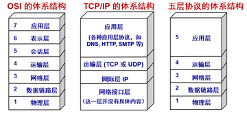
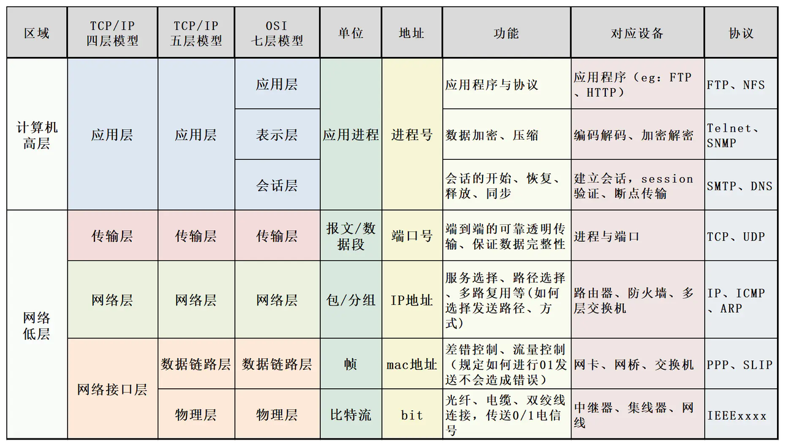
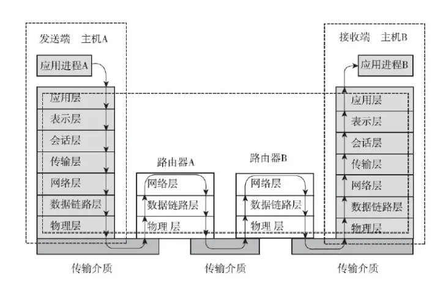

# 网络模型结构

### OSI 七层模型介绍

(1).应用层:

应用层被称为用户实体(AE)为应用程序提供网络服务，例如为文件的创数管理（FTAM）、电子文本信息 MHS）等提供公共的应用服务，同时当我们接收到网络发回的数据例如 mp4 文件,当返回是一系列的字符等相关的信息,这时候就有应用层进行解释然后展示给用户。

(2).表示层:

负责数据的压缩,加密等相关处理。当我们在进行较大图片或者视频或者重要信息例如密码之类的数据就会在这里进行一个压缩、加密处理，而由接收方进行一个逆过程的处理

(3)会话层

建立，管理，终止会话．**例如我们在使用浏览器访问淘宝网，你就建立一个会话，你正在查询你的购物车里有什么东西，这时候你朋友来用你的电脑，再一次又打开了一个淘宝首页．这时候又开启了一个会话，当你朋友发送请求时候，放回的数据这时候只会在他所在的界面进行渲染，而不会影响你所打开的界面，这就是会话．**

(４).传输层:

定义了一系列的数据传输协议与端口号,同时提供流量控制与差错校验,当数据包离开网卡就进入传输层，当我们发送的数据段过大时候，数据段就会进行一个分割处理发送，当到达目的地后再一次进行重组

（５）网络层

进行逻辑寻址，实现不同网络之间的一个路径选择．如图当我们再进行数据发送时候，中间可能会经过很多的路由器进行一个转发，而网络层就在此实现一个路径选择．再发送过程中不断寻址，拆解头部，重新封装寻址．

（６）数据链路层

将数据在物理层发送的 ０１ 数据制定传输的规则（制定多少个 ０１ 数据，要又什么样的规则才能保证这些 ０１ 数据不会乱套且对方能够读懂）**封装成帧**

（７）物理层

数据的传输总需要介质，因此所有的数据在这一层都会通过 ０１ 的电信号在双绞线，光纤，电缆进行一个发送。**发送比特流**
