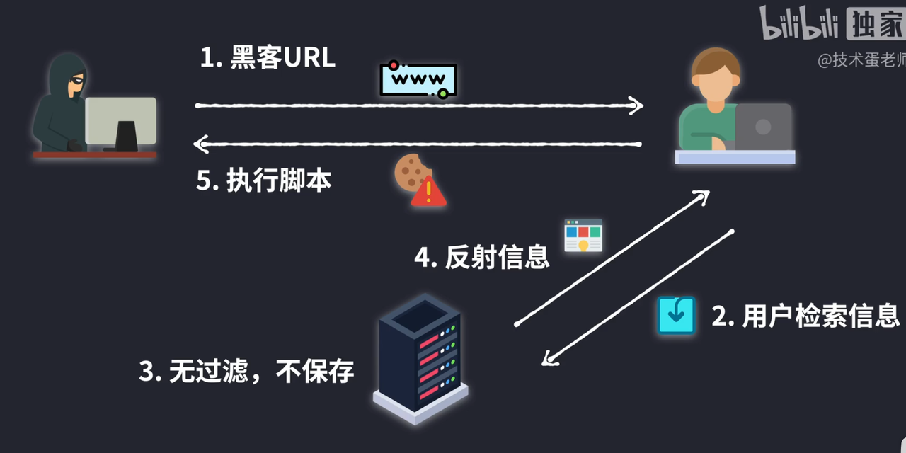
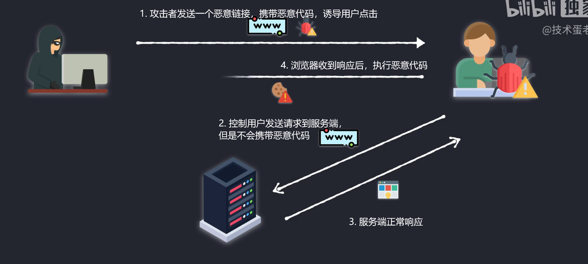

网络安全

> 随着 Web2.0、社交网络、[微博](https://baike.baidu.com/item/微博/58302300?fromModule=lemma_inlink)等等一系列新型的[互联网产品](https://baike.baidu.com/item/互联网产品/10881649?fromModule=lemma_inlink)的诞生，基于 Web 环境的互联网应用越来越广泛，[企业信息化](https://baike.baidu.com/item/企业信息化/613412?fromModule=lemma_inlink)的过程中各种应用都架设在 Web 平台上，Web 业务的迅速发展也引起[黑客](https://baike.baidu.com/item/黑客/118396?fromModule=lemma_inlink)们的强烈关注，接踵而至的就是 Web 安全威胁的凸显，黑客利用网站操作系统的漏洞和[Web 服务](https://baike.baidu.com/item/Web服务/2837593?fromModule=lemma_inlink)程序的 SQL 注入漏洞等得到[Web 服务器](https://baike.baidu.com/item/Web服务器/8390210?fromModule=lemma_inlink)的控制权限，轻则篡改网页内容，重则窃取重要内部数据，更为严重的则是在网页中植入[恶意代码](https://baike.baidu.com/item/恶意代码?fromModule=lemma_inlink)，使得网站访问者受到侵害。这也使得越来越多的用户关注应用层的安全问题，对 Web 应用安全的[关注度](https://baike.baidu.com/item/关注度/5103138?fromModule=lemma_inlink)也逐渐升温。

## 跨站脚本攻击(XSS)

> 引用：https://tech.meituan.com/2018/09/27/fe-security.html

Cross-Site Scripting（跨站脚本攻击）简称 XSS，是一种**代码注入攻击**。攻击者通过在目标网站上注入恶意脚本，使之在用户的浏览器上运行。利用这些恶意脚本，攻击者可获取用户的敏感信息如 Cookie、SessionID 等，进而危害数据安全。

为了和 CSS 区分，这里把攻击的第一个字母改成了 X，于是叫做 XSS。

XSS 的本质是：恶意代码未经过滤，与网站正常的代码混在一起；浏览器无法分辨哪些脚本是可信的，导致恶意脚本被执行。

根据攻击的来源，XSS 攻击可分为存储型、反射型和 DOM 型三种。

### 反射型



反射型 XSS 的攻击步骤：

1. 攻击者构造出特殊的 URL，其中包含恶意代码。
2. 用户打开带有恶意代码的 URL 时，网站服务端将恶意代码从 URL 中取出，拼接在 HTML 中返回给浏览器。
3. 用户浏览器接收到响应后解析执行，混在其中的恶意代码也被执行。
4. 恶意代码窃取用户数据并发送到攻击者的网站，或者冒充用户的行为，调用目标网站接口执行攻击者指定的操作。

反射型 XSS 跟存储型 XSS 的区别是：存储型 XSS 的恶意代码存在数据库里，反射型 XSS 的恶意代码存在 URL 里。

反射型 XSS 漏洞常见于通过 URL 传递参数的功能，如网站搜索、跳转等。

由于需要用户主动打开恶意的 URL 才能生效，攻击者往往会结合多种手段诱导用户点击。

POST 的内容也可以触发反射型 XSS，只不过其触发条件比较苛刻（需要构造表单提交页面，并引导用户点击），所以非常少见。

### 存储型

存储型 XSS 的攻击步骤：

1. 攻击者将恶意代码提交到目标网站的数据库中。
2. 用户打开目标网站时，网站服务端将恶意代码从数据库取出，拼接在 HTML 中返回给浏览器。
3. 用户浏览器接收到响应后解析执行，混在其中的恶意代码也被执行。
4. 恶意代码窃取用户数据并发送到攻击者的网站，或者冒充用户的行为，调用目标网站接口执行攻击者指定的操作。

这种攻击常见于带有用户保存数据的网站功能，如论坛发帖、商品评论、用户私信等。

### DOM 型

DOM 型 XSS 的攻击步骤：

1. 攻击者构造出特殊的 URL，其中包含恶意代码。
2. 用户打开带有恶意代码的 URL。
3. 用户浏览器接收到响应后解析执行，前端 JavaScript 取出 URL 中的恶意代码并执行。
4. 恶意代码窃取用户数据并发送到攻击者的网站，或者冒充用户的行为，调用目标网站接口执行攻击者指定的操作。

DOM 型 XSS 跟前两种 XSS 的区别：DOM 型 XSS 攻击中，取出和执行恶意代码由浏览器端完成，属于前端 JavaScript 自身的安全漏洞，而其他两种 XSS 都属于服务端的安全漏洞。



关于这三种攻击的理解，可以参考 B 站视频：

https://www.bilibili.com/video/BV1rg411v7B8/?spm_id_from=333.337.search-card.all.click&vd_source=08a0c62bb7d988bf53d634998054046b

### 预防

存储型和反射型 XSS 都是在服务端取出恶意代码后，插入到响应 HTML 里的，攻击者刻意编写的“数据”被内嵌到“代码”中，被浏览器所执行。

预防这两种漏洞，有两种常见做法：

- 改成纯前端渲染，把代码和数据分隔开。
- 对 HTML 做充分转义。

#### 纯前端渲染

纯前端渲染的过程：

1. 浏览器先加载一个静态 HTML，此 HTML 中不包含任何跟业务相关的数据。
2. 然后浏览器执行 HTML 中的 JavaScript。
3. JavaScript 通过 Ajax 加载业务数据，调用 DOM API 更新到页面上。

在纯前端渲染中，我们会明确的告诉浏览器：下面要设置的内容是文本（`.innerText`），还是属性（`.setAttribute`），还是样式（`.style`）等等。浏览器不会被轻易的被欺骗，执行预期外的代码了。

但纯前端渲染还需注意避免 DOM 型 XSS 漏洞（例如 `onload` 事件和 `href` 中的 `javascript:xxx` 等，请参考下文”预防 DOM 型 XSS 攻击“部分）。

在很多内部、管理系统中，采用纯前端渲染是非常合适的。但对于性能要求高，或有 SEO 需求的页面，我们仍然要面对拼接 HTML 的问题。

#### 转义 HTML

如果拼接 HTML 是必要的，就需要采用合适的转义库，对 HTML 模板各处插入点进行充分的转义。

常用的模板引擎，如 doT.js、ejs、FreeMarker 等，对于 HTML 转义通常只有一个规则，就是把 `& < > " ' /` 这几个字符转义掉，确实能起到一定的 XSS 防护作用，但并不完善；所以要完善 XSS 防护措施，我们要使用更完善更细致的转义策略。

#### 预防 DOM 型 XSS 攻击

DOM 型 XSS 攻击，实际上就是网站前端 JavaScript 代码本身不够严谨，把不可信的数据当作代码执行了。

在使用 `.innerHTML`、`.outerHTML`、`document.write()` 时要特别小心，不要把不可信的数据作为 HTML 插到页面上，而应尽量使用 `.textContent`、`.setAttribute()` 等。

如果用 Vue/React 技术栈，并且不使用 `v-html`/`dangerouslySetInnerHTML` 功能，就在前端 render 阶段避免 `innerHTML`、`outerHTML` 的 XSS 隐患。

DOM 中的内联事件监听器，如 `location`、`onclick`、`onerror`、`onload`、`onmouseover` 等，`<a>` 标签的 `href` 属性，JavaScript 的 `eval()`、`setTimeout()`、`setInterval()` 等，都能把字符串作为代码运行。如果不可信的数据拼接到字符串中传递给这些 API，很容易产生安全隐患，请务必避免。

## 跨站请求伪造(XSRF)

CSRF（Cross-site request forgery）跨站请求伪造：攻击者诱导受害者进入第三方网站，在第三方网站中，向被攻击网站发送跨站请求。利用受害者在被攻击网站已经获取的注册凭证，绕过后台的用户验证，达到冒充用户对被攻击的网站执行某项操作的目的。

一个典型的 CSRF 攻击有着如下的流程：

- 受害者登录 a.com，并保留了登录凭证（Cookie）。
- 攻击者引诱受害者访问了 b.com。
- b.com 向 a.com 发送了一个请求：a.com/act=xx。浏览器会默认携带 a.com 的 Cookie。
- a.com 接收到请求后，对请求进行验证，并确认是受害者的凭证，误以为是受害者自己发送的请求。
- a.com 以受害者的名义执行了 act=xx。
- 攻击完成，攻击者在受害者不知情的情况下，冒充受害者，让 a.com 执行了自己定义的操作。

### 几种常见的攻击类型

**GET 类型的 CSRF**

GET 类型的 CSRF 利用非常简单，只需要一个 HTTP 请求，一般会这样利用：

```HTML
 

```

在受害者访问含有这个 img 的页面后，浏览器会自动向`http://bank.example/withdraw?account=xiaoming&amount=10000&for=hacker`发出一次 HTTP 请求。bank.example 就会收到包含受害者登录信息的一次跨域请求。

**POST 类型的 CSRF**

这种类型的 CSRF 利用起来通常使用的是一个自动提交的表单，如：

```HTML
 <form action="http://bank.example/withdraw" method=POST>
 <input type="hidden" name="account" value="xiaoming" />
 <input type="hidden" name="amount" value="10000" />
 <input type="hidden" name="for" value="hacker" />
 </form>
 <script> document.forms[0].submit(); </script>
```

访问该页面后，表单会自动提交，相当于模拟用户完成了一次 POST 操作。

POST 类型的攻击通常比 GET 要求更加严格一点，但仍并不复杂。任何个人网站、博客，被黑客上传页面的网站都有可能是发起攻击的来源，后端接口不能将安全寄托在仅允许 POST 上面。

**链接类型的 CSRF**

链接类型的 CSRF 并不常见，比起其他两种用户打开页面就中招的情况，这种需要用户点击链接才会触发。这种类型通常是在论坛中发布的图片中嵌入恶意链接，或者以广告的形式诱导用户中招，攻击者通常会以比较夸张的词语诱骗用户点击，例如：

```HTML
  <a href="http://test.com/csrf/withdraw.php?amount=1000&for=hacker" taget="_blank">
  重磅消息！！
  <a/>
```

由于之前用户登录了信任的网站 A，并且保存登录状态，只要用户主动访问上面的这个 PHP 页面，则表示攻击成功。

### CSRF 的特点

- 攻击一般发起在第三方网站，而不是被攻击的网站。被攻击的网站无法防止攻击发生。
- 攻击利用受害者在被攻击网站的登录凭证，冒充受害者提交操作；而不是直接窃取数据。
- 整个过程攻击者并不能获取到受害者的登录凭证，仅仅是“冒用”。
- 跨站请求可以用各种方式：图片 URL、超链接、CORS、Form 提交等等。部分请求方式可以直接嵌入在第三方论坛、文章中，难以进行追踪。

CSRF 通常是跨域的，因为外域通常更容易被攻击者掌控。但是如果本域下有容易被利用的功能，比如可以发图和链接的论坛和评论区，攻击可以直接在本域下进行，而且这种攻击更加危险。

### 防护策略

> 引用：https://tech.meituan.com/2018/10/11/fe-security-csrf.html

CSRF 通常从第三方网站发起，被攻击的网站无法防止攻击发生，只能通过增强自己网站针对 CSRF 的防护能力来提升安全性。

上文中讲了 CSRF 的两个特点：

- CSRF（通常）发生在第三方域名。
- CSRF 攻击者不能获取到 Cookie 等信息，只是使用。

针对这两点，我们可以专门制定防护策略，如下：

- 阻止不明外域的访问
  - 同源检测
  - Samesite Cookie
- 提交时要求附加本域才能获取的信息
  - CSRF Token
  - 双重 Cookie 验证

1. 点击劫持

点击劫持是指在一个 Web 页面中隐藏了一个透明的 iframe，用外层假页面诱导用户点击，实际上是在隐藏的 frame 上触发了点击事件进行一些用户不知情的操作。

#### 典型点击劫持攻击流程

1. 攻击者构建了一个非常有吸引力的网页【不知道哪些内容对你们来说有吸引力，我就不写页面了，偷个懒】
2. 将被攻击的页面放置在当前页面的 `iframe` 中
3. 使用样式将 iframe 叠加到非常有吸引力内容的上方
4. 将 iframe 设置为 100%透明
5. 你被诱导点击了网页内容，你以为你点击的是\*\*\*，而实际上，你成功被攻击了。

## 点击劫持防御

> 引用：https://juejin.cn/post/6844903842635579405

点击劫持是指在一个 Web 页面中隐藏了一个透明的 iframe，用外层假页面诱导用户点击，实际上是在隐藏的 frame 上触发了点击事件进行一些用户不知情的操作。

#### 典型点击劫持攻击流程

1. 攻击者构建了一个非常有吸引力的网页【不知道哪些内容对你们来说有吸引力，我就不写页面了，偷个懒】
2. 将被攻击的页面放置在当前页面的 `iframe` 中
3. 使用样式将 iframe 叠加到非常有吸引力内容的上方
4. 将 iframe 设置为 100%透明
5. 你被诱导点击了网页内容，你以为你点击的是\*\*\*，而实际上，你成功被攻击了。

**1. frame busting**

```JavaScript
if ( top.location != window.location ){    top.location = window.location}
```

需要注意的是: HTML5 中 iframe 的 `sandbox` 属性、IE 中 iframe 的`security` 属性等，都可以限制 iframe 页面中的 JavaScript 脚本执行，从而可以使得 frame busting 失效。

**2. X-Frame-Options**

X-FRAME-OPTIONS 是微软提出的一个 http 头，专门用来防御利用 iframe 嵌套的点击劫持攻击。并且在 IE8、Firefox3.6、Chrome4 以上的版本均能很好的支持。

可以设置为以下值:

- DENY: 拒绝任何域加载
- SAMEORIGIN: 允许同源域下加载
- ALLOW-FROM: 可以定义允许 frame 加载的页面地址
