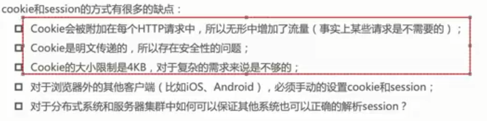
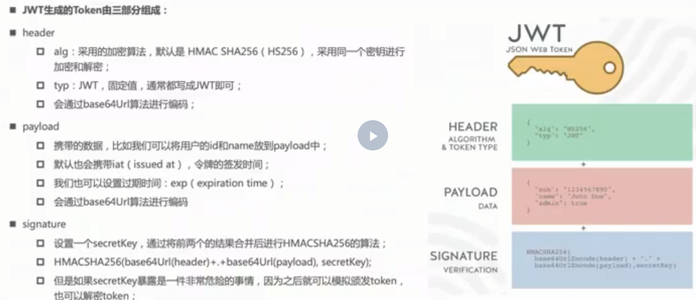

# session&cookies 与 token

## 1. session&cookies 的缺点



- Cookies 会被附加到每个 http 请求中，所以无形中增加了流量（事实上某些请求是不需要的）；
- Cookies 是明文传递的，所以存在安全性的问题；
- Cookies 的大小限制式 4KB， 对于复杂的需求来说是不够的；
- 对于浏览器外的其他客户端（比如 IOS，Android）,必须手动的设置 cookies 和 session;
- 对于分布式系统和服务器集群中如何可以保证其他系统也可以正确的解析 session.

## 2. Token

**优点**

> 1. 支持跨域访问: Cookie 是不允许垮域访问的，token 支持；
> 2. 无状态： token 无状态，session 有状态的；
> 3. 去耦: 不需要绑定到一个特定的身份验证方案。Token 可以在任何地方生成，只要在 你的 API 被调用的时候， 你可以进行 Token 生成调用即可；
> 4. 更适用于移动应用: Cookie 不支持手机端访问的；
> 5. 性能: 在网络传输的过程中，性能更好；
> 6. 基于标准化: 你的 API 可以采用标准化的 JSON Web Token (JWT). 这个标准已经存在 多个后端库（.NET, Ruby, Java,Python, PHP）和多家公司的支持（如： Firebase,Google, Microsoft）。

**缺点**

> 1. 占带宽，正常情况下要比 session_id 更大，需要消耗更多流量，挤占更多带宽，假如你的网站每月有 10 万次的浏览器，就意味着要多开销几十兆的流量。听起来并不多，但日积月累也是不小一笔开销。实际上，许多人会在 JWT 中存储的信息会更多；
> 2. 无法在服务端注销，那么久很难解决劫持问题；
> 3. 性能问题，JWT 的卖点之一就是加密签名，由于这个特性，接收方得以验证 JWT 是否有效且被信任。但是大多数 Web 身份认证应用中，JWT 都会被存储到 Cookie 中，这就是说你有了两个层面的签名。听着似乎很牛逼，但是没有任何优势，为此，你需要花费两倍的 CPU 开销来验证签名。对于有着严格性能要求的 Web 应用，这并不理想，尤其对于单线程环境。

## 3. JWT 实现 Token 机制



## 4. Openssl

使用博客： https://blog.csdn.net/qq_27706119/article/details/126612472

- 产生私钥，公钥

```Shell
# 打开ssl，在一般的windows的cmd环境下不能进行openssl，可以使用git bash进行操作
# 在需要生成公钥与私钥的文件夹下执行如下命令：

# 打开ssl
openssl
# 产生RSA私钥
genrsa -out rsa_private_key.pem 1024
# 根据私钥产生公钥
rsa -in rsa_private_key.pem -pubout -out rsa_public_key.pem
```
