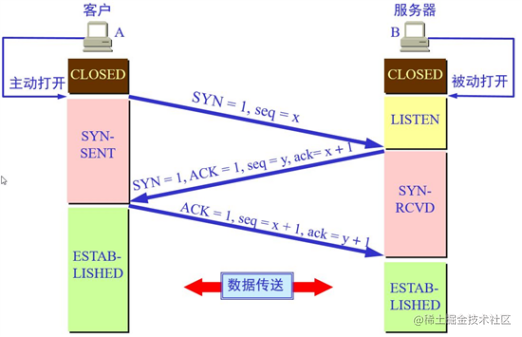
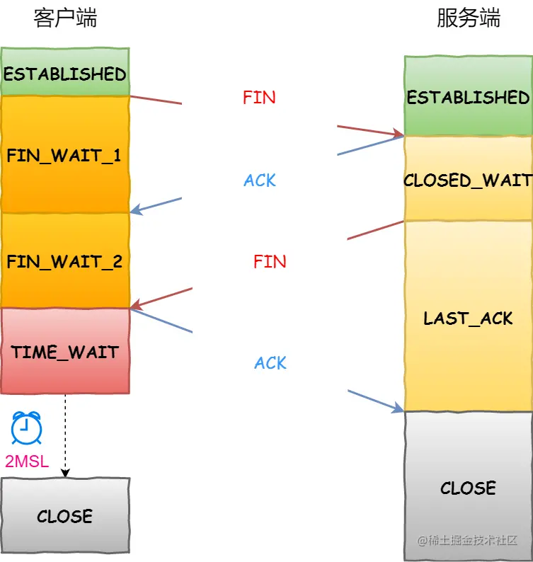

# TCP 三次握手，四次挥手

> 学习博客： https://juejin.cn/post/7071542934394372110
>
> 强烈推荐：https://juejin.cn/post/7217731723510054973 (带你从高启强与陈舒婷的恋爱来学习 TCP 连接)

## 1. **三次握手**

- 客户端准备建立连接，此时客户端向服务器向发送一个 SYN=1(表示建立新链接),序号 seq=x(一般 x 为 1)的 tcp 报文，之后客户端进入 syn-send 状态；

- 服务端接收到客户端发送的 tcp 报文之后，结束 listen 状态，返回一段 SYN=1,ACK=1,seq=y,ack=x+1 的 tcp 报文，之后进入 syn-rcvd 状态；

- 客户端接收到服务端发送的 tcp 报文之后，发送一个 ACK=1,seq=x+1, ack=y+1 的 tcp 报文，之后客户端进入 ESTABLISHED 状态；

- 服务端接收到客户端发送的 ACK 应答报文之后，进入 ESTABLISHED 状态。

## 2. **四次挥手**

- 客户端准备关闭连接时，会发送一个 TCP 首部 FIN 标志位置为 1 的报文，之后客户端进入 FIN_WAIT_1 状态；
- 服务端收到客户端发送的 FIN 报文后，就向客户端发送 ACK 应答报文，之后服务端进入 CLOSED_WAIT 状态；
- 客户端收到服务端发送的 ACK 应答报文之后，进入 FIN_WAIT_2 状态；
- 等待服务端处理完数据后，再次向客户端发送 FIN 报文，之后进入 LAST_ACK 状态；
- 客户端接收到服务端的 FIN 报文后，发送一个 ACK 应答报文，之后进入 TIME_WAIT 状态；
- 服务端收到 ACK 应答报文之后，进入 CLOSE 状态，至此服务端完成连接关闭；
- 客户端在经过 2MSL 一段时间之后，自动进入 CLOSE 状态。
