# 文件管理

> 参考：https://blog.csdn.net/weixin_43765321/article/details/123345475

## 文件系统

### 基本概念

文件是以**计算机硬盘**为**载体**的存储在计算机上的**信息集合**，文件可以是文本文档、图片、程序等。

文件在逻辑上分为有结构文件和无结构文件两种。在有结构文件中，文件由一组相似的记录组成，又称记录式文件；而无结构文件则被视为一个[字符流](https://so.csdn.net/so/search?q=字符流&spm=1001.2101.3001.7020)，又称流式文件。

**文件属性**：

- 文件名：创建时，由用户决定文件名，方便查找，同一目录不能有相同的文件名；
- 标识符：一个系统内的各文件标识符唯一，对用户来说毫无可读性，因此标识符只是操作系统用于区分各个文件的一种内部名称；
- 类型：指明文件的类型；
- 位置：文件存放的路径（让用户使用）、在外存中的地址（操作系统使用，对用户不可见）
- 大小：指明文件大小创建时间、上次修改时间文件所有者信息；
- 保护信息：对文件进行保护的访问控制信息；
- 时间、日期和用户标识：文件创建、上次修改和上次访问的相关信息，用于保护和跟踪文件的使用

#### 文件的基本操作

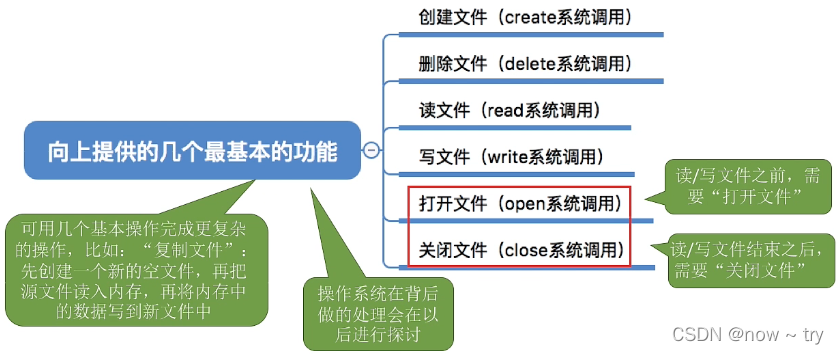

1. 创建文件。创建文件有两个必要的步骤：一是在文件系统中为文件找到空间；二是在目录中为新文件创建条目，该条目记录文件名称、在文件系统的位置及其他可能的信息。
2. 写文件。为了写文件，执行一个系统调用，指明文件名称和要写入文件的内容。
3. 读文件。为了读文件，执行一个系统调用，指明文件名称和要读入文件块的内存位置。
4. 文件重定位（文件寻址）。按某条件搜索目录，将当前文件位置设为给定值，并且不会读、写文件。
5. 删除文件。先从目录中找到要删除文件的目录项，使之称为空项，然后回收该文件所占用的空间。
6. 截断文件。允许文件所有属性不变，并删除文件内容，即将其长度设为 0 并释放其空间。

#### 文件的打开与关闭

打开文件不是一个文件系统必须有的操作

引入打开和关闭文件的目的是为了实现[文件共享](https://so.csdn.net/so/search?q=文件共享&spm=1001.2101.3001.7020)以及提高文件的存取效率。

### 文件的逻辑结构

文件的逻辑结构是从用户观点出发看到的文件的组织形式，文件的存储结构是从实现观点出发看到的文件在外存上的存储组织形式。文件的逻辑结构与存储介质特性无关，但文件的物理结构与存储介质的特性有很大的关系。

按逻辑结构，文件可划分为无结构文件和有结构文件两种。

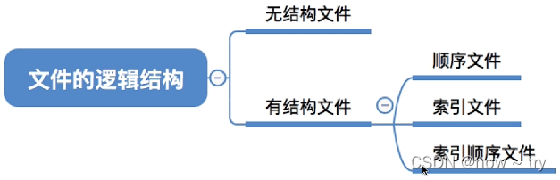

#### 无结构文件（流式文件）

无结构文件是最简单的文件组织形式。无结构文件将数据按顺序组织成记录并积累、保存，它是有序相关信息项的集合，以字节为单位。

字符流的无结构文件虽然对记录的访问只能通过穷举搜索的方式，但是管理简单，用户可以方便对其进行操作。所以，对基本信息操作不多的文件比较适合采用字符流的无结构方式，如源程序文件目标代码文件等。

#### 有文件结构（记录式文件）

有结构文件按记录的组织形式可以分为以下几种：

##### 顺序文件

文件中的记录一个接着一个地排列，记录通常是定长的，可以顺序存储或以链表形式存储，在访问时需要顺序搜索文件，顺序文件有串结构和顺序结构两种。

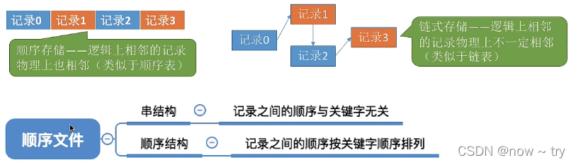

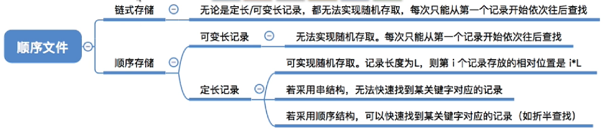

在对记录进行批量操作，即每次要读或写一大批记录时，顺序文件的效率是所有逻辑结构中最高的，而且，也只有顺序文件才能存储在磁带上，并且有效工作。并且记录存储紧凑，没有浪费空间。但是顺序文件对查找、修改、增加或删除单条记录的操作比较困难。

##### 索引文件

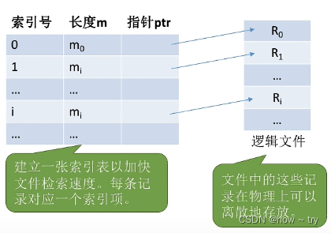

- 对于定长记录文件，要查找第 i 条记录，可直接根据 Ai = i x L 得到第 i 条记录相对于第一条记录的地址。
- 对于可变长记录文件，要查找第 i 条记录，必须顺序地查找前 i - 1 条记录，从而获得相应记录地长度 L。

变长记录文件只能顺序查找，系统开销大，为此可以建立一张索引表以加快检索速度。

索引表本身是定长记录的顺序文件，因此可以快速找到第 i 个记录对应的索引项。可将关键字作为索引号内容，若按关键字顺序排列，则还可以支持按照关键字折半查找。每当要增加/删除一个记录时，需要对索引表进行修改。

由于索引文件有很快的检索速度，因此主要用于对信息处理的及时性要求比较高的场合。另外，可以用不同的数据项建立多个索引表。如:学生信息表中，可用关键字“学号”建立一张索引表。也可用“姓名”建立一张索引表。这样就可以根据“姓名”快速地检索文件了。

索引文件解决了顺序文件不方便增删记录地问题，同时让不定长记录文件实现了随机存取，但索引表可能占用很多空间。

##### 索引顺序文件

索引顺序文件是顺序和索引两种组织形式的结合。索引顺序文件将顺序文件中所有记录分为若干组，为顺序文件建立一张索引表，在索引表中为每组中的第一条记录建立一个索引项，其中包含该记录的关键字值和指向该记录的指针。

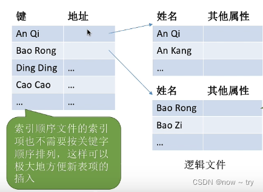

查找一条记录时，首先通过索引表找到其所在的组，然后在该组中使用顺序查找。

索引顺序文件提高了查找效率，若记录数很多，则可采用两级或多级索引。

索引文件和索引顺序文件都提高了存取的速度，但因为配置索引表而增加了存储空间。

##### 直接文件或散列文件

给定记录的键值或通过散列函数转换的键值直接决定记录的物理地址。这种映射结构不同与顺序文件或索引文件，没有顺序的特性。 散列文件有很高的存取速度，但是会引起冲突，即不同的关键字的散列函数值相同。

### 目录结构

目录管理的基本要求：从用户的角度看，目录在用户所需要的文件名和文件之间提供一种映射，所以目录管理要实现“按名存取”；目录存取的效率直接影响到系统的性能，所以要提高对目录的检索速度；在共享系统中，目录还需要提供用于控制访问文件的信息。此外，文件允许重名也是用户的合理和必然要求，目录管理通过树形结构来解决和实现。

#### 文件控制快和索引结点

- 文件控制块（FCB）：文件控制块是用来存放控制文件需要的各种信息的数据结构，以实现“按名存取”。FCB 的有序集合称为文件目录，一个 FCB 就是一个文件目录项。
- 索引结点：在检索目录时，文件的其他描述信息不会用到，也不需要调入内存，因此，有的系统采用了文件名和文件描述信息分开的方法，文件描述信息形成一个称为索引结点的数据结构。

#### 目录结构

目录结构上执行的操作有如下几种：

- 搜索。当用户使用一个文件时，需要搜索目录，以找到该文件的对应目录项。
- 创建文件。当创建一个新文件时，需要在目录中增加一个目录项。
- 删除文件。当删除一个文件时，需要在目录中删除相应的目录项。
- 显示目录。用户可以请求显示目录的内容，如显示该用户目录中的所有文件及属性。
- 修改目录。某些文件属性保存在目录中，因而这些属性的变化需要改变相应的目录项。

常见目录结构

##### 单级目录结构

在整个文件系统中只建立一张目录表，每个文件占一个目录项。

优点：实现了按名存取

缺点：查找速度慢，文件不允许重名，不便于文件共享

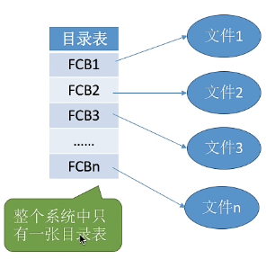

##### 两级目录结构

将文件目录分为主文件目录和用户文件目录两级

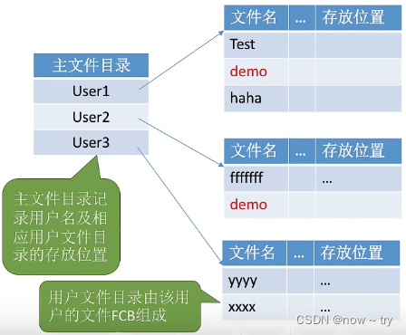

优点：解决了不同用户文件重名的问题，在一定程度上保证了文件的安全 缺点：缺乏灵活性，不能对文件分类，且同一用户不能有相同的文件名

##### 多级目录结构（树形目录结构）

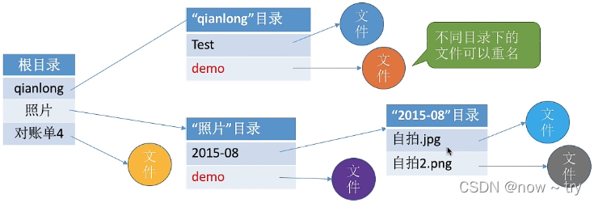

用户要访问某个文件时，用文件的路径名标识文件，文件路径名是个字符串，由根目录出发到所找文件通路上所有目录名与数据文件名用分隔符“/”链接而成。

从根目录出发的路径称为绝对路径，从当前目录出发的路径称为相对路径。

优点：可以很方便的对文件进行分类，层次结构清晰，能够有效地进行文件地管理和保护

缺点：查找文件时，需要按照路径名逐级访问中间结点，增加了访盘次数，影响了查询速度；不方便对文件共享

##### 无环图目录结构

在树形目录结构地基础上增加了一些指向同一结点的有向边，使整个目录成为一个有向无环图。引入无环图目录结构是为了实现文件共享。

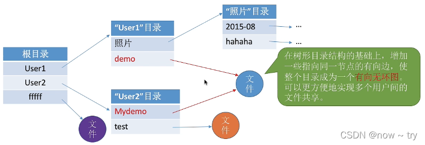

需要为每个共享结点设置一个共享计数器，用于记录此时有多少个地方在共享该结点。用户提出删除结点的请求时，只是删除该用户的 FCB、并使共享计数器减 1，并不会直接删除共享结点。只有共享计数器减为 0 时，才删除结点。

注意：共享文件不同于复制文件。在共享文件中，由于各用户指向的是同一个文件，因此只要其中一个用户修改了文件数据，那么所有用户都可以看到文件数据的变化。

### 文件共享

文件共享使多个用户共享同一个文件，系统中只需保留该文件的一个副本。若系统不能提供共享功能，则每个需要该文件的用户都要有各自的副本，会造成对存储空间的极大浪费。

#### 基于索引结点的共享方式（硬链接）

索引结点，是一种文件目录瘦身策略。由于检索文件时只需要用到文件名，因此可以将除了文件名之外的其他信息放到索引结点中。这样目录项就只需要包含文件名、索引结点指针。

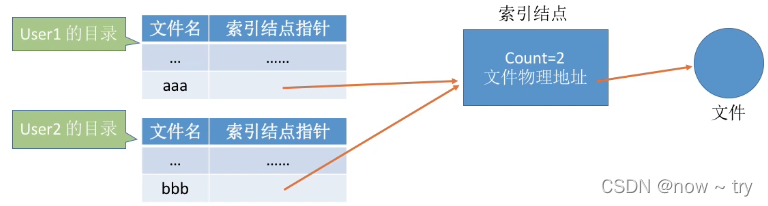

索引结点中设置一个链接计数变量 count，用于表示链接到本索引结点上的用户目录项数。

若 count=2，说明此时有两个用户目录项链接到该索引结点上，或者说是有两个用户在共享此文件。若某个用户决定“删除”该文件，则只是要把用户目录中与该文件对应的目录项删除，且索引结点的 count 值减 1。

若 count>0，说明还有别的用户要使用该文件，暂时不能把文件数据删除，否则会导致指针悬空。

当 count =0 时系统负责删除文件。

#### 利用符号链实现文件共享（软链接）

为使用户 B 能共享用户 A 的一个文件 F，可以由系统创建一个 LINK 类型的新文件，也取名为 F，并将文件 F 写入用户 B 的目录，以实现用户 B 的目录与文件 F 的链接。在新文件中只包含被链接文件 F 的路径名。这种链接方法被称为符号链接。

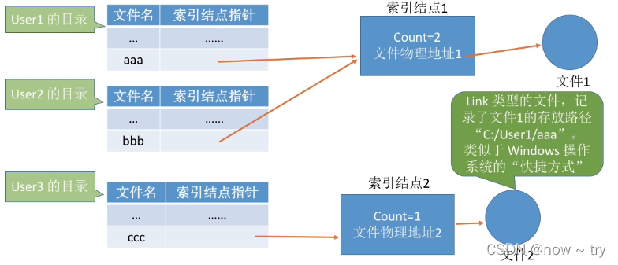

当 User3 访问“ccc”时，操作系统判断文件“ccc”属于 Link 类型文件，于是会根据其中记录的路径层层查找目录，最终找到 User1 的目录表中的“aaa”表项，于是就找到了文件 1 的索引结点。

在符号链的共享方式中，当其他用户读共享文件时，需要根据文件路径名逐个地查找目录，甚至找到该文件的索引结点。因此，每次访问时，都可能要多次地读盘，使得访问文件的开销变大并增加了启动磁盘的频率。所以，软连接比硬链接要慢。此外，符号链的索引结点也要耗费一定的磁盘空间。

### 文件保护

为了防止文件共享可能会导致文件被破坏或未经核准的用户修改文件，文件系统必须控制用户对文件的存取，即解决对文件的读、写、执行的许可问题。为此，必须在文件系统中建立相应的文件保护机制。

文件保护通过口令保护、加密保护和访问控制等方式实现。其中，口令保护和加密保护是为了防止用户文件被他人存取或窃取，而访问控制则用于对文件的访问方式。

## 文件系统实现

## 磁盘组织与管理

### 磁盘调度算法

#### 先来先服务算法（FCFS）

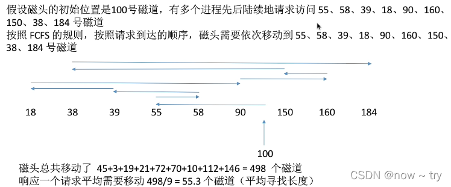

优点：公平；如果请求访问的磁道比较集中的话，算法性能还算过的去 缺点：如果有大量进程竞争使用磁盘，请求访问的磁道很分散，则 FCFS 在性能上很差，寻道时间长。

#### 最短寻道时间优先（SSTF）

SSTF 算法选择调度处理的磁道是与当前所在磁道距离最近的磁道，以便使每次的寻找时间最短。

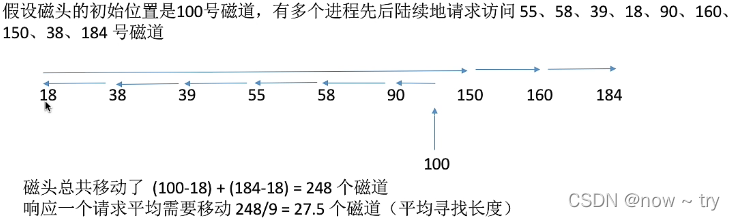

优点：算法性能好，平均寻道时间短 缺点：会产生饥饿现象

#### 扫描算法

SCAN 算法在磁头当前移动方向上选择与当前磁头所在磁道距离最近的请求作为下一次服务的对象，实际上就是在最短寻找时间优先算法的基础上规定了磁头运动的方向。又称电梯算法。

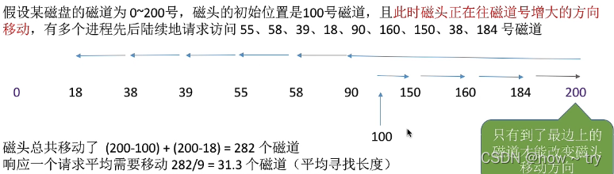

优点：性能较好，寻道时间短，不会产生饥饿现象 缺点：只有达到最边上的磁道时才能改变磁头移动方向；对于各个位置的磁道响应频率不平均

#### 循环扫描算法

在扫描算法的基础上规定磁头单向移动来提供服务，回返时直接快速移动至起始端而不服务任何请求。

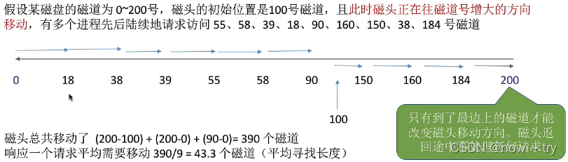

SCAN 来，对于各个位置磁道的响应频率很平均。 缺点：只有到达最边上的磁道时才能改变磁头移动方向；另外，比起 SCAN 算法来，平均寻道时间更长。
