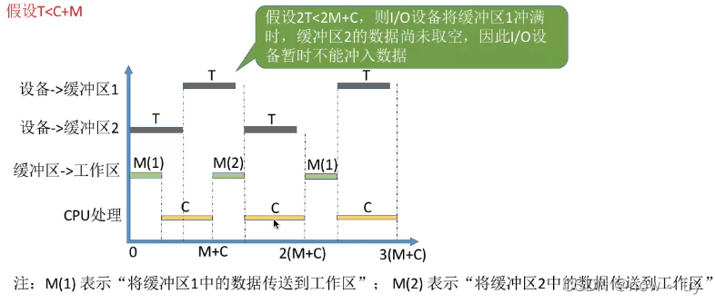
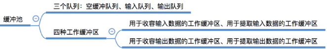
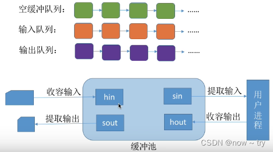

# 输入输出 I/O

> 参考：https://blog.csdn.net/weixin_43765321/article/details/123368685?spm=1001.2014.3001.5502

## I/O 管理概述

### I/O 设备

I/O 设备就是可以将数据输入到计算机，或者可以接收计算机输出数据的外部设备，属于计算机中的硬件部分。

I/O 设备按使用特性可以分为以下类型：

1. 人机交互类设备。用于与计算机用户之间交互的设备，如打印机、显示器、鼠标和键盘等。
2. 存储设备。用于存储程序和数据的设备，如磁盘、磁带和光盘等。
3. 网络通信设备。用于与远程设备通信的设备，如各种网络接口、调制解调器等。

按传输速率分类：

1. 低速设备。传输速率仅为每秒几字节到数百字节的一类设备，如键盘、鼠标等。
2. 中速设备。传输速率为每秒数千字节至数万字节的一类设备，如打印机等。
3. 高速设备。传输速率在数百千字节至千兆字节的一类设备，如磁带机、磁盘机等。

按信息交换的单位分类：

1. 块设备。由于信息的存取总是以数据块为单位的，所以存储信息的设备称为块设备。传输速率高、可寻址。
2. 字符设备。用于数据输入、输出的设备为字符设备，因为其传输的基本单位是字符。传输速率低、不可寻址。

### I/O 控制方式

设备管理的主要任务之一是控制设备和内存或处理机之间的数据传送。外围设备和内存之间的输入/输出控制方式有如下 4 种。

#### 程序直接控制方式

计算机从外部设备读取数据到存储器，每次读一个字的数据。对读入的每个字，CPU 需要对外设状态进行循环检查，直到确定该字已经在 I/O 控制器的数据寄存器中。

CPU 的绝大部分时间处于等待 I/O 设备完成数据 I/O 的循环测试中，造成了 CPU 资源的极大浪费。

- 数据传送的单位：每次读写一个字
- 数据的流向： 读操作（数据输入）：I/O 设备->CPU->内存 写操作（数据输出）：内存->CPU->I/O 设备
- 优点：简单且易于实现
- 缺点：CPU 利用率极低

#### 中断驱动方式

允许 I/O 设备主动打断 CPU 的运行并请求服务，从而“解放”CPU，使得其向 I/O 控制器发送读命令后可以继续做其他工作。

- 数据传送的单位：每次读写一个字
- 数据的流向：

读操作（数据输入）：I/O 设备->CPU->内存

写操作（数据输出）：内存->CPU->I/O 设备

- 优点：CPU 不再需要不停地查询，CPU 和 I/O 设备可并行工作，CPU 利用率明显提高。
- 缺点：数据中的每个字在存储器与 I/O 控制器之间的传输都必须经过 CPU，这就导致了中断驱动方式仍然后消耗较多的 CPU 时间。

#### DMA 方式

DMA（直接存储器存取）方式的基本思想是在 I/O 设备和内存之间开辟直接的数据交换通路，彻底解放 CPU。

DMA 方式的特点如下：

1. 数据的传送单位是“块”。不再是一个字、一个字的传送。
2. 数据的流向是从设备直接放入内存，或者从内存直接到设备。不再经过 CPU。
3. 仅在传送一个或多个数据块的开始和结束时，才需要 CPU 干预。整块数据的传送是在 DMA 控制器的控制下完成的。

- 数据传送的单位：每次读或写一个或多个块
- 数据的流向：

读操作（数据输入）：I/O 设备->内存

写操作（数据输出）：内存->I/O 设备

- 优点：数据传输以“块”为单位，CPU 介入频率进一步降低。数据的传输不再需要先经过 CPU 再写入内存，数据传输效率进一步增加。CPU 和 I/O 设备的并行性得到提升。
- 缺点：CPU 每发出一条 I/O 指令，只能读/写一个或多个连续的数据块。

通道控制方式 通道：一种硬件，可以识别并执行一系列通道指令。

与 CPU 相比，通道的指令类型单一，没有自己的内存，通道所执行的通道程序是放在主机的内存中的，也就是说通道与 CPU 共享内存。

#### I/O 字系统的层次结构

整个 I/O 系统可以视为具有 4 个层次的系统结构，如下图所示。

- 用户层 I/O 软件：用户层软件实现了与用户交互的接口，用户可直接使用该层提供的、与 I/O 操作相关的库函数对设备进行操作
- 设备独立性软件：用于实现用户程序与设备驱动器的统一接口，、设备命令、设备保护及设备分配与释放等，同时为设备管理和数据传送提供必要的存储空间。设备独立性又称设备无关性，使得应用程序独立于具体使用的物理设备。
- 设备驱动程序：与硬件直接相关，负责具体实现系统对设备发出的操作指令，驱动 I/O 设备工作的驱动程序。不同的 I/O 设备具有不同的硬件特性，系统需按设备类型分配驱动程序。
- 中断处理程序：用于保护被中断进程的 CPU 环境，转入相应的中断处理程序进行处理，处理完并恢复被中断进程的现场后，返回到被中断进程。
- 硬件设备：包括一个机械部件（设备本身）和一个电子部件（控制器）。

## I/O 核心子系统

I/O 核心子系统提供的服务主要有 I/O 调度、缓冲与高速缓存、设备分配与回收、假脱机、设备保护和差错处理等。

I/O 调度就是确定一个好的顺序来执行这些 I/O 请求。

### 高速缓存与缓冲区

#### 磁盘高速缓存

磁盘高速缓存用来提高磁盘 I/O 的速度，对高速缓存复制的访问要比原始数据访问更为高效。

磁盘高速缓存逻辑上属于磁盘，物理上则是驻留在内存中的盘块。

高速缓存在内存中分为两种形式：一种是在内存中开辟一个单独的存储空间作为磁盘高速缓存，大小固定；另一种是把未利用地内存空间作为一个缓冲池，供请求分页系统和磁盘 I/O 时共享。

#### 缓冲区

缓冲区地数据非空时，不能往缓冲区冲入数据，只能从缓冲区把数据传出；当缓冲区为空时，可以往缓冲区冲入数据，但是必须把缓冲区充满时，才能从缓冲区把数据传出。

根据系统设置缓冲器的个数，缓冲技术可以分为如下几种：

1. 单缓存。在设备和处理机之间设置一个缓冲区。 假定从磁盘把一块数据输入缓冲区的时间为 T，操作系统将该缓冲区中的数据传送到用户区的时间为 M，CPU 对这一块数据的处理时间为 C。则单缓冲区处理每块数据的用时为 max（C,T） + M。

1. 双缓冲。根据单缓冲的特点，CPU 在传送时间 M 内处于空闲状态，由此引入双缓冲。双缓冲机制提高了处理机和双缓冲设备的并行操作程度。
   1. I/O 设备输入数据时先装填到缓冲区 1，在缓冲区 1 填满后才开始装填缓冲区 2，与此同时处理机可以从缓冲区 1 中取出数据放入用户进程处理，当缓冲区 1 中的数据处理完后，若缓冲区 2 已填满，则处理及又从缓冲区 2 取出数据放入用户进程处理，而 I/O 设备又可以装填缓冲区 1。

采用双缓冲策略处理一块数据的用时为 max（C + M，T）。

1. 循环缓冲 包含多个大小相等的缓冲区，每个缓冲区中有一个链接指针指向下一个缓冲区，最后一个缓冲区指针指向第一个缓冲区，多个缓冲区构成一个环形。 in 指针指向可以输入数据的第一个缓冲区，out 指针指向可以提取数据的第一个满缓冲区。
2. 缓冲池 由多个系统共用的缓冲区组成。

高速缓存与缓冲区对比：

### 设备分配与回收

#### 设备分配概述

设备分配是指根据用户的 I/O 请求所分配的设备。设备的固有属性可分为三种：独占设备、共享设备和虚拟设备。

- 独占设备：一个时段只能分配给一个进程（如打印机)
- 共享设备：可同时分配给多个进程使用（如磁盘），各进程往往是宏观上同时共享使用设备，而微观上交替使用。
- 虚拟设备：采用 SPOOLing 技术将独占设备改造成虚拟的共享设备，可同时分配给多个进程使用（如采用 SPOOLing 技术实现的共享打印机)

#### 设备分配的数据结构

- 设备控制表(DCT)：每个设备对应一张 DCT，关键字段:类型/标识符/状态/指向 COCT 的指针/等待队列指针
- 控制器控制表(COCT)：每个控制器对应一张 COCT，关键字段 ∶ 状态/指向 CHCT 的指针/等待队列指针
- 通道控制表(CHCT)：每个控制器对应一张 CHCT，关键字段:状态/等待队列指针
- 系统设备表（SDT)：记录整个系统中所有设备的情况，每个设备对应一个表目，关键字段:设备类型/标识符/DCT/驱动程序入口

#### 设备分配策略

1. 设备分配原则。设备分配应根据设备特性、用户要求和系统配置情况。分配的总原则是：既要充分发挥设备的使用效率，又要避免造成进程死锁，还要将用户程序和具体设备隔离开。
2. 设备分配方式。设备分配方式有静态分配和动态分配两种。

   1. 静态分配主要用于对独占设备的分配，它在用户作业开始执行前，由系统一次性分配该作业所要求的全部设备、控制器。一旦分配，这些设备、控制器就一直为该作业所占用，直到该作业被撤销。静态分配方式不会出现死锁，但设备的使用效率低。因此，静态分配方式并不符合分配的总原则。

   2. 动态分配在进程执行过程中根据执行需要进行。当进程需要设备时，通过系统调用命令向系统提出设备请求，由系统按照事先规定的策略给进程分配所需要的设备、I/O 控制器,一旦用完，便立即释放。动态分配方式有利于提高设备的利用率，但若分配算法使用不当，则有可能造成进程死锁。

3. 设备分配算法。常用的动态设备分配算法有先请求先分配、优先级高者优先等。

对于独占设备，既可以采用动态分配方式，又可以采用静态分配方式，但往往采用静态分配方式，即在作业执行前，将作业所要用的这一类设备分配给它。共享设备可被多个进程所共享，一般采用动态分配方式，但在每个 IO 传输的单位时间内只被一个进程所占有，通常采用先请求先分配和优先级高者优先的分配算法。

#### 设备分配的安全性

设备分配的安全性是指设备分配中应防止进程死锁。

### SPOOLing 技术（假脱机技术）

为了缓和 CPU 的高速性和 I/O 设备的低速性之间的矛盾，引入了脱机输入/输出技术。引入 SPOOLing 技术提高 I/O 设备的使用效率。把一个物理设备虚拟成逻辑上的多台设备，将独占设备改造成共享设备。

SPOOLing 系统的组成如下图所示：

1. 输入井和输出井：模拟脱机输入/输出时的磁带
2. 输入进程和输出进程：模拟脱机输入/输出时的外围控制机
3. 输入缓冲区和输出缓冲区：内存中的缓冲区，输入、输出时的”中转站"
