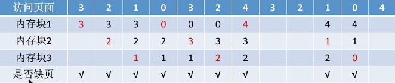

内存管理

## 一、引用

https://blog.csdn.net/weixin_42570192/article/details/126101323

https://blog.csdn.net/weixin_43765321/article/details/123322055

## 二、内存

> 内存是用于存放数据的硬件，程序执行前需要先放到内存中才能被 CPU 处理。
>
> 在多道程序环境下，系统中会有多个程序并发执行，也就是说会有多个程序的数据需要同时放到内存中，为了区分各个程序数据的存放位置，就需要给内存的存储单元编地址。
>
> 内存地址从 0 开始，每个地址对应一个存储单元。存储单元如果按字节编址，则每个内存单元的大小为 1 字节，也就是 8 个二进制位；如果字长为 16 位的计算机按字编址，则每个内存单元的大小为 1 个字，也就是 16 个二进制位。

### 程序运行的基本原理

从写程序到程序运行的过程如下图示所示：

- **编译**: 将程序源代码转编译成若干个目标模块，也是一个把高级语言编译为机器语言的过程；
- **链接**：由链接程序将编译后形成的一组目标模块以及所需的库函数链接在一起，形成一个完整的装入模块；
- **装入**：由装入程序将装入模块装入内存运行；

**链接的三种方式：**

- **静态链接**：在程序运行前，先将各目标模块及它们所需的库函数连接成一个完整的可执行文件(装入模块)，之后不再拆开；
- **装入时动态链接**：将各目标模块装入内存时，边装入边链接；
- **运行时动态链接**：在程序执行过程中需要该目标模块时才对它进行链接，其优点是便于修改和更新，便于实现对目标模块的共享

**装入的三种方式**：

- **绝对装入**：在编译时，如果知道程序将放到内存中的哪个位置，编译程序将产生绝对地址的目标代码，装入程序按照装入模块中的地址，将程序和数据装入内存。绝对装入只适用于单道程序环境。
- **静态重定位**：也称可**重定位装入**；编译、链接后的装入模块的地址都是从 0 开始的，指令中使用的地址、数据存放的地址都是相对于起始地址而言的逻辑地址，可以根据内存的当前情况，将装入模块装入到内存的适当位置，装入时对地址进行重定位，**将逻辑地址变换为物理地址**。静态重定位的特点是**在一个作业装入内存时，必须分配其要求的全部内存空间，如果没有足够的内存，就不能装入该作业，作业一旦进入内存后，在运行期间就不能再移动，也不能再申请内存空间。静态重定位方法用于早期的多道批处理操作系统**。
- **动态重定位**：也称**动态运行时装入；**编译、链接后的装入模块的地址都是从 0 开始的，装入程序把装入模块装入内存后，并不会立即把逻辑地址转换为物理地址，而是**把地址转换推迟到程序真正要执行时才进行**，因此装入内存后所有的地址依然是逻辑地址，不过这种方式需要一个**重定位寄存器**(存放装入模块存放的起始位置)的支持。**动态重定位方法用于现代操作系统**。

采用**动态重定位**时允许程序在**内存**中发生**移动**，并且可将程序分配到**不连续的存储区**中，在程序运行前只需装入它的**部分代码**即可投入运行，然后在程序运行期间根据需要**动态申请分配内存**，便于程序段的共享，可以向用户提供一个比存储空间大得多的地址空间。

### 内存管理

> 内存管理，包含了：**内存空间的分配和回收**，**内存空间的扩充**、**地址转换**以及**内存保护**。

- 内存空间的分配和回收
  - OS 需要记录内存中哪些区域已经被分配出去了，哪些区域是空闲的；
  - 内存中有很多位置可以存放进程时，该进程该放在哪里；
  - 当进程运行结束之后，如何将进程占用的内存空间回收等。
- 内存空间的扩充
  - OS 需要提供一种技术从逻辑上对内存空间进行扩充。例如运行一款大型游戏时，所占用的内存空间已经超过了电脑本身的内存空间，但是电脑依旧可以正常运行，这里就涉及到了 OS 的**虚拟技术**
- 地址转换
  - OS 提供地址转换功能，实现逻辑地址到物理地址的转换；
  - 用到的装入方法有：绝对装入，静态重定位、动态重定位
- 内存保护

  - 保存各进程在各自的存储空间内运行，互不干扰；
  - 内存保护采用的方法有：

    - 设置上下限寄存器
      - 在 CPU 中设置一对上、下限寄存器，存放进程的上、下限地址，进程的指令要访问某个地址时，CPU 要检查是否越界，只有不越界时，才允许当前进程进行访问，否则禁止访问。
    - 利用重定位寄存器，界地址寄存器进行越界检查
    - ​ 重定位寄存器中存放的是进程的起始物理地址，界地址寄存器中存放的是进程的最大逻辑地址。

    -

#### 1、内存空间的分配与回收

##### 1.1、连续分配管理方式

- 单一连续分配
- 固定分区分配
- 动态分区分配

###### 单一连续分配

单一连续分配方式中，内存被分为系统区和用户区，如下图所示。

系统区通常位于低地址部分，用于存放操作系统相关数据，用于区用于存放用户进程相关数据。内存中只能有一道用于程序，用户程序独占整个用户区域空间。

**方法优点**：

实现简单，无外部碎片；可以采用覆盖技术扩充内存；不一定需要采用内存保护；

**方法缺点**：

只能用于单用户，单任务的操作系统中；有内部碎片；存储利用率低；

**内部碎片：**分配给某个进程的内存区域中，如果有些部分没有用上，就是内部碎片；

**外部碎片：**指内存中的某些空间分区由于太小而难以利用。

###### 固定分区分配

20 世纪 60 年代出现了支持多道程序的系统，为了能在**内存中装入多道程序**，且这些程序之间又不会相互干扰，于是将整个用户空间划分为若干个固定大小的分区，在**每个分区中只装入一道作业**，这样就形成了最早的、最简单的一种可运行多道程序的内存管理方式。

固定分区分配又包括分区大小相等和分区大小不相等两种，如下图所示。

分区大小相等的情况缺乏灵活性，但是很适合用于一台计算机控制多个相同对象的场合。分区大小不相等增加了灵活性，可以满足不同大小的进程需求，根据常在系统中运行的作业大小请求进行划分。一般多划分小分区，适量的中等分区和少量的大分区。

操作系统需要建立一个数据结构----分区说明表，以此来实现各个分区的分配和回收，每个表项对应一个分区，通常按照分区大小排列，每个表项包括对应的分区大小，起始地址和状态（是否已分配）；

当某用户程序要装入内存时，由操作系统内核程序根据用户程序大小检索该表，从中找到一个能满足大小的，为分配的分区，将它分配给该程序，然后修改状态为已分配；

**方法优点**：实现简单，无外部碎片；

**方法缺点**：当用户程序太大时，可能所有的分区都不能满足需求，此时不得不采用**覆盖技术**来解决，但是这样会降低性能。此外，该方法会产生内部碎片，内存利用率低。

###### 动态分区分配

动态分区分配又称为可变分区分配，这种分配方式不会预先划分内存分区，而是在进程装入内存时，根据进程的大小动态地建立分区，并使分区的大小正好适合进程的需要，因此系统分区的大小和数目是可变的。

系统使用**空闲分区表**和**空闲分区链**表两种方式记录内存的使用情况。

空闲分区表中，每个空闲分区对应一个表项，表项中包含分区号、分区大小、分区起始地址以及状态等信息；

空闲分区链中，每个分区的起始部分和末尾部分分别设置前向指针和后向指针，起始部分处还可记录分区大小等信息。

把一个新作业装入内存时，须按照一定的**动态分区分配算法**从空闲分区表或空闲分区链中选出一个分区分配给该作业。

- 分区的分配

在进行分区分配时，按照动态分区分配算法选择了某一分区后，在其对应的空闲分区表或空闲分区链中进行数据的更新即可。

- 分区的回收
  - 情况一：回收区的后面有一个相邻的空间分区。
    - 这种情况下将两个相邻的空间分区合并为一个，并更新分区大小和起始地址。
  - 情况二：回收区的前面有一个相邻的空间分区。
    - 这种情况下仍然将两个相邻的空间分区合并为一个，并更新分区大小和起始地址。
  - 情况三：回收区的前、后各有一个相邻的空间分区。
    - 这种情况下要将三个相邻的空间分区合并为一个，并更新分区大小和起始地址。
  - 情况四：回收区的前、后都没有相邻的空间分区。
    - 这种情况下需要新增一个表项，并把分区号、分区大小、起始地址和状态填进去。总的来说，相邻的空间分区要合并。

动态分区分配算法

动态分区分配算法需要解决的问题是：当多个内存分区都能满足进程需求时，如果选择分区进行分配；

- 首次适应算法（First Fit）
- 最佳适应算法（Best Fit）
- 最坏适应算法（Worst Fit）
- 邻近适应算法（Next Fit）

首次适应算法

**算法思想**：每次都从低地址开始查找，找到第一个能满足大小的空闲分区。 **实现**：空闲分区**按地址递增**的次序排列，每次分配内存时顺序查找空闲分区表或空闲分区链，找到大小能满足要求的第一个空闲分区分配给进程，然后对空闲分区表或空闲分区链的内容进行更新，这种方法不需要对链表重新排序。

最佳适应算法

**算法思想**：由于动态分区分配是一种连续分配方式，其为各进程分配的空间必须是连续的一整片区域。因此为了保证当大进程到来的时候能有连续的大片空间，可以尽可能多地留下大片的空闲区，优先使用更小的空闲区。

**实现**：空闲分区**按容量递增的次序排列**，每次分配内存时顺序查找空闲分区表或空闲分区链，找到大小能满足要求的第一个空闲分区分配给进程(这时找到的第一个空间分区是既满足申请又是容量最小的)，然后对空闲分区表或空闲分区链的内容进行更新并**重新排序**。

最佳适应算法的**缺点**：由于该算法每次都是选最小的分区进行分配，因此会留下越来越多的、很小的、难以利用的内存块，所以这种方法会产生很多的**外部碎片**。

最坏适应算法

最坏适应算法又称最大适应算法(Largest Fit)。

**算法思想**：为了解决最佳适应算法的问题，即留下太多难以利用的小碎片，可以在每次分配时优先使用最大的连续空间区，这样分配后剩余的空闲区就不会太小，更方便使用。

**实现**：空闲分区按容量递减的次序排列，每次分配内存时顺序查找空闲分区表或空闲分区链，找到大小能满足要求的第一个空闲分区分配给进程，然后对空闲分区表或空闲分区链的内容进行更新并重新排序。

最坏适应算法的**缺点**：由于该算法每次都是选最大的分区进行分配，虽然可以让分配后留下的空闲区更大、更可用，但是这种方式会导致较大的连续空间区被迅速用完，如果之后有大进程到达，就没有内存分区可用了。

邻近适应算法

**算法思想**：首次适应算法每次都是从链头开始查找的，这可能会导致低地址部分出现很多小的空闲分区，而每次分配查找时，都要经过这些分区，因此也增加了查找的开销，如果每次都从上次查找结束的位置开始检索，就能解决查找开销较大的问题。

**实现**：空闲分区按地址递增的次序排列，可以排成一个**循环链表**，每次分配内存时从上次查找结束的位置开始查找空闲分区表或空闲分区链，找到大小能满足要求的第一个空闲分区分配给进程，这种方法不需要对链表重新排序。

首次适应算法每次都要从头查找，每次都需要检索低地址的小分区，但是这种规则也决定了当低地址部分有更小的分区可以满足需求时，会更有可能用到低地址部分的小分区，也会把高地址部分的大分区保留下来。

邻近适应算法的**缺点**：邻近适应算法的规则可能会导致无论低地址还是高地址部分的空闲分区都有相同的概率被使用，也就导致了高地址部分的大分区更可能被使用从而划分为小分区，最后导致无大分区可用。

##### 1.2、动态重定位分区分配（实则还是连续地址分配）

###### 紧凑

在连续分配方式中，会出现许多未分配的小分区，这些小分区的容量总和可能大于当前进程所需容量，那么我们可以将已经分配的分区进行紧凑处理，堆积在一个连续的内存空间中，那么就可以将那些小空闲分区合并为一个大的空闲分区，此时可以适应一些进程需求，但是中方式，需要在紧凑的进行地址转换，会降低整体的效率；

###### 动态重定位

在上述紧凑方案的进一步优化，使用在进行动态重定位装入时，是在程序真正执行的时候才进行地址转换。为使地址的变换不会影响指令的执行速度，必须有硬件地址变换机构的支持，即须在系统中增设一个重定位寄存器，用它来存放程序（数据）在内存中的起始地址。程序在执行时，真正访问的内存地址是相对地址与重定位寄存器中的地址相加而形成的。

##### 1.3、分页存储管理（非连续地址分配）

前面介绍到的两种连续分配方式：固定分区分配和动态分区分配，它们都有一定的缺点。 固定分区分配缺乏灵活性，会产生大量的内部碎片，内存利用率很低。动态分区分配会产生很多的外部碎片，虽然可以用紧凑技术来处理，但是时间代价很高。

如果允许将一个进程分散地装入到许多不相邻的分区中，便可以充分地利用内存，而无需再进行紧凑。基于这种思想，就产生了非连续分配方式，或者离散分配方式。

连续分配为用户进程分配的必须是一个连续的内存空间，而非连续分配为用户进程分配的可以是一些分散地内存空间。 基本分页存储管理的思想：**把内存分为一个个相等的小分区，再按照分区大小把进程拆分成一个个小部分**。

如上图所示，把内存空间分为一个个大小相等的分区，每个分区就是一个**页框**，或称**页帧**、**内存块**、**物理块**。每个页框有一个编号，也就是页框号(或者页帧号、内存块号、物理块号)，页框号是从 0 开始的。

将**用户进程的地址空间也分为与页框大小相等的一个个区域**，称为**页**或**页面**，每个页面也有一个编号，即页号，页号也是从 0 开始的。 需要注意的是，进程的最后一个页面可能没有一个页框那么大，这样的话就会产生内部碎片，所以页框设置的不能太大，否则可能产生过大的内部碎片。

操作系统以页框为单位为各个进程分配内存空间，进程的每个页面分别放入一个页框中，进程的页面与内存的页框有一一对应的关系。各个页面不必连续存放，也不必按先后顺序来，可以放到不相邻的各个页框中。 **采用分页存储方法最重要的就是解决逻辑地址到物理地址的转化。**

比如 CPU 要访问逻辑地址为 80 的内存单元，如何计算其物理地址。首先可以确定，逻辑地址为 80 的内存单元在 1 号页，该页在内存中的起始位置是 450，逻辑地址为 80 相对于该页的起始地址而言，偏移量是 30。所以逻辑地址为 80 的内存单元对应的实际物理地址是：450+30=480。

逻辑地址到物理地址的计算步骤：**算出逻辑地址对应的页号——>要知道该页号对应的页面在内存中的起始地址——>算出逻辑地址在页面内的偏移量——>物理地址 = 页面地址 + 页内偏移量。**

页号 = 逻辑地址/页面长度 (取整数)

页内偏移量 = 逻辑地址%页面长度 (取余数)

页面在内存中的起始位置：操作系统需要用某种数据结构记录进程各个页面的起始位置。

为了能知道进程的每个页面在内存中存放的位置，操作系统要为每个进程建立一张页表

###### 地址变换机构

基本地址转换机构

基本地址变换机构适用于实现逻辑地址到物理地址转换的一组硬件机构，它可以借助进程的页表将逻辑地址转换为物理地址。

**通常会在系统中设置一个页表寄存器，存放页表（页表是上述每个进程都对应一个页表，页面是在内存中的）在内存中的起始地址 F 和页表长度 M。进程未执行时，页表的始址和页表长度放在进程控制块中，当进程被调度时，操作系统内核会把它们放到页表寄存器中。**

逻辑地址到物理地址的变换过程如下图所示。

基本地址转换需要访问两次内存：

- 第一次是在访问页表的时候；
- 第二次是在访问物理地址对应的内存单元；

具有快表的地址变换机构

局限性原理

局限性原理有时间局限性和空间局限性

- **时间局限性：**如果执行了程序中的某条指令，那么不久后这条之灵很有可能会被再次访问，数据访问也如此，因为程序会存在大量的循环。
- **空间局限性：**一旦程序访问了某个存储单元，在不久之后，其附近的存储单元也有可能被访问，因为很多数据在内存中是连续存放的。

快表又称联想寄存器，是一种**访问速度比内存快很多的高速缓冲存储器**，用来存放当前访问的若干页表项，以加速地址变换的过程。与此对应的，**内存中的页表常称为慢表（再次重申，\*\***前面的基本地址转换中的页表是存放在内存中的\***\*）**。

快表的应用如下图所示，在快表命中后就不需要再访问内存了，和之前相比提高了访问的效率。

引入快表后的地址变换过程为：

①CPU 给出逻辑地址，由某个硬件算得页号、页内偏移量，将页号与快表中的所有页号进行比较；

② 如果找到匹配的页号，说明要访问的页表项在快表中有副本，则直接从中取出该页对应的内存块号，再将内存块号与页内偏移量拼接形成物理地址，最后，访问该物理地址对应的内存单元。因此，若快表命中，则访问某个逻辑地址仅需一次访存即可；

③ 如果没有找到匹配的页号，则需要访问内存中的页表，找到对应页表项，得到页面存放的内存块号，再将内存块号与页内偏移量拼接形成物理地址，最后，访问该物理地址对应的内存单元。因此，若快表未命中，则访问某个逻辑地址需要两次访存。需要注意的是，在找到页表项后，应同时将其存入快表，以便后面可能的再次访问，但若快表已满（快表容量有限），则必须按照一定的算法对旧的页表项进行替换。

###### 两级页表

单级页表存在的问题： 问题一：页表必须连续存放，因此当页表很大时，需要占用很多个连续的页框； 问题二：没必要让整个页表都常驻内存，因为进程在一段时间内可能只需要访问某几个特定的页面就可以正常运行。

**解决**：

1、怎么解决问题一呢？可以将长页表进行分组，使每个内存块刚好可以放入一个分组，此外，要为离散分配的页表再建立一张页表，称为页目录表(或称为外层页表/顶层页表)。如下为两级页表

2、问题二的解决方法是：在需要访问页面时才把页面调入内存，这里要用到虚拟存储技术，可以在页表项中增加一个标志位，用于表示该页面是否已经调入内存。如果想要访问的页面不在内存中，则产生缺页中断，即内中断，然后将目标页面从外存调入内存。

多级页表中需要注意的两个问题：

① 采用多级页表机制，则各级页表的大小不能超过一个页面。(比如页面大小为 1KB，1KB = 2^10B，所以各级页表的大小最多由 10 位二进制数表示)

② N 级页表访问一个逻辑地址的访存次数为 N+1 次(N 次访问页表，一次根据物理地址访问内存单元)。

##### 1.4、基于分段存储管理方式

分段存储管理与分页存储管理方式最大的不同就是离散分配时所分配地址空间的基本单位不同。 分段方式中进程的地址空间是**按照程序自身的逻辑关系划分为若干个段**，每个段都有一个段名，且每段从 0 开始编址。 内存分配规则：以段为单位进行分配，**每个段在内存中占据连续空间**，**但各段之间可以不相邻**。

由于是按照逻辑功能模块划分， 用户编程更方便，程序的可读性高。

编译程序会将段名转换为段号。

分段系统中的逻辑地址由段号(段名)和段内地址(段内偏移量)组成，段号的位数决定了每个进程最多可以分几个段，段内地址位数决定了每个段的最大长度是多少。

程序分为多个段，各段离散地装入内存，为了保证程序能正常运行，就必须从物理内存中找到各个逻辑段的存放位置，所以就需要为每个进程建立一张段映射表，也就是段表。如下图所示。

各个段表项的长度是相同的。段号可以是隐含的，不占存储空间。 下图是分段存储管理方式的具体流程，与分页方式主要的不同是第四步，由于分段存储管理方式中的段长是不相同的，因此要进行比较看有没有越界的产生，而分页存储管理方式中的页面长度是相同的，因此不用比较。

分页与分段管理方式的对比：

页是信息的物理单位，分页的主要目的是为了实现离散分配，提高内存利用率，分页仅仅是系统管理上的需要，完全是系统行为，对用户是不可见的；段是信息的逻辑单位，分段的主要目的是更好地满足用户需求，一个段通常包含着一组属于一个逻辑模块的信息。分段对用户是可见的，用户编程时需要显式的给出段名。

页的大小固定且由系统决定，段的长度不固定，它取决于用户编写的程序。

分页的用户进程地址空间是一维的，程序员只需给出一个记忆符即可表示一个地址；分段的用户进程地址空间是二维的，程序员在标识一个地址时，既要给出段名，也要给出段内地址。

分段比分页更容易实现信息的共享和保护。

要实现共享，只需要让各进程的段表项指向同一个段即可，能共享的只是不能被修改的代码，也就是纯代码或可重入代码，这不属于临界资源，而可修改的代码是不能共享的，比如代码段中包含很多的变量。

##### 1.5、 段页式管理方式

分页管理的优点是内存空间利用率高，不会产生外部碎片，只会有少量的页内碎片，缺点是不方便按照逻辑模块实现信息的共享和保护；

分段管理的优点是很方便按照逻辑模块实现信息的共享和保护，缺点是如果段长过大，为其分配很大的连续空间会很不方便，此外，该方式会产生外部碎片。

如图所示：

一个进程会对应一个段表，但可能会对应多个页表。 段页式管理方式的具体流程如下图所示。

#### 2、内存空间的扩充

##### 2.1、覆盖技术

覆盖技术用来解决程序大小超过物理内存总和的问题。

覆盖技术的思想是：**将程序分为多个段(多个模块)，常用的段常驻内存，不常用的段只在需要时调入内存。**

**内存中分为一个固定区和若干个覆盖区，需要常驻内存的段放在固定区中，调入后就不再调出，除非运行结束。不常用的段放在覆盖区，需要用到时调入内存，用不到时就调出内存**。

我们可以按照自身逻辑结构，让那些不可能同时被访问的程序段共享同一个覆盖区，这样就能够减少内存的占用。 这种方法必须由程序员声明覆盖结构，操作系统完成自动覆盖。其缺点是对用户不透明，从而增加了用户编程的负担。 覆盖技术只用于早期的操作系统中，现在已成为历史，不再使用。

##### 2.2、交换技术

交换技术也称对换技术，其设计思想是：**内存空间紧张时，系统将内存中某些进程暂时换出外存，把外存中某些已具备运行条件的进程换入内存。采用交换技术时，进程在内存与磁盘间动态调度**。 **交换技术用到了中级调度，也就是内存调度**，该调度就是要决定将哪个处于挂起状态的进程重新调入内存。

交换技术中有以下几个问题需要解答：

① 应该在外存(磁盘)的什么位置保存被换出的进程？

在具有对换功能的操作系统中，通常把磁盘空间分为文件区和对换区两部分。文件区主要用于存放文件，追求存储空间的利用率，因此对文件区空间的管理采用离散分配方式。对换区空间只占磁盘空间的小部分，被换出的进程数据就存放在对换区。由于对换区的速度直接影响到系统的整体速度，因此对换区空间的管理主要追求换入换出的速度，因此通常对换区采用连续分配方式。对换区的 I/O 速度比文件区的更快。

② 什么时候应该交换？

交换通常在许多进程运行且内存吃紧时进行，而系统负荷降低就暂停。比如：在发现许多进程运行时经常发生缺页，就说明内存紧张，此时可以换出一些进程，如果缺页率明显下降，就可以暂停换出。

③ 应该换出哪些进程？

可优先换出阻塞进程；可换出优先级低的进程；为了防止优先级低的进程在被调入内存后很快又被换出，有的系统还会考虑进程在内存的驻留时间。需要注意的是 PCB 会常驻内存，不会被换出到外存。

覆盖技术与交换技术的区别是：覆盖是在同一个程序或进程中进行的，而交换是在不同进程或作业之间发生的。

### 虚拟内存管理

#### 基本概念

基于局部性原理(关于其原理，可以查看本文中基于快表访问处的局部性原理)，在程序装入时，可以将程序中很快会用到的部分先装入内存中，暂时用不上的部分就留在外存中，就可以让程序开始执行。在程序执行过程中，当所访问的信息不在内存中时，由操作系统负责将所需信息从外存中调入内存，然后继续执行程序。若内存空间不足，由操作系统负责将内存中暂时用不到的信息换出到外存。在操作系统的管理下，在用户看来似乎有一个比实际内存大的多的内存，这就是虚拟内存。

虚拟存储器的最大容量是由计算机的地址结构决定，实际容量=min{内存和外存的容量之和，CPU 的寻址范围}。并不是简单的内外存容量相加。

虚拟存储器有三个特性：

- 多次性：无需在作业运行时一次性全部装入内存，而是允许被分成多次调入内存；
- 对换性：在作业运行时无需一直常驻内存，而是允许在作业运行过程中，将作业换入，换出；
- 虚拟性：从逻辑上扩充了内存的容量，使用户看到的内存容量，远大于实际容量；

#### 虚拟内存的实现

- 请求分页存储管理
- 请求分段存储管理
- 请求段页式存储管理

不管是哪种实现方式，都需要硬件技术的支持。一般需要的支持有以下几个方面：

- 一定容量的内存和外存
- 页表机制（或短表机制）作为主要的数据结构
- 中断机构：当用户程序要访问的部分尚未调入内存时，则产生中断
- 地址变换机构：实际逻辑地址到物理地址的变换

##### 请求分页存储管理方式

**请求分页产生内部碎片，请求分段产生外部碎片**

请求分页系统建立在基本分页系统的基础之上，为了支持虚拟存储器功能而增加了请求调页和页面置换功能。在请求分页系统中，只要求将当前需要的一部分页面装入内存，便可以启动程序运行。

###### 页表机制

请求分页系统的页表机制不同于基本分页系统，请求分页系统在一个作业运行之前不要求全部一次性调入内存，因此在作业运行过程中，必然会出现要访问的页面不在内存中的情况，如何发现和处理这种情况是请求分页系统必须解决的两个基本问题。为此，在请求页表项中增加了 4 个字段，如下图所示。

- 状态位：用于指示该页是否已调入内存，供程序访问时参考。
- 访问字段：用于记录本页在一段时间内被访问的次数，或记录本页最近已有多长时间未被访问，供置换算法换出页面时参考。
- 修改位：标识该页在调入内存后是否被修改过。
- 外存地址：用于指出该页在外存上的地址，通常是物理块号，供调入该页时参考。

###### 缺页中断机构

在请求分页系统中，每当要访问的页面不在内存中时，便产生一个缺页中断，请求操作系统将所缺的页调入内存。此时应将缺页的进程阻塞（调页完成唤醒），若内存中有空闲块，则分配一个块，将要调入的页装入该块，并修改页表中的相应页表项，若此时内存中没有空闲块，则要淘汰某页，若被淘汰的页在内存期间被修改过，则要将其写回外存。

缺页中断与一般中断的不同：

- 在指令执行期间而非一条指令执行完后产生和处理中断信号，属于内部中断。
- 一条指令在执行期间，可能产生多次缺页中断。

###### 地址变换机构

在进行地址变换时，先检索快表：

- 若找到要访问的页，则修改页表项中的访问位，然后利用页表项中给出的物理块号和页内地址形成物理地址。
- 若未找到该页的页表项，则应到内存中去查找页表，再对比页表项中的状态位 P，看该页是否已调入内存，未调入内存则产生缺页中断，请求从外存把该页调入内存。

##### 页面置换算法

进程运行时，若其访问的页面不在内存中而需将其调入，但内存已无空闲空间时，就需要从内存中调出一页程序或数据，送入磁盘的对换区。

选择调出页面的算法就称为页面置换算法。用**页面置换算法决定应该换出哪个页面**。页面的换入换出需要有磁盘的 I/O，会有较大的开销，因此好的页面置换算法需要追求更少的缺页率。

- 最佳置换算法（OPT）
- 先进先出置换算法（FIFO）
- 最近最久未使用置换算法（LRU）
- 时钟置换算法（CLOCK）

###### 最佳置换算法（OPT）

最佳页面置换算法**选择的被淘汰页面是以后永不使用的页面，或是在最长时间内不再被访问的页面**，以便保证获得最低的缺页率。但是，人们无法预知进程在内存下的若干页面中的哪个是未来最长时间内不再被访问的，因为该算法无法实现。

###### 先进先出置换算法（FIFO）

优先淘汰最早进入内存的页面，即在内存中驻留时间最久的页面。 FIFO 算法还会产生所分配的物理块数增大而页故障数不减反增的异常现象，这成为 Belady 异常。只有 FIFO 算法可能出现 Belady 异常。

Belady 异常如下图所示：（内存容量增加，但是缺页情况却反倒增加）

###### 最近最久未使用置换算法（LRU）

选择最近最长时间未访问过的页面予以淘汰，它认为过去一段时间内未访问过的页面，在最近的将来可能也不会被访问。该算法为每个页面设置一个访问字段，来记录页面自上次被访问以来所经历的时间，淘汰页面时选择现有页面中值最大的予以淘汰。 LRU 算法需要寄存器和栈的硬件支持。

###### 时钟置换算法（CLOCK）

最佳置换算法性能最好，但无法实现;先进先出置换算法实现简单，但算法性能差;最近最久未使用置换算法性能好，是最接近 OPT 算法性能的，但是实现起来需要专门的硬件支持，算法开销大。

时钟置换算法是一种性能和开销较均衡的算法，又称 CLOCk 算法，或最近未用算法（NRU，NotRecently Used)

简单的 CLOCK 算法实现方法

为每个页面设置一个访问位，再将内存中的页面都通过链接指针链接成一个循环队列。当某页被访问时，其访问位置为 1。当需要淘汰一个页面时，只需检查页的访问位。如果是 o，就选择该页换出;如果是 1，则将它置为 0，暂不换出，继续检查下一个页面，若第一轮扫描中所有页面都是 1，则将这些页面的访问位依次置为 o 后，再进行第二轮扫描（第二轮扫描中一定会有访问位为 0 的页面，因此简单的 CLOCK 算法选择一个淘汰页面最多会经过两轮扫描)

###### 改进型的时钟算法

简单的时钟置换算法仅考虑到一个页面最近是否被访问过。事实上，如果被淘汰的页面没有被修改过，就不需要执行 I/O 操作写回外存。只有被淘汰的页面被修改过时，才需要写回外存。

因此，除了考虑一个页面最近有没有被访问过之外，操作系统还应考虑页面有没有被修改过。在其他条件都相同时，应优先淘汰没有修改过的页面，避免 I/O 操作。这就是改进型的时钟置换算法的思想。修改位=0，表示页面没有被修改过;修改位=1，表示页面被修改过。

为方便讨论，用（访问位，修改位）的形式表示各页面状态。如（1，1）表示一个页面近期被访问过，且被修改过。

算法规则:将所有可能被置换的页面排成一个循环队列

第一轮:从当前位置开始扫描到第一个(0,0）的帧用于替换。本轮扫描不修改任何标志位

第二轮:若第一轮扫描失败，则重新扫描，查找第一个（0,1）的帧用于替换。本轮将所有扫描过的帧访问位设为 0

第三轮:若第二轮扫描失败，则重新扫描，查找第一个(0,0）的帧用于替换。本轮扫描不修改任何标志位

第四轮:若第三轮扫描失败，则重新扫描，查找第一个(0,1）的帧用于替换。

由于第二轮已将所有帧的访问位设为 0，因此经过第三轮、第四轮扫描一定会有一个帧被选中，因此改进型 CLOCK 置换算法选择一个淘汰页面最多会进行四轮扫描.

##### 页面分配策略

驻留集：指请求分页存储管理中给进程分配的物理块的集合。

- 固定分配：操作系统为每个进程分配一组固定数目的物理块，在进程运行期间不再改变。即，驻留集大小不变
- 可变分配：先为每个进程分配一定数目的物理块，在进程运行期间，可根据情况做适当的增加或减少。即，驻留集大小可变
- 局部置换：发生缺页时只能选进程自己的物理块进行置换。
- 全局置换：可以将操作系统保留的空闲物理块分配给缺页进程，也可以将别的进程持有的物理块置换到外存，再分配给缺页进程。

##### 抖动

刚刚换出的页面马上又换入主存，刚刚换入的页面马上又换出主存，这种频繁的页面调度行为称为抖动或颠簸。 抖动发生的主要原因是，进程频繁访问的页面数目高于可用的物理页帧数目，即分配给进程的物理块不够。

##### 工作集

工作集指在某段时间间隔内，进程要访问的页面集合。基于局部性原理，可以用最近访问过的页面来确定工作集。

若工作集窗口大小为 4，则各时刻工作集如下所示：

为了防止抖动现象，一般来说给进程分配的物理块数（即驻留集大小）要大于工作集大小。
