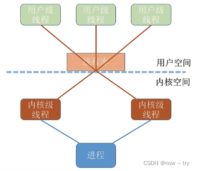

# 进程管理

> 参考：
>
> https://blog.csdn.net/sgr011215/article/details/123487568
>
> https://blog.csdn.net/weixin_43765321/article/details/123279800

## 操作系统基础

### 概念

指控制和管理整个计算机系统的硬件和资源，并合理的组织调度计算机工作和资源的分配，以提供给用户和其他软件方便的接口和环境它是计算机系统最基本的系统软件。

### 功能和目标

- **资源的管理者**

  - > 处理器管理:当我们运行一个 QQ 时，QQ 整个进程就被处理机(CPU)处理 储存器管理：当我们运行 QQ 时，需要把 QQ 这个程序相关数据放到内存中 文件管理:当我们要运行 QQ 的时，需要在文件夹中找到 QQ 这个应用程序 设备管理:和朋友视频聊天的时候，将摄像头分配给 QQ

- **向用户提供服务**

  - 命令接口（允许用户直接调用）

    - > 联机命令接口：我说一句，系统执行一句；（cmd 命令窗口）
      >
      > 脱机命令接口：我把要说的放到文件中，一起交给系统来执行；（一个**bat**执行文件）

  - 程序接口（允许用户通过程序间接调用）

    - 由一组系统调用组成

  - GUI 用户界面

  - 提供可视化操作

- **对硬件机器的扩展**

  - > 没有任何软件支持的计算机称为**裸机**。在裸机上安装操作系统，可以提供资源管理功能和方便用户使用功能，将裸机改造成功能更强、使用更方便的机器，通常把覆盖了软件的机器称为**扩充机器**，又称之为**虚拟机**。

### OS 基本特征

- 并发：在同一个时间段内，可以执行多个任务。在宏观上看，就像是同一时刻执行的多个任务；微观上看，实则是多个任务在一个极小的时间段内，交替在执行。

- 共享：共享即共享资源，是指系统中的资源可供**多个并发执行的进程**同时使用。

  - 互斥共享
  - > 系统中的某些资源，虽然可以提供给多个进程使用，但**一个时间段内只允许一个进程访问该资源**。

  - 同时共享
  - > 系统中的某些资源，允许**一个时间段内由多个进程"同时"对他们进行访问**。 所谓"同时"，往往都是宏观上的，而在微观上，这些进程可能是交替地对该资源进行访问的(分时共享)

- 虚拟：

  - > 虚拟是指把一个物理上的实体变成若干个逻辑上的对应物。物理实体(前者)是实际存在的，而逻辑上对应物（后者）使用户感受到的。 为什么会有这样的感觉？ 就是因为多个程序同时执行是并发的，它们宏观上都在执行，但是它们实际上只是交替执行的，这也成为**虚拟处理器技术**。

  - 空分复用技术：虚拟储存技术
  - 时分复用技术：虚拟处理器技术

- 异步：

  - > 异步是指在多道程序环境下，允许多个程序并发执行，但由于资源有限，进程的执行不是一贯到底的，而是走走停停的，以不可预知的速度向前推进，这就是进程的异步性。
    >
    > 例如：程序 1 执行占用了 A 资源，正在使用 A 资源，这时候程序 2 并发执行，但是由于程序 1 占用了 A 资源，所有操作堵塞，只有当程序 1 将资源用完返回后，程序 2 才能继续进行下去，所有是以不可预知的速度向前推进。

## 进程管理

### 进程和线程

#### 进程的概念和特征

##### 概念

进程是一个具有一定独立功能的程序关于某个数据集合的一次运行活动 ，**是系统进行资源分配和调度的一个独立单位**。

- 进程是程序的一次执行
- 进程是一个程序机器数据在处理机上顺序执行时所发生的活动
- 进程是程序在一个数据集合上运行的过程
- 进程是系统进行资源**分配和调度**的一个独立的单位（或者说基本单位）

##### 特征

动态性：进程是程序的一次执行，具有一定的生命周期，是动态地产生、变化和消亡的。动态性是进程最基本的特征。

并发性：指多个进程实体同时存在于内存中，能在一段时间内同时运行。引入进程的目的就是为了使程序能与其他进程的程序并发执行，以提高资源利用率。

独立性：指进程实体是一个能独立运行、独立获得资源和独立接受调度的基本单位。

异步性：进程按各自独立的、不可预知的速度向前推进。异步性会导致执行结果的不可再现性。

结构性：从结构上看，进程是由程序段、数据段和进程控制块三部分组成。

#### 状态转换

#### 进程控制

进程控制的主要功能是对系统中的所有进程实施有效的管理，它具有创建新进程、撤销已有进程、实现进程状态转换等功能。在操作系统中，一般把进程控制用的程序段称为原语。

##### 进程创建

允许一个进程创建另一个进程。此时创建者称为父进程，被创建者称为子进程。子进程可以继承父进程所拥有的资源。当子进程被撤销时，应将其从父进程那里获得的资源归坏给父进程。在撤销父进程时，必须同时撤销其所有的子进程。

在操作系统中，终端用户登录系统、作业调度、系统提供服务和用户程序的应用请求等都会引起进程的创建。（注：设备分配不会导致创建新进程）

##### 进程终止

引起进程终止的事件主要有：

1. 正常结束： 表示进程的任务已经完成并准备退出运行
2. 异常结束：表示进程在运行时，发生某种异常事件，使程序无法继续运行
3. 外界干预：指进程应外界的请求而终止运行

##### 进程的阻塞和唤醒

- 正在执行的进程，由于期待的某些事件尚未发生，如请求系统资源失败。等待某种操作的完成，新数据尚未到达或无新工作可做等，由系统自动执行阻塞原语，使自己由运行态进入阻塞态；
- 当被阻塞进行所期待的事件出现时，如它所启动的 I/O 操作已完成或其他所期待的数据已到达，由相关进程调用唤醒原语，将等待该事件的进程唤醒；

##### 进程切换

进程切换是指处理机从一个进程的运行转换到另一个进程上运行，在这个过程中，进程的运行环境发生了实质性的变化。

调度与切换的区别：调度是指决定资源分配给哪个进程的行为，是一种决策行为；切换是指实际分配的行为，是执行行为。**一般来说，先有资源的调度，再有进程的切换**。

##### 进程通信

进程通信是指进程之间的信息交换。PV 操作是低级通信方式，高级通信方式是指以较高的效率传输大量数据的通信方式。

进程是分配系统资源的单位（包括内存地址空间），因此各进程拥有的内存地址空间相对独立。为了保证进程的安全，一个进程不能直接访问另一个进程的地址空间，但是进程之间的信息交换又是必须实现的，为了保证进程间的安全通信，操作系统提供了共享存储、消息传递和管道通信等一些方法。

高级通信方式主要有以下三类：

- 共享存储：在通信的进程之间存在一块可以直接访问的共享空间，通过对这片共享空间进行读/写操作实现进程之间的信息交换。共享存储又分为两种：低级方式的共享是基于数据结构的共享，高级方式的共享是基于存储区的共享。
- 消息传递：在消息传递系统中，进程间的数据交换是以格式化的消息为单位的。若通信的进程之间不存在可以直接访问的共享空间，则必须利用操作系统提供的消息传递方法实现进程通信。进程通过系统提供的发送消息和接收消息两个原语进行数据交换。
- 管道通信：管道是指用于连接一个读进程和一个写进程以实现他们之间的通信的一个共享文件
  - 管道只能采用半双工通信，某一时间段内只能实现单向的传输。如果要实现双向同时通信，则需要设置两个管道。
  - 各进程要互斥地访问管道。
  - 数据以字符流的形式写入管道，当管道写满时，写进程的 write()系统调用将被阻塞，等待读进程将数据取走。当读进程将数据全部取走后，管道变空，此时读进程的 read()系统调用将被阻塞。
  - 如果没写满，就不允许读。如果没读空，就不允许写。
  - 数据一旦被读出，就从管道中被抛弃，这就意味着读进程最多只能有一个，否则可能会有读错数据的情况。

#### 线程

线程是轻量级进程，它是一个基本的 CPU 执行单元，也是程序执行流的最小单元，由线程 ID、程序计数器、寄存器集合和堆栈组成。线程不拥有资源，只拥有一点在运行中必不可少的资源，但它可与同属一个进程的其他线程共享进程所拥有的全部资源。

一个线程可以创建和撤销另一个线程，同一个进程间的多个线程也可以并发执行。线程也有就绪、阻塞和运行三种基本状态。

##### 线程与进程的比较

1. 调度。在引入线程之后，CPU 调度的基本单位变为线程；
2. 拥有资源。线程是几乎不持有资源的（但是也有一小部分是不可以缺少的资源）；
3. 并发性。同一个进程中线程的并发，开销要比进程并发小，提高并发效率；
4. 系统开销。线程的创建和撤销都要比进程开销小。同时由于同一进程内的多个线程共享进程的地址空间，因此这些线程之间的同步与通信非常容易，甚至无需操作系统的干预；
5. 地址空间和其他资源（如打开的文件）。进程的地址空间之间互相独立，同一进程的各线程间共享进程的资源，某进程内的线程对于其他进程不可见。
6. 通信方面。进程间通信需要进程同步和互斥手段的辅助，以保证数据的一致性，而线程间可以直接读/写进程数据段来进行通信。

##### 线程实现方式

线程的实现方式可分为两类：用户级线程和内核级线程。

- 用户级线程有应用程序通过线程库实现。所有的线程管理工作都应该有应用程序负责（包括线程切换）。在用户看来，是有多个线程。但是在操作系统内核看来，并意识不到线程的存在。

  - 优点：用户级线程的切换是在用户空间完成的，不用切换到内核态，线程管理系统的开销小，效率高；

  - 缺点：当一个用户级线程被阻塞后，整个进程都会被阻塞，并发度不高。多个线程不可在多核处理器上并行运行。

  - 

- 内核级线程的管理工作是有操作系统完成，线程调度，切换等工作都是有内核完成。因此内核级线程的切换必然需要在核心态下完成；

- 优点：当一个线程被阻塞后，别的线程还可以继续执行，并发能力强。多线程可以在多核处理器上并行执行；

- 缺点：一个用户进程会占用多个内核级线程。线程切换由操作系统完成，需要切换到核心态，成本高，开销大；

- 

组合方式：

##### 多线程模型

- 多对一模型：多个用户级线程映射到一个内核级线程。每个用户进程只对应一个内核级线程。
  - 优点：用户级线程的切换在用户空间即可完成，不需要切换到内核态 ，线程管理的系统开销小，效率高；
  - 缺点：当一个用户级线程被阻塞后，整个进程都会被阻塞，并发度不高。多个线程不可以在多核处理机上并发执行；
- 一对一模型：一个用户级线程映射到一个内核级线程。每个用户进程有与用户级线程同数量的内核级线程；
  - 优点：当一个线程被阻塞后，别的线程还可以继续执行，并发能力强。多线程可以多核处理机上并行执行；
  - 缺点：一个用户进程会占用多个内核级线程，线程切换由操作系统切换由操作系统内核完成。需要切换到内核态，因此线程管理的成本高，开销大；
- 多对多模型：n 个用户级线程映射到 m 个内核级线程(n>=m)，每个用户进程对应 m 个内核级线程；克服了多对一模型并发度不高的缺点，又克服了一对一模型中一个用户进程占用太多内核线程，开销太大的问题；

### 处理机调度

#### 调度

处理机调度是对处理机进行分配，即从就绪队列中按照一定的算法选择一个进程并将处理机分配给它运行，以实现进程并发地执行。

#### 调度层次

1. 作业调度：又称高级调度，按一定的原则从外存上处于后备队列的作业中挑选一个或多个作业，给他们分配内存等必要资源，并建立相应的进程，以使它们获得竞争处理机的权利。
2. 中级调度：又称内存调度，其作用是提高内存利用率和系统吞吐量。应将那些暂时不能运行的进程调至外存等待，把此时的进程称为挂起态。当他们已具备运行条件且内存又稍有空闲时，由中级调度来决定把外存上的那些已具备运行条件的就绪进程再重新调入内存，并修改其状态为就绪态，挂在就绪队列上等待。
3. 进程调度：又称低级调度，其主要任务是按照某种方法和策略从就绪队列中选取一个进程，将处理机分配给它。进程调度频率很高，一般几十毫秒一次。

#### 调度的时机、切换和过程

进程调度与切换程序是操作系统内核程序。请求调度的事件发生后，才可能运行进程调度程序，调度了新的就绪进程后，才会进行进程间的切换。

现代操作系统中，不能进行进程的调度与切换的情况有：

- 在处理中断的过程中
- 进程在操作系统内核程序临界区中
- 其他需要完全屏蔽中断的原子操作过程中

应当进行进程调度与切换的情况下：

1. 发生引起调度条件且当前进程无法继续运行下去时，可以马上进行调度与切换；
2. 中断处理结束或自陷处理结束后，返回被中断进程的用户态程序执行现场前，若置上请求调度标志，即可马上进行进程调度与切换。

#### 进程调度方式

进程调度方式是指当某个进程正在处理机上执行时，若有某个更为重要或紧迫的进程需要处理，即有优先权更高的进程进入就绪队列，此时应如何分配处理机。

1. 非剥夺调度方式，又称非抢占方式。只允许进程主动放弃处理机，在运行过程中即便有更紧迫的任务到达，当前进程依然会继续使用处理机，直到该进程终止或主动要求进入阻塞态。
2. 剥夺调度方式，又称抢占方式。当一个进程正在处理机上执行时，如果有一个更重要或更紧迫的进程需要使用处理机，则立即暂停正在执行的进程，将处理机分配给更重要紧迫的那个进程。

#### 进程调度基本准则

1. CPU 利用率：指 CPU 忙碌的时间占总时间的比例
2. 系统吞吐量：单位时间内 CPU 完成作业的数量
3. 周转时间：指从作业提交到作业完成所经历的时间，是作业等待、在就绪队列中排队、在处理机上运行及进行输入/输出操作所花费时间的总和。
4. 周转时间=作业完成时间 - 作业提交时间
5. 带权周转时间=作业周转时间/作业实际运行时间
6. 等待时间：进程处于等待处理机状态的时间之和
7. 响应时间：从用户提交请求到系统首次产生响应所用的时间

#### 调度算法

##### 先来先服务调度（FCFS）

选择最先进入队列的，属于**不可剥夺算法**

特点：算法简单，但效率低；对长作业有利，但是对短作业不利；有利于 CPU 繁忙型作业。而不利于 I/O 繁忙型作业；

##### 短作业优先调度（SJF）

选择完成时间最短的，存在长作业饥饿的问题 特点：算法的平均等待时间，平均周转时间最少；但是对长作业不友好。未考虑作业的紧迫情况，不能保证紧迫型作业被及时处理；

##### 优先级调度（PR)

选择优先级别最高的，根据新的更高优先级进程能否抢占正在执行的进程，调度算法分为非剥夺式优先级调度算法和剥夺式优先级调度算法；根据进程创建后其优先级是否可以改变，进程优先级分为静态优先级和动态优先级。

优先级的设置参考：

- 系统进程>用户进程
- 交互型进程>非交互型进程
- I/O 型进程>计算型进程

##### 高响应比优先调度

选择响应比最高的，不会发生饥饿现象。响应比=（等待时间+要求服务时间） / （要求服务时间）

##### 时间片轮转调度

总是选择就绪队列中的第一个进程，但仅能运行一个时间片段。若时间片足够大，以至于所有进程都能在一个时间片内执行完毕，则时间片轮转调度算法就退化为先来先服务调度算法。若时间片段很小，则处理机就在进程间过于频繁地切换，使处理机开销增大；

##### 多级反馈队列调度

时间片轮转调度算法和优先级调度算法的综合和发展。通过调整进程优先级和时间片大小，多级反馈队列调度算法可以兼顾多方面的系统目标。例如，为提高系统吞吐量和缩短平均周转时间而照顾短进程；为获得较好的 I/O 设备利用率和缩短响应时间而照顾 I/O 型进程；同时，也不必事先估计进程的执行时间。

### 进程同步

> https://blog.csdn.net/qq_45852626/article/details/126529493

在多道程序环境下，进程是并发执行的，不同进程之间存在着不同的相互制约关系。为了协调进程之间的相互制约关系，引入进程同步的概念。

将一次仅允许一个进程使用的资源称为临界资源，访问临界资源的那段代码称为临界区。

**同步**：协调进程的执行次序，使并发进程间能有效地共享资源和相互合作，保证数据一致性

**互斥**：当一个进程进入临界区使用临界资源时，另一个进程必须等待，当占用临界资源的进程退出临界区后，另一个进程才允许区访问此临界资源。

为禁止两个进程同时进入临界区，同步机制应遵循以下准则：

- **空闲让进**
  - 临界区空闲时，允许一个请求进入临界区的进程立即进入临界区
- **忙则等待**
  - 当已有进程进入临界区，其他试图进入临界区的进程必须等待
- **有限等待**

对请求访问的进程，应保证能在有限时间内进入临界区（保证不会饥饿）

- **让权等待**

进程不能进入临界区，应当立即释放处理机，防止进程忙等待

#### 实现临界区互斥的基本方法

##### 软件实现方法

在进入区设置并检查一些标志来标明是否有进程在临界区中，若已有进程在临界区，则在进入区通过循环检查进行等待，进程离开临界区后则在退出区修改标志。 算法一：单标志法 算法二：双标志先检查法 算法三：双标志后检查法 算法四：皮特森算法（Peterson’s Algorithm）

##### 硬件实现方法

1. 中断屏蔽方法
2. 硬件指令方法，如 TestAndSet 指令，Swap 指令

- 硬件方法的优点：对于任意数目的进程，而不管是单处理机还是多处理机；简单、容易验证其正确性。可以支持进程内有多个临界区，只需为每个临界区设立一个布尔变量。
- 硬件方法的缺点：进程等待进入临界区时要耗费处理机时间，不能实现让权等待。从等待进程中随机选择一个进入临界区，有的进程可能一直选不上，从而导致“饥饿”现象。

##### 管程

管程定义了一个数据结构和能为并发进程所执行的一组操作，这组操作能同步进程和改变管程中的数据。

引入管程更方便地实现进程同步和互斥，解决信号量机制编程麻烦、易出错的问题。

管程解决的问题：

- 同步：设置条件变量及等待/唤醒操作以解决
- 互斥：由编译器负责保证

管程的组成：

- 管程的名称
- 局部于管程内部的共享结构数据说明
- 对该数据结构进行操作的一组过程
- 对局部于管程内部的共享数据设置初始值的语句

管程的基本特性：

- 局部于管程的数据只能被局部于管程的过程访问
- 一个进程只有通过调用管程内的过程才能进入管程访问共享数据
- 每次仅允许一个进程进入管程

### 死锁

死锁是指多个进程因竞争资源而造成的一种僵局，若无外力作用，这些进程都将无法向前推进。

#### 死锁产生的条件

- 互斥条件

进程要求对所分配的资源进行排他性控制，即在一段时间内某资源仅为一个进程所占用，此时若有其他进程请求该资源，则请求进程只能等待；

- 不可剥夺条件

进程所获得的资源在未使用完之前，不能由其他进程强行夺走，只能主动释放

- 请求和保持条件

进程已经保持了至少一个资源，但又提出了新的资源请求，而该资源请求又别其他进程占有，此时请求进程被阻塞，但又对自己已有的资源保持不放；

- 循环等待条件

存在一种进程资源的循环等待链，链中的每一个进程已获得的资源同时被下一个进程所请求，发生死锁时，一定有循环等待，但是发生循环等待时未必死锁。
