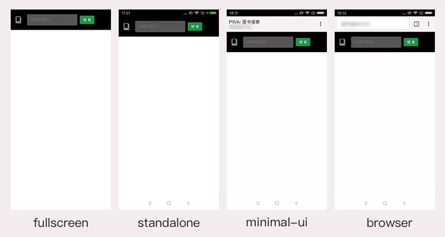

# Manifest

## Web App Manifest

> manifest 的目的是将 Web 应用程序安装到设备的主屏幕，为用户提供更快的访问和更丰富的体验。 —— MDN

Manifest 是一个 JSON 格式的文件，你可以把它理解为一个指定了 Web App 桌面图标、名称、开屏图标、运行模式等一系列资源的一个清单。

- manifest 添加到桌面的应用同比普通的桌面应用

  - > 使用 manifest 添加到桌面的 APP 是一种 Web App 的形式，它不需要在应用商店中进行下载和安装，只需要在桌面上添加快捷方式即可使用。它通常是基于 Web 技术（HTML、CSS 和 JavaScript）构建的，具有跨平台性和可访问性。这种类型的 APP 需要依赖浏览器来运行，因此它的功能和性能可能会受到浏览器的影响。
    >
    > 真实的 APP 是指通过应用商店下载安装到手机或电脑上的应用程序，它通常是基于原生开发（比如 Android 的 Java 或 iOS 的 Objective-C/Swift）构建的，具有更好的性能和功能。真实的 APP 可以充分利用设备的硬件和软件资源，因此用户可以享受更加流畅和丰富的使用体验。相对于使用 manifest 添加到桌面的 APP，真实的 APP 需要消耗更多的设备存储空间和处理能力，且需要克服不同平台之间的兼容性问题。

- 通过 manifest 添加的桌面应用是不占用计算机存储空间，实际应用仍然在浏览器中，因此它所占用的存储空间仅限于浏览器缓存中的页面和文件，这些缓存内容可以随时清除和删除。

```JSON
{
    "name": "图书搜索",
    "short_name": "书查",
    "start_url": "/",
    "display": "standalone",
    "background_color": "#333",
    "description": "一个搜索图书的小WebAPP（基于豆瓣开放接口）",
    "orientation": "portrait-primary",
    "theme_color": "#5eace0",
    "icons": [{
        "src": "img/icons/book-32.png",
        "sizes": "32x32",
        "type": "image/png"
    }, {
        "src": "img/icons/book-72.png",
        "sizes": "72x72",
        "type": "image/png"
    }, {
        "src": "img/icons/book-128.png",
        "sizes": "128x128",
        "type": "image/png"
    }, {
        "src": "img/icons/book-144.png",
        "sizes": "144x144",
        "type": "image/png"
    }, {
        "src": "img/icons/book-192.png",
        "sizes": "192x192",
        "type": "image/png"
    }, {
        "src": "img/icons/book-256.png",
        "sizes": "256x256",
        "type": "image/png"
    }, {
        "src": "img/icons/book-512.png",
        "sizes": "512x512",
        "type": "image/png"
    }]
}
```

### 关于 manifest 文件的基本配置：

- name，short_name

> 指定了 Web App 的名称。`short_name`其实是该应用的一个简称。一般来说，当没有足够空间展示应用的`name`时，系统就会使用`short_name`。可以看到本文的例子中，图书搜索这个应用在桌面上展示的名称就是`short_name`书查。

- start_url

> 打开 web app 时加载的 URL, 相对 URL 会相对于 manifest，这里指定 start_url 为 ‘/’ ，访问根目录

- display

> `display`控制了应用的显示模式，它有四个值可以选择：`fullscreen`、`standalone`、`minimal-ui`和`browser`。
>
> - `fullscreen`：全屏显示，会尽可能将所有的显示区域都占满；
> - `standalone`：独立应用模式，这种模式下打开的应用有自己的启动图标，并且不会有浏览器的地址栏。因此看起来更像一个 Native App；
> - `minimal-ui`：与`standalone`相比，该模式会多出地址栏；
> - `browser`：一般来说，会和正常使用浏览器打开样式一致。

让我们来看下这四种模式的差异：



- Orientation

> 控制 Web App 的方向。设置某些值会具有类似锁屏的效果（禁止旋转），例如例子中的`portrait-primary`。具体的值包括：`any, natural, landscape, landscape-primary, landscape-secondary, portrait, portrait-primary, portrait-secondary`。

- icons、background_color

> `icons`用来指定应用的桌面图标。icons 本身是一个数组，每个元素包含三个属性：
>
> - sizes：图标的大小。通过指定大小，系统会选取最合适的图标展示在相应位置上。
> - src：图标的文件路径。注意相对路径是相对于 manifest。
> - type：图标的图片类型。
>
> 需要指出的是，我一直提的“开屏图”其实是背景颜色+图标的展示模式（并不会设置一张所谓的开屏图）。`background_color`是在应用的样式资源为加载完毕前的默认背景，因此会展示在开屏界面。`background_color`加上我们刚才定义的`icons`就组成了 Web App 打开时的“开屏图”。

- theme_color

> 定义应用程序的默认主题颜色。 这有时会影响操作系统显示应用程序的方式（例如，在 Android 的任务切换器上，主题颜色包围应用程序）。此外，还可以在 meta 标签中设置 theme_color：`<meta name="theme-color" content="#5eace0"/>`

- Description

> 这个字段的含义非常简单，就是一段对该应用的描述。这个字段的含义非常简单，就是一段对该应用的描述。

### 使用 manifest

创建好 manifest 文件后，下一步就是需要知道如何能让我们的 Web App 使用它——非常简单，只需要在 head 中添加一个 link 标签：

```HTML
<!-- 在index.html中添加以下meta标签 -->
<link rel="manifest" href="/manifest.json">
```

这样，在 android 上我们使用 chrome 将应用添加到桌面，就会拥有文章开头处的 PWA 效果。你可在这里验证 manifest.json 的内容：[Web Manifest Validator](https://manifest-validator.appspot.com/)

### manifest 存在一定的兼容性

#### iOS（safari）中的处理方式

safari 虽然不支持 Web App Manifest，但是它有自己的一些 head 标签来定义相应的资源与展示形式：

- `apple-touch-icon`：桌面图标，通过在 head 中添加`<link rel="apple-touch-icon" href="your_icon.png">`即可。其中还可以添加 sizes 属性，来指示系统使用在各类平台（iphone、ipad…）中使用最合适的图标
- `apple-mobile-web-app-title`：应用的标题。注意，这里需要使用 meta 标签`<meta name="apple-mobile-web-app-title" content="AppTitle">`
- `apple-mobile-web-app-capable`：类似于 manifest 中的 display 的功能，通过设置为 yes 可以进入 standalone 模式，同样也是 meta 标签`<meta name="apple-mobile-web-app-capable" content="yes">`
- `apple-mobile-web-app-status-bar-style`：这会改变 iOS 移动设备的状态栏的样式，并且只有在 standalone 模式中才会有效果。`<meta name="apple-mobile-web-app-status-bar-style" content="black">`，不过在 iPhoneX 上 black 会导致状态栏不显示任何东西。

下面是 learning-pwa 项目中的相关设置

```HTML
<meta name="apple-mobile-web-app-capable" content="yes">
<meta name="apple-mobile-web-app-status-bar-style" content="default">
<meta name="apple-mobile-web-app-title" content="图书搜索">
<link rel="apple-touch-icon" href="img/icons/book-256.png">
```

#### IE 中的处理方式

与 Safari 类似，IE 中也有自己的 meta 标签来指示相应的资源。其中比较重要的有：

- `application-name`：指明了 app 的名称
- `msapplication-TileColor`：指明了“tile”的背景颜色
- `msapplication-xxxlogo`：不同大小的“tile”所使用的图标，包括这几种：`msapplication-square70x70logo, msapplication-square150x150logo, msapplication-wide310x150logo, msapplication-square310x310logo`

下面是 learning-pwa 项目中的相关设置，其中图标的设置为了方便就复用了已有的图标文件

```HTML
<meta name="application-name" content="图书搜索" />
<meta name="msapplication-TileColor" content="#222">
<meta name="msapplication-square70x70logo" content="img/icons/book-72.png" />
<meta name="msapplication-square150x150logo" content="img/icons/book-144.png" />
<meta name="msapplication-square310x310logo" content="img/icons/book-256.png" />
```
