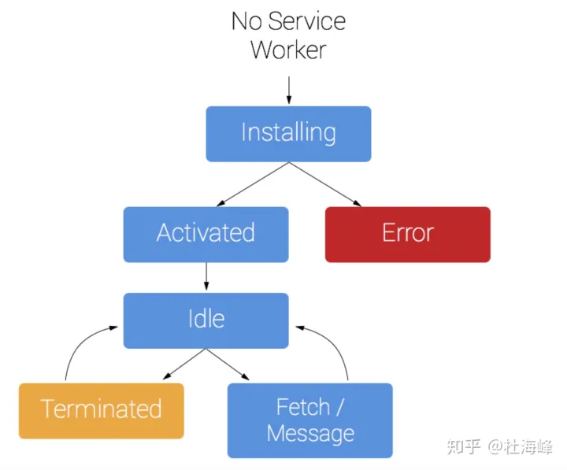

# Service Worker

## 实现 web 离线应用-Service Worker

> 参考博客：[【PWA 学习与实践】(3) 让你的 WebApp 离线可用](https://juejin.cn/post/6844903588691443725)

### Service Worker 是如何实现离线可用的？

首先，我们想一下，当访问一个 web 网站时，我们实际上做了什么呢？总体上来说，我们通过与与服务器建立连接，获取资源，然后获取到的部分资源还会去请求新的资源（例如 html 中使用的 css、js 等）。所以，粗粒度来说，我们访问一个网站，就是在获取/访问这些资源。

可想而知，当处于离线或弱网环境时，我们无法有效访问这些资源，这就是制约我们的关键因素。因此，一个最直观的思路就是：如果我们把这些资源缓存起来，在某些情况下，将网络请求变为本地访问，这样是否能解决这一问题？是的。但这就需要我们有一个本地的 cache，可以灵活地将各类资源进行本地存取。


有了本地的 cache 还不够，我们还需要能够有效地使用缓存、更新缓存与清除缓存，进一步应用各种个性化的缓存策略。而这就需要我们有个能够控制缓存的“worker”——这也就是 Service Worker 的部分工作之一。顺便多说一句，可能有人还记得 [ApplicationCache](https://link.juejin.cn?target=https%3A%2F%2Fdeveloper.mozilla.org%2Fen-US%2Fdocs%2FWeb%2FAPI%2FWindow%2FapplicationCache) 这个 API。当初它的设计同样也是为了实现 Web 资源的缓存，然而就是因为不够灵活等各种缺陷，如今已被 Service Worker 与 cache API 所取代了。

Service Worker 有一个非常重要的特性：你可以在 Service Worker 中监听所有客户端（Web）发出的请求，然后通过 Service Worker 来代理，向后端服务发起请求。通过监听用户请求信息，Service Worker 可以决定是否使用缓存来作为 Web 请求的返回。

下图展示普通 Web App 与添加了 Service Worker 的 Web App 在网络请求上的差异：


这里需要强调一下，虽然图中好像将浏览器、SW(Service Worker)与后端服务三者并列放置了，但实际上浏览器（你的 Web 应用）和 SW 都是运行在你的本机上的，所以这个场景下的 SW 类似一个“客户端代理”。

了解了基本概念之后，就可以具体来看下，我们如何应用这个技术来实现一个离线可用的 Web 应用。

#### service worker 准备工作

Service workers 能够运行的前提是网站采用了 https。这是出于安全因素的考虑。

现在主流浏览器都已经支持 service worker，不需要去单独开启了。

虽然 service worker 一定要在 https 的域名下面运行，但是本地的`http://localhost`域名却不影响，可以正常运行。

#### 注册 Service Worker

```JavaScript
// 为保证应用渐进可用，我们应该先判断浏览器是否支持service worker
if('serviceWorker' in navigator) {
    navigator.serviceWorker.register('./sw.js').then(function () {
        console.log("Service Worker 注册成功")
    })
}

// 更新一种写法
if ('serviceWorker' in navigator) {
  navigator.serviceWorker
    .register('sw.js', { scope: './' })
    .then(function (serviceWorker) {
      // 注册成功
      document.getElementById('status').innerHTML = 'success!!!';
    })
    .catch(function (error) {
      // 注册失败
      document.getElementById('status').innerHTML = 'error!!!';
    });
} else {
  alert('当前浏览器暂不支持serviceWorker');
}
```

> register 的第二个参数的`scope`表示此 service worker 的作用范围是当前域名下面的根目录。
>
> sw.js 文件：添加一些事件监听，处理缓存等工作

**卸载 serviceWorker**

> 在本地项目中，也就是这里的 demo 吧，我们注册完 serviceWorker 之后，如果后续不再使用 servieWorker 之后，就可以将其卸载

```JavaScript
serviceWorker.unregister().then(function() {
    // 卸载成功
    document.getElementById("status").innerHTML = 'unregister success!!!'
})
```

一个 sw.js 文件内容

```JavaScript
// self 是Service Worker中的一个特殊的全局变量，类似于我们最常见的window对象，
// self引用了当前这个Service Worker
// 监听install
self.addEventListener('install', function (e) {
  console.log('%c%s', 'font-size:20px;color:yellow', 'Install Event: ' + e);
});

// active
self.addEventListener('activate', function (e) {
  console.log('%c%s', 'font-size:20px;color:yellow', 'Activate Event: ' + e);
});
```

#### Service Worker 生命周期

[玩转 Service Worker 生命周期](https://zhuanlan.zhihu.com/p/162870243)

> 当我们注册了 Service Worker 后，它会经历生命周期的各个阶段，同时会触发相应的事件。整个生命周期包括了：installing --> installed --> activating --> activated --> redundant。当 Service Worker 安装（installed）完毕后，会触发 install 事件；而激活（activated）后，则会触发 activate 事件。




添加监听事件

```JavaScript
self.addEventListener("install", function(e) {
    console.log("Service Worker状态：install");
})
```

> `self` 是 Service Worker 中的一个特殊的全局变量，类似于我们最常见的 window 对象，self 引用了当前这个 Service Worker

#### 缓存静态资源

> 要使得对应的 web App 离线可用，就需要将所需资源缓存下来，我们需要一个资源列表，当 Service Worker 被激活时，会将该列表内的资源缓存进 cache；

```JavaScript
// sw.js
var cacheName = 'bs-0-2-0';
var cacheFiles = [
    '/',
    './index.html',
    './index.js',
    './style.css',
    './img/book.png',
    './img/loading.svg'
];

// 监听install事件，安装完成后，进行文件缓存
self.addEventListener('install', function (e) {
    console.log('Service Worker 状态： install');
    var cacheOpenPromise = caches.open(cacheName).then(function (cache) {
        return cache.addAll(cacheFiles);
    });
    e.waitUntil(cacheOpenPromise);
});
```

Ps:

可以看到，首先在`cacheFiles`中我们列出了所有的静态资源依赖。注意其中的`'/'`，由于根路径也可以访问我们的应用，因此不要忘了将其也缓存下来。当 Service Worker install 时，我们就会通过`caches.open()`与`cache.addAll()`方法将资源缓存起来。这里我们给缓存起了一个`cacheName`，这个值会成为这些缓存的 key。

> Cache 接口提供缓存的 Request / Response 对象对的存储机制。Cache 接口像 workers 一样, 是暴露在 window 作用域下的。尽管它被定义在 service worker 的标准中, 但是它不必一定要配合 service worker 使用。——MDN

#### 使用缓存的静态资源

> 上述过程，只是对静态资源进行了缓存，但是并没有对其进行使用。关于缓存资源的使用，我们可以使用前面提到的‘客户端代理’来解决；

未使用到缓存：


使用到了缓存：


上述的过程类似于 http 缓存的过程，这里使用缓存的过程大致就是：

1. 浏览器发起一个请求，Service Worker 检测对应的请求，是否为自己要缓存的资源，如果是就进行下一步，反之就直接去发送请求到服务端；
2. 客户端代理现在 Cache 中查询是否有对应请求的内容；
3. 如果查询到有对应请求的资源，那么就返回 cache 中的内容给浏览器客户端；
4. 如果没有找到，就去服务端查询，代理向服务器发送请求，获取数据，同时这个数据如果是要被缓存的资源，那么同时也会进入到对应 Cache 中；

```JavaScript
// sw.js
self.addEventListener('fetch', function (e) {
    // 如果有cache则直接返回，否则通过fetch请求
    e.respondWith(
        caches.match(e.request).then(function (cache) {
            return cache || fetch(e.request);
        }).catch(function (err) {
            console.log(err);
            return fetch(e.request);
        })
    );
});
```

`fetch`事件会监听所有浏览器的请求。`e.respondWith()`方法接受 Promise 作为参数，通过它让 Service Worker 向浏览器返回数据。`caches.match(e.request)`则可以查看当前的请求是否有一份本地缓存：如果有缓存，则直接向浏览器返回`cache`；否则 Service Worker 会向后端服务发起一个`fetch(e.request)`的请求，并将请求结果返回给浏览器。

到目前为止，运行我们的 demo：当第一联网打开“图书搜索”Web App 后，所依赖的静态资源就会被缓存在本地；以后再访问时，就会使用这些缓存而不发起网络请求。因此，即使在无网情况下，我们似乎依旧能“访问”该应用。

#### 更新缓存的静态资源

> 通过使用缓存的静态资源可以极大地减去网络请求的次数，降低网络开销；但是，我们不可能一次请求，永久使用，因为服务器对应的静态资源可能会修改，所以如果一直使用缓存资源，那么用户就看不到最新的内容，那么再快的响应速度，也没有什么意义了。所以现在，就需要来进行缓存资源的更新：

解决这个问题的一个简单方法就是修改`cacheName`。由于浏览器判断 sw.js 是否更新是通过字节方式，因此修改`cacheName`会重新触发 install 并缓存资源。此外，在 activate 事件中，我们需要检查`cacheName`是否变化，如果变化则表示有了新的缓存资源，原有缓存需要删除。

```JavaScript
// sw.js
// 监听activate事件，激活后通过cache的key来判断是否更新cache中的静态资源
self.addEventListener('activate', function (e) {
    console.log('Service Worker 状态： activate');
    var cachePromise = caches.keys().then(function (keys) {
        return Promise.all(keys.map(function (key) {
            if (key !== cacheName) {
                return caches.delete(key);
            }
        }));
    })
    e.waitUntil(cachePromise);
    return self.clients.claim();
});
```

#### 离线搜索

> 实则就是缓存部分 xhr(获取其他请求方式：fetch, axios 等)请求的数据。当再次发起请求时，我们会优先使用本地缓存（如果有缓存的话），然后向服务器请求数据，服务器返回数据后，基于该数据替换展示


```JavaScript
// sw.js
var apiCacheName = 'api-0-1-1';
self.addEventListener('fetch', function (e) {
    // 需要缓存的xhr请求
    var cacheRequestUrls = [
        '/book?'
    ];
    console.log('现在正在请求：' + e.request.url);

    // 判断当前请求是否需要缓存
    var needCache = cacheRequestUrls.some(function (url) {
        return e.request.url.indexOf(url) > -1;
    });

    /**** 这里是对XHR数据缓存的相关操作 ****/
    if (needCache) {
        // 需要缓存
        // 使用fetch请求数据，并将请求结果clone一份缓存到cache
        // 此部分缓存后在browser中使用全局变量caches获取
        caches.open(apiCacheName).then(function (cache) {
            return fetch(e.request).then(function (response) {
                cache.put(e.request.url, response.clone());
                return response;
            });
        });
    }
    /* ******************************* */

    else {
        // 非api请求，直接查询cache
        // 如果有cache则直接返回，否则通过fetch请求
        e.respondWith(
            caches.match(e.request).then(function (cache) {
                return cache || fetch(e.request);
            }).catch(function (err) {
                console.log(err);
                return fetch(e.request);
            })
        );
    }
});
```

这里，我们也为 API 缓存的数据创建一个专门的缓存位置，key 值为变量`apiCacheName`。在`fetch`事件中，我们首先通过对比当前请求与`cacheRequestUrls`来判断是否是需要缓存的 XHR 请求数据，如果是的话，就会使用`fetch`方法向后端发起请求。

在`fetch.then`中我们以请求的 URL 为 key，向 cache 中更新了一份当前请求所返回数据的缓存：`cache.put(e.request.url, response.clone())`。这里使用`.clone()`方法拷贝一份响应数据，这样我们就可以对响应缓存进行各类操作而不用担心原响应信息被修改了。

#### 调试

1. 在 chrome 中打开：`chrome://inspect/#service-workers`
2. 或者在 chrome 中输入：`chrome://serviceworker-internals/` 如果列表里面没有的话，说明没有 service worker 正在运行
3. 在 DevTools 中的 Source 下面的 service worker 可以看到对应的 js 脚本

在`chrome://serviceworker-internals/`页面中，可以看到每个 service worker 下面有几个按钮

- **Terminated**：注销 service worker
- **Start/Stop**: 开启/停止 service worker
- **Sync**: 给 worker 同步 Sync 事件
- **push**: 给 worker 同步 push 事件
- **Inspect**：在检查器中打开 worker

即使勾选了 Network 中的 disable cache，service worker 依然会生效，如果需要每次都更新，需要勾选 Application->service worker->offline
