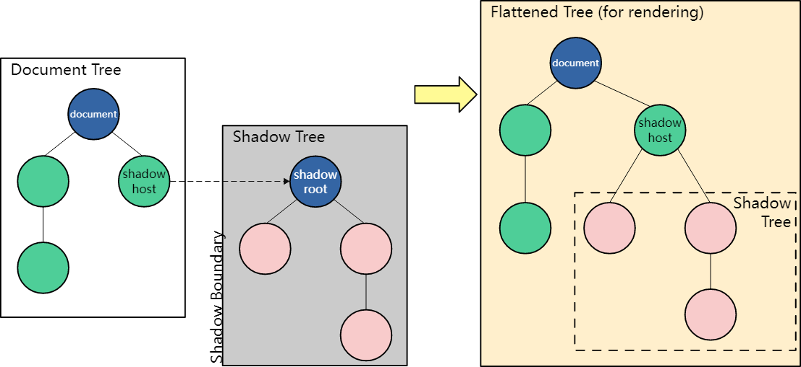

# Web components

> Web Component 是一套不同的技术，允许你**创建可重用的定制元素**（它们的功能封装在你的代码之外）并且在你的 web 应用中使用它们。

它由三项主要技术组成：

- Custom element（自定义元素）：一组 JavaScript API，允许您定义 custom elements 及其行为，然后可以在您的用户界面中按照需要使用它们。
- Shadow DOM（影子 DOM）：一组 JavaScript API，用于将封装的“影子”DOM 树附加到元素（与主文档 DOM 分开呈现）并控制其关联的功能。通过这种方式，您可以保持元素的功能私有，这样它们就可以被脚本化和样式化，而不用担心与文档的其他部分发生冲突。
- HTML template（HTML 模板）： `<template>` 和 `<slot>` 元素使您可以编写不在呈现页面中显示的标记模板。然后它们可以作为自定义元素结构的基础被多次重用。

实现 web component 的基本方法通常如下所示：

1. 创建一个类或函数来指定 web 组件的功能，如果使用类，请使用 ECMAScript 2015 的类语法 (参阅[类](https://developer.mozilla.org/zh-CN/docs/Web/JavaScript/Reference/Classes)获取更多信息)。
2. 使用 `CustomElementRegistry.define()` 方法注册您的新自定义元素，并向其传递要定义的元素名称、指定元素功能的类、以及可选的其所继承自的元素。
3. 如果需要的话，使用 `Element.attachShadow()` 方法将一个 shadow DOM 附加到自定义元素上。使用通常的 DOM 方法向 shadow DOM 中添加子元素、事件监听器等等。
4. 如果需要的话，使用 `<template>` 和 `<slot>` 定义一个 HTML 模板。再次使用常规 DOM 方法克隆模板并将其附加到您的 shadow DOM 中。
5. 在页面任何您喜欢的位置使用自定义元素，就像使用常规 HTML 元素那样。

## custom Element

> Web Components 标准非常重要的一个特性是，它使开发者能够将 HTML 页面的功能封装为 custom elements（自定义标签），而往常，开发者不得不写一大堆冗长、深层嵌套的标签来实现同样的页面功能。

`CustomElementRegistry.define()` 方法用来注册一个 custom element，该方法接受以下参数：

- 表示所创建的元素名称的符合 `DOMString` 标准的字符串。注意，custom element 的名称不能是单个单词，且其中[必须要有短横线](https://html.spec.whatwg.org/#valid-custom-element-name)。
- 用于定义元素行为的 [类](https://developer.mozilla.org/zh-CN/docs/Web/JavaScript/Reference/Classes) 。
- `可选参数`，一个包含 `extends` 属性的配置对象，是可选参数。它指定了所创建的元素继承自哪个内置元素，可以继承任何内置元素。

作为示例，我们可以像这样定义一个叫做 [word-count](https://mdn.github.io/web-components-examples/word-count-web-component/) 的 custom element：

```JavaScript
customElements.define('word-count', WordCount, { extends: 'p' });
```

Copy to ClipboardCopy to Clipboard

这个元素叫做 `word-count`，它的类对象是 `WordCount`, 继承自 `<p>` 元素。

一个 custom element 的类对象可以通过 ES 2015 标准里的类语法生成。所以，`WordCount`可以写成下面这样：

```JavaScript
class WordCount extends HTMLParagraphElement {
    constructor() {
        // 必须首先调用 super 方法
        super();
        // 元素的功能代码写在这里...
    }
}
```

共有两种 custom elements：

- **Autonomous custom elements** 是**独立的元素**，它不继承其他内建的 HTML 元素。你可以直接把它们写成 HTML 标签的形式，来在页面上使用。例如 `<popup-info>`，或者是`document.createElement("popup-info")`这样。
- **Customized built-in elements** **继承自基本的 HTML 元素**。在创建时，你必须指定所需扩展的元素（正如上面例子所示），使用时，需要先写出基本的元素标签，并通过 `is` 属性指定 custom element 的名称。例如`<p is="word-count">`, 或者 `document.createElement("p", { is: "word-count" })`。(原来 createElement 的第二个参数是这样使用的)

#### **Autonomous custom elements**

> 参考 MDN 例子：https://github.com/mdn/web-components-examples/tree/main/popup-info-box-web-component

```JavaScript
// 这是一个Autonomous custom elements（独立元素，不继承自内置的元素）
// 但是需要继承自HTMLElement
class PopUpInfo extends HTMLElement {
  constructor() {
    // 首先调用super
    super(); // 继承原型链方法

    // TODO: 创建一个shadow root (暂时不知道拿来干嘛！！！)
    const shadow = this.attachShadow({ mode: 'open' });

    // 创建spans
    const wrapper = document.createElement('span');
    wrapper.setAttribute('class', 'wrapper');

    const icon = document.createElement('span');
    icon.setAttribute('class', 'icon');
    icon.setAttribute('tabindex', 0);

    const info = document.createElement('span');
    info.setAttribute('class', 'info');

    // 获取元素的属性值，并将该值放置到info里面
    const text = this.getAttribute('data-text');
    info.textContent = text;

    // 插入图标
    let imgUrl;
    if (this.hasAttribute('img')) {
      imgUrl = this.getAttribute('img');
    } else {
      imgUrl = '../static/alt.png';
    }

    const img = document.createElement('img');
    img.src = imgUrl;
    icon.appendChild(img);

    // 创建一些css 应用到shadow dom上
    const style = document.createElement('style');
    console.log(style.isConnected);

    style.textContent = `
      .wrapper {
        position: relative;
      }

      .info {
        font-size: 0.8rem;
        width: 200px;
        display: inline-block;
        border: 1px solid black;
        padding: 10px;
        background: white;
        border-radius: 10px;
        opacity: 0;
        transition: 0.6s all;
        position: absolute;
        bottom: 20px;
        left: 10px;
        z-index: 3;
      }
      .img {
        width: 1.2rem;
      }
      .icon:hover + .info,
      .icon:focus + .info {
        opacity: 1;
      }
    `;

    // Attach the created elements to the shadow dom
    shadow.appendChild(style);
    console.log(style.isConnected);
    shadow.appendChild(wrapper);
    wrapper.appendChild(icon);
    wrapper.appendChild(info);
  }
}

// Define the new element
customElements.define('popup-info', PopUpInfo);
```

使用

> 可以像普通的内置元素一样使用

```HTML
 <div class="box">
      hello<popup-info
        img="../static/alt.png"
        data-text="Your card validation code (CVC)
  is an extra security feature — it is the last 3 or 4 numbers on the
  back of your card."
      ></popup-info>
      <input type="text" />
    </div>
    <script src="./PopUpInfo.js"></script>
```

#### **Customized built-in elements**

> 参考 MDN 例子：https://github.com/mdn/web-components-examples/tree/main/expanding-list-web-component

```JavaScript
// 继承内置元素的自定义元素
class ExpandingList extends HTMLUListElement {
  constructor() {
    self = super();

    const uls = Array.from(self.querySelectorAll('ul'));
    const lis = Array.from(self.querySelectorAll('li'));

    uls.forEach((ul) => {
      ul.style.display = 'none';
    });
    lis.forEach((li) => {
      if (li.querySelectorAll('ul').length > 0) {
        li.setAttribute('class', 'closed');

        const childText = li.childNodes[0];
        const newSpan = document.createElement('span');

        newSpan.textContent = childText.textContent;
        newSpan.style.cursor = 'pointer';

        newSpan.onclick = self.showul;

        childText.parentNode.insertBefore(newSpan, childText);
        childText.parentNode.removeChild(childText);
      }
    });
  }
  showul(e) {
    const nextul = e.target.nextElementSibling; // span下面的ul元素

    if (nextul.style.display === 'block') {
      nextul.style.display = 'none';
      nextul.parentNode.setAttribute('class', 'closed');
    } else {
      nextul.style.display = 'block';
      nextul.parentNode.setAttribute('class', 'open');
    }
  }
}
// 定义自定义元素，这里需要继承自指定的内置元素
customElements.define('expanding-list', ExpandingList, { extends: 'ul' });
```

使用

> 使用 is 属性来指定对应的自定义元素

```HTML
 <div>

      <ul is="expanding-list">
        <li>1</li>
        <li>
          2
          <ul>
            <li>2-1</li>
            <li>2-2</li>
            <li>2-3</li>
          </ul>
        </li>
        <li>3</li>
        <li>4</li>
      </ul>
</div>
<script src="./ExpandingList.js"></script>
```

#### 生命周期

> - `connectedCallback`：当 custom element 首次被插入文档 DOM 时，被调用。
> - `disconnectedCallback`：当 custom element 从文档 DOM 中删除时，被调用。
> - `adoptedCallback`：当 custom element 被移动到新的文档时，被调用。
> - `attributeChangedCallback`: 当 custom element 增加、删除、修改自身属性时，被调用。

参考 MDN 例子: https://github.com/mdn/web-components-examples/tree/main/life-cycle-callbacks

## shadow DOM

> Web components 的一个重要属性是**封装**——可以将标记结构、样式和行为隐藏起来，并与页面上的其他代码相隔离，保证不同的部分不会混在一起，可使代码更加干净、整洁。其中，Shadow DOM 接口是关键所在，它可以将一个隐藏的、独立的 DOM 附加到一个元素上。

_Shadow_ DOM 允许将隐藏的 DOM 树附加到常规的 DOM 树中——它以 shadow root 节点为起始根节点，在这个根节点的下方，可以是任意元素，和普通的 DOM 元素一样。



这里，有一些 Shadow DOM 特有的术语需要我们了解：

- Shadow host：一个常规 DOM 节点，Shadow DOM 会被附加到这个节点上。
- Shadow tree：Shadow DOM 内部的 DOM 树。
- Shadow boundary：Shadow DOM 结束的地方，也是常规 DOM 开始的地方。
- Shadow root: Shadow tree 的根节点。

你可以使用同样的方式来操作 Shadow DOM，就和操作常规 DOM 一样——例如添加子节点、设置属性，以及为节点添加自己的样式（例如通过 `element.style` 属性），或者为整个 Shadow DOM 添加样式（例如在 `<style>` 元素内添加样式）。不同的是，Shadow DOM 内部的元素始终不会影响到它外部的元素（除了 `:focus-within`），这为封装提供了便利。

注意，不管从哪个方面来看，Shadow DOM 都不是一个新事物——在过去的很长一段时间里，浏览器用它来封装一些元素的内部结构。以一个有着默认播放控制按钮的 `<video>` 元素为例。你所能看到的只是一个 `<video>` 标签，实际上，在它的 Shadow DOM 中，包含了一系列的按钮和其他控制器。Shadow DOM 标准允许你为你自己的元素（custom element）维护一组 Shadow DOM。

### **基本使用**

可以使用 `Element.attachShadow()` 方法来将一个 shadow root 附加到任何一个元素上。它接受一个配置对象作为参数，该对象有一个 `mode` 属性，值可以是 `open` 或者 `closed`：

```JavaScript
let shadow = elementRef.attachShadow({mode: 'open'});
let shadow = elementRef.attachShadow({mode: 'closed'});
```

`open` 表示可以通过页面内的 JavaScript 方法来获取 Shadow DOM，例如使用 `Element.shadowRoot` 属性：

```JavaScript
let myShadowDom = myCustomElem.shadowRoot;
```

如果你将一个 Shadow root 附加到一个 Custom element 上，并且将 `mode` 设置为 `closed`，那么就不可以从外部获取 Shadow DOM 了——`myCustomElem.shadowRoot` 将会返回 `null`。浏览器中的某些内置元素就是如此，例如`<video>`，包含了不可访问的 Shadow DOM。

## template 、slots

当您必须在网页上重复使用相同的标记结构时，使用某种模板而不是一遍又一遍地重复相同的结构是有意义的。以前这是可行的，但 HTML `<template>` 元素使它更容易实现 (这在现代浏览器中得到了很好的支持)。此元素及其内容不会在 DOM 中呈现，但仍可使用 JavaScript 去引用它。

让我们看一个简单的示例：

```JavaScript
<template id="my-paragraph"><p>My paragraph</p></template>
```

上面的代码不会展示在你的页面中，直到你用 JavaScript 获取它的引用，然后添加到 DOM 中，如下面的代码：

```JavaScript
let template = document.getElementById('my-paragraph');
let templateContent = template.content;
document.body.appendChild(templateContent);
```

虽然是个简单的例子，但您已经可以开始了解它是多么的有用了。

参考：https://developer.mozilla.org/zh-CN/docs/Web/API/Web_components/Using_templates_and_slots
