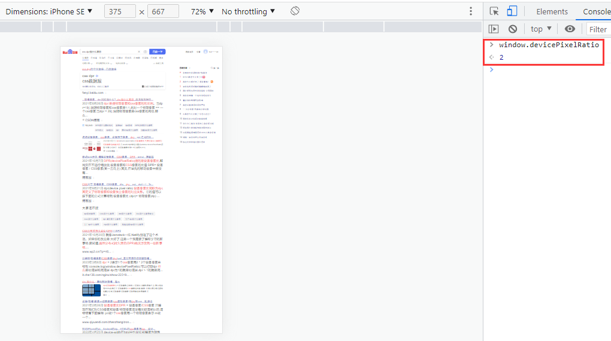
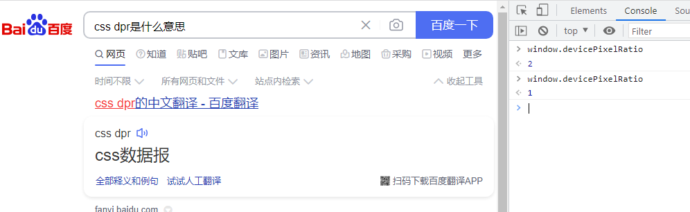

# CSS 基础

## 1. 实现单行，多行显示

```CSS
.box {
    overflow: hidden;
    white-space: nowrap;
    text-overflow: ellipsis;
}
.box2 {
    overflow: hidden;
    text-overflow: ellipsis;
    display: -webkit-box; // 作为弹性伸缩盒子模型显示
    -webkit-box-orient: vertical; // 设置伸缩盒子的子元素排列方式，从上到下垂直排列
    -webkit-line-clamp: 3; // 显示的行数
}
```

## 2. 解决 1px 问题

1px 问题是指在部分移动端设备上，1px 会变粗，呈现出不止 1px 的效果。CSS 中的 1px 并不能和移动设备上的 1px 划等号。它们之间的比例关系有一个专门的属性来描述：

```JavaScript
window.devicePixelRadio = 设备的物理像素 / CSS像素
```

- 通过 chrome 的调试工具，切换到移动设备（iPhone SE），其对应的属性值为：2；



- 在浏览器设备上，则显示的是：1



那么在移动端上，固然会出现 1px 变粗的情况；

在开始解决问题之前，先理解几个概念：

- **css 像素**：也叫做逻辑像素，或者独立设备像素；css 中的 1px 就是一个独立设备像素。
- **物理像素**：是指设备屏幕实际拥有的像素点，设备出厂后就不能改变的参数。
- **dpr**：是指物**理像素和 css 像素的的比例**。当 dpr=1 时，说明物理像素和 css 像素是 1:1，此时一个物理像素 == 一个 css 像素；当 dpr = 2 时，说明物理像素是 css 像素的两倍，那么此时 4 个物理像素显示一个 css 像素(长 2 倍，宽 2 倍，乘起来就是 4 倍)。一般来说，屏幕出厂前都已经设定好了，不可改变。

### 直接设置对应的像素

首先通过 JavaScript 拿到当前设备的 dpr，然后通过 CSS 的属性选择器来设置对应的大小；（使用 jsx 语法）

```HTML
<div class='box' data-device={{window.devicePixelRadio}}></div>
// 设置宽度
.box[data-device="2"] {
    border: 0.5px solid #000;
}
```

虽然这种方式设置简单，但是在实际应用过程中还是存在一定的兼容性问题。

### 伪元素先放大后缩小

这个方法的可行性会更高，兼容性也会更好。

**思路**：

先放大，后缩小：在目标元素的后面追加一个::after 伪元素，让这个元素布局为 absolute 之后，整个伸展开铺在目标元素上，然后把它的宽和高都设置为目标元素的两倍，border 值设置为 1px。接着借助 CSS 动画特效中的放缩功能，把整个伪元素缩小为原来的 50%。此时，伪元素的宽和高刚好可以和原来的目标元素对齐，而 border 也会缩小为 1px 的一半，间接地实现了 0.5px 的效果。

```CSS
.box[data-device="2"] {
    position: relative;
}
.box[data-device="2"]::after {
    position: absolute;
    top: 0;
    left: 0;
    width: 200%；
    height: 200%;
    content: '';
    transform: scale(0.5);
    transform-origin: left top; // 变形的原点，这里就是基于什么位置进行缩放
    box-sizing: border-box;
    border: 1px solid #000;
}
```

### 使用 viewport 缩放

这个思路就是使用功能 meta 标签里面的一些属性来实现：

```HTML
<meta name="viewport" content="inital-scale=0.5,maxmum-scale=0.5,minmum-scale=0.5,user-scalable=no" />
```

这里是针对 dpr 为 2 的页面，把整个页面缩放为了原来的 1/2 大小。这样，本来占用 2 个物理像素的 1px 样式。现在占用的就是标准的一个物理像素。根据像素比的不同，这个缩放比例可以被计算为不同的值，使用 js 实现：

```JavaScript
const scale = 1/ window.devicePixelRadio;
// 这里的metaEl指的是meta标签对应的DOM
metaEl.setAttribute('content', `width=device-width,user-scalable=no,inital-scale=${scale},maxmum-scale=${scale},minmum-scale=${scale}`)
```

这种方式虽然实现简单，但是其副作用也是不小的，它会将这个页面进行缩放，这是 1px 已经被处理成物理像素大小，这样的大小在手机上显示边框很合适，但是，一些原本不需要被缩小的内容，比如文字，图片等，都会被缩小。

## 3. 继承与非继承属性

链接：https://www.nowcoder.com/questionTerminal/b8c4d762aad84745a5dd13c3dcaee8db?

**一、无继承性的属性**

1、display：规定元素应该生成的框的类型

2、文本属性：

vertical-align：垂直文本对齐

text-decoration：规定添加到文本的装饰

text-shadow：文本阴影效果

white-space：空白符的处理

unicode-bidi：设置文本的方向

3、盒子模型的属性：width、height、margin 、margin-top、margin-right、margin-bottom、margin-left、border、border-style、border-top-style、border-right-style、border-bottom-style、border-left-style、border-width、border-top-width、border-right-right、border-bottom-width、border-left-width、border-color、border-top-color、border-right-color、border-bottom-color、border-left-color、border-top、border-right、border-bottom、border-left、padding、padding-top、padding-right、padding-bottom、padding-left

4、背景属性：background、background-color、background-image、background-repeat、background-position、background-attachment

5、定位属性：float、clear、position、top、right、bottom、left、min-width、min-height、max-width、max-height、overflow、clip、z-index

6、生成内容属性：content、counter-reset、counter-increment

7、轮廓样式属性：outline-style、outline-width、outline-color、outline

8、页面样式属性：size、page-break-before、page-break-after

9、声音样式属性：pause-before、pause-after、pause、cue-before、cue-after、cue、play-during

10、透明度：opacity

**二、有继承性的属性**

1、字体系列属性

font：组合字体

font-family：规定元素的字体系列

font-weight：设置字体的粗细

font-size：设置字体的尺寸

font-style：定义字体的风格

font-variant：设置小型大写字母的字体显示文本，这意味着所有的小写字母均会被转换为大写，但是所有使用小型大写字体的字母与其余文本相比，其字体尺寸更小。

font-stretch：对当前的 font-family 进行伸缩变形。所有主流浏览器都不支持。

font-size-adjust：为某个元素规定一个 aspect 值，这样就可以保持首选字体的 x-height。

2、文本系列属性

text-indent：文本缩进

text-align：文本水平对齐

line-height：行高

word-spacing：增加或减少单词间的空白（即字间隔）

letter-spacing：增加或减少字符间的空白（字符间距）

text-transform：控制文本大小写

direction：规定文本的书写方向

color：文本颜色

3、元素可见性：visibility

4、表格布局属性：caption-side、border-collapse、border-spacing、empty-cells、table-layout

5、列表布局属性：list-style-type、list-style-image、list-style-position、list-style

6、生成内容属性：quotes

7、光标属性：cursor

8、页面样式属性：page、page-break-inside、windows、orphans

9、声音样式属性：speak、speak-punctuation、speak-numeral、speak-header、speech-rate、volume、voice-family、pitch、pitch-range、stress、richness、、azimuth、elevation

三、**所有元素可以继承的属性**

1、元素可见性：visibility

2、光标属性：cursor

四、**内联元素可以继承的属性**

1、字体系列属性

2、除 text-indent、text-align 之外的文本系列属性

五、**块级元素可以继承的属性**

1、text-indent、text-align
