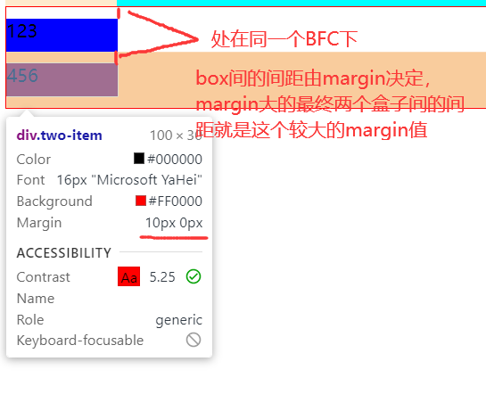
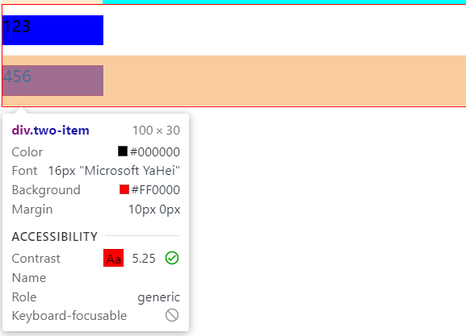
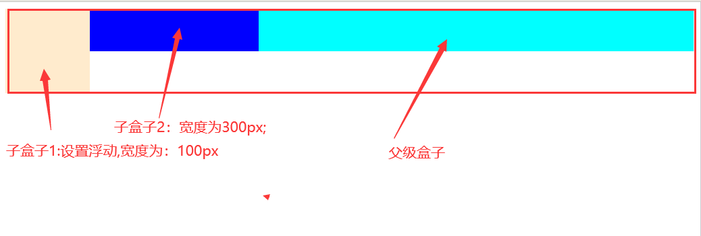

# CSS-BFC

## 什么是 BFC

一个块格式化上下文（block formatting context） 是 Web 页面的可视化 CSS 渲染出的一部分。它是块级盒布局出现的区域，也是浮动层元素进行交互的区域。

## 触发 BFC 的条件

1、根元素或其它包含它的元素（这个是在写 html 时，就有了）

2、浮动元素 (元素的 float 不是 none)

3、绝对定位元素 (元素具有 position 为 absolute 或 fixed)

4、内联块 (元素具有 display: inline-block)

5、表格单元格 (元素具有 display: table-cell，HTML 表格单元格默认属性)

6、表格标题 (元素具有 display: table-caption, HTML 表格标题默认属性)

7、具有 overflow 且值不是 visible 的块元素，一般使用的是 auto 这个属性值

8、display: flow-root （推荐使用）

9、column-span: all 应当总是会创建一个新的格式化上下文，即便具有 column-span: all 的元素并不被包裹在一个多列容器中。

## BFC 特性

1.内部的 Box 会在垂直方向上一个接一个的放置。 2.垂直方向上的距离由 margin 决定。 3.bfc 的区域不会与 float 的元素区域重叠。 4.计算 bfc 的高度时，浮动元素也参与计算。 5.bfc 就是页面上的一个独立容器，容器里面的子元素不会影响外面元素。

## 为什么要使用触发 BFC？

1、BFC 可以解决子元素浮动导致父元素高度塌陷问题； 2、BFC 可以解决两个兄弟盒子之间的垂直距离是由他们的外边距所决定的，但不是他们的两个外边距之和，而是以较大的为准，即 margin 重叠问题； 3、不被浮动元素覆盖(给非浮动元素设置 BFC)； 4、防止文字环绕(给文字盒子添加 BFC);

- 解决 margin 重叠

  - ```HTML
    .container {
        display: flow-root; /* 设置BFC */
    }
    .one-item {
        height: 30px;
        width: 100px;
        margin: 10px 0;
        background-color: blue;
    }
    .two-item {
        height: 30px;
        width: 100px;
        margin: 10px 0;
        background-color: red;
    }


    <div class="container">
        <div class="one-item">123</div>
        <div class="two-item">456</div>
    </div>
    ```

- 结果：

- 

- **解决方案：因为处在不同 BFC 中的元素不会相互影响，所以可以通过将两个盒子放到不同的 BFC 中，实现 margin 重叠的问题**

- ```HTML
  .container {
      display: flow-root; /* 设置BFC */
  }

  .one-wrapper {
      display: flow-root;
  }

  .one-item {
      height: 30px;
      width: 100px;
      margin: 10px 0;
      background-color: blue;
  }


  .two-item {
      height: 30px;
      width: 100px;
      margin: 10px 0;
      background-color: red;
  }

  <div class="container">
      <div class="one-wrapper">
          <div class="one-item">123</div>
      </div>
      <div class="two-item">456</div>
  </div>
  ```

- 

- 解决高度塌陷问题



- 根据上图，需要解决的问题有：

- - 因为子盒子 1 设置了浮动，父级盒子出现了高度塌陷的问题；
  - 同时随着盒子 1 的浮动出现，对应盒子 2 的宽度也没有完全展示出来；

```HTML
<!-- 父级盒子 -->
.father {
    <!-- 设置BFC，解决高度塌陷问题 -->
    display: flow-root;
}

<!-- 子盒子2 -->
.two {
    <!-- 设置BFC, 解决盒子2被遮盖问题 -->
    display: flow-root;
}
```
