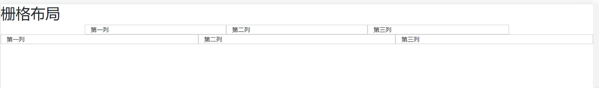

# 前端 UI 框架

## Bootstrap

> Bootstrap 是全球最受欢迎的前端框架，用于构建响应式、移动设备优先的网站
>
> v4 文档： https://v4.bootcss.com/docs/getting-started/introduction/
>
> v5 文档： https://v5.bootcss.com/docs/layout/containers/

### 响应式布局

https://v4.bootcss.com/docs/layout/overview/

> 提供一个 container 的容器，实现栅格系统
>
> 默认情况下，container 是一个响应式的容器，在不同尺寸屏幕下会动态设置不同的宽度
>
> Our default `.container` class is a responsive, fixed-width container, meaning its `max-width` changes at each breakpoint.

|                  | Extra small <576px | Small ≥576px | Medium ≥768px | Large ≥992px | Extra large ≥1200px |
| ---------------- | ------------------ | ------------ | ------------- | ------------ | ------------------- |
| .container       | 100%               | 540px        | 720px         | 960px        | 1140px              |
| .container-sm    | 100%               | 540px        | 720px         | 960px        | 1140px              |
| .container-md    | 100%               | 100%         | 720px         | 960px        | 1140px              |
| .container-lg    | 100%               | 100%         | 100%          | 960px        | 1140px              |
| .container-xl    | 100%               | 100%         | 100%          | 100%         | 1140px              |
| .container-fluid | 100%               | 100%         | 100%          | 100%         | 100%                |

使用案例

```HTML
    <h1>栅格布局</h1>
    <div class="container">
      <div class="row">
      <!-- col-box是自定义的样式类 -->
        <div class="col-box col-sm">第一列</div>
        <div class="col-box col-sm">第二列</div>
        <div class="col-box col-sm">第三列</div>
      </div>
    </div>

    <!-- 流体-栅格布局-占满整个盒子宽度 -->
    <div class="container-fluid">
      <div class="row">
        <div class="col-box col-sm">第一列</div>
        <div class="col-box col-sm">第二列</div>
        <div class="col-box col-sm">第三列</div>
      </div>
    </div>
```



### 编码规范

https://codeguide.bootcss.com/
