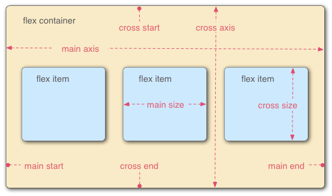
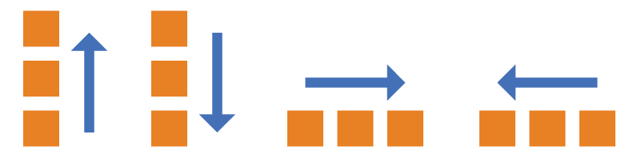
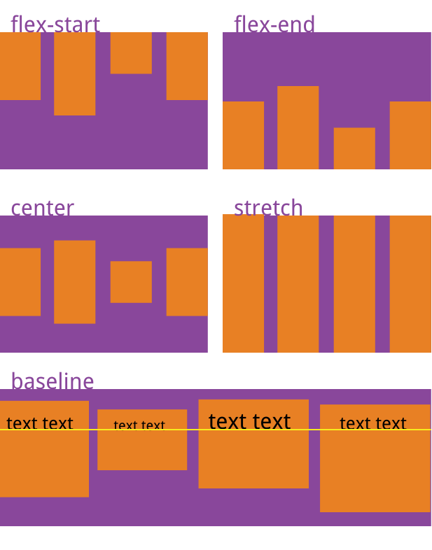
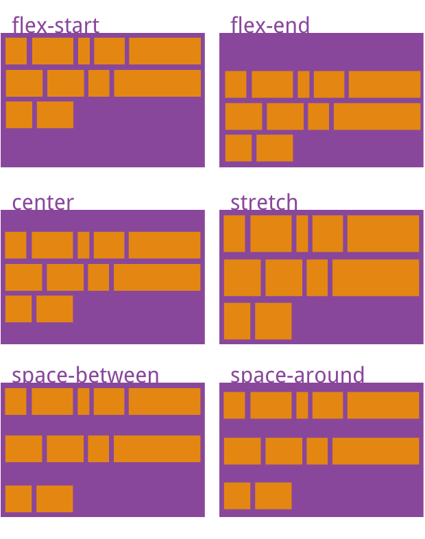

# CSS-flex 布局

> 网页布局（layout）是 css 的一个重要应用；
>
> 布局的传统解决方案，基于**盒装模型**，**依赖 display 属性+position 属性+float 属性**。它对于特殊布局非常不便。

## flex 布局

> Flexible Box 意为： '弹性布局'，用来盒装模型提供最大的灵活性；

任何一个容器可以指定为 flex 布局

```CSS
// 行内元素也可使用flex
.box{
  display: inline-flex;
}

// webkit 内核的浏览器，必须加上-webkit前缀
.box{
  display: -webkit-flex; /* Safari */
  display: flex;
}
```

Ps: 设为 flex 布局以后，子元素的`float`，`clear `和`vertical-align `属性将失效；

## 基本概念

> 采用 Flex 布局的元素，称为 Flex 容器（flex container），简称"容器"。它的所有子元素自动成为容器成员，称为 Flex 项目（flex item），简称"项目"。



容器默认存在两根轴：水平的主轴（main axis）和垂直的交叉轴（cross axis）。主轴的开始位置（与边框的交叉点）叫做`main start`，结束位置叫做`main end`；交叉轴的开始位置叫做`cross start`，结束位置叫做`cross end`。

项目默认沿主轴排列。单个项目占据的主轴空间叫做`main size`，占据的交叉轴空间叫做`cross size`。

## 容器的属性

> - flex-direction
> - flex-wrap
> - flex-flow
> - justify-content
> - align-items
> - align-content

### flex-direction 属性

> 决定主轴的方向；

```CSS
.box {
  flex-direction: row（默认值） | row-reverse | column | column-reverse;
}
```



### flex-wrap

> 是否换行；默认情况下，项目都排在一条线上，flex-wrap 属性定义，如果一条轴线排不下时，如何换行；

```CSS
.box{
  flex-wrap: nowrap | wrap | wrap-reverse;
}
nowrap: 不换行
wrap: 排不下就换行，多余部分从上往下排
wrap-reverse: 与wrap方向相反，从下往上排
```

### flex-flow

> `flex-flow`属性是`flex-direction`属性和`flex-wrap`属性的简写形式，默认值为`row nowrap`。

```CSS
.box {
  flex-flow: <flex-direction> || <flex-wrap>;
}
```

### **justify-content**

> `justify-content`属性定义了项目在主轴上的对齐方式。

```CSS
.box {
  justify-content: flex-start | flex-end | center | space-between | space-around;
}
```

### align-items

> `align-items`属性定义**项目**在交叉轴上如何对齐；

```CSS
.box {
  align-items: flex-start | flex-end | center | baseline | stretch;
}
```



### align-content

> `align-content`属性定义了多根轴线的对齐方式。如果项目只有一根轴线，该属性不起作用。

```CSS
.box {
  align-content: flex-start | flex-end | center | space-between | space-around | stretch;
}
```



## 项目的属性

> - order
> - flex-grow
> - flex-shrink
> - flex-basis
> - flex
> - align-self

### order

> 定义项目的排列顺序，数值越小，排列越靠前，默认为 0；

```CSS
.item {
    order: <integer>;
}
```

### flex-grow

> 定义项目放大比例，默认值：0，即如果存在剩余空间，也不放大；

```CSS
.item {
    flex-grow: <number>; /* default 0 */
}
```

如果所有项目的`flex-grow`属性都为 1，则它们将等分剩余空间（如果有的话）。如果一个项目的`flex-grow`属性为 2，其他项目都为 1，则前者占据的剩余空间将比其他项多一倍;

### flex-shrink

> 定义项目的缩小比例，默认为 1，即如果空间不足，该项目将缩小；

```CSS
.item {
    flex-shrink: <number>;
}
```

如果所有项目的`flex-shrink`属性都为 1，当空间不足时，都将等比例缩小。如果一个项目的`flex-shrink`属性为 0，其他项目都为 1，则空间不足时，前者不缩小。

负值对该属性无效。

### flex-basis

> 定义了在分配多余空间之前，项目占据的主轴空间，浏览器根据这个属性，计算主轴是否有多余空间，它的默认值为 auto，即项目的大小。
>
> 它可以设置为跟 width 和 height 属性一样的值（比如 350px），则项目将占据固定空间；

```CSS
.item {
    flex-basis: <length> | auto; /* default: auto */
}
```

### flex

> flex 属性是 flex-grow，flex-shrink 和 flex-basis 的简写，默认值：0 1 auto; 后两个属性可选；

```CSS
.item {
    flex: none | [<'flex-grow'> <'flex-shrink'> ? || <'flex-basis'>]
}
```

该属性有两个快捷值：`auto` (`1 1 auto`) 和 none (`0 0 auto`)。

建议优先使用这个属性，而不是单独写三个分离的属性，因为浏览器会推算相关值。

### align-self

> `align-self`属性允许单个项目有与其他项目不一样的对齐方式，可覆盖`align-items`属性。默认值为`auto`，表示继承父元素的`align-items`属性，如果没有父元素，则等同于`stretch`。
>
> **交叉轴上的对齐方式**

```CSS
.item {
  align-self: auto | flex-start | flex-end | center | baseline | stretch;
}
```

## Demo

> [Flex 布局教程：实例篇](https://www.ruanyifeng.com/blog/2015/07/flex-examples.html)
>
> [flex 布局：掘金](https://code.juejin.cn/pen/7209224785694294016)
