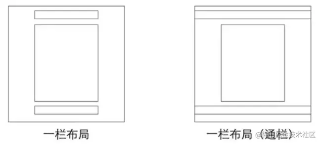

# 常用布局

## 单列布局



### 一栏布局

```Plain
<div class="header"></div>
<div class="content"></div>
<div class="footer"></div>复制代码
.header{
    margin:0 auto;
    max-width: 960px;
    height:100px;
    background-color: blue;
}
.content{
    margin: 0 auto;
    max-width: 960px;
    height: 400px;
    background-color: aquamarine;
}
.footer{
    margin: 0 auto;
    max-width: 960px;
    height: 100px;
    background-color: aqua;
}
```

### 一栏布局（通栏）

> header 和 footer 不设置宽度

## 两列布局（其中一列自适应）

- 右边自适应

```HTML
 <div class="box">
     <div class="left">left</div>
     <div class="right">right</div>
 </div>
.box {
    overflow: hidden;
}
.left {
  float: left;
  width: 250px;
  background-color: antiquewhite;
}
.right {
  overflow: hidden;
  background-color: aliceblue;
```

- 左边自适应

**注意： 这里 html 文档中的浮动盒子书写顺序在自适应盒子的前面**

这是因为在文档流中，元素是从上到下、从左到右逐个排列的。如果自适应盒子在**浮动盒子 前**面，那么它会挤占空间，导致自**浮动盒子**无法和自适应盒子在同一行。而如果靠右的盒子放在自适应盒子前面，自适应盒子会先占据一定的空间，保证左边的盒子能完全自适应，然后靠右的盒子再按照剩余的空间进行布局，从而实现两个盒子的自适应布局。

```HTML
 <div class="box">
      <div class="right">right</div>
      <div class="left">left</div>
 </div>
.right {
  float: right;
  width: 100px;
  background-color: antiquewhite;
}

.left {
  overflow: hidden;
  background-color: aliceblue;
}
```

参考博客：https://juejin.cn/post/6844903710070407182
