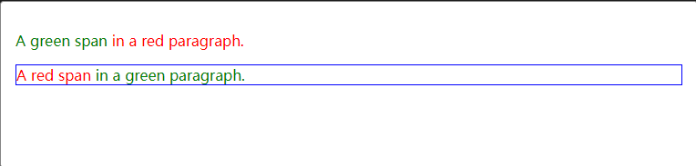
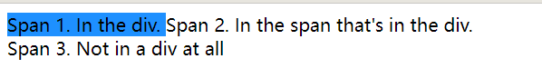
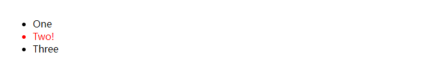
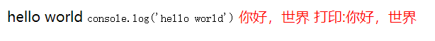
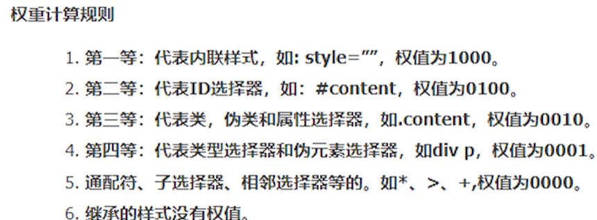

# CSS 选择器-优先级

## 1. css 选择器

> **类型选择器(元素选择器)，通配选择器，类选择器，伪类选择器，ID 选择器，标签属性选择器，伪元素选择器，后代选择器，子代选择器，相邻兄弟选择器，通用兄弟选择器；**

- 类型选择器

  > h1, p, span, div 这些为类型选择器

- 通配选择器

  > 使用' \* '表示，可以用来设置全局样式
  >
  > 会降低性能，在一般情况不推荐使用

  示例：

  ```CSS
   *[lang^=en]{color:green;}
   *.warning {color:red;}
   *#maincontent {border: 1px solid blue;}
  ```

  ```HTML
   <p class="warning"><span lang="en-us">A green span</span> in a red paragraph.
   </p><p id="maincontent" lang="en-gb"><span class="warning">A red span</span> in a green paragraph.
   </p>
  ```



- 类选择器
  - > ` .类名 {样式声明 }` 等价为 `[class~=类名] {样式声明 }`
- 属性选择器

> ```
> [attr]
> ```
>
> 表示带有以 _attr_ 命名的属性的元素。
>
> ```
> [attr=value]
> ```
>
> 表示带有以 _attr_ 命名的属性，且属性值为 _value_ 的元素。
>
> ```
> [attr~=value]
> ```
>
> 表示带有以 _attr_ 命名的属性的元素，并且该属性是一个以空格作为分隔的值列表，其中至少有一个值为 _value_。
>
> ```
> [attr|=value]
> ```
>
> 表示带有以 _attr_ 命名的属性的元素，属性值为“value”或是以“value-”为前缀（"`-`"为连字符，Unicode 编码为 U+002D）开头。典型的应用场景是用来匹配语言简写代码（如 zh-CN，zh-TW 可以用 zh 作为 value）。
>
> ```
> [attr^=value]
> ```
>
> 表示带有以 _attr_ 命名的属性，且属性值是以 *value *开头的元素。
>
> ```
> [attr$=value]
> ```
>
> 表示带有以 _attr_ 命名的属性，且属性值是以 *value *结尾的元素。
>
> ```
> [attr*=value]
> ```
>
> 表示带有以 _attr_ 命名的属性，且属性值至少包含一个 *value *值的元素。
>
> ```
> [attr operator value i]
> ```
>
> 在属性选择器的右方括号前添加一个用空格隔开的字母 `i`（或 `I`），可以在匹配属性值时忽略大小写（支持 ASCII 字符范围之内的字母）。

- 伪类选择器

  > 伪类由冒号（`:`）后跟着伪类名称组成（例如，`:hover`）。
  >
  > 相较于伪类，[伪元素](https://developer.mozilla.org/zh-CN/docs/Web/CSS/Pseudo-elements)可用于设置元素*特定部分*的样式。

- 伪元素选择器

  > 一个选择器中只能使用一个伪元素。伪元素必须紧跟在语句中的简单选择器/基础选择器之后。
  >
  > **注意：**按照规范，应该使用双冒号（`::`）而不是单个冒号（`:`），以便区分伪类和伪元素。但是，由于旧版本的 W3C 规范并未对此进行特别区分，因此目前绝大多数的浏览器都同时支持使用这两种方式来表示伪元素。

- 后代选择器

  > 平时使用的多个选择器的列表

  示例

  ```CSS
   .container .image-item .cell__inner {
       /* 这种多个选择器放在一起 */
   }
  ```

- 子代选择器

  > 使用 ‘>’ 选择匹配的第一个元素
  >
  > `元素 1 > 元素 2 {样式声明 }`

  示例

  ```CSS
   span { background-color: white; }
   div > span {background-color: DodgerBlue;}
  ```

  ```HTML
  <div>
    <span>Span 1. In the div.
      <span>Span 2. In the span that's in the div.</span>
    </span>
  </div>
  <span>Span 3. Not in a div at all</span>
  ```



- 相邻兄弟选择器

  > 使用 '+' 选择与当前元素相邻的那个元素

  ```CSS
  li:first-of-type + li {color: red;}
  <ul>
      <li>One</li>
      <li>Two!</li>
      <li>Three</li>
  </ul>
  ```



- 通用兄弟选择器

  > 相邻兄弟选择器需要在相邻的元素下一个才行，通用兄弟选择器匹配同一层级的元素(当前元素的后面元素)

  示例

  ```HTML
   css
     .custom-context ~ span {
           color: red;
         }

   html
    <p>
           <span class="custom-context">hello world</span>
           <code>console.log('hello world')</code>
           <span>你好，世界</span>
           <span>打印:你好，世界</span>
    </p>
  ```



## 2. 优先级

从上至下，优先级逐级递减

1. !important (但是不属于 css 选择器)
2. Style 内联样式(不属于 css 选择器)
3. id 选择器
4. 伪类选择器
5. class(类)选择器，属性选择器
6. 元素选择器

备注： **在伪类选择其中要准备 ‘lvha’的使用顺序，不然会导致逻辑错误**

```CSS
.state:link {
   color: red;
}
.state:visited {
   color: rgb(56, 9, 224);
}
.state:hover {
  color: green;
}
.state:active {
  color: pink;
}
```

## 3. 权重



## 4.关于 css 书写顺序进行一定的优化

优化策略

对于绝大部分的开发者来说，css 的功能就是完成页面布局，制定页面的展示效果。其实 css 也有许多实现 Web 性能优化的方法。

我们都知道对于网站来说，性能至关重要，CSS 作为页面渲染和内容展现的重要环节，影响着用户对整个网站的第一体验。因此，与其相关的性能优化是不容忽视的。

2.1 CSS 书写顺序对性能有影响吗？

需要注意的是：浏览器并不是一获取到 CSS 样式就立马开始解析，而是根据 CSS 样式的书写顺序将之按照 DOM 树的结构分布渲染样式，然后开始遍历每个树结点的 CSS 样式进行解析，此时的 CSS 样式的遍历顺序完全是按照之前的书写顺序。

在解析过程中，一旦浏览器发现某个元素的定位变化影响布局，则需要倒回去重新渲染。

栗子：

```CSS
width: 150px;
height: 150px;
font-size: 24px;
position: absolute;
```

当浏览器解析到 position 的时候突然发现该元素是绝对定位元素需要脱离文档流，而之前却是按照普通元素进行解析的，所以不得不重新渲染。

渲染引擎首先解除该元素在文档中所占位置，这就导致了该元素的占位情况发生了变化，其他元素可能会受到它回流的影响而重新排位。

我们对代码进行调整：

```CSS
position: absolute;
width: 150px;
height: 150px;
font-size: 24px;
```

在实际开发过程中，我们如何能保证自己的书写顺序是最优呢？

这里有一个规范，建议顺序大致如下：

1. 定位属性 position display float left top right bottom overflow clear z-index
2. 自身属性 width height padding border margin background
3. 文字样式 font-family font-size font-style font-weight font-varient color
4. 文本属性 text-align vertical-align text-wrap text-transform text-indent text-decoration letter-spacing word-spacing white-space text-overflow
5. CSS3 中新增属性 content box-shadow border-radius transform

总之，我们需要知道这个规则就够了，剩下的可以交给一些插件去做，譬如 CSSLint
