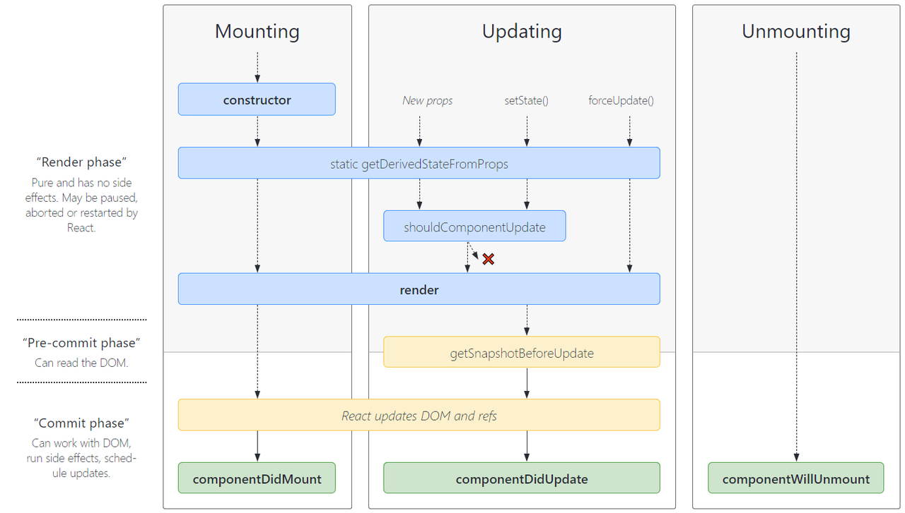
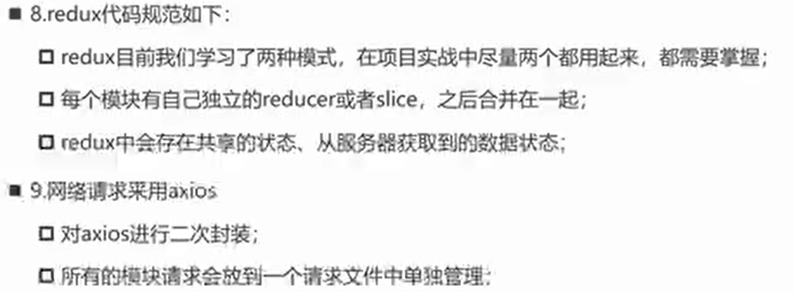

# 基础知识

## 安装使用 react

- 方式一：

```HTML
// 使用 CDN 加载对应该的文件(如果出现跨域，添加 `crossorigin` 到script标签上)
 <script src="https://unpkg.com/react@18/umd/react.development.js"></script>
    <script src="https://unpkg.com/react-dom@18/umd/react-dom.development.js"></script>
    <!-- Don't use this in production: -->
<script src="https://unpkg.com/@babel/standalone/babel.min.js"></script>

<!--  引入自己的js或者jsx文件，需要注意的时，需要使用 type='text/babel' -->
<script type="text/babel" src="./handleEvent.jsx"></script>
```

对应的 js / jsx 代码

```JavaScript
import ReactDom from 'react-dom/client';

// 函数式组件
function Demo() {
    return (
        <h1>函数式组件</h1>
    )
}
// class 组件
class Bar extends React.Component {
    render() {
        return (
            <h2>class 组件</h2>
        )
    }
}

// 创建根节点
const root = ReactDOM.createRoot(document.getElementById('root'));
root.render(
    <div>
        <Demo />
    </div>

)
```

上述方式的缺点就是，有的时候连接不上，一般在晚上都连接不上，感觉是到点就被关闭了，可能是出于安全考虑啥的吧。

- 使用官方推荐的工具链安装，`createReactAPP`

> 执行命令：`npx create-react-app my-app`

```Shell
We suggest that you begin by typing:

  cd react-app
  npm start

Happy hacking! # 第一次感受到一门框架的热情，非常开心
```

## 使用 class 组件时，class 的方法和 this 绑定问题

> 你必须谨慎对待 JSX 回调函数中的 `this`，**在 JavaScript 中，class 的方法默认不会\*\***[绑定](https://developer.mozilla.org/en/docs/Web/JavaScript/Reference/Global_objects/Function/bind)\*\* **`this`\*\***。如果你忘记绑定\*\* **`this.handleClick`** **并把它传入了** **`onClick`\*\***，当你调用这个函数的时候\*\* **`this`** **的值为** **`undefined`\*\***。\*\*
>
> 这并不是 React 特有的行为；这其实与 [JavaScript 函数工作原理](https://www.smashingmagazine.com/2014/01/understanding-javascript-function-prototype-bind/)有关。通常情况下，如果你没有在方法后面添加 `()`，例如 `onClick={this.handleClick}`，你应该为这个方法绑定 `this`。

如果觉得使用 `bind` 很麻烦，这里有两种方式可以解决。你可以使用 [public class fields 语法](https://developer.mozilla.org/en-US/docs/Web/JavaScript/Reference/Classes/Public_class_fields#public_instance_fields) to correctly bind callbacks:

```JavaScript
class LoggingButton extends React.Component {
    // This syntax ensures `this` is bound within handleClick.
    handleClick = () => {
        console.log('this is:', this);
    };
    render() {
    return (
        <button onClick={this.handleClick}>
          Click me
        </button>);
    }
}
```

[Create React App](https://github.com/facebookincubator/create-react-app) 默认启用此语法。

如果你没有使用 class fields 语法，你可以在回调中使用[箭头函数](https://developer.mozilla.org/en/docs/Web/JavaScript/Reference/Functions/Arrow_functions)：

```JavaScript
class LoggingButton extends React.Component {
handleClick() {
    console.log('this is:', this);
}
    render() {
     // 此语法确保 `handleClick` 内的 `this` 已被绑定。
       return (
        <button onClick={() => this.handleClick()}>
          Click me
        </button>
    );
   }
}
```

此语法问题在于每次渲染 `LoggingButton` 时都会创建不同的回调函数。在大多数情况下，这没什么问题，但如果该回调函数作为 prop 传入子组件时，这些组件可能会进行额外的重新渲染。**我们通常建议在构造器中绑定或使用 class fields 语法来避免这类性能问题。**

**[ 事件处理](https://zh-hans.reactjs.org/docs/handling-events.html)**

## 定义变量

[向 class 组件中添加局部的 state](https://zh-hans.reactjs.org/docs/state-and-lifecycle.html#adding-local-state-to-a-class)

在 react 组件中，定义的变量有两种类型，一种是用于视图渲染，一种是不用于视图渲染；

- 第一种

```JavaScript
// 用于视图渲染
// 在构造函数，使用this.state
this.state = { value: 'value' };  // 构造函数这里，是唯一可以直接修改this.state的地方
// 然后要更改state中的数据时，使用this.setState(params);
// 这个params可以是对象，也可以是函数

// params: 对象
this.setState({
    value: '1321' // 将this.state.value 的值修改成了新的值
})
// params： 回调函数; 注意这里是要返回值的
this.setState((prevState /* 上一轮的state */, props /* 对应传入组件的props参数 */) => ({
    value: prevState.value + 'dfghd'
}))
```

this.setState() 会触发 render 函数执行，这是一种通过数据驱动来更新视图的方式，需要注意的是，只能使用 this.setState() 这种方式来修改 state 中的数据，如果直接通过 this.state[value] 这种方式修改，是不会进行视图更新的；

- 第二种方式

直接在 this 对象上吧绑定属性；这种方式绑定的属性，就是和平时绑定到对象上的属性是一样的。同上述的变量唯一的区别就是值变化时，不会引起视图更新；

### 关于使用 this.setState

> 这个实例方法是**继承至 React.Component**;
>
> 是**异步**的；
>
> **执行之后，会触发 render 函数执行**；
>
> 可以进行**数据更新驱动视图变化；**

```JavaScript
// 三种使用
this.setState({ /* 里面接受一个对象，对象中的属性值，会和没有进行修改的原state进行合并 */ })

// 举例：
this.state = {
    name: "123",
    age: 12
}

this.setState({
    age: 14
})

// result：
this.state ==> { name: "123", age: 14 }

// 第二种也就是传递回调函数
this.setState((state, props) => { return { ... } })

// 第三种就是接收第二个参数(也是一个回调函数)
this.setState({...}, () => {
    // 这个回调函数，会在数据合并之后执行
})
```

### 关于 setState 是异步的原因

- setState 设计为异步，可以**显著提升性能**；
  - 因为调用 setState 之后，会进行 render 函数执行，那么如果每次调用 setState 就去执行一次 render 函数，那么这样频繁执行 render 函数终将会降低整体性能；采用异步方式，实现多次 setState 调用，一次 render 执行；
- 如果**同步更新 state**,但是还没有执行 render 函数，那么**state 和 pops 不能保持同步**；
  - 如果 state 和 props 没有保持同步，在开发过程中可能产生不必要的错误；

## 关于 react 中使用 jsx

React 认为**渲染逻辑**本质上与其他 UI 逻辑存在**内在耦合**；

- 比如 UI 需要绑定事件（button, a 原生等）;
- 比如 UI 中需要展示数据状态；
- 比如在某些状态发生改变时，又需要改变 UI;

他们之间是密不可分的，所以 React 没有将 HTML 分离到不同的文件中，而是将他们组合到一起，这个地方就是**组件** ;

## jsx 书写规范

- jsx 结构中只能有**一个根元素**；
- 闭合：用 ‘()’ 包裹标签， 可以进行换行编写；
- 可以使用双标签，和单标签，使用单标签时需要些闭合标签（‘ /> ’）;
- jsx 中的注释
  - ```JavaScript
    {/* 这个才是jsx中的注释写法 */}
    ```
- jsx 中可以放置基本的数据类型，其中 undefined 和 null 不会直接显示到视图上，当然可以使用 String()方法实现显示对应的字符串； 另外 Object 是不能直接作为 react child，会报错；

## React 的生命周期



## 使用 classnames(https://github.com/JedWatson/classnames)

> 实现 className 的书写可以更加方便，类似 vue 中 class 的书写方式

## 性能优化

在开发过程中，我们会经常使用 this.setState 来修改数据，这样会去执行相应的 render 函数，但是有时候我们执行的 setState 方法时，其实里面的数据是没有发生变化的，但是依旧会执行 render 函数，这会导致一定的性能下降；

解决方案有：

- [shouldComponentUpdate()](https://zh-hans.reactjs.org/docs/react-component.html#shouldcomponentupdate)

> 返回一个 boolean 值，用来判断是否需要执行 render 函数；
>
> 在首次渲染和执行 forceUpdate 时不会执行这个方法；
>
> 有时返回 false 的时候，也会出现重复渲染的情况；
>
> 一般不推荐使用该方法

- PureComponent

> [对比 PureComponent 和 shouldComponentUpdate()](https://zh-hans.reactjs.org/docs/optimizing-performance.html#shouldcomponentupdate-in-action)

> 使用 ‘浅比较’ 的方式进行比较对应 props 和 state 的变化；
>
> 之所以叫浅比较是因为这种方式对于有些情况不能实现相应的功能；
>
> 比如： 当在 state 中定义的一个数组，向里面新增内容的时候，不会进行重新渲染，因为检测到数组还是之前的数组；这时可以重新赋值数组，也就是更换数组地址实现该属性值的变化，实现重新渲染；

- memo

> 实现函数式组件中，当只有自身的 props 或者 state 中有数据变化时才执行自己的 render 函数；

使用:

```JavaScript
import { memo } from 'react';

const Demo = memo(function(props) {
    return <h1>{props.userInfo}</h1>
})
```

## 函数式组件的缺点

- 不能使用 setState 之类的控制数据响应式的操作，使得原始的函数式组件只能做展示操作；
- 没有对应的生命周期钩子，不能在特定时间节点上进行相关操作；

## ` React.memo`

```Plaintext
const MyComponent = React.memo(function MyComponent(props) {/* 使用 props 渲染 */});
```

`React.memo` 为[高阶组件](https://zh-hans.reactjs.org/docs/higher-order-components.html)。

如果你的组件在相同 props 的情况下渲染相同的结果，那么你可以通过将其包装在 `React.memo` 中调用，以此通过记忆组件渲染结果的方式来提高组件的性能表现。这意味着在这种情况下，React 将跳过渲染组件的操作并直接复用最近一次渲染的结果。

`React.memo` 仅检查 props 变更。如果函数组件被 `React.memo` 包裹，且其实现中拥有 `useState`，`useReducer` 或 `useContext` 的 Hook，当 state 或 context 发生变化时，它仍会重新渲染。

默认情况下其只会对复杂对象做浅层对比，如果你想要控制对比过程，那么请将自定义的比较函数通过第二个参数传入来实现。

```Plaintext
function MyComponent(props) {/* 使用 props 渲染 */}function areEqual(prevProps, nextProps) {/*
  如果把 nextProps 传入 render 方法的返回结果与
  将 prevProps 传入 render 方法的返回结果一致则返回 true，
  否则返回 false
  */}export default React.memo(MyComponent, areEqual);
```

此方法仅作为**[性能优化](https://zh-hans.reactjs.org/docs/optimizing-performance.html)**的方式而存在。但请不要依赖它来“阻止”渲染，因为这会产生 bug。

> **注意**
>
> 与 class 组件中 `shouldComponentUpdate()` 方法不同的是，如果 props 相等，`areEqual` 会返回 `true`；如果 props 不相等，则返回 `false`。这与 `shouldComponentUpdate` 方法的返回值相反。

## useEffect

> - 组件渲染，数据变化等需要之执行的一些副作用；
> - 同时在一个 Hookh 中，可以多次使用 useEffect;
> - 接收一个回调函数，执行对应的副作用；
> - 回调函数返回另一个回调函数，一般用户清除副作用，比如：取消事件订阅，监听等；
> - 实现类组件中的生命周期的功能；
> - 接收第二个参数（为一个数组，数组中元素发生变化，或者其他操作之后，会执行改 useEffect 中传入的回调函数）

```JavaScript
  useEffect(() => {
    document.title = count;
    return () => {
      // useEffect返回一个回调函数，当组件在重新渲染和销毁，会先执行这个回调，然后再执行传入useEffect的回调函数
      // 一般这里用于取消事件订阅，监听等
    };
  });
```

## useState

> 实现在函数式组件中使用响应式数据

## useContext

> 解决之前在进行数据共享时，使用 createContext 的繁琐问题；

## useCallback

> 记忆数据的变化，当数据发生变化后执行；
>
> 有一个**性能优化**的措施，就是在父子组件中，在父组件中使用 useCallback 时，**父组件中对应的数据改变的时候，会重新渲染父组件，但是不会去重新渲染子组件**（前提是子组件中的数据也没有发生变化）

## useRef

> 在使用 useCallback 时，如果需要每次是使用同一个回调函数（关于这个同一个回调函数，其实就是通过 useCallback 监测的变量发生变化时，就会重新创建一个回调函数，也就是组件被重新渲染了，这时的组件中的函数会被重新创建），那么我们想再数据发生变化时，还是执行上一次的回调函数，那么就要不给 useCallback 添加监测对象，那么此时就会使用上一次的回调函数，但是存在的问题就是使用功能的变量值也是上一次的结果（这个是由于闭包的原因，访问的外部变量保存在内存中），所以这里通过采用 useRef 的方式，获取到当前最新的变量的值，同时使用上一次的执行回调。

## react 项目规范（仅参考）



## 关于 react-activation

> **HACK Implementation** of the `<keep-alive />` function in `Vue` For `React`
>
> Please also pay attention to official support `<Offsreen />` in `React 18.x`

## 继续学习

- umi: https://umijs.org/docs/introduce/faq
- dva: https://github.com/dvajs/dva/blob/master/README_zh-CN.md

## immutable

> [react redux-immutable](https://blog.csdn.net/weixin_54565737/article/details/122061908)
>
> https://github.com/gajus/redux-immutable

reducer 函数是一个纯函数，所以在进行派发 action 修改 initialState 中的数据时，不应该直接去修改它里面的属性的值，通常不改变原来 state 并返回一个新的 state 的方法有

```JavaScript
// 方案1：使用在简单对象中，属性中的值，一般为基本数据类型
{...state, userName: 'XXX'}
// 方案2： 使用场景基本同上
Object.assgin({}, state, {userName: 'XXX'}) // 返回一个新的对象
// 方案三使用immutable
```

## 关于 redux 中的 reducer 设计为纯函数的目的

通常在比较对象中各个属性值的变化会采用深拷贝的方式进行，但是在实际开发过程中，这种深拷贝的方式对于属性较少的对象比较适用，但是对于属性庞大，嵌套较深的对象来说就是噩梦，每次数据的改变都要进行一次递归算法，在一定程度上会带来性能开销，所以 redux 团队在开发过程中，比较两个新旧 state 时，采用的是直接比较存储地址，那么我们在处理这个 reducer 函数时，就不能直接去修改 state，而是应该返回一个新的地址空间，同时为了保证

开源项目学习：https://www.osrc.com/Taylor7625/projects/project_890902364458606592
