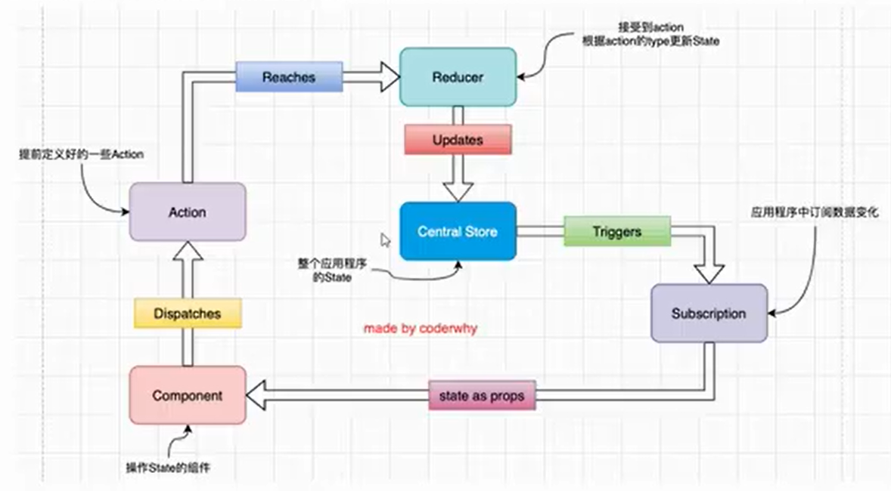

# Redux

> 类似于 vue 中的状态管理 vuex，以及现在的 pinia
>
> Redux 是 JavaScript 应用的状态容器，提供可预测的状态管理。
>
> 可以帮助你开发出行为稳定可预测的、运行于不同的环境（客户端、服务器、原生应用）、易于测试的应用程序。不仅于此，它还提供超爽的开发体验，比如有一个[与时间旅行调试器相结合的实时代码编辑](https://github.com/reduxjs/redux-devtools)。
>
> 可以将 Redux 与 [React](https://reactjs.org/) 或其他视图库一起使用。它体小精悍（只有 2kB，包括依赖），却有很强大的插件扩展生态。

## 三大原则

- 整个应用程序的 state 被存储在一个 object tree 中，并且这个 object tree 只存储在一个 store 中；
- Redux 并没有强制让我们不能创建多个 store，但是那样并不利于数据的维护；
- **单一的数据源**可以让整个应用程序的 state 变得方便维护，追踪，修改；



（ps: **单向数据流**）

## Redux-thunk

> 整个插件是为了实现在 dispatch 时可以返回一个函数，而不用每次都需要返回一个 plain Object
>
> 搭配 redux 的中间件方法使用

```JavaScript
import { createStore, applyMiddleware } from 'redux';
import reducer from './reducer';
import thunk from 'redux-thunk';
const store = createStore(reducer, applyMiddleware(thunk));
```

## Redux-devtools

> redux 调试工具，前提是安装 redux-devtools, 同时需要在配置 redux 的文件中，配置如下：

```JavaScript
  import { createStore, applyMiddleware, compose } from 'redux';

+ const composeEnhancers = window.__REDUX_DEVTOOLS_EXTENSION_COMPOSE__ || compose;
+ const store = createStore(reducer, /* preloadedState, */ composeEnhancers(
- const store = createStore(reducer, /* preloadedState, */ compose(
    applyMiddleware(...middleware)
  ));
```
