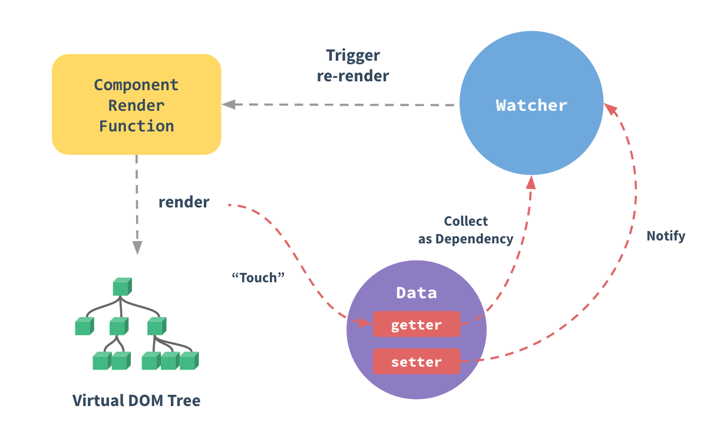

# Vue 的数据绑定机制

## 相关问题

- Vue 是如何实现数据劫持的
- Vue 是如何实现双向绑定的
- MVVM 是什么

## 回答关键点

```
响应式对象` `数据劫持` `双向绑定` `MVVM（Model-View-ViewModel）` `发布/订阅模式（publish-subscribe pattern）
```

**响应式对象**

Vue2 通过 `Object.defineProperty`，Vue3 通过 Proxy 来劫持 state 中各个属性的 setter、getter，通过 getter 收集依赖。当 state 中的数据发生变动之后发布通知给订阅者更新数据。

**双向绑定**

Vue 通过 `v-model` 实现双向绑定。`v-model` 实际是 `v-bind:xxx` 和 `v-on:xxx` 的语法糖。当触发元素对应的事件（如 input、change 等）时更新数据（ViewModel），当数据（ViewModel）更新时同步更新到元素的对应属性（View）上。

**MVVM（Model-View-ViewModel）**

MVVM 模式是一种软件架构模式，相比 MVC 模式多了一个 ViewModel 层。有助于将图形用户界面的开发与业务逻辑或后端逻辑（数据模型）的开发分离开来。

- Model：模型层，负责处理业务逻辑以及和服务器端进行交互。
- View：视图层，将数据通过 UI 展现出来。
- ViewModel：视图模型层，连接 Model 层和 View 层。

## 知识点深入

1. 前置概念

在详细说明原理之前，需要对以下概念有一定的认知：

1. Dep：实现发布订阅模式的模块。
2. Watcher：订阅更新和触发视图更新的模块。
3. 实现原理



上图是 Vue 官网描述 Vue 内数据变化与发布更新的流程，我们以响应式对象、依赖收集、数据更新的顺序详细说明整个过程。

#### 2.1 响应式对象

Vue2 通过 `Object.defineProperty`，Vue3 通过 Proxy 来劫持 state 中各个属性的 getter、setter。其中 getter 中主要是通过 Dep 收集依赖这个属性的订阅者，setter 中则是在属性变化后通知 Dep 收集到的订阅者，派发更新。

以下是 Dep 的伪代码：

```TypeScript
export default class Dep {
  static target?: Watcher;
  subs: Array<Watcher>;

  constructor () {
    this.subs = []
  }

  /**
   * 添加订阅者（watcher）
   /
  addSub (sub: Watcher) {
    this.subs.push(sub)
  }

  /
   * 移除订阅者（watcher）
   /
  removeSub (sub: Watcher) {
    remove(this.subs, sub)
  }

  /
   * 添加订阅（调用订阅者上的 addDep 方法）
   /
  depend () {
    if (Dep.target) {
      Dep.target.addDep(this)
    }
  }

  /
   * 遍历通知订阅者更新
   **/
  notify () {
    const subs = this.subs.slice()
    for (let i = 0, l = subs.length; i < l; i++) {
      subs[i].update()
    }
  }
}

Dep.target = null
```

以下是生成响应式对象的伪代码：

```TypeScript
/**
 * 生成响应式对象
 * 为了方便理解，以下代码略有修改，省略了部分不相关内容
 */
export function defineReactive (
  obj: Object,
  key: string,
  val: any,
) {
  const dep = new Dep()
  Object.defineProperty(obj, key, {
    enumerable: true,
    configurable: true,
    get: function reactiveGetter () {
      // 每次 get 时如果有订阅者则添加订阅
      if (Dep.target) {
        dep.depend()
      }
      return val
    },
    set: function reactiveSetter (newVal) {
      val = newVal
      // 每次更新数据之后广播更新
      dep.notify()
    }
  })
}
```

#### 2.2 依赖收集

Vue 会在需要使用到属性的地方新建一个 Watcher 的实例 watcher，watcher 实例化时会读取对应属性的内容，从而触发 1.1 中的 getter，将 watcher 注册进 Dep 中。

以下是 Watcher 的伪代码：

```TypeScript
/**
 * 为了方便理解，以下代码略有修改，省略了部分不相关内容
 /
export default class Watcher {
  vm: Component;
  getter: Function;
  value: any;
  cb: Function;

  constructor (
    vm: Component,
    exp: string
  ) {
    this.vm = vm
    this.cb = cb
    // 获取表达式对应的属性的 getter
    this.getter = parsePath(exp)
    this.value = this.get()
  }

  /*
   * 获取最新的值
   /
  get () {
    // 将 Dep 的当前订阅者指向当前 watcher
    Dep.target = this
    let value
    const vm = this.vm
    // 获取对应属性值
    value = this.getter.call(vm, vm)
    // 清空 Dep 当前订阅者
    Dep.target = null
    return value
  }

  /
   * 订阅
   /
  addDep (dep: Dep) {
    // 将当前 watcher 添加到 Dep 的订阅者列表中
    dep.addSub(this)
  }

  /
   * 更新视图
   **/
  update () {
    const value = this.get()
    const oldValue = this.value
    // 调用 callback 更新视图
    this.cb.call(this.vm, value, oldValue)
  }
}
```

#### 2.3 数据更新

state 属性更新时会触发属性的 setter，setter 中会触发 Dep 的更新，Dep 通知 1.2 中收集到的 watcher 更新，watcher 获取到更新的数据之后触发更新视图。

1. 无法监听到的变化

由于受到 JavaScript 设计的限制，Vue2 使用的 `Object.defineProperty` 并不能完全劫持所有数据的变化，以下是几种无法正常劫持的变化：

- 无法劫持新创建的属性，为了解决这个问题，Vue 提供了 `Vue.set` 以创建新属性。
- 无法劫持数组的变化，为了解决这个问题，Vue 对数组原生方法进行了劫持。
- 无法劫持利用索引修改数组元素，这个问题同样可以用 `Vue.set` 解决。

1. Vue2 与 Vue3 的差异

Vue2 与 Vue3 数据绑定机制的主要差异是劫持方式。Vue2 使用的是 `Object.defineProperty` 而 Vue3 使用的是 `Proxy`。`Proxy` 可以创建一个对象的代理，从而实现对这个对象基本操作的拦截和自定义。

| 特性                 | defineProperty | Proxy     |
| -------------------- | -------------- | --------- |
| 劫持新创建属性       | 否             | 是        |
| 劫持数组变化         | 否             | 是        |
| 劫持索引修改数组元素 | 否             | 是        |
| 兼容性               | IE8 及以上     | 不支持 IE |

由于 Vue 3 中改用 Proxy 实现数据劫持，Vue 2 中的 `Vue.set/vm.$set` 在 Vue 3 中被移除。
