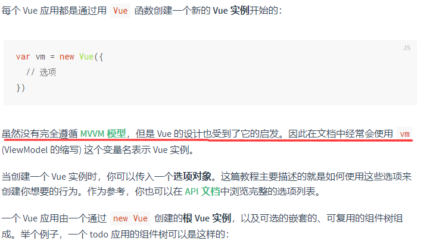

# Vue 相关

## 对 vue 的理解

> vue 借鉴了 angular 的模板和数据绑定；借鉴了 react 的组件化开发和虚拟 DOM;
>
> vue 是一个用户创建用户界面的 javascript 框架，也是一个创建单页面应用的 web 应用框架；

**官方介绍：**

> Vue 是一个渐进式的 javascript 框架，基于前端三件套进行构建，并提供了一套声明式的，组件化的编程模型；它有两个核心功能：数据驱动、组件化。

- **渐进式**

> 渐进式的含义是：主张最少，没有多做职责之外的事；每个框架都不可避免会有自己的一些特点，从而会对使用者有一定的要求，这些要求就是主张，主张有强有弱，它的强势程度会影响在业务开发中的使用方式。
>
> 自己的理解：在开发 vue 项目中，我们可以只引入 vue 脚手架进行开发，当需要使用到对应组件，插件再进行引入，而不需要全部引入才能使用，也就是要什么就给什么的形式，逐步推进。

Vue 的渐进式理解

命令式渲染：需要以具体代码表达在哪里做了什么，需要具体实现过程

声明式渲染：需要声明在哪里需要做什么，不关心具体实现


Vue 的核心功能--视图模板引擎，在声明式渲染的基础上，Vue 提供了组件系统、客户端路由、大规模状态管理来构建完整的框架，各部分功能相互独立，不需要整合所有部件。

- **数据驱动**

> 所谓数据驱动就是当数据发生变化时，用户界面会跟随发生相应的变化，开发者不需要手动去修改 DOM。
>
> 在 vue 中，通过 Object.defineProperty 数据劫持(vue3 中使用的 proxy)，实现对数据的监听，vue 会依次递归 data 中的变量，为每个属性添加相应的 getter/setter 处理函数(vue3 中是 proxy handler)；在更新视图上，vue 采用虚拟节点(Vnode)的方式，比较变化的部分，对视图进行更新。

- **组件化**

> 组件是一个可以复用的 vue 实例。它可以增强代码的复用性，可维护性和可测试性；
>
> 组件的本质是产生一个 vnode.它可以降低更新范围，只重新渲染发生变化的组件。

## MVVM

> M: 数据模型 (model)
>
> V: 视图层（view）
>
> VM: viewModel ,连接 view 和 model


当数据源发生变化时，会被 ViewModel 监听到，VM 会根据最新的数据源自动更新页面的结构

当表单元素的值发生变化时，也会被 VM 监听到，VM 会把变化过后最新的值自动同步到 Model 数据源中


🍕 在 vue2 中明确指出了，vue 是没有完全遵循 MVVM 框架，但是 vue 的设计是受到它的启发的。

在 vue，可以通过 ref 来直接修改 DOM（不是在监听到数据源发生变化去更新视图），这个违背了 MVVM 的设计思想。



## 双向绑定原理

> vue2:
>
> vue3:

vue 通过数据劫持并结合发布-订阅者模式实现了数据的双向绑定。

实现双向绑定主要涉及两个方面：

- view 视图层发生变化，更新 data 数据层（可以直接通过相应的事件触发更新，如：input，change 事件等）
- data 数据发生变化，根据视图层（需要监听数据变化->触发对应视图更新）

### Data -> View 实现过程：

- 实现一个监听器 Observer：使用 Object.defineProperty()劫持属性，为每个属性添加 getter/setter 处理函数;
- 实现一个订阅器 Dep: 使用订阅器来统一管理监听器和订阅者；
- 实现一个订阅者 Watcher：包含了具体的依赖执行函数（即数据变化时需要执行的函数），以及 update 方法，用于在响应数据变化时执行；
- 实现 compile：解析模板指令，替换模板中的数据，初始化视图；将模板指令对应的节点绑定相应的更新函数，初始化相应的订阅器；


## Computed 和 Watch 的区别

- Computed:
  - 有缓存策略，仅当依赖的响应式数据发生变化时才会重新计算；
  - 不支持异步操作，如果有异步函数，将无法监听到数据的变化；
  - 其缓存是基于 data 中的响应式数据进行的缓存，或者依据父组件传递的 props;
  - 如果一个属性的值依赖其他的属性值，那么可以采用计算属性；
  - 有函数和对象两种形式，如果是函数，就默认使用 get 方法，函数的返回值就是属性的值；在 computed 中，属性有一个 get 方法和一个 set 方法，当数据发生变化时，会调用 set 方法。
- Watch:
  - 没有缓存策略，数据变化时，它会触发相应的操作；
  - 支持异步监听；
  - 监听函数接收两个参数，第一个是 newValue,第二个是 oldValue;
  - 当一个属性发生变化时，就需要执行相应的操作
  - 监听数据必须是 data 中声明的或者父组件传递过来的 props 中的数据，当发生变化时，会触发其他操作，函数有两个的参数：
    - immediate：组件加载立即触发回调函数
    - deep：深度监听，发现数据内部的变化，在复杂数据类型中使用，例如数组中的对象发生变化。需要注意的是，deep 无法监听到数组和对象内部的变化。
  - 当想要执行异步或者昂贵的操作以响应不断的变化时，就需要使用 watch。

### 运用场景：

- 当需要进行数值计算,并且依赖于其它数据时，应该使用 computed，因为可以利用 computed 的缓存特性，避免每次获取值时都要重新计算。

- 当需要在数据变化时执行异步或开销较大的操作时，应该使用 watch，使用 watch 选项允许执行异步操作 ( 访问一个 API )，限制执行该操作的频率，并在得到最终结果前，设置中间状态。这些都是计算属性无法做到的。

## vue 生命周期

- > 在浏览器端，有如下的生命周期钩子；
  >
  > 在服务端，只有 beforeCreated, created

- | vue2          | vue3          | 组合式 API 中的生命周期 | 内容                                                                                                                                               |
  | ------------- | ------------- | ----------------------- | -------------------------------------------------------------------------------------------------------------------------------------------------- |
  | beforeCreate  | beforeCreate  | onBeforeCreate          | 在创建 vue 实例到这里，进行了一定的初始化操作，此时有一些默认的生命周期钩子等函数，但是此时还不能访问到 data 和 method 的属性内容；                |
  | created       | created       | onCreated               | 完成了 vue 实例初始化，此时可以访问 data 等属性的内容，同时一般这里也是我们在获取初始页面数据时，执行接口调用；                                    |
  | beforeMounte  | beforeMount   | onBeforeMount           | 完成 vue 实例初始化之后，进行 DOM 的渲染过程，到这里的时候，已经完成了 DOM 的渲染过程，但是还没有将其挂载到指定的 DOM 节点上，所以还不能操作 DOM； |
  | mounted       | mounted       | onMounted               | 此时是能够访问 DOM 的最早的时期，此时已经完成了 DOM 的挂载；                                                                                       |
  | beforeUpdate  | beforeUpdate  | onBeforeUpdate          | 从这里开始的钩子函数属性 vue 的执行时期的钩子，前面的四个都是在 vue 创建的时候才进行调用，其余时间不会被调用                                       |
  | updated       | updated       | onUpdated               | 进行组件的更新，在这里不应该进行页面 DOM 的更改，以及一些会对组件更新造成影响的操作，防止组件进行无限递归更新；                                    |
  | beforeDestory | beforeUnMount | onBeforeUnMount         | 组件销毁之前的钩子函数，这一步可以进行事件派发等的清除，防止内存泄漏；                                                                             |
  | destory       | unmounted     | onUnmounted             | 完整组件销毁，此时组件中是所有属性都不能在访问；                                                                                                   |
  |               | errorCaptured |                         | 在捕获了后代组件传递的错误时调用;这个钩子带有三个实参：错误对象、触发该错误的组件实例，以及一个说明错误来源类型的信息字符串。                      |


> 父子组件的生命周期执行顺序：

- 创建阶段

> beforeCreate(父) -> created(父)->beforeCreate(子)->create(子)->beforeMount(子)->mounted(子)->beforeMount(父)->mounted(父)

- 更新阶段（父子组件同时需要更新时，如果是单个更新，不会影响其他的组件）

> beforeUpdate(父)->beforeUpdate(子)->updated(子)->updated(父)

- 销毁阶段

> 父 beforeDestroy -> 子 beforeDestroy -> 子 destroyed -> 父 destroyed

**vue3 生命周期：**


## vue.nextTick()

> **在下次 DOM 更新循环结束之后执行延迟回调。在修改数据之后立即使用这个方法，获取更新后的 DOM。**

`nextTick` 是 Vue 提供的一个全局 API，由于 Vue 的异步更新策略，导致我们对数据修改后不会直接体现在 DOM 上，此时如果想要立即获取更新后的 DOM 状态，就需要借助该方法。

Vue 在更新 DOM 时是异步执行的。当数据发生变化，Vue 将开启一个异步更新队列，并缓冲在同一事件循环中发生的所有数据变更。如果同一个 `watcher` 被多次触发，只会被推入队列一次。这种在缓冲时去除重复数据对于避免不必要的计算和 DOM 操作是非常重要的。`nextTick`方法会在队列中加入一个回调函数，确保该函数在前面的 DOM 操作完成后才调用。

使用场景：

1. 如果想要在修改数据后立刻得到更新后的`DOM`结构，可以使用`Vue.nextTick()`

2. 在`created`生命周期中进行`DOM`操作

## vue 的模板编译原理

> vue 中通过使用一个模板编译器**compiler**, 将模板语句转换成 javascript 可以执行的**render**函数。
>
> 在 vue 中，compiler 对先对 template 语法进行解析(parse)，完成之后，得到一个 js 对象，称为**AST(抽象语法树)，**
>
> 然后再对 AST 进行加工处理(**transform**)，最后将前面得到的 AST 生成 js 代码，得到 render 函数。

## vue 中的修饰符

- 表单修饰符
  - Lazy：在填写完信息之后，当光标移除输入框之后，才将信息赋值给 value，也就是在 change 事件之后再进行同步；
  - Number: 自动将用户输入值转换成数字，同时 parseFloat 方法进行转换，如果转换的结果为 NaN，就返回原本的内容；
  - Trim: 用来清除内容两端的空格；
- 事件修饰符

  - Stop: 阻止事件捕获和冒泡；
  - Prevent:阻止默认行为， 例如设置
  - ` <a href="http://www.baidu.com" target="_blank" ``@click.prevent``></a> ` 阻止默认跳转；

  - Once: 事件只执行一次；
  - Native: 使用原生的事件；
  - Self:只有在`event.target === event.currentTarget`触发， 在进行多个元素需要
  - Passive: **告诉浏览器不阻止事件的默认行为**
  - Capture: 在事件捕获时就执行对应的绑定事件函数；

- 鼠标按键修饰符
  - Left
  - Right
  - Middle
- 键值修饰符

  - 键盘修饰符是用来修饰键盘事件（`onkeyup`，`onkeydown`）的，有如下： `keyCode`存在很多，但`vue`为我们提供了别名，分为以下两种：

  - 普通键（enter、tab、delete、space、esc、up...）
  - 系统修饰键（ctrl、alt、meta、shift...）

相关博客： https://blog.csdn.net/qq_45305209/article/details/116780997

## vue 单页面和多页面的区别

- 单页面

> 只有一个主页面的应用，一开始只需要加载一次 js，css 等相关资源。

## vue 中的性能优化方案

**路由懒加载**

```JavaScript
// 在路由配置中
// 组件Child
const router = new Route({
    route: [
        {
            path: '/child',
            component: () => import('./Child') // 通过这种方式进行路由懒加载
        }
    ]
})
```

**Keep-alive 缓存**

```JavaScript
<template>
    <div id='app'>
       <keep-alive>
          <router-view />
       </keep-alive>
    </div>
</template>
```

**使用 v-show 复用 DOM**

```JavaScript
// 使用v-show来动态展示dom元素(组件内容)
```

1. **v-for 遍历避免同时使用 v-if**

```JavaScript
// 在vue2是v-for的优先级比v-if高，同时在一个元素上使用的时候，不会报错，但是对应长列表的数据来说，会减低整体的性能；
// 在vue3中，优先级相反了，此时就直接不能同时一起在一个元素上使用了。
```

**长列表性能优化**

```JavaScript
foo: async function() {
    const list = await axios.get(url);
    this.userList = Object.freeze(list); // 冻结list，此时就不会在对其添加getter/setter处理函数；

    // 在vue3中，我们可以直接使用一个普通变量来处理

    // 这种方式只适合一次性获取长列表数据，后面的过程中不会再进行处理

    // 另外的方案就是虚拟列表
}
```

**事件销毁**

```JavaScript
// 在需要进行组件销毁的时候，由于组件销毁只会销毁自身的属性，事件等，对于定义的一些其他监听器不会被销毁；
// 所以在组件销毁的时候，需要将其他的事件等一并销毁，方式下次组件渲染时，出现多个相同监听器等。
```

**图片懒加载**

```JavaScript
// 使用v-lazy指令，实现图片懒加载
```

**第三方插件按需引入**

```JavaScript
// 例如在使用element-ui时，可以只在需要使用到对应组件的模块中引入，而无须全局引入。
```

**服务端渲染**

```JavaScript
// 1. 提高首屏渲染速度；
// 2. 有利于实现SEO；
```

## 组件通信

1. 父子组件通信: **props** **/ $emit**
2. provide / reject (依赖注入)
3. $attrs / $listeners
4. 事件总线

```JavaScript
// eventBus.js
import Vue from 'vue';
export const EventBus = new Vue();

// 两个兄弟组件： Foo, Bar
// Foo

mounted() {
    EventBus.$on('addNum', param => {
        // 监听addNum事件， 第二参数为一个函数，函数的参数即为传递过来的信息
    })
}

// Bar
mounted() {
    // 发送事件
    EventBus.$emit('addNum', {
        num: 123
    });
}
```

1. ref 和 $refs 获取到对应的组件实例
2. $parent 和 $children 父元素、子元素
   1. 使用 $parent 可以让组件访问父组件的实例（访问的是上一级父组件的属性和方法）
   2. 使用$children可以让组件访问子组件的实例，但是$children 并不能保证顺序，并且访问的数据也不是响应式的；
