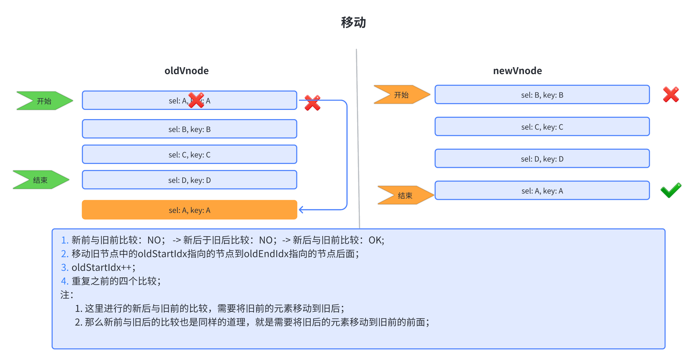

# 虚拟 DOM 和 diff 算法的理解

## 1. 虚拟 DOM

> 虚拟 DOM 是一个 javascript 对象，是对原始的 DOM 进行的抽象；由于是一个 javascript 对象，所以可以运行在服务端和浏览器端，实现跨端功能，同时结合 diff 算法，实现了 DOM 的局部更新，避免了大量的回流重绘，在一定程度上提高了性能。

> 虚拟 DOM 本质是一个 javascript 对象，它可以代表 DOM 的一部分特征，是 DOM 的抽象简化版本。通过预先操作虚拟 DOM，在**某个时机**找出和真实 DOM 之间的**差异部分**并重新渲染，来提升操作真实 DOM 的性能和效率。

要达到最终的目的，要关注的两个问题：什么时候开始渲染、如何高效选择重新渲染范围，找出需要重新渲染的范围，就是 Diff 的过程。React 和 Vue 的 Diff 算法思路基本一致，只对同层节点进行比较，利用唯一标识符对节点进行区分。

### 1.1 创建虚拟节点（vnode）

一个 vnode 对象包含的内容有：

```JavaScript
// 这里面定义一个vnode函数，虚拟节点
/**
 * @param {string} sel 元素标签名
 * @param {object} data 标签属性
 * @param {array|string|object} children 子节点
 * @param {object} elm 真实的DOM对象
 * @param {string} text 字符串节点
 * @return {object}
 *
 */
export default function vnode(sel, data, children, elm, text) {
  const key = data === undefined ? undefined : data.key;
  return { sel, data, children, elm, text, key };
}
```

使用 h 函数创建虚拟 DOM：

```JavaScript
const vnode = h('ul', {}, [
  h('li', {}, '测试1'),
  h('li', {}, '测试2'),
  h('li', {}, '测试3')
]);
// h函数的内部回去调用vnode函数，生成对应的vnode
```

## 2. patch 函数执行过程


### 2.1 精细化比较


#### 2.1.1 diff 核心

> 在新旧节点中，都有 children 元素时，就要开始比较子元素节点是否相同，如果相同就继续进行 patchVnode 操作；
>
> 在进行比较时，分别采用头尾指针（在新旧节点中都有头尾指针）的方式进行比较，那么根据这四个不同的指针，就出现了下面这四种不同的比较（如下图）；当然也存在四个比较都没有命中时，需要进行额外处理的情况；那么在进行遍历比较时，这里使用循环遍历，遍历的条件就是：
>
> ```
> oldStartIdx <= oldEndIdx && newStartIdx <= newEndIdx
> ```
>
> 下面依次列举一些情况来进一步理解 diff 算法


- 新增情况


- 删除


- 移动



- 复杂比较

> 当之前的四种比较都无法满足条件时，就进行复杂比较


## 3. diff 算法

> `diff 算法` 本质上是一个 **对比的方法**。其核心就是在：**“旧 DOM 组”更新为“新 DOM 组”时，如何更新才能效率更高。**

**分为两部分：**

- 四种比较

`sync from start`：自前向后的对比

`sync from end`：自后向前的对比

`common sequence + mount`：新节点多于旧节点，需要挂载

`common sequence + unmount`：旧节点多于新节点，需要卸载

- 乱序

`unknown sequence`：乱序


**前置工作：**

```JavaScript
// 首先是定义变量，用来存在当前遍历的情况
let oldStartVnodeIndex = 0; // 旧节点首部索引
let oldEndVnodeIndex = oldVnode.length -1; // 旧节点尾部索引
let newStartVnodeIndex = 0; // 新节点首部索引
let newEndVnodeIndex = newVnode.length - 1; // 新节点尾部索引

// 对应指针
let oldStartVnode = oldVnode[0];
let oldEndVnode = oldVnode[oldEndVnodeIndex ]; // 旧节点尾部指针
let newStartVnode = newVnode[0]; // 新节点首部指针
let newEndVnode = newVnode[newEndVnodeIndex ]; // 新节点尾部指针
```

- 旧前和新前
  - ```JavaScript
    // 对于两个首部节点，如果相同就精细化比较下一层的节点（子节点）；
    // 然后就切换到下一个兄弟节点
    ```
- 旧后和新后

```JavaScript
// 同前一种方法；
// 区别在于是切换为前面一个兄弟节点；
```

- 旧前和新后

```JavaScript
// 如果旧前和新后是相同的节点，那么就将新后节点添加到oldVnode中oldEndVnode的后面
// 代码实现
if(isSameNode(oldStartVnode, newEndVnode)) {
    // 进行插入 parentElm 为父级节点
    parentElm.insertBefore(newEndVnode, oldEndVnode.elm.nextSubling);
    patchVnode(oldStartVnode, newEndVnode);
    oldStartVnode = oldVnode[++oldStartIndex];
    newStartVnode = newVnode[--newEndIndex];
}

```

- 旧后和新前

```JavaScript
// 如果旧后和新前是相同的节点， 同上
parentElm.insertBefore(oldEndVnode, oldStartVnode.elm);
patchVnode(oldEndVnode, newStartVnode);
oldEndVnode = oldCh[--oldEndIndex];
newStartVnode = newCh[++newStartIndex];
```

- 乱序的情况

> 此时就是上面四种情况都不满足时，就进入这一步

```JavaScript
// 1. 得到旧节点中所有 key --> index 的映射关系
// 2. 使用当前这个新节点的key去查找对应映射表中是否有对应的节点索引；
// 3. 如果有就
// 3.1. 如果元素也相同，就进行patchVnode，并且进行移动，移动到当前oldStartVnode前面， 并在旧节点位置置空(undefined)
// 3.2. 如果元素不相同，就直接在当前oldStartVnode前面新建节点
// 4. 如果没有就直接在当前oldStartVnode前面新建节点
```

## 4. diff 算法代码实现

> 通过 h 函数创建出虚拟 DOM 之后，就要开始进行新旧虚拟 DOM 的比较（patch）；
>
> 众所周知，这个比较过程是在 patch 函数中实现的，内容也是进行了很多处理，并最终生成一个更新后的真实 DOM；

涉及到的主要方法有：

- sameVnode： 判断是否为相同的虚拟节点，这是同层级的比较
- createElm： 根据虚拟 DOM 创建真实的 DOM 元素
- patchVnode：在同层级节点相同的前提下，进行下一步比较
- updateChildren：在新旧节点都有子元素时，进行的比较更新，这也是 diff 算法的核心过程

### 4.1 sameVnode

> 主要比较四个地方：
>
> 1. 元素标签
> 2. 元素的 key 属性
> 3. 如果是自定义元素，那么就有一个 is 属性，使用这个属性进行比较
> 4. 如果前面都能满足，那么就可以比较一下 text 类型

```JavaScript
function sameVnode(vnode1: VNode, vnode2: VNode): boolean {
  const isSameKey = vnode1.key === vnode2.key; // key值
  //  https://developer.mozilla.org/zh-CN/docs/Web/API/Web_components
  const isSameIs = vnode1.data?.is === vnode2.data?.is; // for custom elements v1, 在vue中，那个component动态组件，就有一个is类型
  const isSameSel = vnode1.sel === vnode2.sel; // 元素标签
  // 单纯文本节点比较
  const isSameTextOrFragment =
    !vnode1.sel && vnode1.sel === vnode2.sel
      ? typeof vnode1.text === typeof vnode2.text
      : true;

  return isSameSel && isSameKey && isSameIs && isSameTextOrFragment;
}
```

### 4.2 createElm

> 根据虚拟 DOM 创建真实的 DOM 元素，一般要创建真实 DOM 的直接原因就是新旧虚拟节点不一致；
>
> 在这个过程中存在递归创建的过程（如果节点有子元素）

```JavaScript
function createElm(vnode: VNode, insertedVnodeQueue: VNodeQueue): Node {
  let i: any;
  let data = vnode.data;
  if (data !== undefined) {
    const init = data.hook?.init;
    if (isDef(init)) {
      init(vnode);
      data = vnode.data;
    }
  }
  const children = vnode.children;
  const sel = vnode.sel;
  if (sel === "!") {
    if (isUndef(vnode.text)) {
      vnode.text = "";
    }
    vnode.elm = api.createComment(vnode.text!); // 创建注释节点
  } else if (sel !== undefined) {
    // Parse selector
    const hashIdx = sel.indexOf("#");
    const dotIdx = sel.indexOf(".", hashIdx);
    const hash = hashIdx > 0 ? hashIdx : sel.length;
    const dot = dotIdx > 0 ? dotIdx : sel.length;
    const tag =
      hashIdx !== -1 || dotIdx !== -1
        ? sel.slice(0, Math.min(hash, dot))
        : sel;
    const elm = (vnode.elm =
      isDef(data) && isDef((i = data.ns))
        ? api.createElementNS(i, tag, data)
        : api.createElement(tag, data));
    if (hash < dot) elm.setAttribute("id", sel.slice(hash + 1, dot));
    if (dotIdx > 0)
      elm.setAttribute("class", sel.slice(dot + 1).replace(/\./g, " "));
    for (i = 0; i < cbs.create.length; ++i) cbs.create[i](emptyNode, vnode);
    if (is.array(children)) {
      for (i = 0; i < children.length; ++i) {
        const ch = children[i];
        if (ch != null) {
          api.appendChild(elm, createElm(ch as VNode, insertedVnodeQueue));
        }
      }
    } else if (is.primitive(vnode.text)) {
      api.appendChild(elm, api.createTextNode(vnode.text));
    }
    const hook = vnode.data!.hook;
    if (isDef(hook)) {
      hook.create?.(emptyNode, vnode);
      if (hook.insert) {
        insertedVnodeQueue.push(vnode);
      }
    }
  } else if (options?.experimental?.fragments && vnode.children) {
    vnode.elm = (
      api.createDocumentFragment ?? documentFragmentIsNotSupported
    )();
    for (i = 0; i < cbs.create.length; ++i) cbs.create[i](emptyNode, vnode);
    // 循环递归创建元素
    for (i = 0; i < vnode.children.length; ++i) {
      const ch = vnode.children[i];
      if (ch != null) {
        api.appendChild(
          vnode.elm,
          createElm(ch as VNode, insertedVnodeQueue)
        );
      }
    }
  } else {
    vnode.elm = api.createTextNode(vnode.text!);
  }
  return vnode.elm;
}
```

### 4.3 patchVnode

> 在同层比较时，如果节点相同，那么就进行更加精细的比较;
>
> 在 snabbdom 源码中，还是进行了很完善的处理

```JavaScript
function patchVnode(
  oldVnode: VNode,
  vnode: VNode,
  insertedVnodeQueue: VNodeQueue
) {
  const hook = vnode.data?.hook;
  hook?.prepatch?.(oldVnode, vnode);
  const elm = (vnode.elm = oldVnode.elm)!; // 变量后面跟!表示变量不会是undefined 或 null

  // 如果新旧节点相同(对象地址相同)，无须比较
  if (oldVnode === vnode) return;
  if (
    vnode.data !== undefined ||
    (isDef(vnode.text) && vnode.text !== oldVnode.text)
  ) {
    vnode.data ??= {};
    oldVnode.data ??= {};
    for (let i = 0; i < cbs.update.length; ++i)
      cbs.update[i](oldVnode, vnode);
    vnode.data?.hook?.update?.(oldVnode, vnode);
  }
  const oldCh = oldVnode.children as VNode[];
  const ch = vnode.children as VNode[];
  if (isUndef(vnode.text)) {
    if (isDef(oldCh) && isDef(ch)) {
      // 都有子结点是，进行复杂比较
      if (oldCh !== ch) updateChildren(elm, oldCh, ch, insertedVnodeQueue);
    } else if (isDef(ch)) { // 仅有新节点中有子节点
      if (isDef(oldVnode.text)) api.setTextContent(elm, ""); // 如果旧节点中有text, 则置空
      addVnodes(elm, null, ch, 0, ch.length - 1, insertedVnodeQueue); // 将新节点中的子节点直接加入
    } else if (isDef(oldCh)) { // 只有旧节点中有，就直接删除旧节点中的子节点
      removeVnodes(elm, oldCh, 0, oldCh.length - 1);
    } else if (isDef(oldVnode.text)) {
      api.setTextContent(elm, ""); // 新节点中什么都没有，置空旧节点
    }
  } else if (oldVnode.text !== vnode.text) {
    if (isDef(oldCh)) {
      removeVnodes(elm, oldCh, 0, oldCh.length - 1); // 新旧节点text不相同，直接删除旧节点中的所有
    }
    api.setTextContent(elm, vnode.text!);// 重置旧节点中的text
  }
  hook?.postpatch?.(oldVnode, vnode);
}
```

### 4.4 updateChildren

> diff 算法核心

```JavaScript
function updateChildren(
  parentElm: Node,
  oldCh: VNode[],
  newCh: VNode[],
  insertedVnodeQueue: VNodeQueue
) {
  let oldStartIdx = 0; // 旧开始索引
  let newStartIdx = 0; // 新开始索引
  let oldEndIdx = oldCh.length - 1; // 旧结束索引
  let oldStartVnode = oldCh[0]; // 旧开始指针
  let oldEndVnode = oldCh[oldEndIdx]; // 旧结束指针
  let newEndIdx = newCh.length - 1; // 新结束索引
  let newStartVnode = newCh[0]; // 新开始指针
  let newEndVnode = newCh[newEndIdx]; // 新结束指针
  let oldKeyToIdx: KeyToIndexMap | undefined; // 键值和索引的映射; key --> index
  let idxInOld: number;
  let elmToMove: VNode;
  let before: any;

  while (oldStartIdx <= oldEndIdx && newStartIdx <= newEndIdx) {
    // 两种节点的两端可能存在已经处理过的，所以需要进行一次过滤
    if (oldStartVnode == null) {
      oldStartVnode = oldCh[++oldStartIdx]; // Vnode might have been moved left
    } else if (oldEndVnode == null) {
      oldEndVnode = oldCh[--oldEndIdx];
    } else if (newStartVnode == null) {
      newStartVnode = newCh[++newStartIdx];
    } else if (newEndVnode == null) {
      newEndVnode = newCh[--newEndIdx];
    } else if (sameVnode(oldStartVnode, newStartVnode)) {
      patchVnode(oldStartVnode, newStartVnode, insertedVnodeQueue);
      oldStartVnode = oldCh[++oldStartIdx];
      newStartVnode = newCh[++newStartIdx];
    } else if (sameVnode(oldEndVnode, newEndVnode)) {
      patchVnode(oldEndVnode, newEndVnode, insertedVnodeQueue);
      oldEndVnode = oldCh[--oldEndIdx];
      newEndVnode = newCh[--newEndIdx];
    } else if (sameVnode(oldStartVnode, newEndVnode)) {
      // Vnode moved right
      patchVnode(oldStartVnode, newEndVnode, insertedVnodeQueue);
      api.insertBefore(
        parentElm,
        oldStartVnode.elm!,
        api.nextSibling(oldEndVnode.elm!)
      );
      oldStartVnode = oldCh[++oldStartIdx];
      newEndVnode = newCh[--newEndIdx];
    } else if (sameVnode(oldEndVnode, newStartVnode)) {
      // Vnode moved left
      patchVnode(oldEndVnode, newStartVnode, insertedVnodeQueue);
      api.insertBefore(parentElm, oldEndVnode.elm!, oldStartVnode.elm!);
      oldEndVnode = oldCh[--oldEndIdx];
      newStartVnode = newCh[++newStartIdx];
    } else {
      // 创键key --> index 的映射关系
      if (oldKeyToIdx === undefined) {
        oldKeyToIdx = createKeyToOldIdx(oldCh, oldStartIdx, oldEndIdx);
      }
      idxInOld = oldKeyToIdx[newStartVnode.key as string]; // 在old节点中查询新节点的key 对应old节点的索引
      if (isUndef(idxInOld)) {
        // 没有找到对应的节点，在oldStartVnode前面补一个节点
        // New element
        api.insertBefore(
          parentElm,
          createElm(newStartVnode, insertedVnodeQueue),
          oldStartVnode.elm!
        );
      } else {
        // 此时是两个首部指针位置，对应的内容不一样，然后开始在旧节点中遍历查询和当前newStartVnode一样的key的节点；
        // 如果查询到就直接移动节点到oldStartVnode前面
        elmToMove = oldCh[idxInOld];
        if (elmToMove.sel !== newStartVnode.sel) {
          // 如果不是相同元素就直接新增
          api.insertBefore(
            parentElm,
            createElm(newStartVnode, insertedVnodeQueue), // 新建一个新的节点
            oldStartVnode.elm!
          );
        } else {
          // 如果是相同的元素就行精细化比较
          patchVnode(elmToMove, newStartVnode, insertedVnodeQueue);
          oldCh[idxInOld] = undefined as any; // 置位undefined
          // 直接移动到指定的位置
          api.insertBefore(parentElm, elmToMove.elm!, oldStartVnode.elm!);
        }
      }
      newStartVnode = newCh[++newStartIdx]; // 向前移动新节点的指针
    }
  }

  if (newStartIdx <= newEndIdx) {
    //说明新节点中有新增元素
    // 注意这里写的是newEndIdx
    before = newCh[newEndIdx + 1] == null ? null : newCh[newEndIdx + 1].elm;
    addVnodes(
      parentElm,
      before,
      newCh,
      newStartIdx,
      newEndIdx,
      insertedVnodeQueue
    );
  }
  if (oldStartIdx <= oldEndIdx) {
     // 删除新节点中没有的多余元素
    removeVnodes(parentElm, oldCh, oldStartIdx, oldEndIdx);
  }
}
```
