# Vue源码阅读

## vue2

### 响应式原理

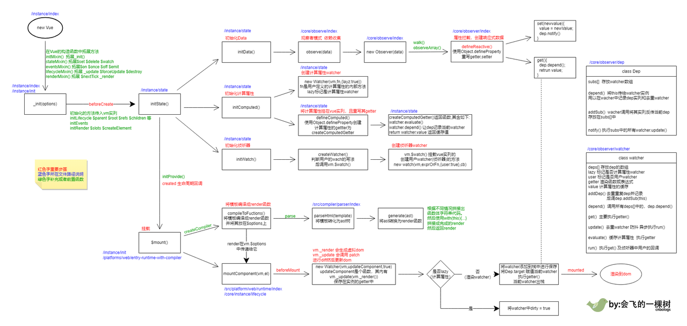

摘录自：https://www.cnblogs.com/flytree/p/16448646.html

- 从**Vue** 构造函数中，可知，在内部会首先调用原型方法**_init,** 执行initState()方法；
- 在initState方法中，又会去执行initData()方法；
- 在initData中就去调用observe()方法（观察者模式）；
-  observe实例化观察者(new Observe);
- Observe实例化调用defineReactive方法实现响应式对象；

vue实现响应式原理步骤：

1. vue实例化时，调用initState方法
2. 设置数据访问代理，this.xx 实际访问 this._data.xx
3. 判断数据不能重复observer
4. vm._data添加__ob__属性，该属性值是Observer类
5. Observer类，包含value, dep 核心属性
6. Observer类，dep属性，是Dep类的实例对象
7. 对vm._data下所有数据循环 defineReactive
8. defineReactive 方法，对vm._data所有数据进行 Object.defineProperty 劫持get set
9. **实例化vue后，进行挂载时，会实例化一个Watcher**
10. **实例化Watcher时， 会设置当前Dep类的target属性，指向当前被 实例化的 watcher**
11. 执行updateComponent方法
12. 执行当前的vm实例的render方法，生成虚拟DOM
13. 获取vm._data数据，触发 defineReactive 方法中定义的 get
14. dep类收集vm._data数据，vm._data.__ob__.dep.subs push对应的watcher
15. 收集的watcher，有个vm属性，指向了使用vm._data.xx的组件实例
16. vm._data上的数据发生变化时，对所有的watcher信息循环 update
17. 进入update队列，执行patch过程，更新dom

摘录自：https://juejin.cn/post/6939174341988843556

### 手写响应式过程

#### 阶段一：实现数据劫持

```JavaScript
const obj = {
  a: 1
};

// 首先响应式：其中一个条件就是在数据更新时，对应视图也需要更新，那么这里就可以使用
// Object.defineProperty方法来设置getter/setter，在数据变化时触发更新

// 使用一个临时变量来解决这个赋值问题

let temp;
Object.defineProperty(obj, 'a', {
  configurable: true,
  enumerable: true,
  get() {
    console.log(`===获取属性的值为：${temp}===`);
     // todo Something
    // return obj['a']; // 问题1： 注意这里不能这样去写，会重复调用，造成内存泄漏
    return temp;
  },
  set(value) {
    console.log(`===修改改属性的值为：${value}===`);
    // this.a = value; 这里的this指向的就是这个obj对象
    // obj['a'] = value; 这里同理上面的问题1

    //
    temp = value;
    
    // todo Something
  }
});

obj.a = 123;
console.log(obj.a);
```

> 通过上面的使用例子，我们使用到了Object.defineProperty来实现了在访问和修改属性值的时候，可以添加getter/setter实现对数据变化时，进行相应的处理;
>
> 存在的问题：
>
> 需要实现多个属性的数据劫持，那么这里就可以使用一个函数，来实现；
>
> 其次就是这里我们使用的是一个变量来实现getter/setter，但是这种方式存在一定的问题，
>
> 那么这里在采用函数之后，我们就可以使用闭包的方式来实现对应功能，在vue2源码中，也的确
>
> 是在defineReactive函数中，使用了闭包，来解决了这问题。（这也是为什么要单独定义defineReactive的原因之一）

**进一步改进：**

> 单独定义一个defineReactive函数，实现数据响应式。

```JavaScript
function defineReactive(obj, key, val) {
  // 当没有给默认值的时候，就返回源对象中对应属性的值
  if (arguments.length === 2) {
    val = obj[key];
  }
  Object.defineProperty(obj, key, {
    configurable: true,
    enumerable: true,
    get() {
      console.log(`===获取属性的值为：${temp}===`);
      return val;
    },
    set(value) {
      console.log(`===修改改属性的值为：${value}===`);
      val = value;
    }
  });
}
```

#### 阶段二：递归对象，实现数据劫持

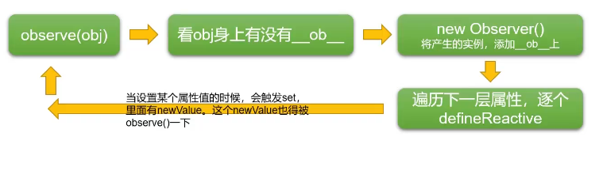

> observe()： 实现了属性的响应式处理；
>
> Observer：给每个属性执行一次defineReactive，实现属性侦听；
>
> 从上图可知：我们在对一个嵌套对象实现数据侦听的过程中，我们是进行循环调用的方式进行属性的递归侦听；

- **observe()函数实现**

```JavaScript
// 封装方法，实现对数据的观察
function observe(value) {
  // 首先我们知道，最开始传递进来的会是一个对象，然后这里主要是为了去判断子元素是否为对象类型
  // 同时也支持数组
  if (isObject(value) || Array.isArray(value)) {
    // 定义一个ob
    let ob;
    if (typeof value.__ob__ !== 'undefined') {
      ob = value.__ob__;
    } else {
      ob = new Observer(value);
    }
    return ob;
  }
}
```

- **Observer 侦听类**

```JavaScript
// 定义一个观察者类，将一个正常的Object转换成一个都可以被侦查的工具类
class Observer {
  constructor(value) {
    // 定义__ob__, 它应该是一个不可枚举类型，所以这里设置不能枚举
    // 构造函数中this指向的实例本身
    def(value, '__ob__', this, false);
    console.log(`执行构造函数Observer`, value);
    // this.walk(value);
    // 判断是否数组
    if (Array.isArray(value)) {
      // 处理数组
      value.__proto__ = arrayMethods;
      this.observeArray(value);
    } else {
      this.walk(value);
    }
  }
  // 遍历对象中的每个属性，实现对每一个属性的侦听
  walk(value) {
    Object.keys(value).forEach((key) => {
      defineReactive(value, key);
    });
  }
  
  // 侦听数据
  observeArray(arr) {
    for (let i = 0, l = arr.length; i < l; i++) {
      observe(arr[i]);
    }
  }
}
```

- **defineReactive 实现具体的响应**

```JavaScript
function defineReactive(obj, key, val) {
  // 当没有给默认值的时候，就返回源对象中对应属性的值
  if (arguments.length === 2) {
    val = obj[key];
  }
  // 需要对子属性，也就是这里的val，如果val是对象，那么这里就需要对其进行侦听
  // 使用一个变量来保存对应的实例，因为在下面的setter中，需要在值发生变化的时候，去修改它
  let childOb = observe(val);
  Object.defineProperty(obj, key, {
    configurable: true,
    enumerable: true,
    get() {
      console.log(`===获取属性 ${key} 的值为：${val}===`);
      return val;
    },
    set(newValue) {
      if (val === newValue) {
        // 如果值没有发生变化，不执行下面的代码
        return;
      }
      console.log(`===修改改属性 ${key} 的值为：${newValue}===`);
      val = newValue;
      // 重新处理子元素的侦听情况
      childOb = observe(newValue);
    }
  });
}
```

在 Vue 中，`__ob__` 是一个非标准属性，用于表示当前对象是否被观测（响应式）。它的作用是在响应式系统中追踪被观察对象的元数据，例如依赖收集器和防止重复观测。只有具备 **`ob`** 属性的对象才能被视为响应式数据，因为只有这样才有依赖收集器和观察者等相关的元数据，才能实现数据的双向绑定。

在 Vue 中，当我们使用 `Vue.set` 或者 `vm.$set` 向响应式对象添加一个新的属性时，会给这个属性添加 **`ob`** 属性，并将它的值设置为响应式对象的 `Observer` 实例，以便于 Vue 进行依赖收集以及在数据发生变化时通知相关的观察者。

需要注意的是，由于 **`ob`** 不是标准属性，并且也可能存在一些其他的原因导致 **`ob`** 属性不可访问，因此我们并不推荐直接在代码中使用该属性。如果你需要进行一些高级的 Vue 开发，可以使用可以使用一些高级工具，例如 Vue Devtools，在浏览器开发工具中查看对象的 `__ob__` 属性，来更加深入地了解响应式系统的实现细节。 需要注意的是，由于在对象中添加了 `__ob__` 属性，因此应该避免直接使用 `Object.defineProperty` 等函数对这个属性进行修改，因为这可能会破坏响应式系统中的一些关键逻辑。同时，如果你需要进行比较高级的 Vue 开发，例如开发自定义渲染器等，也需要了解 `__ob__` 属性以及相关的响应式系统的实现细节，以避免错误的使用方式导致程序的不可预期行为。

#### 阶段三：数组类型的监听

> 同理，在vue源码中，对数组的每一个元素也添加了侦听(只有对象或者数组才会被侦听)，如下代码：

```JavaScript
class Observer {
    constructor(public value: any, public shallow = false, public mock = false) {
        /** 此处省略部分代码 */
    
      if (isArray(value)) {
          /** LY:  给数组方法添加响应式方法  */
          if (!mock) {
               if (hasProto) {
                  /* eslint-disable no-proto */
                  // 将数组实例对象的原型执行重写后的对象
                  ;(value as any).__proto__ = arrayMethods
                  /* eslint-enable no-proto */
                } else {
                  // 这里是给数组上的特定方法添加侦听
                  for (let i = 0, l = arrayKeys.length; i < l; i++) {
                        const key = arrayKeys[i]
                        def(value, key, arrayMethods[key])
                  }
                }
           }
          if (!shallow) {
            // 给每个元素都添加侦听
            this.observeArray(value)
          }
        }
    
    }
    
    observeArray(value: any[]) {
       for (let i = 0, l = value.length; i < l; i++) {
            observe(value[i], false, this.mock)
       }
    }
}
```

但是，我们一般在使用数组的时候，很少直接进行像普通对象那样通过 ' . '点运算符，获取其他方法来修改属性的值，我们更多的可能是通过数组提供的一些方法来进行数组的数据更改，更多的是批量修改；所以在vue中，提供了对**7个**常用方法的侦听，分别是：

- push
- pop
- shift
- unshift
- splice
- sort
- reverse

> 可见，这些方法都是会改变原数组的；

vue重写数组的这七个方法的过程：

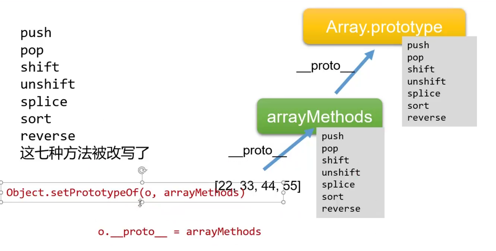

- 创建一个arrayMethods对象，其原型指向：Array.prototype;
- 在arrayMethods对象中，重写上述提到的数组方法；
- 最后是在初始化Data时，如果属性为数组，那么这个数组对象的原型(__proto__)指向这里的arrayMethods;

下面为vue源码中处理数组的方法

```JavaScript
methodsToPatch.forEach(function (method) {
  // cache original method
  const original = arrayProto[method]
  def(arrayMethods, method, function mutator(...args) {
    /** LY: 先执行原始方法 */
    const result = original.apply(this, args)
    const ob = this.__ob__
    let inserted
    switch (method) {
      case 'push':
      case 'unshift':
        inserted = args
        break
      case 'splice':
        inserted = args.slice(2)
        break
    }
    // 对插入的元素添加侦听
    if (inserted) ob.observeArray(inserted)
    // notify change
    if (__DEV__) {
      ob.dep.notify({
        type: TriggerOpTypes.ARRAY_MUTATION,
        target: this,
        key: method
      })
    } else {
      ob.dep.notify()
    }
    return result
  })
})
```

#### 阶段四：依赖收集

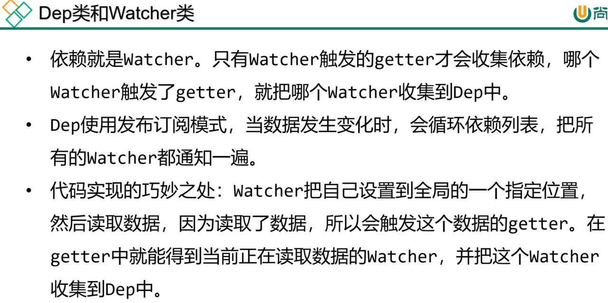

- Dep

```JavaScript
// 依赖管理
let uid = 0;
export class Dep {
  constructor() {
    // console.log('实例化Dep');
    this.id = uid++;
    // 存放依赖(订阅者), 存放的是Watcher实例； subscribes(订阅者)
    this.subs = [];
  }

  // 添加订阅
  addSub(sub) {
    this.subs.push(sub);
  }
  // 添加依赖
  depend() {
    // Dep.target是全局唯一的
    // 它是用于暂存正在读取getter的Watcher
    // 那么当触发属性的getter时，就可以读取这个Dep.target来收集Watcher
    if (Dep.target) {
      this.addSub(Dep.target);
    }
  }

  // 发布更新
  notify() {
    // 执行相关依赖
    console.log('触发依赖执行');
    const subs = this.subs.slice();
    for (let i = 0, l = subs.length; i < l; i++) {
      subs[i].update();
    }
  }
}
// 全局唯一，用户存放依赖
Dep.target = null;
```

- Watcher

```JavaScript
// 相当于一个监听器，它会将触发属性getter的方法拿到，然后它就被属性的Dep收集；
// 当属性值发生变化时，就会以此触发属性上的相关依赖，在触发依赖的时候，就会调用该Watcher实例上的update方法
import { Dep } from './Dep';
let uid = 0;
export class Watcher {
  constructor(target, expression, callback) {
    console.log('实例化Watcher');
    this.id = uid++;
    // 监听的目标对象
    this.target = target;
    // 返回一个函数，用于获取目标对象上的指定属性
    this.getter = parsePath(expression);
    // 一个回调函数，用于在侦听对象的值发生变化时，触发这个回调
    this.callback = callback;
    // 当前的值，也就是侦听对象的值还没有变化的值，变化前的值
    this.value = this.get();
  }
  //
  update() {
    this.run();
  }
  // 获取值
  // 在这个方法中，其实不仅仅是获取值；
  // 首先，是给Dep.target设置的当前的Wather实例，这是全局唯一的，那么在触发目标对象上的getter之后，就可以将这个依赖添加到对应Dep中
  // 其次，在this.getter(obj); 这一步中，其实触发了目标对象的getter访问属性，那么此时内部就会执行收集依赖的过程；
  // 最后，将全局Dep.target置空
  get() {
    // 进入依赖收集
    // 让Dep.target被设置为当前Watcher实例，然后触发getter
    Dep.target = this;
    const obj = this.target;
    let value;
    try {
      value = this.getter(obj); // 触发属性的getter
    } catch (exception) {
      throw new Error('getter error');
    } finally {
      Dep.target = null;
    }
    return value;
  }

  // 执行
  run() {
    this.getAndInvoke(this.callback);
  }

  // 获取并调用
  getAndInvoke(cb) {
    const newValue = this.get();
    if (newValue !== this.value || typeof newValue === 'object') {
      const oldValue = this.value;
      this.value = newValue;
      cb.call(this.target, newValue, oldValue);
    }
  }
}

function parsePath(expression) {
  if (typeof expression !== 'string') {
    return;
  }
  const segments = expression.split('.');
  return (obj) => {
    for (let i = 0, l = segments.length; i < l; i++) {
      if (!obj) {
        return;
      }
      obj = obj[segments[i]];
    }
    return obj;
  };
}
```

- 在对应defineReactive中需要添加对应的依赖收集和触发订阅

```JavaScript
 get() {
      console.log(`===获取属性 ${key} 的值为：${val}===`);
      if (Dep.target) {
        dep.depend(); // 收集依赖 
        if (childOb) {
          childOb.dep.depend();
        }
      }
      return val;
    },
    set(newValue) {
      if (val === newValue) {
        // 如果值没有发生变化，不执行下面的代码
        return;
      }
      console.log(`===修改改属性 ${key} 的值为：${newValue}===`);
      val = newValue;

      // 触发对应依赖执行
      dep.notify();

      // 重新处理子元素的侦听情况
      childOb = observe(newValue);
    }
```

- 使用Watcher，实现订阅

```JavaScript
const obj = {
  a: 1,
  b: 2,
  c: 3,
  d: {
    e: '123',
    f: '456'
  },
  k: [1, 2, 3],
  g: [
    {
      name: '123'
    }
  ]
};
observe(obj);

new Watcher(obj, 'a', (val) => {
  console.log('通过Wather侦听到了a的变化', val);
});

obj.a = '45';
```

### 两种设计模式

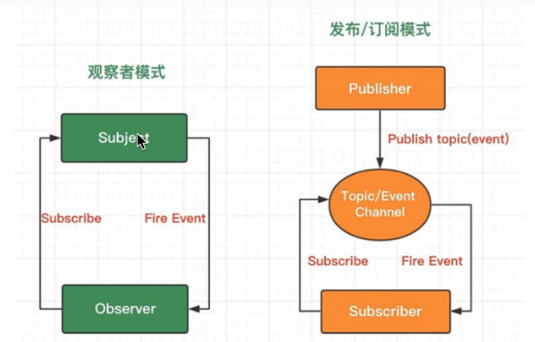

#### 观察者模式

> 观察者（Observer）直接订阅（Subscribe）主题（Subject）,而当主题被激活的时候，会触发（Fire Event）观察者里的事件；（可见，vue中的依赖管理Dep就是使用的这种模式）

#### 发布订阅模式

> 订阅者（Subscriber）把自己想订阅的事件注册（Subscribe）到调度中心（Topic）,当发布者（Publisher）发布该事件（Publish topic）到调度中心，也就是该事件触发时，由调度中心统一调度（Fire Event）订阅者注册到调度中心的处理代码。（事件总线EventBus）

### vue2与vue3中hasChanged方法

> 这个方法，主要在判断两个值（newValue, oldValue）是否一致，也就是新值是否相对于旧值发生变化；

- vue2

```JavaScript
export function hasChanged(x: unknown, y: unknown): boolean {
  if (x === y) {
    // 一般在两个值严格相等的情况下，这两个值就已经是相等的了；
    // 这里附加了一个条件就是 +0 与 -0比较，这两个是不相等的;
    // 还有一个比较特殊的地方就是，这里很巧妙的就是，如果两个值是严格相等话，这里除了关于0的
    // 其他都应该返回一个false, 这里在返回值上，第一步就是先判断了是否值等于0，如果不等于就返回false；
    // 感觉这个很巧妙；
    // 然后如果值为0，那么就进行-0 与+0 判断；
    return x === 0 && 1 / x !== 1 / (y as number)
  } else {
    return x === x || y === y
    // 这里就是判断两个值是否不相等，不相等一般就会返回true;
    // 但是在JavaScript中，有一个很特别的值，就是NaN(Not a Number)
    // NaN === NaN 这个是返回false的；
    // 那么上述表达式在碰到两个NaN时，就会返回false
    // 着实巧妙。高手！！！
  }
}
```

> 需要注意的是，在JavaScript中，当除数为0时，不会报错，会返回结果：Infinity ( -Infinity );

- vue3

```JavaScript
export const hasChanged = (value: any, oldValue: any): boolean =>
  !Object.is(value, oldValue)
 
  // 相比于vue2中的判读，这里简化了很多，当然，这里和上面的效果是等效的 
```

`Object.is()` 与 `==` 运算符并不等价。`==` 运算符在测试相等性之前，会对两个操作数进行类型转换（如果它们不是相同的类型），这可能会导致一些非预期的行为，例如 `"" == false` 的结果是 `true`，但是 `Object.is()` 不会对其操作数进行类型转换。

`Object.is()` 也**不**等价于 `===` 运算符。`Object.is()` 和 `===` 之间的唯一区别在于它们处理带符号的 0 和 `NaN` 值的时候。`===` 运算符（和 `==` 运算符）将数值 `-0` 和 `+0` 视为相等，但是会将 `NaN` 视为彼此不相等。

### 模板引擎 Mustache

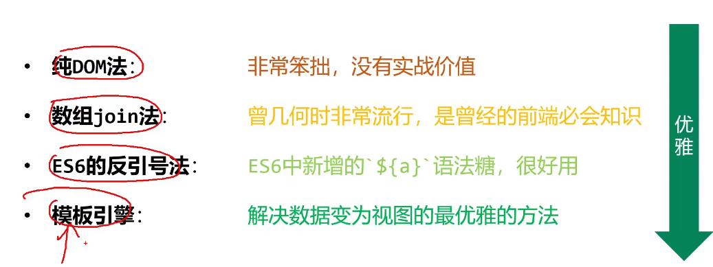

> **Mustache仓库地址:** **https://github.com/mustache/mustache**
>
> mustache并不是什么vue的内容（之前一直以为是vue自己弄的，没想到居然是一个早就出现的库），但是vue中也是有一套属于自己的模板引擎；

使用Mustatche

> 在写模板的时候，如果使用字符串的形式，会因为不能换行而变得麻烦，这里我们可以使用es6的**模板字符串，**可以实现换行，但是在es6之前是没有模板字符串这个语法的，所以我们将这些模板内容写到了script标签中（因为script标签不会被渲染到页面上，同时需要注意，这里的type不能设置为已有的常规type，防止被浏览器解析为其他内容导致报错。这里是自定义的type）；

```HTML
<!DOCTYPE html>
<html lang="en">
  <head>
    <meta charset="UTF-8" />
    <meta http-equiv="X-UA-Compatible" content="IE=edge" />
    <meta name="viewport" content="width=device-width, initial-scale=1.0" />
    <title>mustache-test</title>
  </head>
  <body>
    <div id="app"></div>
    <!-- <script type="module" src="../lib/mustache.js"></script> -->
    <script type="text/template" id="templateDom">
      Current UserInfo:
      <h1>用户信息</h1>
      <ul>
        <li>
          userName: {{userName}}
        </li>
        <li>
          userAge: {{userAge}}
        </li>
      </ul>

      <!-- 使用注释 -->

      <h1>使用数组</h1>
      <ol>
        {{#arr}}
          <li>{{num}}--{{score}}</li>
        {{/arr}}
      <ul>

      <h2>单个元素的数组</h2>
      <ul>
        {{#oneItemList}}
        <li>{{.}}</li>
        {{/oneItemList}}
      </ul>
      <h2>是否显示内容</h2>
      {{#isShow}}
      <div>测试内容</div>
      {{/isShow}}
    </script>
    <script type="module">
      import Mustache from '../lib/mustache.js';
      const app = document.querySelector('#app');
      const templateDom = document.querySelector('#templateDom');
      const data = {
        userName: '张三',
        userAge: 12,
        arr: [
          { num: 'A', score: 100 },
          { num: 'C', score: 80 },
          { num: 'B', score: 90 }
        ],
        oneItemList: ['张三', '李四', '王五'],
        isShow: true
      };

      const template = Mustache.render(templateDom.innerHTML, data);
      app.innerHTML = template;
    </script>
  </body>
</html>
```

#### 实现一个简易的模板引擎-使用正则匹配，replace替换

> 注意这里正则里面使用的小括号是用来捕获的，然后会在replace的第二个参数中(下面代码中是一个函数)，它的第二个参数($1)就是捕获到的值

```JavaScript
let templateStr = '我喜欢{{action}}, 因为它{{useful}}';
      const obj = {
        action: '篮球',
        useful: '看起来很cool'
      };

      const result = templateStr.replace(
        /\{\{(\w+)\}\}/g,
        function (matchStr, $1, index, originStr) {
           /**
           * matchStr: 匹配上的部分
           * $1: 捕获到的内容
           * index: 匹配的位置
           * originStr: 原始的字符串
           */
          console.log(matchStr, $1, index, originStr);
          return obj[$1];
        }
      );
      console.log(result);
```

### mustache库的机理

- **大致流程如下**：

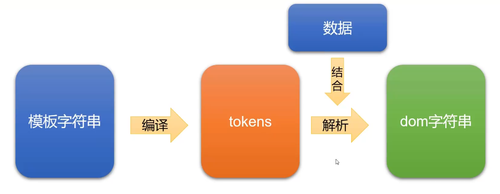

- **什么是tokens**

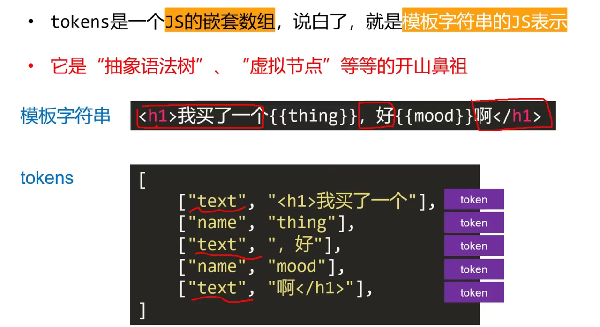

- **对于一些特殊的内容的解析**：

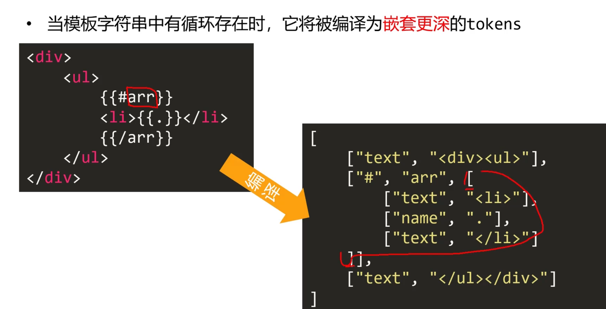

- **mustache库底层主要需要做的两件事**：
  - 如何将模板转换成tokens
  - 如果将tokens结合数据生成DOM节点

## Vue3

**目录结构(这是在core/packages下的部分文件)**

> 这里来一份网上看到的；两个版本的项目的比较：
>
> Vue3 的项目结构相较于 Vue2 有了很大的进步，在 Vue2 中，所有的模块都是放在一个项目中（Vue2 的项目结构可以看我的这篇博客），在打包时，无法做到分模块打包，各个模块耦合在一起，如果只想用项目中的一部分功能，也需要导入包含全部功能的 vue.js。
>
> Vue3 使用 **Monorepo** 的模式管理项目，Monorepo 的思想是指在一个项目仓库中管理多个模块，每个模块都是一个独立的项目，各个模块的耦合度非常低，每个模块都可以单独的打包发行
>
> （上述vue3项目就更加的符合渐进式，所谓渐进式：要啥才加啥，不要的就不用加）

```JavaScript
compiler-core          // 与平台无关的编译器核心
compiler-dom           // 针对浏览器的编译模块
compiler-sfc           // 用于解析 xxx.vue 单文件
compiler-ssr           // 针对服务器渲染的编译模块
reactivity             // 响应式系统
runtime-core           // 与平台无关的运行时核心
runtime-dom            // 针对浏览器的运行时，例如包含了很多 DOM 操作以及属性事件操作等等
runtime-test           // 用于测试的运行时
server-renderer        // 服务器端渲染器
sfc-playground         // Vue3 单文件组件 playground
size-check             // 用来测试代码体积
template-explorer      // 用于调试编译器输出的开发工具
vue                    // 完整版本 Vue，包含运行时和编译器
```

### 响应式原理

> 关键是reactive函数；
>
> ref函数，在底层，区分两种：普通的值和对象类型，如果是对象，那么会在底层去调用reative函数

- Ref

> 在vue3中，已经是全部拥抱TypeScript，在这个RefImpl就使用类的私有属性修饰符，来存储要实现响应式数据的原始值以及一个响应式数据，同时还有一个我们非常熟悉的Dep（依赖管理，收集）

```JavaScript
// ref函数
export function ref(value?: unknown) {
  return createRef(value, false)
}

// RefImpl类
class RefImpl<T> {
  private _value: T
  private _rawValue: T

  public dep?: Dep = undefined
  public readonly __v_isRef = true

  constructor(value: T, public readonly __v_isShallow: boolean) {
    this._rawValue = __v_isShallow ? value : toRaw(value)  /** toRaw()就是获取Proxy包装下的原始对象 */
    this._value = __v_isShallow ? value : toReactive(value)
  }
  
  get value() {
  trackRefValue(this)
  return this._value
}

set value(newVal) {
  const useDirectValue =
    this.__v_isShallow || isShallow(newVal) || isReadonly(newVal)
  newVal = useDirectValue ? newVal : toRaw(newVal) // 转换成原始值
  /** LY：先判断是否发生了变化 */
  if (hasChanged(newVal, this._rawValue)) {
    this._rawValue = newVal // 原始值
    this._value = useDirectValue ? newVal : toReactive(newVal)
    triggerRefValue(this, newVal)
  }
}
  
  
}
// 如果是对象就直接调用reative函数
export const toReactive = <T extends unknown>(value: T): T =>
  isObject(value) ? reactive(value) : value
```

- **reative**

```JavaScript
export function reactive(target: object) {
  // if trying to observe a readonly proxy, return the readonly version.
  if (isReadonly(target)) {
    return target
  }
  // 创建一个响应式对象
  return createReactiveObject(
    target,
    false,
    mutableHandlers,
    mutableCollectionHandlers,
    reactiveMap
  )
}


function createReactiveObject(
  target: Target,
  isReadonly: boolean,
  baseHandlers: ProxyHandler<any>,
  collectionHandlers: ProxyHandler<any>,
  proxyMap: WeakMap<Target, any>
) {
  if (!isObject(target)) {
    if (__DEV__) {
      console.warn(`value cannot be made reactive: ${String(target)}`)
    }
    return target
  }
  // target is already a Proxy, return it.
  // exception: calling readonly() on a reactive object
  if (
    target[ReactiveFlags.RAW] &&
    !(isReadonly && target[ReactiveFlags.IS_REACTIVE])
  ) {
    return target
  }
  // target already has corresponding Proxy
  // target已经具备了相应的proxy
  const existingProxy = proxyMap.get(target)
  if (existingProxy) {
    return existingProxy
  }
  // only specific value types can be observed.
  const targetType = getTargetType(target)
  if (targetType === TargetType.INVALID) {
    return target
  }
  // 使用Proxy代理，来处理数据劫持
  // 增加了对集合类型的处理
  const proxy = new Proxy(
    target,
    targetType === TargetType.COLLECTION ? collectionHandlers : baseHandlers
  )
  // 将设置的代理对象数据添加到一个proxyMap中
  proxyMap.set(target, proxy)
  return proxy
}
```

一个小细节，在vue3中有不少地方出现了  *`/\*#__PURE__\*/`* *这个* *是一个特殊的注释，用来告诉编译器和打包工具这个函数或变量是纯粹的，没有副作用，在打包过程中可以安全地进行代码优化和删除。这个注释通常在定义一些可以被静态分析并进行优化的函数或常量时使用。* *在 Vue 3 的编译器中，会自动在一些特定场合下插入* *`/\*#__PURE__\*/`* *注释，例如对一些纯函数进行内联，将多个常量合并成一个对象等。这种优化可以减少最终打包后的代码量，并提高代码的性能和可读性。*

## vue工作流程

> 刷B站视频，看到的一个视频合集，关于Vue的：https://www.bilibili.com/video/BV1rC4y187Vw?p=3&vd_source=08a0c62bb7d988bf53d634998054046b

> vue中有三个主要的模块：响应式模块、编译模块、渲染模块；
>
> 这里以一个简单的vue组件为例子：

- 组件会有自己的**template模板**（html代码），已经相关的**响应式对象；**
- 首先，模板编译器会将HTML文档编译成**render函数；**
- 然后**初始化响应式对象**;
- 接着进入**渲染阶段**：
  - 调用**render函数**，该函数会引用相关的响应式对象，vue内部会监听该响应式对象的变化；
  - render函数会生成一个**virtual DOM node**（虚拟节点）;
- 然后进入**挂载阶段**：
  - 使用功能VNode创建web页面；
- 最后，如果响应式对象发生变化（**更新阶段**）：
  - 编译器会再次调用**render函数**；
  - 生成新的**VNode**;
  - 调用**patch函数**，对比新旧节点，根据需要更新web页面；

下图为组件更新的过程：（同时这张图也描绘出来vue的是三个主要模块，以及像render函数，patch函数这些主要内容等）

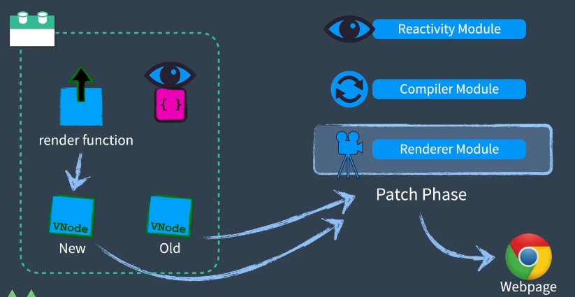

记录一下视频中讲到的内容：

1. 首先是讲述了vue的一些基本概念；
2. 讲述了render函数，其中vue2的render函数灵感来自于项目: [snabbdom](https://github.com/snabbdom/snabbdom)

(看视频发现，对snabbom的理解可能有些问题，下面的截图是在[尚硅谷视频](https://www.bilibili.com/video/BV1v5411H7gZ?p=2&vd_source=08a0c62bb7d988bf53d634998054046b)里面讲解到的,是关于虚拟DOM的)

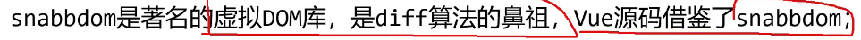

> A virtual DOM library with focus on simplicity, modularity, powerful features and performance. -- snabbdom

1. 当你觉得你想表达的内容用JavaScript更容易实现时，就可以使用render函数；