# Git 相关

要想弄懂 Git 是怎么对我们的代码进行管理的，那首当其冲的是了解 Git 的工作区域是如何构成的。因为，只有彻底弄懂了 Git 工作区域的构成，你才可以在适当的区域使用合适的命令。如下图所示，此图包含了 Git 的 4 个工作区和一些常见的操作。

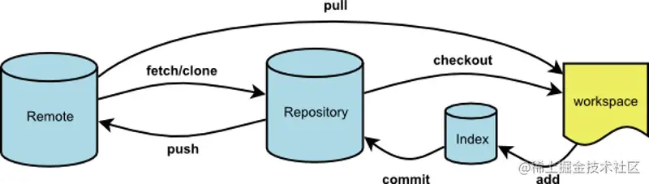

Workspace：工作区，就是平时进行开发改动的地方，是当前看到最新的内容，在开发的过程也就是对工作区的操作

Index：暂存区，当执行 `git add` 的命令后，工作区的文件就会被移入暂存区，暂存区标记了当前工作区中那些内容是被 Git 管理的，当完成某个需求或者功能后需要提交代码，第一步就是通过 `git add` 先提交到暂存区。

Repository：本地仓库，位于自己的电脑上，通过 `git commit` 提交暂存区的内容，会进入本地仓库。

Remote：远程仓库，用来托管代码的服务器，远程仓库的内容能够被分布在多个地点的处于协作关系的本地仓库修改，本地仓库修改完代码后通过 `git push` 命令同步代码到远程仓库。

一般来说，Git 的工作流程分为以下几步

```Bash
1.在工作区开发，添加，修改文件。
2.将修改后的文件放入暂存区。
3.将暂存区域的文件提交到本地仓库。
4.将本地仓库的修改推送到远程仓库。
复制代码
```

## Git 基本操作

### git add

添加文件到暂存区

```Bash
# 添加某个文件到暂存区，后面可以跟多个文件，以空格区分
git add xxx
# 添加当前更改的所有文件到暂存区。
git add .
复制代码
```

### git commit

```Bash
# 提交暂存的更改，会新开编辑器进行编辑
git commit
# 提交暂存的更改，并记录下备注
git commit -m "you message"# 等同于 git add . && git commit -m
git commit -am
# 对最近一次的提交的信息进行修改,此操作会修改commit的hash值
git commit --amend
复制代码
```

### git pull

```Bash
# 从远程仓库拉取代码并合并到本地，可简写为 git pull 等同于 git fetch && git merge
git pull <远程主机名> <远程分支名>:<本地分支名>
# 使用rebase的模式进行合并
git pull --rebase <远程主机名> <远程分支名>:<本地分支名>
复制代码
```

### git fetch

与 `git pull` 不同的是 `git fetch` 操作仅仅只会拉取远程的更改，不会自动进行 merge 操作。对你当前的代码没有影响

```Bash
# 获取远程仓库特定分支的更新
git fetch <远程主机名> <分支名>
# 获取远程仓库所有分支的更新
git fetch --all
复制代码
```

### git branch

```Bash
# 新建本地分支，但不切换
git branch <branch-name>
# 查看本地分支
git branch
# 查看远程分支
git branch -r
# 查看本地和远程分支
git branch -a
# 删除本地分支
git branch -D <branch-nane>
# 重新命名分支
git branch -m <old-branch-name> <new-branch-name>
```

### git checkout

```Shell
# 切换分支
git checkout <branch>
```

## 工作中使用 Git 解决问题的场景

### git rebase 让你的提交记录更加清晰可读

#### git rebase 的使用

rebase 翻译为变基，他的作用和 merge 很相似，用于把一个分支的修改合并到当前分支上。

如下图所示，下图介绍了经过 rebase 后提交历史的变化情况。

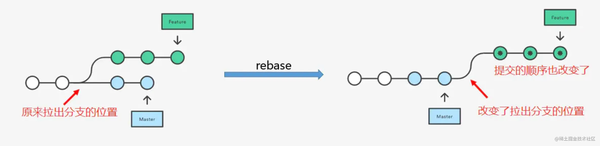

现在我们来用一个例子来解释一下上面的过程。

假设我们现在有 2 条分支，一个为 master，一个为 feature/1，他们都基于初始的一个提交 add readme 进行检出分支，之后，master 分支增加了 3.js 和 4.js 的文件，分别进行了 2 次提交，feature/1 也增加了 1.js 和 2.js 的文件，分别对应以下 2 条提交记录。

此时，对应分支的提交记录如下。

master 分支如下图：

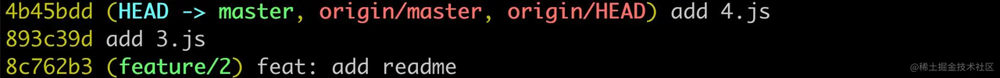

feature/1 分支如下图

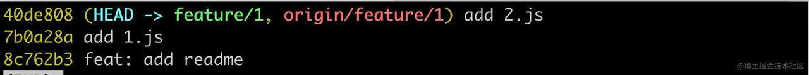

结合起来看是这样的

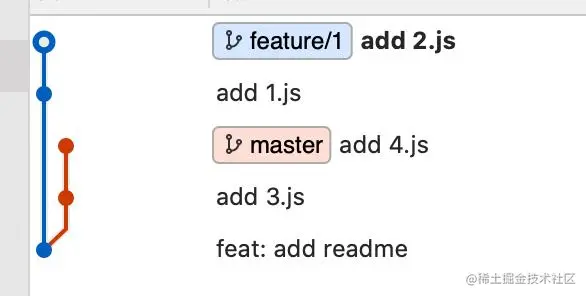

此时，切换到 feature/1 分支下，执行 `git rebase master`，成功之后，通过 `git log` 查看记录。

如下图所示：可以看到先是逐个应用了 mater 分支的更改，然后以 master 分支最后的提交作为基点，再逐个应用 feature/1 的每个更改。


所以，我们的提交记录就会非常清晰，没有分叉，上面演示的是比较顺利的情况，但是大部分情况下，rebase 的过程中会产生冲突的，此时，就需要手动解决冲突，然后使用依次 `git add ` 、`git rebase --continue ` 的方式来处理冲突，完成 rebase 的过程，如果不想要某次 rebase 的结果，那么需要使用 `git rebase --skip ` 来跳过这次 rebase 操作。

#### git merge 和 git rebase 的区别

不同于 `git rebase` 的是，`git merge` 在不是 fast-forward（快速合并）的情况下，会产生一条额外的合并记录，类似 `Merge branch 'xxx' into 'xxx'` 的一条提交信息。

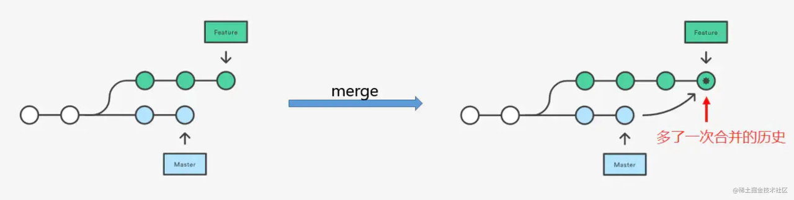

另外，在解决冲突的时候，用 merge 只需要解决一次冲突即可，简单粗暴，而用 rebase 的时候 ，需要依次解决每次的冲突，才可以提交。

#### git rebase 交互模式

在开发中，常会遇到在一个分支上产生了很多的无效的提交，这种情况下使用 rebase 的交互式模式可以把已经发生的多次提交压缩成一次提交，得到了一个干净的提交历史，例如某个分支的提交历史情况如下：

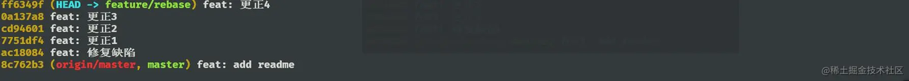

进入交互式模式的方式是执行：

```Shell
git rebase -i <base-commit>
复制代码
```

参数 `base-commit` 就是指明操作的基点提交对象，基于这个基点进行 rebase 的操作，对于上述提交历史的例子，我们要把最后的一个提交对象（ ac18084 ）之前的提交压缩成一次提交，我们需要执行的命令格式是：

```Shell
git rebase -i ac18084
复制代码
```

此时会进入一个 vim 的交互式页面，编辑器列出的信息像下列这样。

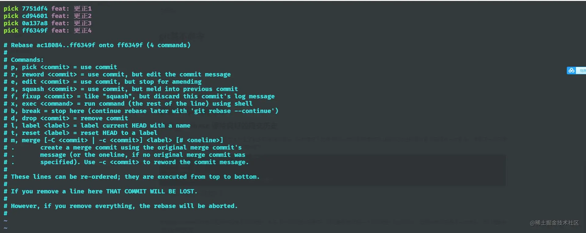

想要合并这一堆更改，我们要使用 Squash 策略进行合并，即把当前的 commit 和它的上一个 commit 内容进行合并， 大概可以表示为下面这样，在交互模式的 rebase 下，至少保留一个 pick，否则命令会执行失败。

```Bash
pick  ... ...
s     ... ...
s     ... ...
s     ... ...
复制代码
```

修改文件后 按下 `:` 然后 `wq` 保存退出，此时又会弹出一个编辑页面，这个页面是用来编辑提交的信息，修改为 `feat: 更正`，最后保存一下，接着使用 `git branch` 查看提交的 commit 信息，rebase 后的提交记录如下图所示，是不是清爽了很多？rebase 操作可以让我们的提交历史变得更加清晰。

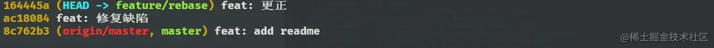

> 特别注意，只能在自己使用的 feature 分支上进行 rebase 操作，不允许在集成分支上进行 rebase，因为这种操作会修改集成分支的历史记录。

### 使用 git cherry-pick 获取指定的 commit

`git cherry-pick` 可以理解为”挑拣”提交，和 merge 合并一个分支的所有提交不同的是，它会获取某一个分支的单笔提交，并作为一个新的提交引入到你当前分支上。当我们需要在本地合入其他分支的提交时，如果我们不想对整个分支进行合并，而是只想将某一次提交合入到本地当前分支上，那么就要使用 `git cherry-pick` 了。

如下场景，以下有三条分支，feature/cherry-pick1 和 feature/cherry-pick2 都是基于 master 检出的两条功能性分支，对应的分支 log 记录如下

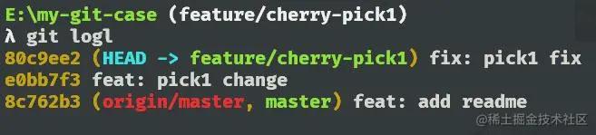

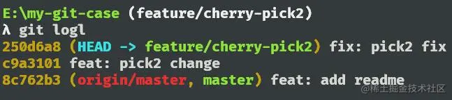

master 分支的提交如下


现在 master 只需要 feature/cherry-pick1 和 feature/cherry-pick2 有关 change 的修改，并不关心有关 fix 内容的修改。此时就可以用 cherry-pick 指令了。

语法： `git cherry-pick [commit-hash]`

commit-hash 表示的是某次 commit 的 hash 值。现在，依次执行以下两条指令 `git cherry-pick e0bb7f3`、`git cherry-pick c9a3101`，过程中，如果出现冲突，解决冲突后 进行 `git add `，接着执行 `git cherry-pick --continue`，最后，master 上的提交如下


此时，master 分支上应用了需要的提交，就达到了我们想要的效果。如果需要多个 cherry-pick 需要同步到目标分支，可以简写为 `git cherry-pick <first-commit-id>...<last-commit-id>`，这是一个左开右闭的区间，也就时说 `first-commit-id` 提交带来的代码的改动不会被合并过去，如果需要合并过去，可以使用 `git cherry-pick <first-commit-id>^...<last-commit-id>`，它表示包含 `first-commit-id` 到 `last-commit-id` 在内的提交都会被合并过去。

### 使用 git revert 回滚某次的提交

想象这么一个场景，你的项目最近有 2 个版本要上线，这两个版本还伴随着之前遗留的 bug 的修复，一开始的时候，你将 bug 修复在了第一个版本的 release 分支上，突然在发版前一天，测试那边反馈，需要把第一个版本修复 bug 的内容改在第二个版本上，这个时候，第一个版本的集成分支的提交应该包括了第一个版本的功能内容，遗留 bug 修复的提交和其他同事提交的内容，想要通过 reset 的方式粗暴摘除之前的关于 bug 修复的 commit 肯定是不行的，同时，这种做法比较危险，此时，我们既不想破坏之前的提交记录，又想撤回我们遗留 bug 的 commit 记录应该怎么做呢？git revert 就派上了用场。

> `git revert` 撤销某次操作，此操作不会修改原本的提交记录，而是会新增一条提交记录来抵消某次操作。

语法： `git revert <commit-id>` 针对普通 commit

`git revert <commit-id> -m` 针对 merge 的 commit

下面就用一个案例来理解一下这个命令，如下图所示，假设被红框框起来的地方是会引起 bug 的一次提交，在他的提交之后，又进行了 2 次提交，其中包含了其它同事的提交。

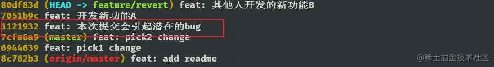

此时想把引起提交的 bug 的干掉，执行 `git revert 1121932`，执行操作后，再打开查看日志，如下图所示，可以看到是新增了一条 commit 记录，这个 commit 的产生的 msg 是自动生成的，Revert 开头，后面跟撤回的 commit-msg 信息 之前的 commit 记录并没有消失，此时也达到了代码回退的效果

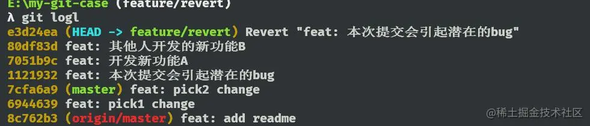

此外 git revert 也可以回滚多次的提交

语法：`git revert [commit-id1] [commit-id2] ...` 注意这是一个前开后闭区间，即不包括 commit1 ，但包括 commit2 。

回滚我们的提交有二种方式，一种是上文提到的`git revert`命令外，还可以使用 `git reset` 命令，那么它们两者有什么区别呢？

`git revert` 会新建一条 commit 信息，来撤回之前的修改。

`git reset` 会直接将提交记录退回到指定的 commit 上。

对于个人的 feature 分支而言，可以使用 `git reset` 来回退历史记录，之后使用 `git push --force` 进行推送到远程，但是如果是在多人协作的集成分支上，不推荐直接使用 `git reset` 命令，而是使用更加安全的 `git revert` 命令进行撤回提交。这样，提交的历史记录不会被抹去，可以安全的进行撤回。

### 使用 git stash 来暂存文件

会有这么一个场景，现在你正在用你的 feature 分支上开发新功能。这时，生产环境上出现了一个 bug 需要紧急修复，但是你这部分代码还没开发完，不想提交，怎么办？这个时候可以用 `git stash` 命令先把工作区已经修改的文件暂存起来，然后切换到 hotfix 分支上进行 bug 的修复，修复完成后，切换回 feature 分支，从堆栈中恢复刚刚保存的内容。

基本命令如下

```Bash
git stash //把本地的改动暂存起来
git stash save "message" 执行存储时，添加备注，方便查找。
git stash pop // 应用最近一次暂存的修改，并删除暂存的记录
git stash apply  // 应用某个存储,但不会把存储从存储列表中删除，默认使用第一个存储,即 stash@{0}，如果要使用其他个，git stash apply stash@{$num} 。
git stash list // 查看 stash 有哪些存储
git stash clear // 删除所有缓存的 stash
复制代码
```

下面通过几幅图对 stash 的命令做进一步了解。

此时，我正在开发一个新功能，修改了 1.js 文件里的内容

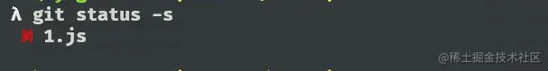

还没开发完成，这个时候，我想切换到 hotfix 分支上修复 bug，得暂停下开发切换到 hotfix 分支，但是现在工作区还有内容，此时如果切换分支 Git 会报出下面的错误

```Shell
error: Your local changes to the following files would be overwritten by checkout:
        1.js
Please commit your changes or stash them before you switch branches.
Aborting
复制代码
```

上面那句话的意思就是说工作区有文件修改，不能提交，需要先进行 commit 或者 stash 操作，执行 `git stash`，结果如下

```Bash
Saved working directory and index state WIP on stash: 22e561c feat: add 1.js
复制代码
```

此时，我们的工作区已经干净了，可以切换到 hotfix 分支进行 bug 修复的工作，假设我们现在 bug 修复完成了，继续切回 feature 分支进行原本功能的开发，此时只需要执行 `git stash pop`，之前我们暂存的修改就会恢复到工作区，如下图所示。

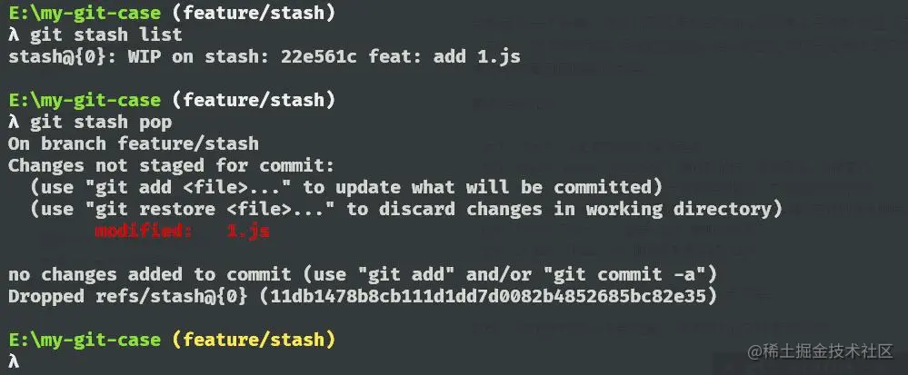

当我们想要暂存文件，切换分支做某些事的时候，可以用 `git stash` 这种机制帮助开发。

推荐在使用 stash 的相关命令时，每一次暂存的时候，不要直接使用 `git stash` 命令进行暂存下来，而是使用 `git stash save "message..."` 这种方式，给本次的提交做一个信息的记录。这样，想应用更改的时候，先通过 `git stash list` 查看一下所有的暂存列表。之后，推荐使用 `git stash apply stash@${num}` 的方式进行应用对应的 stash，这样不会清空已有的 stash 的列表项，并且能应用到当前的工作区，不需要这个暂存的话，再手动清除就可以了。

### 不同的工作区域撤销更改

开发中，我们经常需要回退代码的操作，在不同的工作区域中，回退代码的方式也是不相同的。如下图所示，假设现在要在 feature/revoke 分支上进行开发,

首先通过 `git status` 查看下现在的状态。

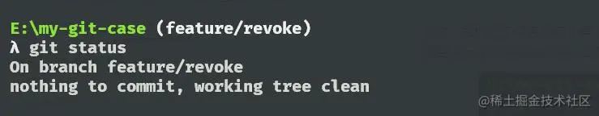

目前我们的工作区是很干净的，没有任何修改的操作，此时，修改一下代码再次查看状态，可以看到，1.js 这个文件被修改了。

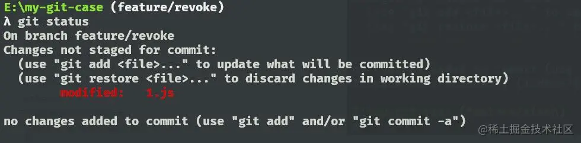

现在我们想把 1.js 这个文件恢复到修改前的状态，即撤回工作区的修改，就可以使用 `git checkout -- <filename>` 的命令，如果要撤回多个文件的修改，文件之间使用空格隔开，如下图所示，我们撤回了 1.js 文件的修改，工作区也恢复干净了。

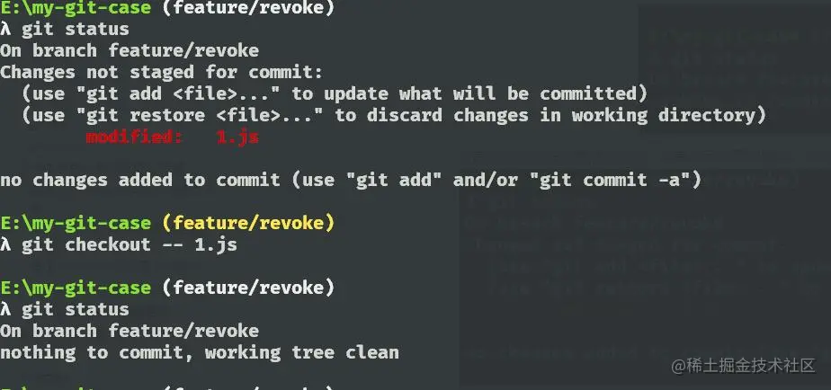

如果说现在我们对文件进行了修改，并且已经提交到暂存区了，这部分文件我们不想要的话，那么就可以通过 `git reset <filename>` 的命令来对特定的文件进行撤销，`git reset` 会撤回所有存在暂存区的文件，如下图所示，查看前后的状态可知，文件最后成功撤回到工作区了。

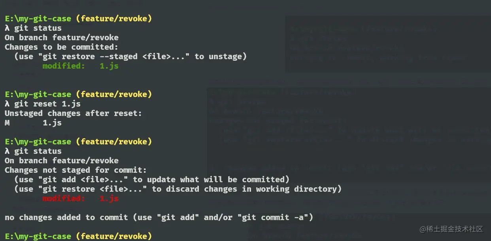

### 配置 git alias 提升工作效率

一般我们在工作中，接到开发任务后，需要新创建一个分支进行开发 此时需要 用到 `git branch`、`git checkout`、 `git pull` 等命令，在我们一顿操作后，开发完成，到了提交代码的阶段，又要诸如此类 `git add` 、`git commit`、`git push` 等命令，虽然简单，但是输入起来也是不够简洁，作为一个程序员，开发程序就是为了提高我们的效率的，懒是人类进步的源泉，所以我们可以通过配置别名的方式，简化这些命令。

它的基本用法是 `git config --global alias.<简化的字符> 原始命令`

如下面的例子：

```Bash
$ git config --global alias.co checkout
$ git config --global alias.ci commit
$ git config --global alias.br branch
复制代码
```

这里将 co 表示 checkout，ci 表示 commit，br 表示 branch，以后提交就可以简写成

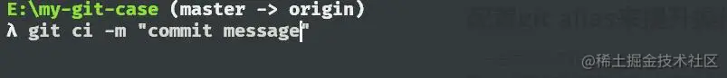

`--global` 是全局参数，也就是配置一次后，这些命令可以在这台电脑下的所有仓库都适用。这些命令其实是更新你全局的 .gitconfig 文件，该文件用来保存全局的 git 配置，`vim ~/.gitconfig`，执行这段命令后，显示如下，下图展示了刚才通过 `git config --global alias` 添加的 `alias`。

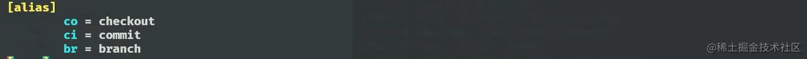

除了上面那种直接通过命令的方式外，也可以通过修改这个文件的 `alias` 项来设置别名。

这里分享一个我自己常用的别名设置，把以下配置替换到 .gitconfig 文件里的 `[alias]` 所属的区域，然后就可以愉快的使用了~

```Bash
[alias]
st = status -sb
co = checkout
br = branch
mg = merge
ci = commit
ds = diff --staged
dt = difftool
mt = mergetool
last = log -1 HEAD
latest = for-each-ref --sort=-committerdate --format=\"%(committername)@%(refname:short) [%(committerdate:short)] %(contents)\"
ls = log --pretty=format:\"%C(yellow)%h %C(blue)%ad %C(red)%d %C(reset)%s %C(green)[%cn]\" --decorate --date=short
hist = log --pretty=format:\"%C(yellow)%h %C(red)%d %C(reset)%s %C(green)[%an] %C(blue)%ad\" --topo-order --graph --date=short
type = cat-file -t
dump = cat-file -p
lg = log --color --graph --pretty=format:'%Cred%h%Creset -%C(yellow)%d%Creset %s %Cgreen(%cr) %C(bold blue)<%an>%Creset' --abbrev-commit
复制代码
```

这样，我们每次想查看 Git 的历史记录,就不用输入那么一长串命令 直接使用 `git lg` ，下图是 axios 源码里的提交记录，使用封装后的 `git lg` 查看的效果图

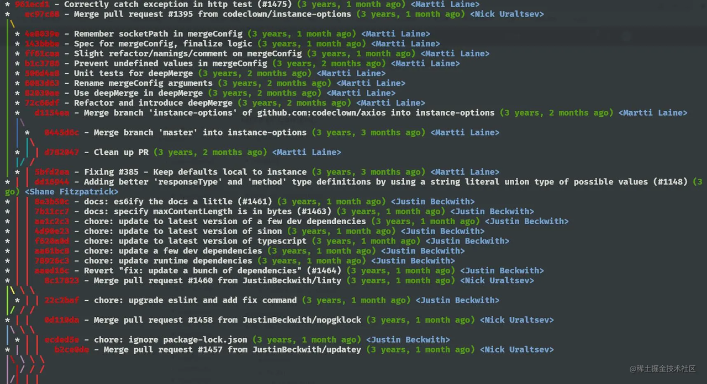

分支之间的关系一眼就很明了，在哪个 commit 上进行的 merge 操作也很清晰，可以帮助我们很好的追溯历史的提交和解决问题。
