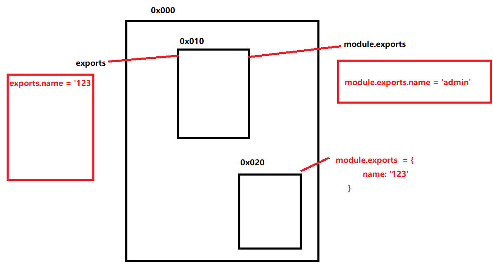
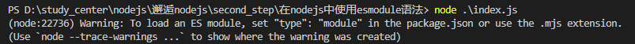
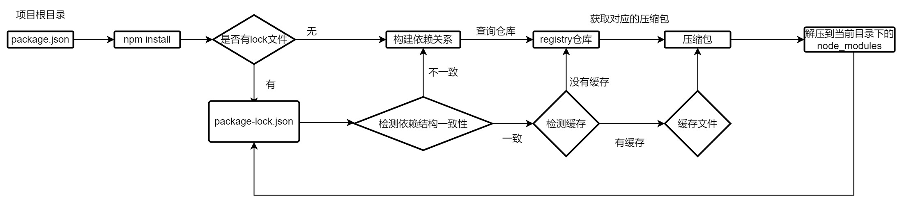
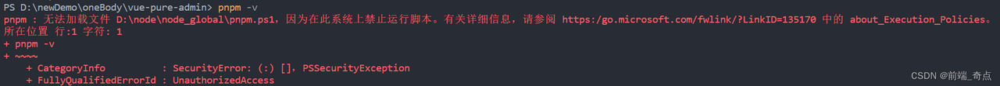

# 模块化

## 认识模块化

> 将目标程序划分成一个个小的结构，每个结构有自己的作用域，处理自己的逻辑；同时可以将自己内部的变量，方法导出，同时也可以导入其他模块暴露的变量和方法。

## CommonJS 规范

- 导出： **exports, module.exports**

> exports 和 module.exports 本质是指向同一个对象的；

```JavaScript
// exports导出方式
exports.[属性名] = [具体内容];

// module.exports 导出方式: 第一种
module.exports.[属性名] = [具体内容];

// module.exports 的另一种导出方式(*这也是常用方式*)
module.exports = {
    [属性名]: [具体内容]
}
```

注意： 当使用 module.exports 的第二种导出方式时，此时 module.exports 的指向和 exports 指向将不一致；



- 导入: **require**

```JavaScript
// 导出模块\, 根据导入的参数进行区别
const {[属性名][,[属性名]...]} = require("./util"); // 导入指定文件
const path = require("path"); // 导入内置模块
const axios = require("axios"); // 导入第三方依赖
```

- **关于导入指定文件的寻找方式：**

- - 先判断是否有后缀：
    - 有后缀就直接去查指定的文件
    - 没有后缀， 以 `const util = require("./util"); ` 为例；
      - 先进行查找： uitls.js --> utils.json --> utils.node；
      - 如果上一步没有找到就查找：utils/index 文件，查找顺序和上面一步是一样的。
  - 如果最后没有找到就报错： not found moudle

**关于导入 npm 内置模块，这个是直接在 npm Registry 中去查找**

**关于导入第三方依赖包，从当前目录下中的 node_modules 目录中查找对应的文件，直到查找到根目录下都没有找到，就报错；**

- 加载导入的内容

> 1. 模块在被第一次引入时，模块中的 js 代码会被运行一次
> 2. 模块被多次引入时，会缓存第一次执行的结果，在后序的引入中，就不会被再次运行
> 3. 如果有循环引入，node 采用的是深度优先算法，一次执行引入的文件 2,

## AMD

> 继 CommonJS 中使用 require 时，在模块中是先加载 require 过来的内容，然后再执行模块中的其他代码，这样造成的后果就是，在浏览器页面初始渲染的时候，如果入口文件所导入的文件过多，或者过大将造成页面渲染的延迟，降低性能，使用 AMD 可以对依赖的文件进行异步加载实现一定的性能优化；

> AMD 规范，全称是 Asynchronous Module Definition，即异步模块加载机制。完整描述了模块的定义，依赖关系，引用关系以及加载机制。
>
> AMD 的核心是预加载，先对依赖的全部文件进行加载，加载完了再进行处理。
>
> 实际上 AMD 是 RequireJS 在推广过程中对模块定义的规范化的产出
>
> 优点：
>
> 适合在浏览器环境中异步加载模块。可以并行加载多个模块。 并可以按需加载。
>
> RequireJS 主要解决了两个问题：
>
> 多个 js 文件可能有依赖关系，被依赖的文件需要早于依赖它的文件加载到浏览器
>
> js 加载的时候浏览器会停止页面渲染，加载文件越多，页面失去响应时间越长
>
> requireJS 的使用：https://www.jianshu.com/p/c90fff39c225

```JavaScript
// index.html
<!-- 引入require.js, 其中使用data-main可以在前面src中的文件加载完毕之后，在之后后面data-main中的文件 -->
<script src="./libs/require.js" data-main="./index.js"></script>

// foo.js， 定义对应的依赖
define(function() {
    const name = "amd";
    const age = 19;

    const sayHello = function() {
        console.log('hello');
    }

    // 这里需要进行导出
    return {
        name,
        age,
        sayHello
    }
})

// todo.js 引用对应的foo.js中的内容
define(['foo'], function(foo) {
    console.log(foo.name);
    console.log(foo.age);
    foo.sayHello();
})

// index.js导入文件
require.config({
    paths: {
        'foo': './modules/foo', // 这里不需要写文件的后缀名
        'todo': './modules/todo'
    }
})

require(['todo'], function(todo) {})
```

## CMD

> CMD 规范：全称是 Common Module Definition，即通用模块定义。按需加载。在 CMD 规范中，一个模块就是一个文件，使用 define 来进行模块，define 是一个全局函数。
>
> AMD 和 CMD 最大的区别是对依赖模块的执行时机处理不同，而不是加载的时机或者方式不同，二者皆为异步加载模块。
>
> 异步加载：不阻碍后 面代码加载执行
>
> AMD 依赖前置，js 可以方便知道依赖模块是谁，立即加载；而 CMD 就近依赖，需要使用把模块变为字符串解析一遍才知道依赖了哪些模块，这也是很多人诟病 CMD 的一点，牺牲性能来带来开发的便利性，实际上解析模块用的时间短到可以忽略。
>
> SeaJs 使用：https://www.jianshu.com/p/ebdf2233e3fe

```JavaScript
// foo.js
define(function(require, exports, module) {

  const name = 'hello world';

  const age = 12;

  module.exports = {
    name,
    age
  }
})

// index.js
define(function(require, exports, module) {
  const foo = require('./modules/foo.js');
  console.log(foo);
});

// index.html
  <script src="../../libs/sea.js"></script>
  <script>
    seajs.use('./index.js');
  </script>
```

## ES Module

> 是 ECMA 自己推出的一款模块化规范，采用**import**(导入), **export**(导出)，支持动态导入;默认会将采用 esmodule 规范的模块置为严格模式： `use strict`

注意: 在基本浏览器中打开 html，是无法解析 type=module 的 js 文件，因为加载这些模块文件时需要在特定的网络协议下获取这些文件，其中包括 http.https 等，但是不包括 file；然而我们直接打开浏览器展示我们的 html 文件是从我们本地进行获取这个文件，此时用的是 file 协议，所以我们一般要使用 esmodule 时，可以使用 live server 打开我们的 html,此时就可以正常加载对应的模块文件

```JavaScript
// 导出 foo.js
export {
 [标识符],
 ...
}
// 导入 index.js
import {[标识符]} from 'foo.js'

// 高级写法 middle.js,
export { [标识符] } from 'foo.js'
// 等同于
import {[标识符]} from 'foo.js'
export {[标识符]}
```

- Export

> 导出当前模块中的变量，方法等；

```JavaScript
// 关于默认导出
// 一个模块中只有一个默认导出; export 和 export default可以在一个模块中同时使用
// export defaul语法 foo.js
const userAge = 18
export default userAge
// 此时的导入 index.js
import userAge from 'foo.js'


// 在指定导出位置直接导出
export const userAge = 17

// 导出取别名
export {
    age as userAge,
    userName
}
```

- Import

> 导入其他模块中的内容

```JavaScript
// 导入取别名
import {name as userName} from 'foo.js'

// 导入全部
import * as foo from 'foo.js'
```

**import()函数**

```JavaScript
// 在一些情况下，我们可能需要在js代码逻辑中动态导出一些外部模块
// 使用方法, 返回一个Promise对象
if(true) {
    import('./foo.js').then(res => {
        console.log(res);
    })
} else {
    import('./todo.js').then(res => {})
}
```

**import.meta 属性**

```JavaScript
// 是es11(ES2020) 中新增的特性
// 包含当前模块的信息，比如这个模块的url
```

**在 nodejs 环境下使用 esmodule 语法**

- 第一种方法: 在 package.json 中添加`type:'module'`
- 第二种是使用`.mjs` 作为 js 文件的后缀名



## 包管理工具

**package.json**

```JSON
{
    "name": "project name", // 项目名称 (必填)
    "version": "1.0.0", // 项目版本 (必填)
    "main": "main.js", // 入口文件 (默认是index.js)
    "scripts": {
        [对应执行脚本的键值对]
    },
    "dependencies": {
        [项目的生产环境下需要的依赖]
    },
    "devDependencies": {
        [开发依赖]
    },
    "peerDependencies": {
        [对等依赖： 像element-plus 就依赖vue3 作为前提]
    }
}
```

- 版本： version

  - > 在 package.json 中，会看到对应依赖后面的版本号：`^1.0.1` or `~1.1.0` or `1.0.0`

  - 版本号遵循 **semver** 规范: x.y.z

  - > X : 主版本号， 做了一些不兼容的修改（可能不兼容之前的版本）
    >
    > Y: 次版本号，做了向下兼容，的功能性新增(新功能增加，同时兼容之前的版本)
    >
    > Z: 修订号，做了向下兼容的问题修正(没有新功能，修复了之前版本的 bug)

  - **^x.y.z**: y 和 z 保持最新，x 不变；

  - **~x.y.z**: z 保持最细，x 和 y 不变；

  - **npm install** 执行流程：



- **npx**

> 主要就是在自己本地有全局和局部的工具时，例如：webpack,如果在全局下有(存在电脑环境变量中，可以直接在终端输入指令使用，)，并且在局部环境下也有；当我们在局部环境下，使用 webpack 指令时，会调用全局或者局部的 webpack,在以前的版本中，会优先调用全局的，所以当时就用`npx` 来调用当前局部的 webpack。

## **包管理工具-pnpm**

> 在之前的 npm,yarn 等包管理工具中，都存在多个项目同时存在于一台主机上时，不同的项目都拥有一个体积庞大的 node_modules 包，但是这些项目的文件占用大量的空间，同时我们使用这些包管理工具，在下载安装依赖时，速度也是比较慢；

> 特性：
>
> ### 快速
>
> pnpm 比其他包管理器快 2 倍
>
> ### 高效
>
> node_modules 中的文件为复制或链接自特定的内容寻址存储库
>
> ### 支持 monorepos
>
> pnpm 内置支持单仓多包
>
> ### 严格
>
> pnpm 默认创建了一个非平铺的 node_modules，因此代码无法访问任意包

- 硬链接

> 多个文件平等共享同一个磁盘空间，删除其中一个文件后，另外的文件还是可以访问到对应的磁盘；

- 软连接/符号连接

> 快捷方式，保存的是路径，执行其他文件或者目录引用，比如像桌面的软件图标；

```Shell
# 创建硬链接
# window： mklink /H [创建硬链接的文件] [源文件]
# mac: ln [源文件] [创建硬链接的文件]
# 创建软连接
# window： mklink [创建硬链接的文件] [源文件]
# mac: ln -s [源文件] [创建硬链接的文件]
```

### pnpm 原理

> 将下载的依赖包放到电脑的一个统一位置，每个项目中要使用对应的依赖，就建立一条硬链接进行使用，然后对于不同版本的依赖，pnpm 将保存这些依赖的不同文件，而不是将两个不同版本分别保存一份；

#### pnpm 安装后，执行命令报错

> 参考文献：https://blog.csdn.net/weixin_60409964/article/details/129525662



- 通过管理员打开 powershell
- 运行 set-ExecutionPolicy RemoteSigned 指令，并且输入 Y ，即可
