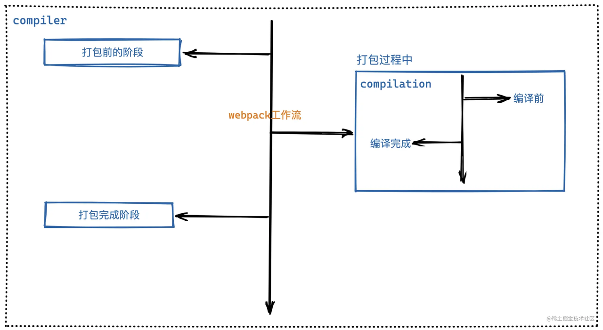
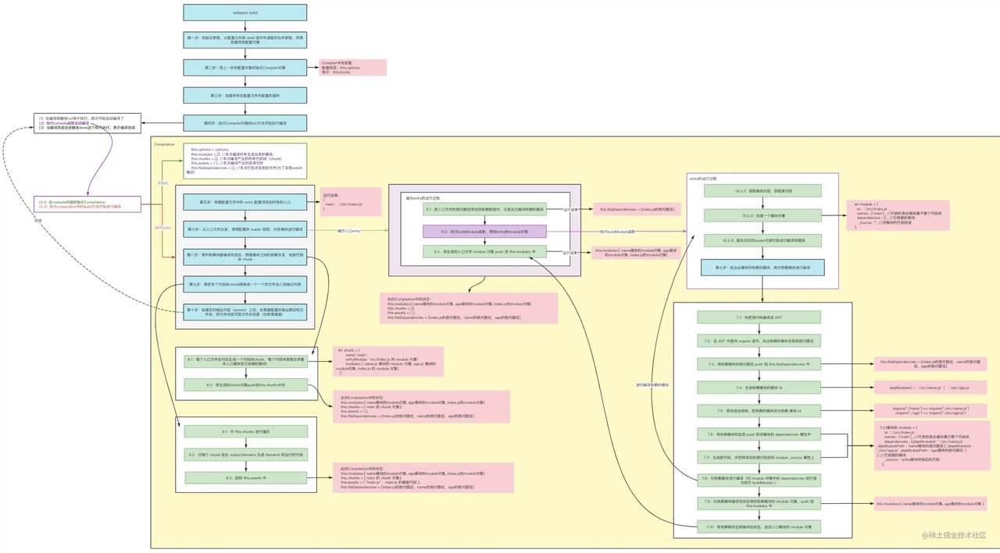

# webpack 工作流程

> webpack 的核心任务就是：内容转化(实现一些新特性能够兼容大部分浏览器等) 和 资源合并；

## 1. 工作流程

### 1.1 初始化阶段

- **初始化参数： 从配置文件、配置对象、shell 参数(执行的命令行参数) 中读取参数并与默认参数进行合并，组合成最终的参数；**
- **创建编译对象：使用初始化的参数创建 Compiler 对象；**
- **初始化编译环境：包括注入内置插件、注册各种模块工厂，初始化 RuleSet 集合、加载配置的插件等；**

### 1.2 构建阶段

- **开始编译：执行 Compiler 对象的 run 方法，创建 Compilation 对象；**
- **确认编译入口：进入 entryOption 阶段，读取配置的 Entries，递归遍历所有的入口文件，调用 Compilation.addEntry 将入口文件转换成 Dependency 对象；**
- **编译模块(make)：调用 normalMoudle 中的 build 开启构建，从 entry 文件开始，调用 loader 对模块进行转译处理，然后调用 JS 解释器(\*\***[acorn](https://www.npmjs.com/package/acorn)\***\*)将内容转换成 AST 对象，然后递归分析依赖，依次处理全部文件；**
- **完成模块编译：在上一步处理好所有模块后，得到模块编译产物和依赖关系图；**

### 1.3 生成阶段

- **输出资源(seal)：根据入口和模块之间的依赖关系，组装成多个包含多个模块的 Chunk，再把每个 Chunk 转换成 Asset 加入到输出列表，这步是可以修改输出内容的最后机会；**
- **写入文件系统(emitAssets)：确定好输出内容后，根据配置的 output 将内容写入文件系统。**

在以上过程中，webpack 会在特定的时间点广播出特定的事件，插件在监听到感兴趣的事件后会执行特定的逻辑，并且插件可以调用 webpack 提供的 API 改变 webpack 的运行结果

- webpack.configeration:

> 通常你的项目还需要继续扩展此能力，为此你可以在项目根目录下创建一个 `webpack.config.js` 文件，然后 webpack 会自动使用它。
>
> 如果出于某些原因，需要根据特定情况使用不同的配置文件，则可以通过在命令行中使用 `--config` 标志修改。

```JSON
"scripts": {"build": "webpack --config prod.config.js"}
```

- Loader
  - Css-loader: 解析引入的 css 文件
  - Style-loader: 将 css 解析出来的文件放入 html 文档中
  - Postcss-loader: 自动添加浏览器前缀，实现浏览器兼容
  - Babel-loader: 实现 js 转换，es6+ => es5，同时可以实现在打包 js 时，实现缓存
  - thread-loader：实现多进程打包，一般用于大型项目开发
- Plugin
  - Html-webpack-plugin: 能够自动将其他文件放到 html 文件中
  - Dotenv-webpack: 配置环境变量
  - splitsChunksPlugin: 将公共依赖的模块提取到已有的入口 chunk 中，或者提取到一个新生成的 chunk。
  - `mini-css-extract-plugin`: 用于将 CSS 从主应用程序中分离
  - webpack-bundle-analyzer： 查看文件打包结果，方便我们在进行项目优化时，进行问题诊断
  - optimize-css-assets-webpack-plugin ： 压缩 css

什么是 webpack: webpack 是一个静态模块化打包工具，默认只支持 javascript 和 json 格式的语法，对于其他类型的文件，需要使用对应的 loader 进行解析；webpack 会将所有的资源都视为一个个模块，分析模块间的依赖关系，构建依赖图，最终编译输出 html,js.css 以及各种静态文件(图片，文字等),提高开发效率。

webpack 的主要作用：

- 模块打包

将不同的模块打包在一起，并保证他们之间的依赖关系。利用打包我们可以项目开发工程中，根据业务自由划分文件模块，让项目结构更加清晰。

- 编译兼容

webpack 通过 loader 机制，不仅让项目代码实现了 polyfill(兼容性处理，例如： postcss-loader 有自动添加前缀的功能，可以实现兼容性处理)，还实现了像.less， .vue， .jsx 这类浏览器不能直接识别文件的解析；

- 能力扩展

webpack 提供了 plugins 机制，在实现上述的打包编译功能后，webpack 还提供了在此基础上进行功能扩展的处理，例如通过 optimize-css-assets-webpack-plugin 实现 css 代码的压缩， 等；

**关于 webpack 的一个大致过程**

```JavaScript
/**
 * 1. 根据配置文件参数和shell命令中的参数，初始化整体参数列表
 * 2. 用配置参数初始化compiler对象
 * 3. 挂载配置文件中的插件
 * 4. 执行compiler对象中的run方法，开始编译
 * 5. 根据配置文件中的entry配置项找到所有的入口
 * 6. 从入口文件出发，根据配置的loader逐次编译模块以及依赖的其他模块
 * 7. 完成编译之后，根据每个模块的依赖关系，组装代码块chunk
 * 8. 把代码块chunk转换成一个一个文件加入到输出列表
 * 9. 确定输出内容之后，根据配置的output等配置项，将文件内容写入到文件系统中
 */
```

## 2. 架构设计

**webpack 的打包过程大致可以分为三个阶段**

> 1. 打包前的准备工作
> 2. 打包过程中，也就是编译阶段，此过程还有一个监听文件变化的过程，也就是在文件内容方法变化的时候，会重新进行编译
> 3. 打包结束（包含打包成功和失败）

在 **Webpack** 源码中，`compiler` 就像是一个大管家，它就代表上面说的三个阶段，在它上面挂载着各种生命周期函数，而 `compilation` 就像专管伙食的厨师，专门负责编译相关的工作，也就是`打包过程中`这个阶段。画个图帮助大家理解：



大致架构定下后，那现在应该如何实现这套事件流呢？

这时候就需要借助 [Tapable](https://link.juejin.cn/?target=https%3A%2F%2Fwww.npmjs.com%2Fpackage%2Ftapable) 了！它是一个类似于 Node.js 中的 [EventEmitter](https://link.juejin.cn/?target=https%3A%2F%2Fwww.npmjs.com%2Fpackage%2Fevents) 的库，但**更专注于自定义事件的触发和处理**。通过 Tapable 我们可以注册自定义事件，然后在适当的时机去执行自定义事件。

类比到 `Vue` 和 `React` 框架中的生命周期函数，它们就是到了固定的时间节点就执行对应的生命周期，`tapable` 做的事情就和这个差不多，我们可以通过它先注册一系列的生命周期函数，然后在合适的时间点执行。

example 🌰：

```JavaScript
const { SyncHook } = require("tapable"); //这是一个同步钩子
//第一步：实例化钩子函数，可以在这里定义形参
const syncHook = new SyncHook(["author", "age"]);
 //第二步：注册事件1
syncHook.tap("监听器1", (name, age) => {   console.log("监听器1:", name, age); });
  //第二步：注册事件2
syncHook.tap("监听器2", (name) => {   console.log("监听器2", name); });
  //第三步：注册事件3
syncHook.tap("监听器3", (name) => {   console.log("监听器3", name); });
  //第三步：触发事件，这里传的是实参，会被每一个注册函数接收到
syncHook.call("不要秃头啊", "99");
```

运行结果：

```JavaScript
监听器1 不要秃头啊 99
监听器2 不要秃头啊
监听器3 不要秃头啊
```

在 Webpack 中，就是通过 `tapable` 在 `comiler` 和 `compilation` 上像这样挂载着一系列`生命周期 Hook`，它就像是一座桥梁，贯穿着整个构建过程：

```JavaScript
class Compiler {
     constructor() {
         //它内部提供了很多钩子
         this.hooks = {
             run: new SyncHook(), //会在编译刚开始的时候触发此钩子
             done: new SyncHook(), //会在编译结束的时候触发此钩子
         };
     }
 }
```

## 3. 具体实现

大致过程：

1. 从配置文件中以及 shell 命令中获取参数，并进行整合；（在下面的实现过程中，只是从配置文件中获取的参数）
2. 根据上面的参数信息，初始化一个 compiler 对象；
3. 挂载配置文件中的插件；
4. 执行 compiler 对象上的 run 方法，开始执行编译；
5. 根据配置文件中的 entry 配置项找到所有的入口；
6. 从入口文件出发，调用配置的 loader 规则，对各个模块进行编译；
7. 找出此模块所依赖的模块，再对依赖模块进行编译；
8. 等所有模块都编译完成之后，根据模块之间的依赖关系，组装代码块 chunk；
9. 把各个代码块 chunk 转换成一个一个文件加入到输出列表中；
10. 确定好输出内容之后，根据配置的输出路径和文件名，将文件内容写入到文件系统中；

### 3.1 搭建结构，读取配置参数

根据 Webpack 的用法可以看出，webpack 本质上是一个函数，它接受一个配置信息作为参数，执行后返回一个 compiler 对象，调用 compiler 对象上的 run 方法就会启动编译，run 方法接收一个回调函数，可以用来查看编译过程中的错误信息或编译信息。

```JavaScript
// 模拟执行webpack打包命令时的执行情况

const webpack = require("./webpack"); //手写webpack
const webpackOptions = require("./webpack.config.js"); //这里一般会放配置信息
const compiler = webpack(webpackOptions); // webpack实则是一个函数，接收配置参数，返回一个compiler对象

// 执行run方法，接收一个回调函数，可以查看到编译过程中的错误信息和编译信息；
compiler.run((err, stats) => {
  console.log(err);
  console.log(
    stats.toJson({
      assets: true, //打印本次编译产出的资源
      chunks: true, //打印本次编译产出的代码块
      modules: true, //打印本次编译产出的模块
    })
  );
});
```

**搭建 webpack 函数**

```JavaScript
// 一个Compiler类
class Compiler {
  constructor() {}
  // 实例上的run方法
  run(callback) {}
}

//第一步：搭建结构，读取配置参数，这里接收的是webpack.config.js中的参数
function webpack(webpackOptions) {
  const compiler = new Compiler()；// 创建并返回一个compiler实例
  return compiler;
}
```

运行流程图：


### 3.2 根据参数初始化 compiler 对象

上面提到过，`Compiler` 它就是整个打包过程的大管家，它里面放着各种你可能需要的`编译信息`和`生命周期 Hook`，而且是单例模式。(在当前的运行的线程中，一个类对应的实例只有一个，即为单例模式)

```JavaScript
const { SyncHook } = require('tapable'); // 引入同步钩子

//Compiler其实是一个类，它是整个编译过程的大管家，而且是单例模式
class Compiler {
+ constructor(webpackOptions) {
+   this.options = webpackOptions; //存储配置信息
+   //它内部提供了很多钩子
+   this.hooks = {
+     run: new SyncHook(), //会在编译刚开始的时候触发此run钩子
+     done: new SyncHook(), //会在编译结束的时候触发此done钩子
+   };
+ }
}

//第一步：搭建结构，读取配置参数，这里接受的是webpack.config.js中的参数
function webpack(webpackOptions) {
  //第二步：用配置参数对象初始化 `Compiler` 对象
const compiler = new Compiler(webpackOptions)
  return compiler;
}
```

### 3.3 挂载配置文件中的插件

先写两个自定义插件配置到 **webpack.config.js** 中：一个在开始打包的时候执行，一个在打包完成后执行。

`Webpack Plugin 其实就是一个普通的函数，在该函数中需要我们定制一个 apply 方法。`（这里的 apply 方法只是名字一样，和 function.apply 没有关系）当 Webpack 内部进行插件挂载时会执行 `apply` 函数。我们可以在 `apply` 方法中订阅各种生命周期钩子，当到达对应的时间点时就会执行。

```JavaScript
// 查看实则就是一个构造函数

// 定义一个接口
class PublicMethod {
    apply() {}
}

//自定义插件WebpackRunPlugin
class WebpackRunPlugin extends PublicMethod {
  apply(compiler) {
    compiler.hooks.run.tap("WebpackRunPlugin", () => {
      console.log("开始编译");
    });
  }
}

//自定义插件WebpackDonePlugin
class WebpackDonePlugin extends PublicMethod {
  apply(compiler) {
    compiler.hooks.done.tap("WebpackDonePlugin", () => {
      console.log("结束编译");
    });
  }
}
```

定义插件的时候，必须要有一个公共的方法，也就是每一个插件都必须要有一个相同的方法名，以此实现加载插件，加载插件实则就是在执行这个方法；（使用一个基(父)类来实现这个）

```JavaScript
//第一步：搭建结构，读取配置参数，这里接受的是webpack.config.js中的参数
function webpack(webpackOptions) {
  //第二步：用配置参数对象初始化 `Compiler` 对象
  const compiler = new Compiler(webpackOptions);
  //第三步：挂载配置文件中的插件
+ const { plugins } = webpackOptions;
+ for (let plugin of plugins) {
+   plugin.apply(compiler);
+ }
  return compiler;
}
```

### 3.4 执行`Compiler`对象的`run`方法开始执行编译

在正式开始编译前，我们需要先调用 compiler 中的 run 钩子(hook.run)，表示开始执行编译，在编译结束只有，调用 done 钩子，表示编译完成；

```JavaScript
//Compiler其实是一个类，它是整个编译过程的大管家，而且是单例模式
class Compiler {
  constructor(webpackOptions) {
   //省略
  }

  // 编译
+ compile(callback){
+  //
+ }

+ //第四步：执行`Compiler`对象的`run`方法开始执行编译
+ run(callback) {
+   this.hooks.run.call(); //在编译前触发run钩子执行，表示开始启动编译了
+   const onCompiled = () => {
+     this.hooks.done.call(); //当编译成功后会触发done这个钩子执行
+   };
+   this.compile(onCompiled); //开始编译，成功之后调用onCompiled
  }
}
```

上面架构设计中提到过，编译这个阶段需要单独解耦出来，通过 `Compilation` 来完成，定义`Compilation` 大致结构：

```JavaScript
class Compiler {
  //省略其他
  run(callback) {
    //省略
  }

  compile(callback) {
    //虽然webpack只有一个Compiler，但是每次编译都会产出一个新的Compilation，
    //这里主要是为了考虑到watch模式，它会在启动时先编译一次，然后监听文件变化，如果发生变化会重新开始编译
    //每次编译都会产出一个新的Compilation，代表每次的编译结果
+   let compilation = new Compilation(this.options);
+   compilation.build(callback); //执行compilation的build方法进行编译，编译成功之后执行回调
  }
}

+ class Compilation {
+   constructor(webpackOptions) {
+     this.options = webpackOptions;
+     this.modules = []; //本次编译所有生成出来的模块
+     this.chunks = []; //本次编译产出的所有代码块，入口模块和依赖的模块打包在一起为代码块
+     this.assets = {}; //本次编译产出的资源文件
+     this.fileDependencies = []; //本次打包涉及到的文件，这里主要是为了实现watch模式下监听文件的变化，文件发生变化后会重新编译
+   }

+   build(callback) {
+    //这里开始做编译工作，编译成功执行callback
+    callback()
+   }
+ }
```

以上就是打包前的准备工作；

### 3.5 根据配置文件中的`entry`配置项找到所有的入口

接下来就正式开始编译了，逻辑均在 `Compilation` 中。

在编译前我们首先需要知道入口文件，而 [入口的配置方式](https://link.juejin.cn/?target=https%3A%2F%2Fwebpack.js.org%2Fconfiguration%2Fentry-context%2F%23entry) 有多种，可以配置成字符串，也可以配置成一个对象，这一步骤就是为了统一配置信息的格式，然后找出所有的入口（考虑多入口打包的场景）。

```JavaScript
class Compilation {
  constructor(webpackOptions) {
    this.options = webpackOptions;
    this.modules = []; //本次编译所有生成出来的模块
    this.chunks = []; //本次编译产出的所有代码块，入口模块和依赖的模块打包在一起为代码块
    this.assets = {}; //本次编译产出的资源文件
    this.fileDependencies = []; //本次打包涉及到的文件，这里主要是为了实现watch模式下监听文件的变化，文件发生变化后会重新编译
  }

  build(callback) {
    //第五步：根据配置文件中的`entry`配置项找到所有的入口
+   let entry = {};
+   if (typeof this.options.entry === "string") {
+     entry.main = this.options.entry; //如果是单入口，将entry:"xx"变成{main:"xx"}，这里需要做兼容
+   } else {
+     entry = this.options.entry; // 可以通过Object.prototype.toString.call(thisArg) === '[object Object]' 来判断是否为一个对象
+   }

    //编译成功执行callback
    callback()
  }
}
```

### 3.6 从入口文件出发，调用配置的`loader`规则，对各模块进行编译

Loader 本质上就是一个函数，接收资源文件或者上一个 Loader 产生的结果作为入参，最终输出转换后的结果。

写两个自定义 Loader 配置到 **webpack.config.js** 中：

```JavaScript
const loader1 = (source) => {
  return source + "//给你的代码加点注释：loader1";
};

const loader2 = (source) => {
  return source + "//给你的代码加点注释：loader2";
};

// 最终会在源代码尾部添加两条注释
```

这一步骤将从入口文件出发，然后查找出对应的 Loader 对源代码进行翻译和替换。

主要有三个要点：

- （6.1）把入口文件的绝对路径添加到依赖数组（`this.fileDependencies`）中，记录此次编译依赖的模块
- （6.2）得到入口模块的的 `module` 对象 （里面放着该模块的路径、依赖模块、源代码等）
  - （6.2.1）读取模块内容，获取源代码
  - （6.2.2）创建模块对象
  - （6.2.3）找到对应的 `Loader` 对源代码进行翻译和替换
- （6.3）将生成的入口文件 `module` 对象 push 进 `this.modules` 中

  6.1 把入口文件的绝对路径添加到依赖数组中，记录此次编译依赖的模块

这里因为要获取入口文件的绝对路径，考虑到操作系统的兼容性问题，需要将路径的 \ 都替换成 / :

```JavaScript
//将\替换成/
function toUnixPath(filePath) {
  return filePath.replace(/\\/g, "/");
}

const baseDir = toUnixPath(process.cwd()); //获取工作目录，在哪里执行命令就获取哪里的目录，这里获取的也是跟操作系统有关系，要替换成/

class Compilation {
  constructor(webpackOptions) {
    this.options = webpackOptions;
    this.modules = []; //本次编译所有生成出来的模块
    this.chunks = []; //本次编译产出的所有代码块，入口模块和依赖的模块打包在一起为代码块
    this.assets = {}; //本次编译产出的资源文件
    this.fileDependencies = []; //本次打包涉及到的文件，这里主要是为了实现watch模式下监听文件的变化，文件发生变化后会重新编译
  }

  build(callback) {
    //第五步：根据配置文件中的`entry`配置项找到所有的入口
    let entry = {};
    if (typeof this.options.entry === "string") {
      entry.main = this.options.entry; //如果是单入口，将entry:"xx"变成{main:"xx"}，这里需要做兼容
    } else {
      entry = this.options.entry;
    }
+   //第六步：从入口文件出发，调用配置的 `loader` 规则，对各模块进行编译
+   for (let entryName in entry) {
+     //entryName="main" entryName就是entry的属性名，也将会成为代码块的名称
+     let entryFilePath = path.posix.join(baseDir, entry[entryName]); //path.posix为了解决不同操作系统的路径分隔符,这里拿到的就是入口文件的绝对路径
+     //6.1 把入口文件的绝对路径添加到依赖数组（`this.fileDependencies`）中，记录此次编译依赖的模块
+     this.fileDependencies.push(entryFilePath);
+   }

    //编译成功执行callback
    callback()
  }
}
```

6.2 读取模块内容，获取源代码

```JavaScript
class Compilation {
  constructor(webpackOptions) {
    this.options = webpackOptions;
    this.modules = []; //本次编译所有生成出来的模块
    this.chunks = []; //本次编译产出的所有代码块，入口模块和依赖的模块打包在一起为代码块
    this.assets = {}; //本次编译产出的资源文件
    this.fileDependencies = []; //本次打包涉及到的文件，这里主要是为了实现watch模式下监听文件的变化，文件发生变化后会重新编译
  }

+ //当编译模块的时候，name：这个模块是属于哪个代码块chunk的，modulePath：模块绝对路径
+ buildModule(name, modulePath) {
+   //6.2.1 读取模块内容，获取源代码
+   let sourceCode = fs.readFileSync(modulePath, "utf8");
+
+   return {};
+ }

  build(callback) {
    //第五步：根据配置文件中的`entry`配置项找到所有的入口
    //代码省略...
    //第六步：从入口文件出发，调用配置的 `loader` 规则，对各模块进行编译
    for (let entryName in entry) {
      //entryName="main" entryName就是entry的属性名，也将会成为代码块的名称
      let entryFilePath = path.posix.join(baseDir, entry[entryName]); //path.posix为了解决不同操作系统的路径分隔符,这里拿到的就是入口文件的绝对路径
      //6.1 把入口文件的绝对路径添加到依赖数组（`this.fileDependencies`）中，记录此次编译依赖的模块
      this.fileDependencies.push(entryFilePath);
      //6.2 得到入口模块的的 `module` 对象 （里面放着该模块的路径、依赖模块、源代码等）
+     let entryModule = this.buildModule(entryName, entryFilePath);
    }

    //编译成功执行callback
    callback()
  }
}
```

6.2.2 创建模块对象

```JavaScript
class Compilation {
  //省略其他

  //当编译模块的时候，name：这个模块是属于哪个代码块chunk的，modulePath：模块绝对路径
  buildModule(name, modulePath) {
    //6.2.1 读取模块内容，获取源代码
    let sourceCode = fs.readFileSync(modulePath, "utf8");
    //buildModule最终会返回一个modules模块对象，每个模块都会有一个id,id是相对于根目录的相对路径
+   let moduleId = "./" + path.posix.relative(baseDir, modulePath); //模块id:从根目录出发，找到与该模块的相对路径（./src/index.js）
+   //6.2.2 创建模块对象
+   let module = {
+     id: moduleId,
+     names: [name], //names设计成数组是因为代表的是此模块属于哪个代码块，可能属于多个代码块
+     dependencies: [], //它依赖的模块
+     _source: "", //该模块的代码信息
+   };
+   return module;
  }

  build(callback) {
    //省略
  }
}
```

6.2.3 找到对应的 loader 对源代码进行翻译和替换

```JavaScript
class Compilation {
  //省略其他

  //当编译模块的时候，name：这个模块是属于哪个代码块chunk的，modulePath：模块绝对路径
  buildModule(name, modulePath) {
    //6.2.1 读取模块内容，获取源代码
    let sourceCode = fs.readFileSync(modulePath, "utf8");
    //buildModule最终会返回一个modules模块对象，每个模块都会有一个id,id是相对于根目录的相对路径
    let moduleId = "./" + path.posix.relative(baseDir, modulePath); //模块id:从根目录出发，找到与该模块的相对路径（./src/index.js）
    //6.2.2 创建模块对象
    let module = {
      id: moduleId,
      names: [name], //names设计成数组是因为代表的是此模块属于哪个代码块，可能属于多个代码块
      dependencies: [], //它依赖的模块
      _source: "", //该模块的代码信息
    };
    //6.2.3 找到对应的 `Loader` 对源代码进行翻译和替换
+   let loaders = [];
+   let { rules = [] } = this.options.module;
+   rules.forEach((rule) => {
+     let { test } = rule;
+     //如果模块的路径和正则匹配，就把此规则对应的loader添加到loader数组中
+     if (modulePath.match(test)) {
+       loaders.push(...rule.use);
+     }
+   });

+   //自右向左对模块进行转译
+   sourceCode = loaders.reduceRight((code, loader) => {
+     return loader(code);
+   }, sourceCode);

    return module;
  }

  build(callback) {
    //省略
  }
}
```

6.3 将生成的入口文件 module 对象 push 进 this.modules 中

```JavaScript
class Compilation {
  constructor(webpackOptions) {
    this.options = webpackOptions;
    this.modules = []; //本次编译所有生成出来的模块
    this.chunks = []; //本次编译产出的所有代码块，入口模块和依赖的模块打包在一起为代码块
    this.assets = {}; //本次编译产出的资源文件
    this.fileDependencies = []; //本次打包涉及到的文件，这里主要是为了实现watch模式下监听文件的变化，文件发生变化后会重新编译
  }

  buildModule(name, modulePath) {
    //省略其他
  }

  build(callback) {
    //第五步：根据配置文件中的`entry`配置项找到所有的入口
    //省略其他
    //第六步：从入口文件出发，调用配置的 `loader` 规则，对各模块进行编译
    for (let entryName in entry) {
      //entryName="main" entryName就是entry的属性名，也将会成为代码块的名称
      let entryFilePath = path.posix.join(baseDir, entry[entryName]); //path.posix为了解决不同操作系统的路径分隔符,这里拿到的就是入口文件的绝对路径
      //6.1 把入口文件的绝对路径添加到依赖数组（`this.fileDependencies`）中，记录此次编译依赖的模块
      this.fileDependencies.push(entryFilePath);
      //6.2 得到入口模块的的 `module` 对象 （里面放着该模块的路径、依赖模块、源代码等）
      let entryModule = this.buildModule(entryName, entryFilePath);
+     //6.3 将生成的入口文件 `module` 对象 push 进 `this.modules` 中
+     this.modules.push(entryModule);
    }
    //编译成功执行callback
    callback()
  }
}
```

### 3.7 找出此模块所依赖的模块，再对依赖模块进行编译

该步骤经过细化可以将其拆分成十个小步骤：

- （7.1）：先把源代码编译成 [AST](https://link.juejin.cn?target=https%3A%2F%2Fastexplorer.net%2F)
- （7.2）：在 `AST` 中查找 `require` 语句，找出依赖的模块名称和绝对路径
- （7.3）：将依赖模块的绝对路径 push 到 `this.fileDependencies` 中
- （7.4）：生成依赖模块的`模块 id`
- （7.5）：修改语法结构，把依赖的模块改为依赖`模块 id`
- （7.6）：将依赖模块的信息 push 到该模块的 `dependencies` 属性中
- （7.7）：生成新代码，并把转译后的源代码放到 `module._source` 属性上
- （7.8）：对依赖模块进行编译（对 `module 对象`中的 `dependencies` 进行递归执行 `buildModule` ）
- （7.9）：对依赖模块编译完成后得到依赖模块的 `module 对象`，push 到 `this.modules` 中
- （7.10）：等依赖模块全部编译完成后，返回入口模块的 `module` 对象

```JavaScript
+ const parser = require("@babel/parser");
+ let types = require("@babel/types"); //用来生成或者判断节点的AST语法树的节点
+ const traverse = require("@babel/traverse").default;
+ const generator = require("@babel/generator").default;

//获取文件路径
+ function tryExtensions(modulePath, extensions) {
+   if (fs.existsSync(modulePath)) {
+     return modulePath;
+   }
+   for (let i = 0; i < extensions?.length; i++) {
+     let filePath = modulePath + extensions[i];
+     if (fs.existsSync(filePath)) {
+       return filePath;
+     }
+   }
+   throw new Error(`无法找到${modulePath}`);
+ }

class Compilation {
  constructor(webpackOptions) {
    this.options = webpackOptions;
    this.modules = []; //本次编译所有生成出来的模块
    this.chunks = []; //本次编译产出的所有代码块，入口模块和依赖的模块打包在一起为代码块
    this.assets = {}; //本次编译产出的资源文件
    this.fileDependencies = []; //本次打包涉及到的文件，这里主要是为了实现watch模式下监听文件的变化，文件发生变化后会重新编译
  }

  //当编译模块的时候，name：这个模块是属于哪个代码块chunk的，modulePath：模块绝对路径
  buildModule(name, modulePath) {
    //省略其他
    //6.2.1 读取模块内容，获取源代码
    //6.2.2 创建模块对象
    //6.2.3 找到对应的 `Loader` 对源代码进行翻译和替换

    //自右向左对模块进行转译
    sourceCode = loaders.reduceRight((code, loader) => {
      return loader(code);
    }, sourceCode);

    //通过loader翻译后的内容一定得是js内容，因为最后得走我们babel-parse，只有js才能成编译AST
    //第七步：找出此模块所依赖的模块，再对依赖模块进行编译
+     //7.1：先把源代码编译成 [AST](https://astexplorer.net/)
+     let ast = parser.parse(sourceCode, { sourceType: "module" });
+     traverse(ast, {
+       CallExpression: (nodePath) => {
+         const { node } = nodePath;
+         //7.2：在 `AST` 中查找 `require` 语句，找出依赖的模块名称和绝对路径
+         if (node.callee.name === "require") {
+           let depModuleName = node.arguments[0].value; //获取依赖的模块
+           let dirname = path.posix.dirname(modulePath); //获取当前正在编译的模所在的目录
+           let depModulePath = path.posix.join(dirname, depModuleName); //获取依赖模块的绝对路径
+           let extensions = this.options.resolve?.extensions || [ ".js" ]; //获取配置中的extensions
+           depModulePath = tryExtensions(depModulePath, extensions); //尝试添加后缀，找到一个真实在硬盘上存在的文件
+           //7.3：将依赖模块的绝对路径 push 到 `this.fileDependencies` 中
+           this.fileDependencies.push(depModulePath);
+           //7.4：生成依赖模块的`模块 id`
+           let depModuleId = "./" + path.posix.relative(baseDir, depModulePath);
+           //7.5：修改语法结构，把依赖的模块改为依赖`模块 id` require("./name")=>require("./src/name.js")
+           node.arguments = [types.stringLiteral(depModuleId)];
+           //7.6：将依赖模块的信息 push 到该模块的 `dependencies` 属性中
+           module.dependencies.push({ depModuleId, depModulePath });
+         }
+       },
+     });

+     //7.7：生成新代码，并把转译后的源代码放到 `module._source` 属性上
+     let { code } = generator(ast);
+     module._source = code;
+     //7.8：对依赖模块进行编译（对 `module 对象`中的 `dependencies` 进行递归执行 `buildModule` ）
+     module.dependencies.forEach(({ depModuleId, depModulePath }) => {
+       //考虑到多入口打包 ：一个模块被多个其他模块引用，不需要重复打包
+       let existModule = this.modules.find((item) => item.id === depModuleId);
+       //如果modules里已经存在这个将要编译的依赖模块了，那么就不需要编译了，直接把此代码块的名称添加到对应模块的names字段里就可以
+       if (existModule) {
+         //names指的是它属于哪个代码块chunk
+         existModule.names.push(name);
+       } else {
+         //7.9：对依赖模块编译完成后得到依赖模块的 `module 对象`，push 到 `this.modules` 中
+         let depModule = this.buildModule(name, depModulePath);
+         this.modules.push(depModule);
+       }
+     });
+     //7.10：等依赖模块全部编译完成后，返回入口模块的 `module` 对象
+     return module;
   }
  //省略其他
}
```

### 3.8 等所有模块都编译完成后，根据模块之间的依赖关系，组装代码块 `chunk`

现在，我们已经知道了入口模块和它所依赖模块的所有信息，可以去生成对应的代码块了。

一般来说，每个入口文件会对应一个代码块`chunk`，每个代码块`chunk`里面会放着本入口模块和它依赖的模块，这里暂时不考虑代码分割。

```JavaScript
class Compilation {
  constructor(webpackOptions) {
    this.options = webpackOptions;
    this.modules = []; //本次编译所有生成出来的模块
    this.chunks = []; //本次编译产出的所有代码块，入口模块和依赖的模块打包在一起为代码块
    this.assets = {}; //本次编译产出的资源文件
    this.fileDependencies = []; //本次打包涉及到的文件，这里主要是为了实现watch模式下监听文件的变化，文件发生变化后会重新编译
  }

  buildModule(name, modulePath) {
   //省略其他
  }

  build(callback) {
    //第五步：根据配置文件中的`entry`配置项找到所有的入口
    //省略其他
    //第六步：从入口文件出发，调用配置的 `loader` 规则，对各模块进行编译
    for (let entryName in entry) {
      //entryName="main" entryName就是entry的属性名，也将会成为代码块的名称
      let entryFilePath = path.posix.join(baseDir, entry[entryName]); //path.posix为了解决不同操作系统的路径分隔符,这里拿到的就是入口文件的绝对路径
      //6.1 把入口文件的绝对路径添加到依赖数组（`this.fileDependencies`）中，记录此次编译依赖的模块
      this.fileDependencies.push(entryFilePath);
      //6.2 得到入口模块的的 `module` 对象 （里面放着该模块的路径、依赖模块、源代码等）
      let entryModule = this.buildModule(entryName, entryFilePath);
      //6.3 将生成的入口文件 `module` 对象 push 进 `this.modules` 中
      this.modules.push(entryModule);
      //第八步：等所有模块都编译完成后，根据模块之间的依赖关系，组装代码块 `chunk`（一般来说，每个入口文件会对应一个代码块`chunk`，每个代码块`chunk`里面会放着本入口模块和它依赖的模块）
+     let chunk = {
+       name: entryName, //entryName="main" 代码块的名称
+       entryModule, //此代码块对应的module的对象,这里就是src/index.js 的module对象
+       modules: this.modules.filter((item) => item.names.includes(entryName)), //找出属于该代码块的模块
+     };
+     this.chunks.push(chunk);
    }
    //编译成功执行callback
    callback()
  }
}
```

### 3.9 把各个代码块 `chunk` 转换成一个一个文件加入到输出列表

这一步需要结合配置文件中的`output.filename`去生成输出文件的文件名称，同时还需要生成运行时代码：

```JavaScript
//生成运行时代码
+ function getSource(chunk) {
+   return `
+    (() => {
+     var modules = {
+       ${chunk.modules.map(
+         (module) => `
+         "${module.id}": (module) => {
+           ${module._source}
+         }
+       `
+       )}
+     };
+     var cache = {};
+     function require(moduleId) {
+       var cachedModule = cache[moduleId];
+       if (cachedModule !== undefined) {
+         return cachedModule.exports;
+       }
+       var module = (cache[moduleId] = {
+         exports: {},
+       });
+       modules[moduleId](module, module.exports, require);
+       return module.exports;
+     }
+     var exports ={};
+     ${chunk.entryModule._source}
+   })();
+    `;
+ }

class Compilation {
  constructor(webpackOptions) {
    this.options = webpackOptions;
    this.modules = []; //本次编译所有生成出来的模块
    this.chunks = []; //本次编译产出的所有代码块，入口模块和依赖的模块打包在一起为代码块
    this.assets = {}; //本次编译产出的资源文件
    this.fileDependencies = []; //本次打包涉及到的文件，这里主要是为了实现watch模式下监听文件的变化，文件发生变化后会重新编译
  }

  //当编译模块的时候，name：这个模块是属于哪个代码块chunk的，modulePath：模块绝对路径
  buildModule(name, modulePath) {
    //省略
  }

  build(callback) {
    //第五步：根据配置文件中的`entry`配置项找到所有的入口
    //第六步：从入口文件出发，调用配置的 `loader` 规则，对各模块进行编译
    for (let entryName in entry) {
      //省略
      //6.1 把入口文件的绝对路径添加到依赖数组（`this.fileDependencies`）中，记录此次编译依赖的模块
      //6.2 得到入口模块的的 `module` 对象 （里面放着该模块的路径、依赖模块、源代码等）
      //6.3 将生成的入口文件 `module` 对象 push 进 `this.modules` 中
      //第八步：等所有模块都编译完成后，根据模块之间的依赖关系，组装代码块 `chunk`（一般来说，每个入口文件会对应一个代码块`chunk`，每个代码块`chunk`里面会放着本入口模块和它依赖的模块）
    }

    //第九步：把各个代码块 `chunk` 转换成一个一个文件加入到输出列表
+    this.chunks.forEach((chunk) => {
+      let filename = this.options.output.filename.replace("[name]", chunk.name);
+      this.assets[filename] = getSource(chunk);
+    });

+     callback(
+       null,
+       {
+         chunks: this.chunks,
+         modules: this.modules,
+         assets: this.assets,
+       },
+       this.fileDependencies
+     );
  }
}
```

到此，完成 compilation

### 3.10 确定好输出内容之后，根据配置的输出路径和文件名，将文件内容写入到文件系统

```JavaScript
class Compiler {
  constructor(webpackOptions) {
    this.options = webpackOptions; //存储配置信息
    //它内部提供了很多钩子
    this.hooks = {
      run: new SyncHook(), //会在编译刚开始的时候触发此run钩子
      done: new SyncHook(), //会在编译结束的时候触发此done钩子
    };
  }

  compile(callback) {
    //省略
  }

  //第四步：执行`Compiler`对象的`run`方法开始执行编译
  run(callback) {
    this.hooks.run.call(); //在编译前触发run钩子执行，表示开始启动编译了
    const onCompiled = (err, stats, fileDependencies) => {
+     //第十步：确定好输出内容之后，根据配置的输出路径和文件名，将文件内容写入到文件系统（这里就是硬盘）
+     for (let filename in stats.assets) {
+       let filePath = path.join(this.options.output.path, filename);
+       fs.writeFileSync(filePath, stats.assets[filename], "utf8");
+     }

+     callback(err, {
+       toJson: () => stats,
+     });

      this.hooks.done.call(); //当编译成功后会触发done这个钩子执行
    };
    this.compile(onCompiled); //开始编译，成功之后调用onCompiled
  }
}
```



### 3.11 实现 Watch 模式

看完上面的实现，有些小伙伴可能有疑问了：`Compilation` 中的 `this.fileDependencies`（本次打包涉及到的文件）是用来做什么的？为什么没有地方用到该属性？

这里其实是为了实现[ Webpack 的 watch 模式](https://link.juejin.cn?target=https%3A%2F%2Fwebpack.docschina.org%2Fguides%2Fdevelopment%2F%23using-watch-mode)：当文件发生变更时将重新编译。

思路：对 `this.fileDependencies` 里面的文件进行监听，当文件发生变化时，重新执行 `compile` 函数

```JavaScript
class Compiler {
  constructor(webpackOptions) {
   //省略
  }

  compile(callback) {
    //虽然webpack只有一个Compiler，但是每次编译都会产出一个新的Compilation，
    //这里主要是为了考虑到watch模式，它会在启动时先编译一次，然后监听文件变化，如果发生变化会重新开始编译
    //每次编译都会产出一个新的Compilation，代表每次的编译结果
    let compilation = new Compilation(this.options);
    compilation.build(callback); //执行compilation的build方法进行编译，编译成功之后执行回调
  }

  //第四步：执行`Compiler`对象的`run`方法开始执行编译
  run(callback) {
    this.hooks.run.call(); //在编译前触发run钩子执行，表示开始启动编译了
    const onCompiled = (err, stats, fileDependencies) => {
      //第十步：确定好输出内容之后，根据配置的输出路径和文件名，将文件内容写入到文件系统（这里就是硬盘）
      for (let filename in stats.assets) {
        let filePath = path.join(this.options.output.path, filename);
        fs.writeFileSync(filePath, stats.assets[filename], "utf8");
      }

      callback(err, {
        toJson: () => stats,
      });

+     fileDependencies.forEach((fileDependencie) => {
+       fs.watch(fileDependencie, () => this.compile(onCompiled));
+     });

      this.hooks.done.call(); //当编译成功后会触发done这个钩子执行
    };
    this.compile(onCompiled); //开始编译，成功之后调用onCompiled
  }
}
```

## 4. webpack 的主要特性

### 1. 代码分离

**目前常用的代码分离方法：**

- 入口起点： 使用 entry 配置手动地分离代码；
- 防止重复：使用 SplitChunksPlugin 去重和分离 chunk;
- 动态导入：通过模块中的内联函数调用来分离代码；（这里说的内联函数，不是类中的内联，主要是指 import 等函数）

> 当涉及到动态代码拆分时，webpack 提供了两个类似的技术。第一种，也是推荐选择的是使用符合 ECMAScript 提案 的 import() 语法 来实现动态导入。第二种，则是 webpack 的遗留功能，使用 webpack 特定的 require.ensure。

### 2. 静态模块化打包

### 3. 插件机制
