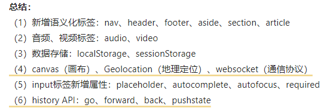

# 基础知识

## DOCTYPE 文档类型

> DOCTYPE 是 HTML5 中一种标准通用标记语言的文档类型声明。目的是告诉浏览器应该以什么样的文档类型定义来解析文档。不同的渲染模式会影响浏览器对 CSS 和 JavaScript 脚本的解析。它必须声明在 HTML 文档的第一行。

浏览器渲染页面的两种模式（可以通过`document.compatMode`获取）

- **CSS1Compat**: **标准模式**（**Strick mode**），默认模式，浏览器使用 W3C 的标准解析渲染页面。在标准模式下，浏览器以其支持的最高标准呈现页面；
- **BackCompat：怪异模式（混杂模式）(Quick Mode)** 浏览器使用自己的怪异模式解析渲染页面。在怪异模式下，页面以以一种比较宽松的向后兼容的方式显示。

## HTML5 新特性

1. **语义化标签**

- header: 定义文档头部
- nav: 定义导航链接的部分
- footer: 定义文档底部
- article: 定义文章内容
- section: 定义文档中的节（section，区段）
- aside: 定义其所处内容之外的内容(侧边栏)

1. **媒体标签**

- **audio**

```HTML
<audio src="" controls autoplay loop='true'></audio>
```

- 属性：

- - controls 控制面板
  - autoplay 自动播放
  - loop 循环播放

- **video**

```HTML
<video controls src='' poster=''></video>
```

- 属性：

- - poster：指定视频还没有完全下载完毕，或者用户还没有点击播放前显示的封面。默认显示当前视频文件的第一帧画面；
  - width
  - height

- source 标签

因为浏览器对视频格式支持程度不一致，为了能够兼容不同的浏览器，可以通过 source 来指定视频源。

```HTML
    <video>
      <source src="abc.flv" type="video/flv" />
      <source src="abc.mp4" type="video/mp4" />
    </video>
```

- 表单

- 表单类型：

- - email: 验证当前输入的邮箱地址是否合法
  - url：验证 URL
  - number：只能输入数字，同时会自带上下增减箭头，可设置最大值，最小值，value 为默认值；
  - search：输入框后面会提供一个小叉，可以删除输入的内容，更加人性化；
  - range：可以提供一个范围
  - color：颜色选择器
  - time：时间选择
  - date：日期选择

- 表单属性：

- - placeholder: 占位
  - autofocus：自动获取焦点
  - autocomplete='on' / 'off'（自动填充），使用这个属性需要: 1. 表单提交过；2. 必须有 name 属性
  - required
  - pattern：校验输入内容
  - multiple：可以选择多个文件或者多个邮箱
  - form：form 表单的 ID

- 表单事件：

- - oninput：每当 input 里输入的内容发生变化就会触发
  - oninvalid：当校验不通过时触发

- 进度条、度量器

  - progress：用来表示任务完成的进度（IE，Safari 不支持），max 表示任务的进度，value 表示完成的多少
  - meter：用来显示剩余容量或者剩余库存（IE，Safari 不支持）
    - high/low：规定被视为高/低的范围
    - max/min：规定最大/小值
    - value：规定当前度量值
  - ```HTML
    <label for="fuel">Fuel level:</label>

    <meter id="fuel"
           min="0" max="100"
           low="33" high="66" optimum="50"
           value="50">
        at 50/100
    </meter>
    ```

- **DOM 查询**

```JavaScript
document.querySelector();
document.querySelectorAll();
```

- **web 存储**
  - localStorage
  - sessionStorage



## Web worker

> 是浏览器页面渲染中，独立于主线程的另一个线程，它的执行不会影响到主线程的执行过程，他可以通过 postMessage 的方式来与主线程进行通信，同时由于它是独立于主线程，无法访问到 DOM 元素；

## label 标签的作用

label 标签用来定义表单控件的关系：当用户选择 label 标签时，浏览器会自动将焦点转到和 label 标签相关的表单控件上。

```HTML
<!--方式1： -->
<label for="userName">userName:</label>
<input type="text" id="userName" />
<!--方式2： -->
<label>
userName:
<input type="text" />
</label>
```

## 渐进增强和优雅降级的区别

1. 渐进增强：主要是针对低版本的浏览器进行页面重构，保证基本功能情况下，再针对高级浏览器进行效果，交互等方面的改进和追加功能，以达到更好的交互体验；
2. 优雅降级：一开始就构建完整的功能，然后针对低版本的浏览器进行兼容

区别：

- 优雅降级是从复杂现状开始，并试图减少用户体验的供给；而渐进增强则是从一个非常基础的，能够起作用的版本开始，并再此基础上不断扩充，以适应未来环境的需要；
- 降级意味着往回看，渐进增强则是往前看，同时保证了其根基处于安全地带；

## HTML5 drap API

- dragstart：事件主体是拖拽元素，在开始拖拽的时候触发；
- drag：事件主体还是拖拽元素，在拖拽的过程中触发；
- dragenter：事件主体变成目标元素，在拖拽元素进入目标元素时触发；
- dragover：事件主体是目标元素，拖拽元素在目标元素内移动时触发；
- dragleave：事件主体是目标元素，拖拽元素移出目标元素时触发；
- drop：事件主体是目标元素，在目标元素完全接受拖拽元素时触发；
- dragend：事件主体是拖拽元素，整个拖拽操作结束时触发；
