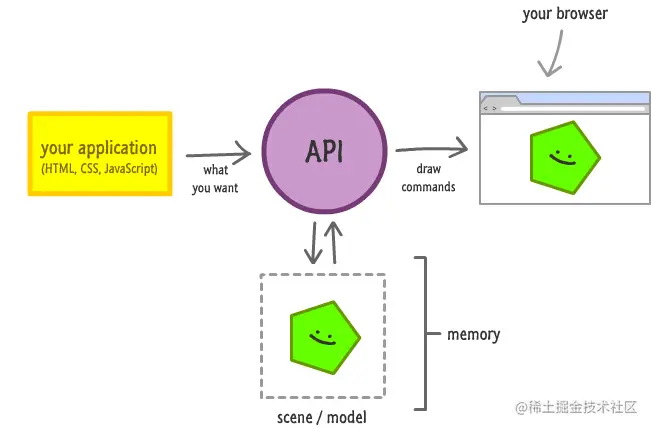
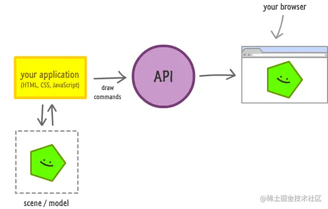
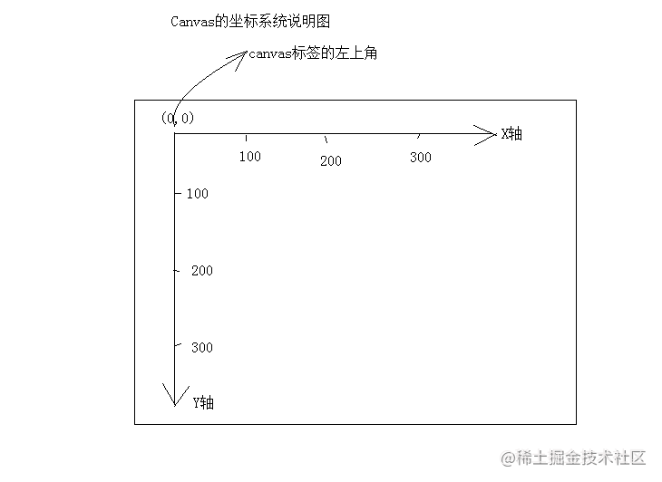

# Canvas

## 了解 canvas

> - 画布，油布的意思；（可以说是 html5 的核心技术之一）
> - Canvas 是一个矩形区域的画布，可以用 JavaScript 在上面绘画。控制其每一个像素；
> - canvas 标签使用 JavaScript 在网页上绘制图像，本身不具备绘图功能；
> - canvas 拥有多种绘制路径、矩形、圆形、字符以及添加图像的方法；
> - HTML5 之前的 web 页面只能用一些固定样式的标签：比如 p、div、h1 等；

- **注意事项：**

- - 标签名需要闭合；
  - 可以设置 width 和 height 属性，同时**属性值必须是 px 作为单位**，否则会被忽略；
  - width 和 height 的默认值为：300\*150；
  - **不要使用 CSS 来控制宽高，这样会导致图片的拉伸等问题**；
  - **重新设置 canvas 标签的宽高属性会让画布擦除掉所有的内容**；
  - 可以给 canvas 画布设置背景色；

### 关于 canvas 的优势，特点

> 1. 拥有更加快速的渲染，相比于 DOM 渲染

- DOM: 驻留模式



DOM 的核心是标签，一种文本标记型语言，多样性很强且多个标签之间存在各种关联（如在同一个 DIV 下设置为 float 的子 DIV）。浏览器为了更好的处理这些 DOM 元素，减少对绘制 API 的调用，就设计了一套将中间结果存放于内存的“驻留模式”。首先，浏览器会将解析 DOM 相关的全部内容（包含 HTML 标签、样式和 JavaScript），将其转化为场景（scene）和模型（model）存储到内存中，然后再调用系统的绘制 API（如 Windows 程序员熟悉的 GDI/GDI+），把这些中间产物绘制到屏幕。

驻留模式通过场景和模型缓存减少了对绘制 API 的调用频次，将性能压力转移到场景和模型生成阶段，即浏览器需要根据 DOM 上下文和 BOM 中的尺寸数据，“自行判断”每一个元素的绘制结果。

- Canvas: 快速模式



对于使用快速模式渲染的 Canvas 而言，浏览器的每次重绘都是基于代码的，不存在能让处理流程变慢的多层解析，所以它真的很快。除了快之外，Canvas 的灵活性也大大超出 DOM。我们可以通过代码精确的控制如何、何时绘制出我们想要的效果。

在资源消耗上，DOM 的驻留模式意味着场景中每增加一点东西就需要额外消耗一些内存，而 Canvas 并没有这个问题。这个差异会随着页面元素的数量增多而愈加明显

## 浏览器兼容

> - ie9 以上才支持 canvas, 其他 chrome、ff、苹果浏览器等都支持
> - 只要浏览器兼容 canvas，那么就会支持绝大部分 api(个别最新 api 除外)
> - 移动端的兼容情况非常理想，基本上随便使用
> - 2d 的支持的都非常好，3d（webgl）ie11 才支持，其他都支持
> - 如果浏览器不兼容，最好进行友好提示

```JavaScript
例如：
<canvas id="cavsElem">
  你的浏览器不支持canvas，请升级浏览器.浏览器不支持，显示此行文本
</canvas>
```

## canvas 绘图上下文 context

> canvas 自身是无法绘制任何内容的，需要通过 javascript 来进行操作；
>
> context 上下文就是 javascript 操作 canvas 的接口，使用[canvasElement].getContext('2d')获取 2D 绘图上下文；

```JavaScript
const canvas = ducoment.getElementById('canvas');
const ctx = canvas.getContext('2d'); // 获取2d绘图上下文
```

## 基本的绘图流程

1. 第一步：获得上下文 =>canvasElem.getContext(‘2d’);
2. 第二步：开始路径规划 =>ctx.beginPath()
3. 第三步：移动起始点 =>ctx.moveTo(x, y)
4. 第四步：绘制线(矩形、圆形、图片…) =>ctx.lineTo(x, y)
5. 第五步：闭合路径 =>ctx.closePath();
6. 第六步：绘制描边 =>ctx.stroke();

## 基础

**canvas 坐标系，从最左上角 0,0 开始。x 向右增大， y 向下增大**



### 设置绘制起点

```JavaScript
* 语法：ctx.moveTo(x, y);
* 解释：设置上下文绘制路径的起点。相当于移动画笔到某个位置
* 参数：x,y 都是相对于 canvas盒子的最左上角。
* 注意：**绘制线段前必须先设置起点。**
```

### 绘制直线

```JavaScript
* 语法：ctx.lineTo(x, y);
* 解释：从x,y的位置绘制一条直线到起点或者上一个线头点。
* 参数：x,y 线头点坐标。
```

### 路径开始和闭合

```JavaScript
* 开始路径：ctx.beginPath();
* 闭合路径：ctx.closePath();
* 解释：如果是绘制不同状态的线段或者形状，必须使用开始新路径的方法把不同的绘制操作隔开。闭合路径会自动把最后的线头和开始的线头连在一起。
* beginPath: 核心的作用是将 不同绘制的形状进行隔离，
  每次执行此方法，表示重新绘制一个路径,跟之前的绘制的墨迹可以进行分开样式设置和管理。
```

### 描边(stroke)

```JavaScript
* 语法：ctx.stroke();
* 解释：根据路径绘制线。路径只是草稿，真正绘制线必须执行stroke
* stroke: （用笔等）画；轻抚；轻挪；敲击；划尾桨；划掉；（打字时）击打键盘
 英 [strəʊk]   美 [strok]
```

参考文档：

[ canvas 详细教程! ( 近 1 万字吐血总结)](https://mp.weixin.qq.com/s?__biz=Mzg4MzY5MTAwMQ==&mid=2247495533&idx=1&sn=0f863e0e680c1ba24b47baf344ba4f9f&chksm=cf4133fbf836baed6af6d3f49d7c2429157fa73c398428b765ebfd7dd9b3ee3ca1c2c7ad5c56#rd)
