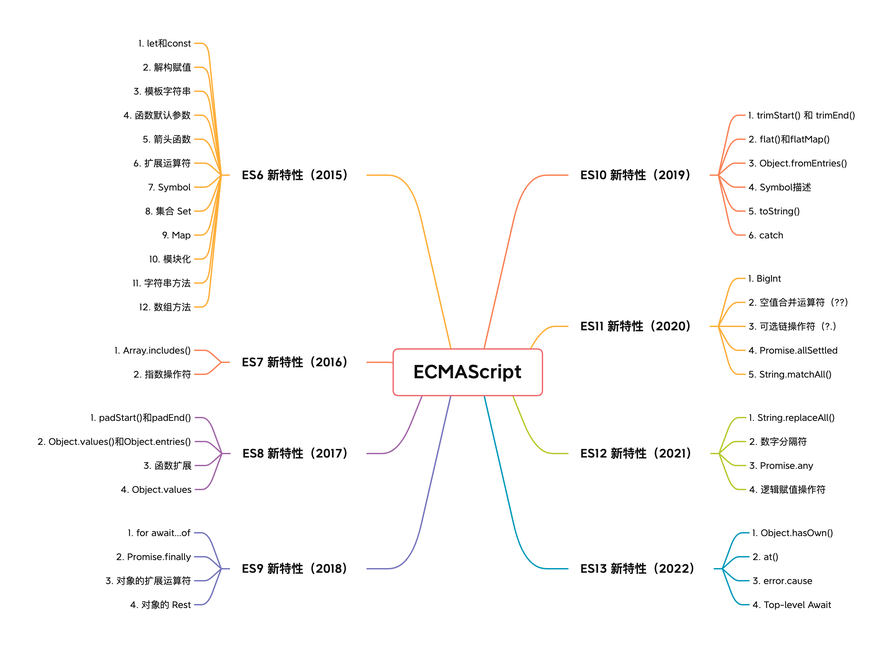

# ES6~ES13

> 引用：https://www.yuque.com/cuggz/feplus/flzunb



## es2015

### let 和 const

- 拥有块级作用域
- 不存在变量提升
- 在同一个作用域下，不能重复声明
- let 定义的变量可以重新赋值，const 定义的为常量

### 解构赋值

- 对象解构
- 数组解构
- 函数参数解构
- 字符串解构等

```JavaScript
const obj = {userName: '张三', age: 12}

let {userName, age} = obj;
```

### 模板字符串

> 这个不用多说，老生常谈

### 函数默认参数

- 函数的 length 属性

函数的 length 属性用来表示函数参数的个数，当引入函数默认值之后，length 表示的就是第一个有默认值参数之前的普通参数个数：

```JavaScript
const funA = function(x, y) {} // funA.length === 2
const funB = function(x, y = 2) {} // funB.length = 1
```

- 参数作用域

当给函数的参数设置了默认值之后，参数在被初始化时将形成一个独立作用域，初始化之后完成作用域消除

```JavaScript
let x = 1;
function func(x, y = x) {
    console.log(y);
}
func(2); // 2
```

这里最终会打印出 2，在函数调用时，参数 x,y 将形成一个独立的作用域，所以参数中的 y 会等于第一个参数的值，而不是上面定义的 1；

### 箭头函数

相比于普通函数的特点：

- 更加简洁
- 不再绑定 this，所以它只会在自己作用域的上一层继承 this。箭头函数中 this 的指向在它定义时就已经确定了，之后不会再发生改变。
- 不能作为构造函数
- 不绑定 arguments，在箭头函数中访问的 arguments 实际上获得的是它上层函数的 arguments 值

### 扩展运算符

应用在：数组，函数参数中

### Symbol

ES6 引入的一个新的基本数据类型 Symbol，表示独一无二的值。特点如下：

- Symbol 的值是唯一的，用来解决命名冲突的问题
- Symbol 值不能与其他类型数据进行运算
- Symbol 定义的对象属性不能使用`for...in `遍历循环，但是可以使用 Reflect.ownKyes 来获取对象的所有键名

功能：

- 避免常量值重复

```JavaScript
// 如何优雅地定义常量
const KEY = {
    alibaba: Symbol(),
    bytedance: Symbol(),
    tencent: Symbol()
}
```

- 避免对象属性覆盖

### 集合 Set

### 映射 Map

### 模块化

- export 导出
- import 导入
- export \* from 'path' 导入导出一起

### 字符串方法

- Includes
- startsWidth
- endsWidth
- Repeat

### 数组方法

- reduce
- filter
- Array.from
- fill

## Generator

通俗地讲，generator 是一个带有\*的函数（它并不是真正的函数，通过 typeof 获取数据类型时，generator 实则为一个对象类型），它可以配合 yield 关键字来暂停或者执行函数。

### Promise

> 异步编程

## es2016

### Array.includes

### 指数操作符

```JavaScript
let num = 10 ** 2; // Math.pow(10,2)
```

## es2017

### async / await

> 异步编程，以同步代码的方式，实现异步编程

### padStart / padEnd

- padStart

  - 如果原字符串的长度，等于或大于指定的最小长度，则返回原字符串：
  - ```JavaScript
    // padStart使用
    'X'.padStart(1, 'abc'); // ‘X’
    ```

  - 如果用来补全字符串与原字符串，两者的长度之和超过了指定的最小长度，则会截去超出位数的补全字符串
  - ```JavaScript
    'x'.padStart(5, 'ab'); 'ababx'
    'x'.padStart(4, 'ab');  'abax'
    ```

  - 如果省略第二个参数，默认使用空格补全长度

- padEnd 同理

### Object.values() 和 Object.entries()

- Object.values() 返回对象属性值的数组
- Object.entries(0 返回对象属性和属性值的数组

### 函数扩展

```JavaScript
function person(one, two, three, ) {}
```

该特性的主要作用就是方便使用 git 进行多人协作开发时，修改同一个函数减少不必要的行变更

## es2018

### for await ... Of

> 异步迭代器

```JavaScript
function gen(time) {
    return new Promise((resolve, reject) => {
        setTimeout(function() {
            resolve(time);
        }, time);
    })
}

async function test() {
    let arr = [gen(2000), gen(100), gen(3000)];
    for await (let item of arr) {
        console.log(Date.now(), item);
    }
}
test()
```

### Promise.finally

> 无论 promise 的状态是 fulfilled 还是 rejected 都会执行 finally

### 对象扩展运算符

### 对象的 Rest

```JavaScript
const obj = {foo: 1, bar: 2, baz: 3};
const {foo, ...rest} = obj;

rest: {bar: 2, baz: 3}
```

## es2019

### trimStart 和 trimEnd

> 去除字符串头(尾)的空格

### flat 和 flatMap

- flat

扁平化数组

- flatMap

该方法使用映射函数映射每一个元素，然后将结果压缩成一个新数组。它与 map 和连着深度值为 1 的 flat 几乎相同。但 flatMap 通常在合并成一种方法的效率稍微高一些。该方法会返回一个新的数组，其中每个元素都是回调函数的结果，并且结果深度 depth 值为 1

```JavaScript
[1,2,3,4].flatMap(x => [[x*2]]) // [[2], [4], [6], [8]]
[1,2,3,4].map(x => [x*2]) // [[2], [4], [6], [8]]
```

### Object.fromEntries

是 Object.entries 的逆过程。它可以将一个键值对列表转换成一个对象。

### Symbol 描述

通过 Symbol 创建符号时，可以通过参数提供字符串作为描述：

```JavaScript
let dog = Symbol('dog'); //
```

在 es10 之前，获取 Symbol 值的描述需要通过 toString 或者 String 方法：

```JavaScript
String(dog) // 'Symbol(dog)'
dog.toString() // 'Symbol(dog)'
```

es10 补充了属性：description，用来直接访问描述：

```JavaScript
dog.description; // dog
```

### toString

在之前的特性中，函数的 toString 可以输出函数的代码，但是会省略到注释和空格，现在方法会保留这些，输出原始代码

### try ... catch ...

新特性中，catch 后面可以不用接参数

## es2020

### BigInt

这是 JavaScript 引入的第八种基本类型。BigInt 可以表示任意大的整数。其语法如下：

```JavaScript
BigInt(value);
```

value: 是创建对象的数值。可以是字符串或者整数。

在 JavaScript 中，Number 基本类型可以精确表示的最大整数是 2^53。因此早期会有这样的问题：

```JavaScript
let max = Number.MAX_SAFE_INTEGER; // 最大安全整数
let max1 = max + 1;
let max2 = max + 2;
console.log(max1 === max2); // true
```

有了 BigInt 之后，这个问题就不复存在了：

```JavaScript
let max = BigInt(Number.MAX_SAFE_INTEGER);
let max1 = max + 1n;
let max2 = max + 2n;
console.log(max1 === max2); // false
```

使用 typeof 和 Object.prototype.toString 判断 BigInt 类型

```JavaScript
typeof 1n === 'BigInt'; // true
typeof BigInt('1') === 'BigInt'; // true

Object.prototype.toString.call(10n) === '[object BigInt]'; // true
```

BigInt 和 Number 不能严格相等，但是可以是宽松相等

### 空值合并运算符：??

```
let a = value ?? 'name';
```

只有当 value 为**null**或者**undefined**时才会赋值后面的值；

### 可选链操作符：?.

这种语法解决了频繁使用&&来判断是否有前驱对象，才能去使用这个对象下面的属性

```JavaScript
a && a.b && a.b.c && a.b.c.d
// 使用?.
a?.b?.c?.d
```

### Promise.allSettled

同 Promise.all 只不过，这里只会把状态从：pending -> fulfilled 转变

### String.matchAll

matchAll()是新增的字符串方法，它返回一个包含所有匹配正则表达式的结果及分组捕获组的迭代器。因为返回的是遍历器，所以通常使用 for...of 循环取出。

```JavaScript
for(const match of 'abcabc'.matchAll(/a/g)) {
    console.log(match)
}
// output
['a', index: 0, input: 'abcabc', groups: undefined]
['a', index: 3, input: 'abcabc', groups: undefined]
```

需要注意，该方法的第一个参数是一个正则表达式对象，如果传递的参数不是一个正则表达式对象，则会隐式地使用 new RegExp(obj) 将其转换为一个 RegExp。另外。RegExp 必须是设置了全局模式 g 的形式，否则会抛出异常 TypeError.

## es2021

### String.replaceAll

返回一个全新的字符串，所有符合匹配规则的字符都将被替换掉，替换规则可以是字符串或者正则表达式

需要注意的是，replaceAll 在使用正则表达式的时候，如果非全局匹配(/g)，会抛出异常；

### 数字分隔符

数字分割符可以在数字之间创建可视化分隔符，通过`_`下划线来分割数字。使得数字更具有可读性。可以放在数字内的任何地方：

```JavaScript
const money = 1_000_000_000 // 1000000000
```

这个分隔符也支持八进制

### Promise.any

可以 Promise.all 接收一个数组，但是它是只要有一个 Promise 出现 fulfilled，最终的状态就会是 fulfilled

### 逻辑赋值操作符

```JavaScript
a ||= b; // a = a || b;
a &&= b; // a = a && b;
a ??= b; // a = a ?? b;
```

## es2022

### Object.hasOwn

在该特性之前，使用`Object.prototype.hasOwnProperty()`来检查一个属性是否属于对象

`Object.hasOwn` 特性一种更加简洁、可靠的检查属性是否直接设置在对象上的方法

### 数组方法：at

> 传递一个索引值，查看执行索引下的值，可以为负数，同 slice 里面使用负数

### Cause

在 es13 规范中，new Error()中可以指定导致它的原因：

```JavaScript
function foo() {
    try {
        // ...
    } catch(error) {
        throw new Error(
            'happen something',
            {cause: error}
        )
    }
}
```

Top-level Await

在之前的规范中，await 只能搭配 async 使用；

在当前规范中，可以使用顶层 await，实现在 async 函数之外使用 await,

使用例子：

```JavaScript
// foo.js
const userInfo = await fetch('http://localhost:8080/user/1');
export {userInfo};

// bar.js
import {userInfo] from 'foo.js';
console.log(userInfo); // 可以正常打印
```
