# JavaScript 执行过程

### **前言**

编写一段 JavaScript 代码，它是如何执行的呢？简单来说，JS 引擎在执行 JavaScript 代码的过程中需要先解析再执行。那么在解析阶段 JS 引擎又会进行哪些操作，接下来就一起来了解一下 JavaScript 在执行过程中的详细过程，包括执行上下文、GO、AO、VO 和 VE 等概念的理解。

### **1.初始化全局对象**

> 首先，JS 引擎会在执行代码之前，也就是解析代码时，会在我们的堆内存创建一个全局对象：Global Object（简称 GO），观察以下代码，在全局中定义了几个变量：

示例代码：

var name = 'curry' var message = 'I am a coder' var num = 30

JS 引擎内部在解析以上代码时，会创建一个全局对象（伪代码如下）：

- 所有的**作用域（scope）**都可以访问该全局对象；
- 对象里面会包含一些**全局的方法和类**，像 Math、Date、String、Array、setTimeout 等等；
- 其中有一个**window 属性**是指向该全局对象自身的；
- 该对象中会收集我们上面全局定义的变量，并设置成 undefined；
- 全局对象是非常重要的，我们平时之所以能够使用这些全局方法和类，都是在这个全局对象中获取的；

```js
  var GlobalObject = { Math: '类', Date: '类', String: '类', setTimeout: '函数', setInterval: '函数', window: GlobalObject, ... name: undefined, message: undefined, num: undefined}
```

### **2.执行上下文栈（调用栈）**

> 了解了什么是全局对象后，下面就来聊聊代码具体执行的地方。JS 引擎为了执行代码，引擎内部会有一个**执行上下文栈（Execution Context Stack，简称 ECS）**，它是用来执行代码的**调用栈**。

**（1）ECS 如何执行？先执行谁呢？**

- 无疑是先执行我们的全局代码块；
- 在执行前全局代码会构建一个**全局执行上下文（Global Execution Context，简称 GEC）**；
- 一开始 GEC 就会被放入到 ECS 中执行；

**（2）那么全局执行上下文（GEC）包含那些内容呢？**

- **第一部分：**执行代码前。
  - 在转成抽象语法树之前，会将全局定义的变量、函数等加入到 Global Object 中，也就是上面初始化全局对象的过程；
  - 但是并不会真正赋值（表现为 undefined），所以这个过程也称之为**变量的作用域提升（hoisting）**；
- **第二部分：**代码执行。
  - 对变量进行赋值，或者执行其它函数等；

下面就通过一幅图，来看看 GEC 被放入 ECS 后的表现形式：

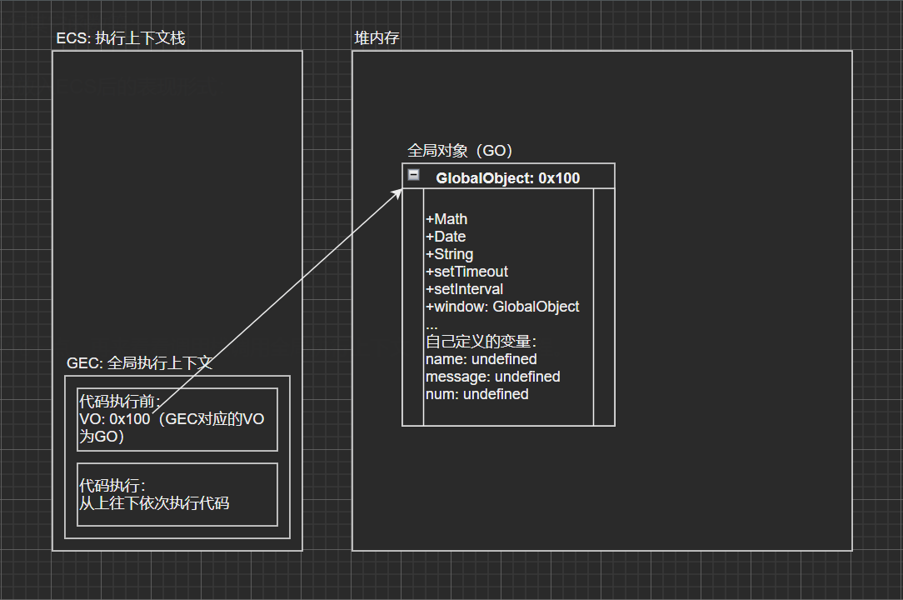

### **3.调用栈调用 GEC 的过程**

> 接下来，将全局代码复杂化一点，再来看看调用栈调用全局执行上下文（GEC）的过程。

实例代码：

var name = 'curry'console.log(message) var message = 'I am a coder'function foo() { var name = 'foo' console.log(name) } var num1 = 30var num2 = 20var result = num1 + num2 foo()

调用栈调用过程：

- 1.初始化全局对象。
  - 这里需要注意的是函数存放的是地址，会指向函数对象，与普通变量有所不同；
  - 从上往下解析 JS 代码，当解析到 foo 函数时，因为 foo 不是普通变量，并不会赋为 undefined，JS 引擎会在堆内存中开辟一块空间存放 foo 函数，在全局对象中引用其地址；
  - 这个开辟的函数存储空间最主要存放了该函数的**父级作用域**和函数的**执行体代码块**；

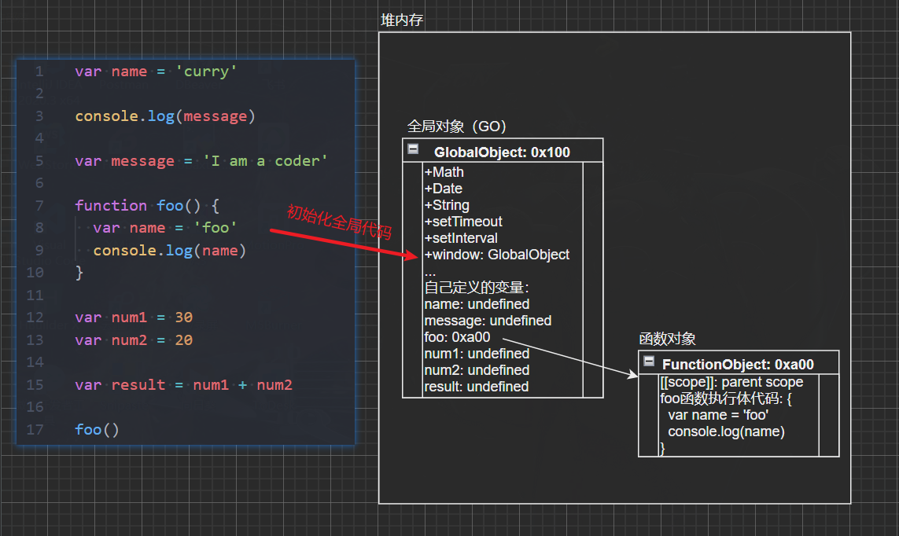

- 2.构建一个全局执行上下文（GEC），代码执行前将 VO 的内存地址指向 GlobalObject（GO）。

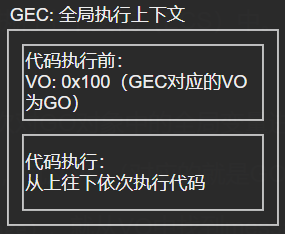

- 3.将全局执行上下文（GEC）放入执行上下文栈（ECS）中。

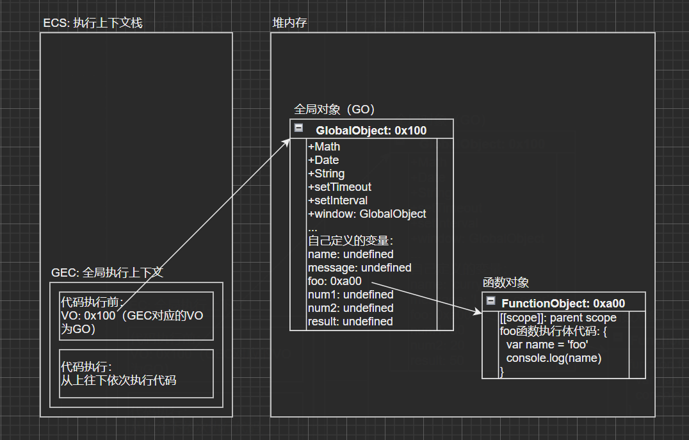

- 4.从上往下开始执行全局代码，依次对 GO 对象中的全局变量进行赋值。
  - 当执行`var name = 'curry'`时，就从 VO（对应的就是 GO）中找到 name 属性赋值为 curry；
  - 接下来执行`console.log(message)`，就从 VO 中找到 message，注意**此时的 message 还为 undefined**，因为 message 真正赋值在下一行代码，所以就直接打印 undefined（也就是我们经常说的变量作用域提升）；
  - 后面就依次进行赋值，执行到`var result = num1 + num2`，也是从 VO 中找到 num1 和 num2 两个属性的值进行相加，然后赋值给 result，result 最终就为 50；
  - 最后执行到`foo()`，也就是需要去执行 foo 函数了，这里的操作是比较特殊的，涉及到**函数执行上下文**，下面来详细了解；

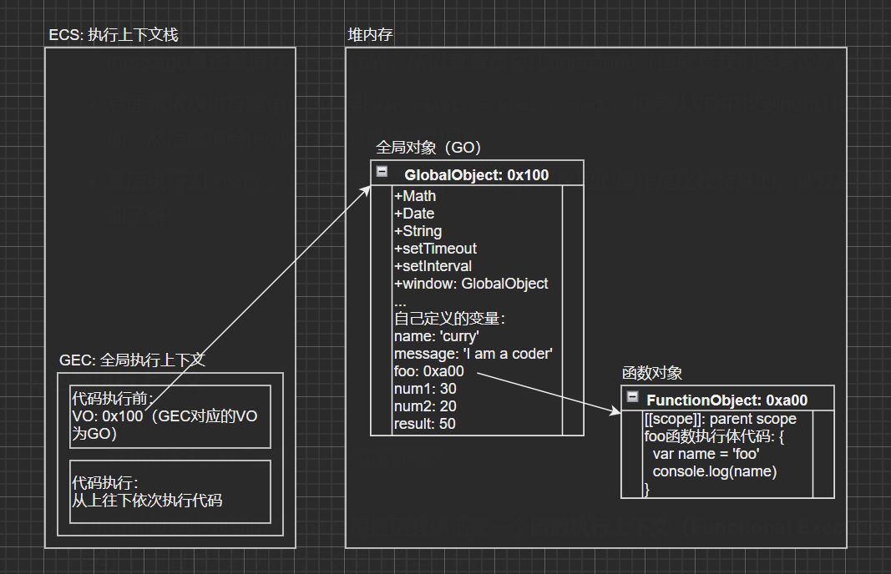

### **4.函数执行上下文**

> 在执行全局代码遇到函数如何执行呢？

- 在执行的过程中遇到函数，就会根据函数体创建一个**函数执行上下文（Functional Execution Context，简称 FEC）**，并且加入到执行上下文栈（ECS）中。
- 函数执行上下文（FEC）包含三部分内容：
  - AO：在解析函数时，会创建一个**Activation Objec（AO）**；
  - 作用域链：由**函数 VO 和父级 VO 组成**，查找是一层层往外层查找；
  - this 指向：this 绑定的值，在函数执行时确定；
- 其实全局执行上下文（GEC）也有自己的作用域链和 this 指向，只是它对应的作用域链就是自己本身，而 this 指向为 window。

继续来看上面的代码执行，当执行到`foo()`时：

- 先找到 foo 函数的存储地址，然后**解析 foo 函数**，生成函数的 AO；
- 根据 AO 生成函数执行上下文（FEC），并将其放入执行上下文栈（ECS）中；
- 开始执行 foo 函数内代码，依次找到 AO 中的属性并赋值，当执行`console.log(name)`时，就会去 foo 的 VO（对应的就是 foo 函数的 AO）中找到 name 属性值并打印；

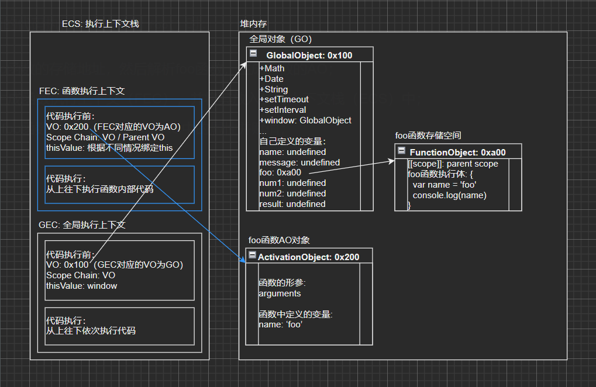

### **5.变量环境和记录**

> 上文中提到了很多次 VO，那么 VO 到底是什么呢？下面从 ECMA 新旧版本规范中来谈谈 VO。

在早期 ECMA 的版本规范中：每一个执行上下文会被关联到一个**变量环境（Variable Object，简称 VO）**，在源代码中的**变量和函数声明**会被作为属性添加到 VO 中。对应函数来说，参数也会被添加到 VO 中。

- 也就是上面所创建的 GO 或者 AO 都会被关联到变量环境（VO）上，可以通过 VO 查找到需要的属性；
- 规定了 VO 为 Object 类型，上文所提到的 GO 和 AO 都是 Object 类型；

在最新 ECMA 的版本规范中：每一个执行上下文会关联到一个**变量环境（Variable Environment，简称 VE）**，在执行代码中**变量和函数的声明**会作为**环境记录（Environment Record）**添加到变量环境中。对于函数来说，参数也会被作为环境记录添加到变量环境中。

- 也就是相比于早期的版本规范，对于变量环境，已经去除了 VO 这个概念，提出了一个新的概念 VE；
- 没有规定 VE 必须为 Object，不同的 JS 引擎可以使用不同的类型，作为一条环境记录添加进去即可；
- 虽然新版本规范将变量环境改成了 VE，但是 JavaScript 的执行过程还是不变的，只是关联的变量环境不同，将 VE 看成 VO 即可；

### **6.全局代码执行过程（函数嵌套）**

> 了解了上面相关的概念和调用流程之后，就来看一下存在函数嵌套调用的代码是如何执行的，以及执行过程中的一些细节，以下面代码为例：

var message = 'global'function foo(m) { var message = 'foo' console.log(m) function bar() { console.log(message) } bar() } foo(30)

- 初始化全局对象（GO），执行全局代码前创建 GEC，并将 GO 关联到 VO，然后将 GEC 加入 ECS 中：
  - foo 函数存储空间中指定的父级作用域为全局对象；

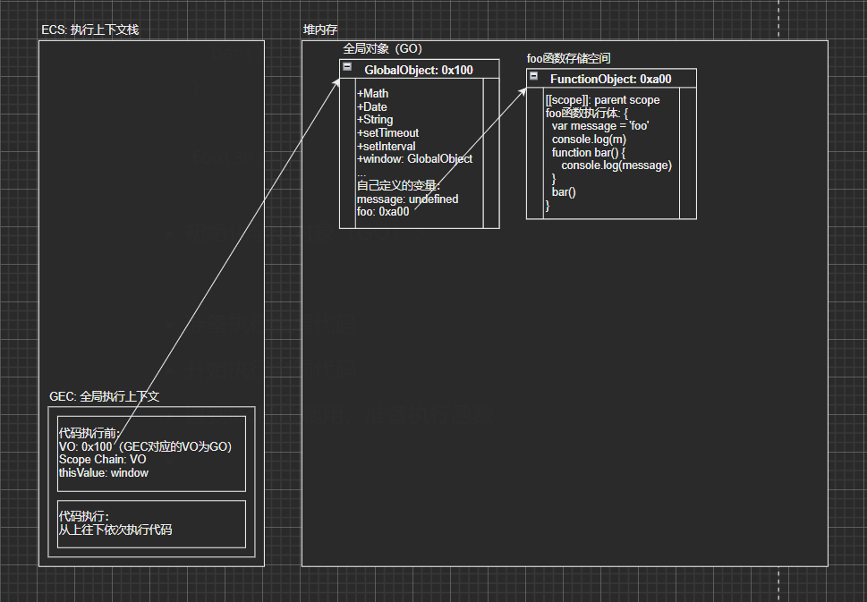

- 开始执行全局代码，从上往下依次给全局属性赋值：
  - 给 message 属性赋值为 global；


- 执行到 foo 函数调用，准备执行 foo 函数前，创建 foo 函数的 AO：
  - bar 函数存储空间中指定父级作用域为 foo 函数的 AO；

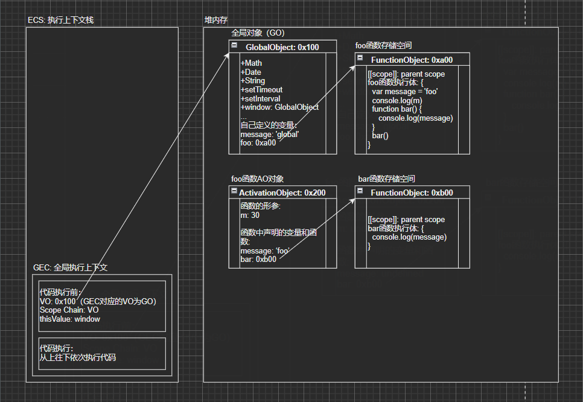

- 创建 foo 函数的 FEC，并加入到 ECS 中，然后开始执行 foo 函数体内的代码：
  - 根据 foo 函数调用的传参，给形参 m 赋值为 30，接着给 message 属性赋值为 foo；
  - 所以，m 打印结果为 30；

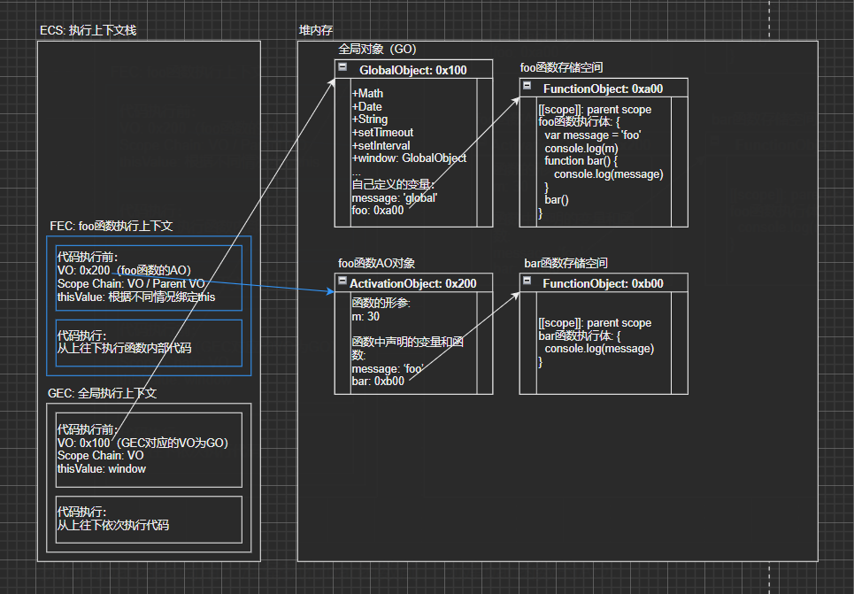

- 执行到 bar 函数调用，准备执行 bar 函数前，创建 bar 函数的 AO：
  - bar 函数中没有定义属性和声明函数，以空对象表示；

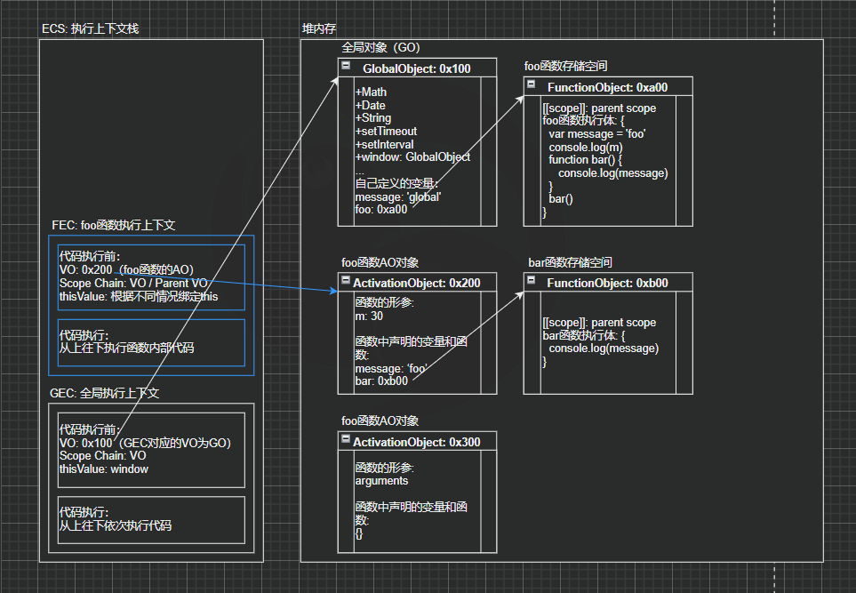

- 创建 bar 函数的 FEC，并加入到 ECS 中，然后开始执行 bar 函数体内的代码：
  - 执行`console.log(message)`，会先去 bar 函数自己的 VO 中找 message，没有找到就往上层作用域的 VO 中找；
  - 这里 bar 函数的父级作用域为 foo 函数，所以找到 foo 函数 VO 中的 message 为 foo，**打印结果为 foo**；

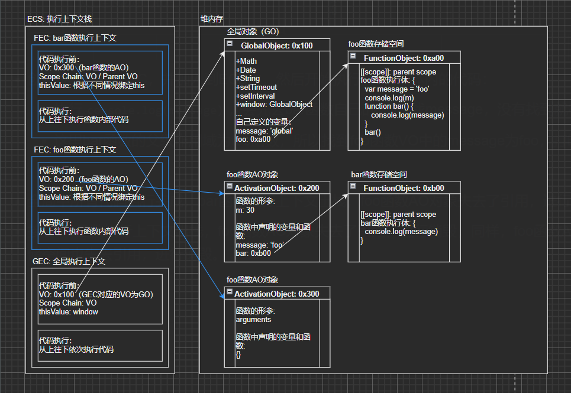

- 全局中所有代码执行完成，bar 函数执行上下文出栈，bar 函数 AO 对象失去了引用，进行销毁。
- 接着 foo 函数执行上下文出栈，foo 函数 AO 对象失去了引用，进行销毁，同样，foo 函数 AO 对象销毁后，bar 函数的存储空间也失去引用，进行销毁。

### 7.**总结：**

- 函数在执行前就已经确定了其父级作用域，与函数在哪执行没有关系，以函数声明的位置为主；
- 执行代码查找变量属性时，会沿着**作用域链**一层层往上查找（沿着 VO 往上找），如果一直找到全局对象中还没有该变量属性，就会报错未定义；
- 上文中提到了很多概念名词，下面来总结一下：

| 名词 | 解释                                                                                    |
| ---- | --------------------------------------------------------------------------------------- |
| ECS  | 执行上下文栈（Execution Context Stack），也可称为调用栈，以栈的形式调用创建的执行上下文 |
| GEC  | 全局执行上下文（Global Execution Context），在执行全局代码前创建                        |
| FEC  | 函数执行上下文（Functional Execution Context），在执行函数前创建                        |
| VO   | Variable Object，早期 ECMA 规范中的变量环境，对应 Object                                |
| VE   | Variable Environment，最新 ECMA 规范中的变量环境，对应环境记录                          |
| GO   | 全局对象（Global Object），解析全局代码时创建，GEC 中关联的 VO 就是 GO                  |
| AO   | 函数对象（Activation Object），解析函数体代码时创建，FEC 中关联的 VO 就是 AO            |

### 经典面试

```JavaScript
// 1.
function foo() {
    var a = 10;
    b = 20;
}
foo();
console.log(b);
console.log(a);
// print:
//  20；
// exception: a is not definded

// 理论上对于没有声明变量，就直接赋值变量，这种处理本身就是一个错误，但是这里js却会将这种变量放到全局对象(Global Object)中

// 对于 var a = b = 10; 这样的代码最终转换成： b = 10; var a = 10;
//   所以我们应该尽量避免写这种代码，一次声明应该只涉及一个变量；
// var b = 10;
// var a = b;
```

摘录一篇博客：https://github.com/mqyqingfeng/Blog/issues/4

```JavaScript
var scope = "global scope";
function checkscope(){
    var scope = "local scope";
    function f(){
        return scope;
    }
    return f();
}
checkscope(); // local scope


var scope = "global scope";
function checkscope(){
    var scope = "local scope";
    function f(){
        return scope;
    }
    return f;
}
checkscope()() // local scope
```

分析：

> 第一个：
>
> ECStack.push(\<checkscope\< functionContext); ECStack.push(\<f\<functionContext); ECStack.pop(); ECStack.pop();
>
> 第二个：
>
> ECStack.push(\<checkscope\< functionContext); ECStack.pop(); ECStack.push(\<f\< functionContext); ECStack.pop();
>
> javascript 采用的是词法作用域，也就是静态作用域；（函数作用域在函数定义时就确定了）
>
> 与之对应的动态作用域，是在函数执行的时候确定

### typeof 和 instanceof

#### typeof

> `typeof` 操作符返回一个字符串，表示未经计算的操作数的类型
>
> 返回值是一个字符串， 用来说明变量的数据类型。
>
> typeof 一般只能返回如下几个结果： number, boolean, string, function, object, undefined。

#### Instanceof

> 返回值为布尔值
>
> instanceof 用于判断一个变量是否属于某个对象的实例。
>
> `instanceof` 运算符用于检测构造函数的 `prototype` 属性是否出现在某个实例对象的[原型链](https://so.csdn.net/so/search?q=原型链&spm=1001.2101.3001.7020)上
>
> ```
> a instanceof A
> ```

```JavaScript
function customInstanceof(a, A) {
  const prototype = Object.getPrototypeOf(a);
  if (prototype === null) {
    return false;
  }
  if (prototype.constructor === A.prototype.constructor) {
    return true;
  }
  return customInstanceof(prototype, A);
}
```
