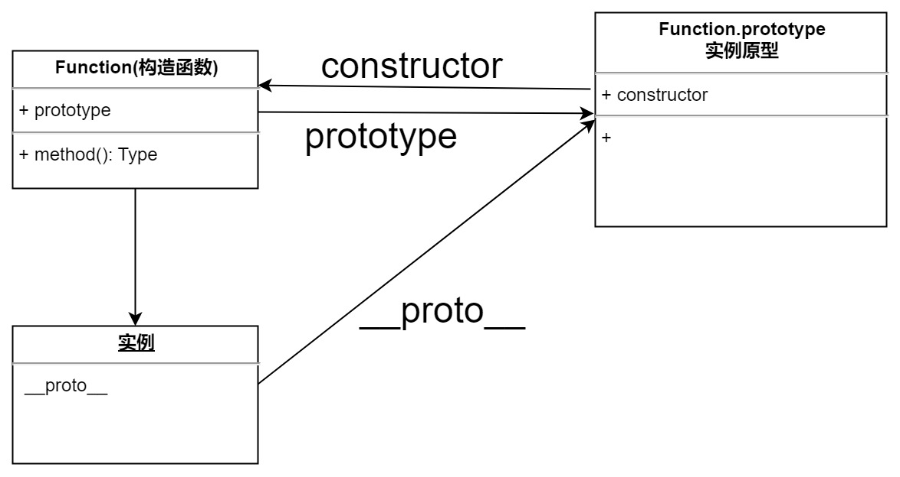

# JS 原型链
> 关于原型链和原型链继承，大家也可以去掘金上看我的两篇文章，点击下方链接直接进入：
> * [JavaScript原型及原型链](https://juejin.cn/post/7235279096312709181)
> * [JavaScript原型链继承](https://juejin.cn/post/7235216665431031865)
## 1. 构造函数

### 使用 new 操作符创建对象的过程

- 首先会在内存中开辟一块内存空间，存储这个新对象；
- 新对象内部的[[Prototype]]特性被赋值为构造函数的 prototype 属性；
- 构造函数内部的 this 被赋值为这个新对象（即 this 指向这个新对象）;
- 执行构造函数内部代码（给新对象添加属性）；
- 如果构造函数返回一个非空对象，那么就返回这个非空对象；否则，就返回刚创建的新对象。

在执行构造函数的时候，如果不使用 new 操作符配合构造函数创建对象时，那么执行构造函数时，内容的 this 会指向全局作用域（浏览器下就是 window 对象）；

如果是用 new 就会返回一个实例对象;

## 2. 理解原型链

> 每个函数都有一个 prototype 属性；
>
> 函数的 prototype 属性指向了一个对象，这个对象正是调用该构造函数而创建的**实例**的原型；
>
> 每一个 JavaScript 对象(null 除外)在创建的时候就会与之关联另一个对象，这个对象就是我们所说的原型，每一个对象都会从原型"继承"属性。
>
> 这是每一个 JavaScript 对象(除了 null )都具有的一个属性，叫**proto**，这个属性会指向该对象的原型。



> 当读取实例的属性时，如果找不到，就会查找与对象关联的原型中的属性，如果还查不到，就去找原型的原型，一直找到最顶层为止。

- 例子

```JavaScript
function Person() {}

Person.prototype.name = 'person';

var person = new Person();

person.name = 'child';

console.log(person.name); // 'child' --> person.name  person实例上的属性

delete person.name;

console.log(person.name); // 'person' --> Person.prototype.name Person原型上的属性
```


## 3. 继承

> 在原型对象上的所有的属性和方法都能够被实例所共享；

- 原型链继承

```JavaScript
// 定义一个父类
function Person() {
}
Person.prototype.name = 'Person';

function Student() {}

Student.prototype = new Person(); // 让子类原型指向父类的实例
Student.prototype.constructor = Student;
var student = new Student();
```

> 1. 使用原型继承的弊端，会造成父类原型上的属性在每个实例上保持一致，一个实例对应进行修改，其他实例上的对应属性，也会被修改；
> 2. 同时，还有一个弊端就是，不能给父类传递参数，产生了一定的局限性；

- 构造函数继承(经典继承)

```JavaScript
// 定义一个父类
function Person() {
}
Person.prototype.name = 'Person';

function Student() {
    Person.call(this[, ...value1]); // 在子类构造函数中，调用父类构造函数，创建实例，完成了传递参数的功能；

}
```

> 1. 构造函数继承，虽然可以将父类上的非原型属性继承下来，但是父类的原型属性不能被继承；

- 组合继承(构造函数继承+原型链继承)

```JavaScript
// 定义一个父类
function Person() {
}
Person.prototype.name = 'Person';

function Student() {
    // 第一处调用父类构造函数位置
    Person.call(this[, ...value1]); // 在子类构造函数中，调用父类构造函数；
}

Student.prototype = new Person(); // 第二次 调用父类构造函数位置
Student.prototype.constructor = Student;

var student = new Student();
```

> 1. 组合继承的弊端主要就是会调用两次父类的构造函数

- 寄生组合继承

```JavaScript
// 定义一个父类
function Person() {
}
Person.prototype.name = 'Person';

function Student() {
    // 第一处调用父类构造函数位置
    Person.call(this[, ...value1]); // 在子类构造函数中，调用父类构造函数；
}

Student.prototype = Object.create(Person.prototype); //
Student.prototype.constructor = Student;

var student = new Student();
```

> 1. 为了解决调用两次父类的构造函数，我们可以在设置子类原型的时候，将子类原型直接指向父类的原型
>
> ```
> Student.prototype = Person.prototype
> ```
>
> ，此时就可以避免调用两次父类构造函数，产生两份父类的属性等问题；
>
> 1. 但是问题又来了，我们如果要在子类的原型上进行修改等操作时，这时我们操作的却是父类的原型；
> 2. 这里通过 Object.create()方法实现子类继承父类的原型：
>
> `Object.create()` 方法用于创建一个新对象，使用现有的对象来作为新创建对象的原型；

## 4. 使用 Object.create()

```JavaScript
// 使用Object.create()方法

var person = {
  name: 'hello',
  age: 12,
  score: 98
};

var stu = Object.create(person);

console.log(person);

console.log(stu);
```

**result**:


- 异曲同工

```JavaScript
// 介绍两种和Object.create()有异曲同工之妙的方法
// first
// 直接使用字面量对象
function createObject(obj) {
  var newObj = {};
  Object.setPrototypeOf(newObj, obj);
  return newObj;
}

// var stu = createObject(person);

// second
function createObject1(obj) {
  function Fun() {} // 使用构造函数来创建对象
  Fun.prototype = obj;
  return new Fun();
}

var stu = createObject1(person);
```


摘录自：http://www.mollypages.org/tutorials/js.mp

## 5. 原型

> **原型**：是**function 对象**的一个属性，它定义了**构造函数**制造出的对象的公共祖先。通过该构造函数产生的对象，可以继承该原型的属性和方法(原型也是对象)。

| 属性        | 用法                 | 描述                                    |
| ----------- | -------------------- | --------------------------------------- |
| prototype   | 构造函数名.prototype | 可以理解为函数的原型对象                |
| **proto**   | 对象名.**proto**     | 指向该对象的原型                        |
| constructor | 对象名.constructor   | 指向关联的构造函数,实例原型指向构造函数 |

## 6. 原型链

> **原型链**：当对象找不到需要的属性时，它会到这个对象的父对象上去找，以此类推，这就构成了对象的原型链。并且**Object.prototype 是对象的最终原型**，**绝大多数**对象最终都会继承自 Object.prototype，而**Object.prototype 的原型是 null**。

## 7. 理解概念

- JavaScript 分为**函数对象**和**普通对象**，每个对象都有**proto**属性，但是只有函数对象才有 prototype 属性；(准则一)
- Object、Function 都是 JavaScript 内置的**函数**，类似的还有我们常用的 Array、RegExp、Date、Boolean、Number、String；(准则一)
- 属性**proto**是一个对象，它有两个属性。contructor 和**proto**；(准则二)
- 原型对象 prototype 有一个默认的 constructor 属性，用于记录实例是由哪个构造函数创建。(准则二)

- 不管有没有`__proto__`属性，`JavaScript`标准规范定义了`prototype`原型属性，所有对象都使用由构造函数所指向的原型对象。原型对象，默认情况下，都会有一个`constructor`属性，重新指回构造函数。
- 对象的原型仅用于属性继承。函数本身并不使用其关联的原型对象，但是因为函数本身也是一个对象，它会继承它的构造函数的原型，**`JavaScript`\*\***中函数的构造函数，是 Function 对象\*\*。
- **每个原型对象自身，默认都是通过\*\***`new Object()`\***\*构造函数创建的**，所以原型对象自身(比如`Foo.prototype`)的原型对象(其`__proto__`指向)就是`Object.prototype`。因此，不管任意类型的实例，最后都会从`Object.prototype`中继承属性。
  - `Object.prototype`的原型对象(`__proto__`)是 null。常见错误：`Cannot read properties of null`，是不是似曾相识，因为 null 没有原型对象，就不能继续通过原型链往上查找属性了，直接异常。
- 所以对象会自动从原型链中读取属性，就好像属性定义在对象自身上。直接在实例自身上设置原型链中同名的属性，会隐藏/遮蔽原型链中的同名的那个属性。

```JavaScript
// 从上方 function Foo() 开始分析这一张经典之图
function Foo()
let f1 = new Foo();
let f2 = new Foo();

f1.__proto__ = Foo.prototype; // 准则2
f2.__proto__ = Foo.prototype; // 准则2
Foo.prototype.__proto__ = Object.prototype; // 准则2 (Foo.prototype本质也是普通对象，可适用准则2)
Object.prototype.__proto__ = null; // 原型链到此停止
Foo.prototype.constructor = Foo; // 准则1
Foo.__proto__ = Function.prototype; // 准则2
Function.prototype.__proto__  = Object.prototype; //  准则2 (Function.prototype本质也是普通对象，可适用准则2)
Object.prototype.__proto__ = null; // 原型链到此停止
// **此处注意Foo 和 Function的区别， Foo是 Function的实例**

// 从中间 function Object()开始分析这一张经典之图
function Object()
let o1 = new  Object();
let o2 = new  Object();

o1.__proto__ = Object.prototype; // 准则2
o2.__proto__ = Object.prototype; // 准则2
Object.prototype.__proto__ = null; // 原型链到此停止
Object.prototype.constructor = Object; // 准则1
// 所有函数的__proto__  都和 Function.prototype指向同一个地方
Object.__proto__ = Function.prototype // 准则2 (Object本质也是函数)；
// 此处有点绕
Function.prototype.__proto__ =  Object.prototype; // 准则2 (Function.prototype本质也是普通对象，可适用准则2)
Object.prototype.__proto__ = null; // 原型链到此停止

// 从下方 function Function()开始分析这一张经典之图
function Function()
Function.__proto__ = Function.prototype // 准则2
Function.prototype.constructor = Function; // 准则1
```

## 8. 案例

#### 案例一

```JavaScript
let user = {
  name: 'John',
  surname: 'Smith',

  set fullName(value) {
    // 理解这一步是关键
    [this.name, this.surname] = value.split(' ');
  },

  get fullName() {
    console.log('get', this);
    return `${this.name} ${this.surname}`;
  }
};

let admin = {
  __proto__: user,
  isAdmin: true
};

console.log(admin.fullName); // John Smith (*)

// setter triggers!
admin.fullName = 'Alice Cooper'; // (**)

console.log(admin.fullName); // Alice Cooper，admin 的内容被修改了
console.log(user.fullName); // John Smith，user 的内容被保护了
```

> 上述的输出结果，感觉主要是去考察自身属性和原型上的属性的处理过程，在上述代码中的 setter 方法中，通过直接赋值的方式给 this 对象绑定属性值，这一步是直接去赋值，而不需要去查找原型上是否有对应的属性，然后才去赋值。同时这里也需要去理解 this 的指向。

#### 案例二

```JavaScript
let hamster = {
  stomach: [],

  eat(food) {
    console.log(this);
    this.abc = '123';
    // this.stomach = '123';
    this.stomach.push(food);
  }
};

let speedy = {
  __proto__: hamster,
  hello: ''
};

let lazy = {
  __proto__: hamster
};

// 这只仓鼠找到了食物
speedy.eat('apple');
console.log(speedy.stomach); // apple

// 这只仓鼠也找到了食物，为什么？请修复它。
console.log(lazy.stomach); // apple
console.log(lazy.stomach); // apple
```

> 这个案例不仅是考察了给原型对象上的属性赋值后，会影响所有实例对象访问该原型属性，还考察了什么时候会去修改原型上的属性值。在这里的 `this.stomach.push(food);`，它首先会去查找 this 对象上是否有这个 stomach 属性，如果有就会去看属性值是否有 push 方法，然后就行后续操作；如果没有，那么就要去递归原型链，查看是否有对应的属性，如果找到就判读是否有 push 方法，然后进行后续操作，如果没有就报错；所以这里最终会影响原型上的属性值，故而两个都输出相同的结果。

## 9. 原型链继承

> 在 ES5 的时候，JavaScript 还没有 Class 类的使用，要实现对象属性的继承就可以通过原型链的方式来实现。

这里可以参考个人文章：[JavaScript 原型链继承](https://juejin.cn/post/7235216665431031865)

## 10. 使用 Class

> class 是 es6 提出的一个面向对象编程的一个概念，其底层其实还是构造函数和原型构成的，其中 class 实则也是一个函数；通过 new 操作符来实例化对象的时候，执行过程和使用构造函数时一样的；

### 使用 class 实现继承需要注意的地方

- 在子类继承父类时，如果子类要使用 constructor，那么必须在构造函数中优先调用 super，或者在构造函数中返回一个 Object 对象；
- 在实例方法中，不能使用 super

### 关于实现抽象类的方法

> 注意，在 es6 中，并没有明确提出有实现抽象类的关键字，但是我们可以在构造函数中使用`new.target==className`的方式实现抽象类，它保证了不能被实例化

```JavaScript
class Person {
    constructor() {
        if(new.target === Person) {
            throw new Error("Person can not be instanced");
        }
    }
}
```

## 11. 引用文章

- [JavaScript 原型和原型链的定义和使用](https://blog.csdn.net/Yuki_yuhan/article/details/108053224)
- [轻松理解 JS 原型原型链](https://juejin.cn/post/6844903989088092174)
- [JavaScript 一张图搞懂原型链](https://zhuanlan.zhihu.com/p/476054746)
- [原型继承](https://zh.javascript.info/prototype-inheritance)
