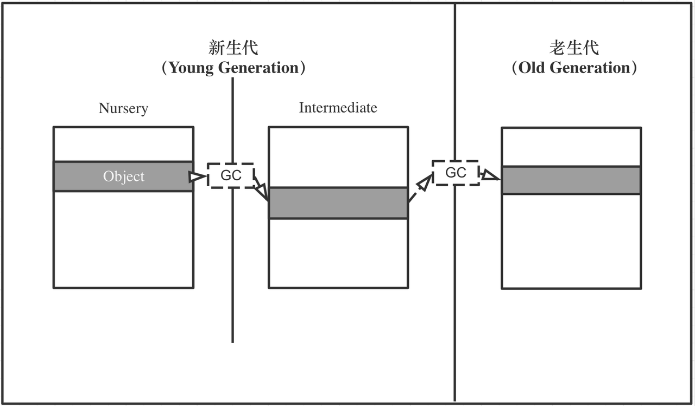
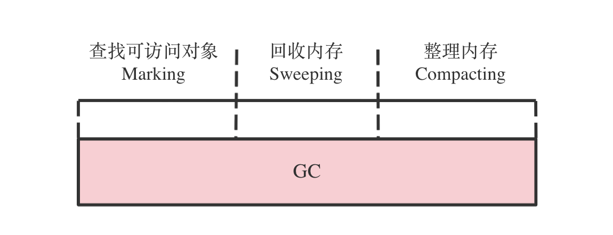
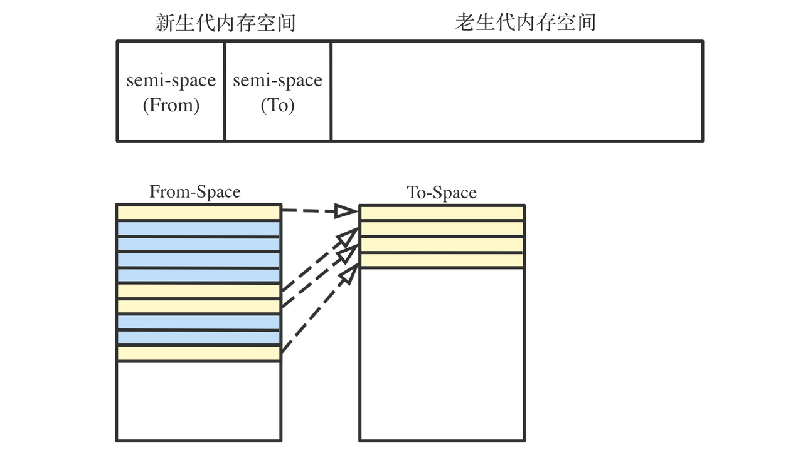

# 浏览垃圾回收机制

GC（Garbage Collection，垃圾回收）是一种内存自动管理机制， 垃圾回收器（Garbage Collector）可以自动回收分配给程序的已经不再使用的内存。常见的 GC 算法有引用计数法和标记清除法等。V8（JavaScript 引擎，提供执行 JavaScript 的运行时环境）的垃圾回收器算法主要由 Mark-Compact 和 Scavenger 构成。

## 知识点深入

## 内存泄漏

内存泄漏是指，应当被回收的对象没有被正常回收，变成常驻老生代的对象，导致内存占用越来越高。内存泄漏会导致应用程序速度变慢、高延时、崩溃等问题。

#### 1.1 内存生命周期

1. 分配：按需分配内存。
2. 使用：读写已分配的内存。
3. 释放：释放不再需要的内存。

#### 1.2 内存泄漏常见原因

- 创建全局变量，且没有手动回收。
- 事件监听器 / 定时器 / 闭包等未正常清理。
- 使用 JavaScript 对象来做缓存，且不设置过期策略和对象大小控制。

## Reference Counting（引用计数）

Reference Counting 是常见的垃圾回收算法，其核心思路是：将资源（比如对象）的被引用次数保存起来，当被引用次数为零时释放。该方法的局限性：当出现**循环引用**时，互相引用的对象不会被回收。

## V8 垃圾回收机制

V8 中有两个垃圾收集器。主要的 GC 使用 **Mark-Compact** 垃圾回收算法，从整个堆中收集垃圾。小型 GC 使用 **Scavenger** 垃圾回收算法，收集新生代垃圾。

两种不同的算法应对不同的场景：

- 使用 Scavenger 算法主要处理**存活周期短**的对象中的可访问对象。
- 使用 Mark-Compact 算法主要处理**存活周期长**的对象中的不可访问的对象。

因为新生代中存活的可访问对象占少数，老生代中的不可访问对象占少数，所以这两种回收算法配合使用十分高效。

#### 3.1 分代垃圾收集

在 V8 中，所有的 JavaScript 对象都通过**堆**来分配。V8 将其管理的堆分成两代：新生代和老生代。其中新生代又可细分为两个子代（Nursery、Intermediate）。

即新生代中的对象为存活时间较短的对象，老生代中的对象为存活时间较长或常驻内存的对象。

#### 3.2 Mark-Compact 算法（Major GC）

Mark-Compact 算法可以看作是 Mark-Sweep（标记清除）算法和 Cheney 复制算法的结合。该算法主要分为三个阶段：标记、清除、整理。

1. 标记（Mark）
2. 标记是找所有可访问对象的过程。GC 会从一组已知的对象指针（称为根集，包括执行堆栈和全局对象等）中，进行递归标记可访问对象。
3. 清除（Sweep）
4. 清除是将不可访问的对象留下的内存空间，添加到空闲链表（free list）的过程。未来为新对象分配内存时，可以从空闲链表中进行再分配。
5. 整理（Compact）
6. 整理是将可访问对象，往内存一端移动的过程。主要解决标记清除阶段后，内存空间出现较多内存碎片时，可能导致无法分配大对象，而提前触发垃圾回收的问题。

#### 3.3 Scavenger 算法（Minor GC）

V8 对新生代内存空间采用了 Scavenger 算法，该算法使用了 semi-space（半空间） 的设计：将堆一分为二，始终只使用一半的空间：From-Space 为使用空间，To-Space 为空闲空间。

新生代在 From-Space 中分配对象；在垃圾回收阶段，检查并按需复制 From-Space 中的可访问对象到 To-Space 或老生代，并释放 From-Space 中的不可访问对象占用的内存空间；最后 From-Space 和 To-Space 角色互换。
