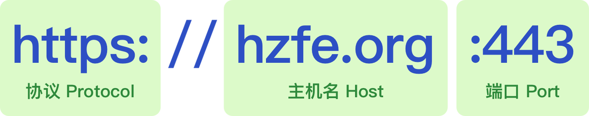

# 浏览器跨域

## 了解跨域

> 跨域问题的来源是浏览器为了**请求安全**而引入的基于**同源策略**的安全特性。当页面和请求的**协议**、**主机名**或**端口**不同时，浏览器判定两者不同源，即为跨域请求。需要注意的是跨域是**浏览器的限制**，服务端并不受此影响。当产生跨域时，我们可以通过 JSONP、CORS、postMessage 等方式解决。

当页面和请求的**协议**、**主机名**或**端口**不同时，浏览器判定两者不同源，从而产生跨域。需要注意的是跨域是**浏览器的限制**，实际请求已经正常发出和响应了。

如上图所示，一个 origin 由**协议（Protocol）**、**主机名（Host）**和**端口（Port）**组成，这三块也是同源策略的判定条件，只有当**协议**、**主机名**和**端口**都相同时，浏览器才判定两者是同源关系，否则即为跨域。

## 跨域解决方案

- CORS
- 反向代理
- JSONP
- ... ...

### CORS（Cross-Origin Resource Sharing）

> CORS 是目前最为广泛的解决跨域问题的方案。方案依赖服务端/后端在响应头中添加 `Access-Control-Allow-*` 头，告知浏览器端通过此请求。(不涉及前端改动)

**具体实现方式：**

CORS 将请求分为**简单请求（Simple Requests）**和**需预检请求（Preflighted requests）**，不同场景有不同的行为：

- 简单请求
  - > 不触发预检请求的称为简单请求，当请求满足以下条件时就是一个简单请求：
    >
    > - 请求方法：`GET`、`HEAD`、`POST`。
    > - 请求头：`Accept`、`Accept-Language`、`Content-Language`、`Content-Type`。
    >   - Content-Type 仅支持：`application/x-www-form-urlencoded`、`multipart/form-data`、`text/plain`。
- 需预检请求

  - 当一个请求不满足以上简单请求的条件时，浏览器会自动向服务端发送一个 **OPTIONS** 请求，通过服务端返回的 `Access-Control-Allow-*` 判定请求是否被允许。

- CORS 引入了以下几个以 `Access-Control-Allow-*` 开头：

- - `Access-Control-Allow-Origin` 表示允许的来源
  - `Access-Control-Allow-Methods` 表示允许的请求方法
  - `Access-Control-Allow-Headers` 表示允许的请求头
  - `Access-Control-Allow-Credentials` 表示允许携带认证信息

当请求符合响应头的这些条件时，浏览器才会发送并响应正式的请求。

### JSONP

> 前后端配合实现，仅支持 GET 请求；主要利用了浏览器加载 javascript 资源文件时不受同源策略的限制而实现跨域获取数据。

- **具体实现：**

- > JSONP 的原理是利用了浏览器加载 JavaScript 资源文件时不受同源策略的限制而实现的。具体流程如下：
  >
  > 1. 全局注册一个函数，例如：`window.getHZFEMember = (num) => console.log('HZFE Member: ' + num);`。
  > 2. 构造一个请求 URL，例如：`https://hzfe.org/api/hzfeMember?callback=getHZFEMember`。
  > 3. 生成一个 `<script>` 并把 `src` 设为上一步的请求 URL 并插入到文档中，如 `<script src="https://hzfe.org/api/hzfeMember?callback=getHZFEMember" />`。
  > 4. 服务端构造一个 JavaScript 函数调用表达式并返回，例如：`getHZFEMember(17)`。
  > 5. 浏览器加载并执行以上代码，输出 `HZFE Member: 17`。
