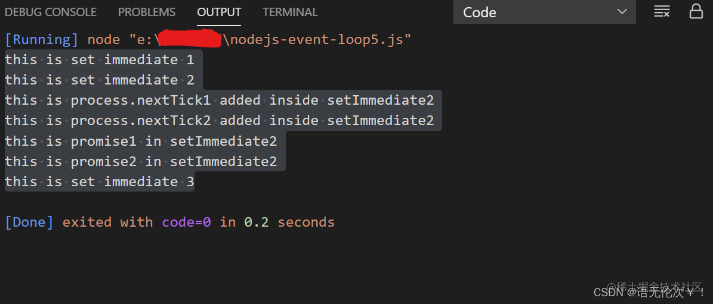

# 浏览器和 Node.js 事件循环

## 了解事件循环 EventLoop


## 浏览器事件循环


## nodejs 事件循环


## 认识 Event LOOP

> Event loop 包含六个阶段：
>
> 1. Timers,
> 2. pending callbacks,
> 3. Idle / prepare,
> 4. Poll,
> 5. Check,
> 6. Close callbacks

event loop 会依次进入上述的每一个阶段。每个阶段都会有一个 callback queue 与之相应。event loop 会遍历这个 callback queue，执行里面的每一个 callback。直到 callback queue 为空或者当前 callback 的执行数量超过某一个阈值为止。

### Timers

> 在 timers 阶段中，event loop 会检查是否有到期的定时器可以执行，有就执行。
>
> 调用 setTimeout 或者 setInterval 方法时传入的 callback 会在指定的延迟时间后入队列到 timers callback queue （注意这里是在到指定延迟时间后才会进入队列，而不是先进入队列，在等延迟时间到了再进入）跟浏览器环境中的 setTimeout 和 setInterval 方法一样，调用时候传入的延迟时间并不是确切执行的时间。timer callback 的执行时间点无法得到稳定的，一致的保证，因为它们的执行会受到操作系统调用层面和其他 callback 函数调用耗时的影响。
>
> 从技术上来说，poll 阶段实际上控制了 timer callback 执行的时间点。

### Pending callbacks

> 这个阶段主要是执行系统级层面的回调函数。比如说：TCP 发生错误时候的错误回调，假如一个 TCP socket 在尝试建立连接时发生了‘ECONNREFUSED’错误，则 nodejs 需要将对应的错误回调入队到对应的 pending callback queue 中，并马上执行，以此来通知操作系统。

### idle/prepare

> 只供 nodejs 内容使用的阶段，对开发者而言可以忽略；

### Poll

> 在进入轮询阶段之前，event loop 会检查 timer queue 是否为空，如果不为空的话，那么 event loop 就会退回到 timer 阶段，依次执行所有的 timer callback 才回到轮询阶段。
>
> 进入轮询阶段后，event loop 会做两件事：
>
> 1. 根据不同操作系统的实际情况来计算轮询阶段所应该占用 event loop 的时间长度；
> 2. 对 event Demultiplexer 进行轮询，并执行 I/O callback queue 里面的 callback;
>
> 因为 nodejs 旨在应用 I/O 密集型软件，所以，在一个 event loop 循环中，它会花费很大比例的时间在轮询阶段。在这个阶段，event loop 要么处于执行 I/O callback 状态，要么处于轮询等待的状态，要么处于轮询等待的状态。当然，轮询占用 event loop 的时间也会是有个限度的。这就是第一件事情要完成的事-计算出有一个切合当前操作系统环境的适合的最大时间值。event loop 退出当前轮询阶段还有两个条件：
>
> 1. 当前轮询阶段所占用的时间长度已经超过 nodejs 计算出来的阈值；
> 2. 当天 I/O callback queue 为空，并且 immediate callback 阶段；

一旦符合以上两个条件中的一个，就退出轮询阶段，进入 check 阶段；


### Check

> 当 poll 处于空闲状态时(也就是 I/O callback queue 为空时)，一旦 event loop 发现 immediate callback queue 有 callback 入队了，event loop 就会退出轮询阶段，马上进入 check 阶段。调用 setImmediate() 时传入的 callback 会被传入到 immediate callback queue。 Event loop 会依次执行队列中的 callback ，直到队列为空，然后移步下一阶段；

### Close callback

> 执行那些注册在关闭事件上 callback 的阶段，比如说： socket.on('close', callback)。这种类型的异步代码比较少。

## **更多细节**

正如上面小节所解释的，这六个阶段里面，pending callbacks 和 idle/prepare 这两个阶段是 nodejs 内部在使用的，只有四个阶段跟用户代码是相关的。我们的异步代码最终是被推入到这四个阶段所对应的 callback queue 里面的。所以 event loop 本身有着以下的几个队列：

- timer callback queue
- I/O callback queue
- immediate callback queue
- close callback queue

除了 event loop 的四个队列之外，还有两个队列值得我们注意：

- nextTick callback queue。调用 process.nextTick()时传入的 callback 会被入队到这里。
- microtask callback queue。一个 promise 对象 reslove 或者 reject 时传入的 callback 会被入队到这里。

这两个队列虽然不属于 event loop 里面的，但是它们一样属于 nodejs 异步机制的一部分。如果以 event loop 机制所涉及的这六个队列为视角的话，event loop 运行机制可以用下面的示意图来描述：


### **process.nextTick()和 Promise/then()**

当 nodejs 程序的入口文件，也就是上图中的 mainline code 执行完毕后，在进入 event loop 之前是先后执行 next tick callback 和 micortask callback 的。有的技术文章将 next tick callback 归为 microtask callback,两者是共存在一个队列里面，并强调它的优先级比诸如 promise 之类的其他 microtask 的优先级高。也有的技术文章强调两者是分别归属为不同的队列，nodejs 先执行 next tick queue，再执行 microtask callback queue。无论是哪一种，所描述的运行结果都是一样的。显然，本文更赞成采用后者。

调用 process.nextTick()后，callback 会入队到 next tick callback queue 中。调用 Promise/then()后，相应的 callback 会进入 microtask callback queue 中。**即使这两个队列同时不为空，nodejs 总是先执行 next tick callback queue，直到整个队列为空后，才会执行 microtask callback queue。当 microtask callback queue 为空后，nodejs 会再次回去检查 next tick callback queue。只有当这两个队列都为空的情况下，nodejs 才会进入 event loop。** 认真观察的话，我们会发现，这两个队列的支持递归入队的特性跟浏览器的 event loop 中 micrtask 队列是一样的。从这个角度，有些技术文章把 next tick callback 称为 microtask callback 是存在合理性的。当对 microtask callback 无限递归入队时，会造成一个后果：event loop starvation。也即是会阻塞 event loop。虽然，这个特性不会造成 nodejs 程序报调用栈溢出的错误，但是实际上，nodejs 已经处于无法假死的状态了。所以，我们不推荐无限递归入队。

可以看出，next tick callback 和 microtask callback 的执行已经形成了一个小循环，nodejs 只有跳转这个小循环，才会进入 event loop 这个大循环。

### **setTimeout VS setImmediate()**

当 mainline code 执行完毕后，nodejs 也进入了 event loop 之后，假如此时 timer callback queue 和 immediate callback queue 都不为空的时候，那应该先执行谁呢？你可能觉得肯定是执行 timer callback queue 啊。是的，正常情况下是会这样的。因为 timer 阶段在 check 阶段之前嘛。但是存在一种情况，是会先执行 immediate callback queue，再执行 timer callback queue。什么情况呢？那就是两者的入队动作发生在 poll 阶段（也可以说发生在 I/O callback 代码里面）。为什么？因为 poll 阶段处于 idle 状态后，event loop 一旦发现你 immediate callback queue 有 callback 了，它就会退出轮询阶段，从而进入 check 阶段去执行所有的 immediate callback。此处不会像进入 poll 阶段之前所发生阶段回退，即不会优先回退到 timer 阶段去执行所有的 timer callback。其实，timer callback 的执行已经是发生在下一次 event loop 里面了。综上所述，如果 timer callback 和 immediate callback 在 I/O callback 里面同时入队的话，event loop 总是先执行后者，再执行前者。

假如在 mainline code 有这样代码：

```JavaScript
// timeout_vs_immediate.jssetTimeout(() => {
  console.log('timeout');
}, 0);

setImmediate(() => {
  console.log('immediate');
});
```

那一定是先打印“timeout”，后打印“immediate”吗？答案是不一定。因为 timer callback 的入队时间点有可能受到进程性能（机器上运行中的其他应用程序会影响到 nodejs 应用进程性能）的影响，从而导致在 event loop 进入 timer 阶段之前，timer callback 没能如预期进入队列。这个时候，event loop 就已经进入了下一个阶段了。所以，上面的代码的打印顺序是无法保证的。有时候是先打印“timeout”，有时候是先打印“immediate”：

```Bash
$ node timeout_vs_immediate.js
timeout
immediate

$ node timeout_vs_immediate.js
immediate
timeout
```

### **大循环 VS 小循环**

大循环指的就是 event loop，小循环就是指由 next tick callback queue 和 microtask callback queue 所组成的小循环。我们可以下这么一个结论：**一旦进入大循环之后，每执行完一个大循环 callback 之后，就必须检查小循环。如果小循环有 callback 要执行，则需要执行完所有的小循环 calback 之后才会回归到大循环里面。** 注意，这里强调的是，nodejs 不会把 event loop 中当前阶段的队列都清空之后才进入小循环，而是执行了一个 callback 之后，就进入了小循环了。关于这一点，官方文档是这么说的：

> ......This is because process.nextTick() is not technically part of the event loop. Instead, the nextTickQueue will be processed after the current operation is completed, regardless of the current phase of the event loop. Here, an operation is defined as a transition from the underlying C/C++ handler, and handling the JavaScript that needs to be executed.
>
> 注意：在 node v11.15.0 之前（不包括本身），在这一点上是不一样的。在这些版本里面，表现是：event loop 执行完当前阶段 callback queue 里面的所有 callback 才会进入小循环。你可以在 runkit 上面验证一下。

为了帮助我们理解，请看下面代码：

```JavaScript
setImmediate(() => console.log('this is set immediate 1'));

setImmediate(() => {
  Promise.resolve().then(()=>{
    console.log('this is promise1 in setImmediate2');
  });
  process.nextTick(() => console.log('this is process.nextTick1 added inside setImmediate2'));
  Promise.resolve().then(()=>{
    console.log('this is promise2 in setImmediate2');
  });
  process.nextTick(() => console.log('this is process.nextTick2 added inside setImmediate2'));
  console.log('this is set immediate 2')
});

setImmediate(() => console.log('this is set immediate 3'));
```

如果是一次性执行完所有的 immediate callback 才进入小循环的话，那么打印结果应该是这样的：

```Kotlin
this is set immediate 1this is set immediate 2this is set immediate 3this is process.nextTick1 added inside setImmediate2
this is process.nextTick2 added inside setImmediate2
this is promise1 in setImmediate2
this is promise2 in setImmediate2
```

但是实际打印结果是这样的：



看到没，在执行完第二个 immediate 之后，小循环已经有 callback 在队列里面了。这时候，nodejs 会优先执行小循环里面的 callback。倘若小循环通过递归入队形成了无限循环的话，那么就会出现上面所提到的“event loop starvation”。上面的示例代码只是拿 immediate callback 做个举例而已，对于 event loop 其他队列里面的 callback 也是一样的，在这里就不赘述了。

也许你会好奇，如果在小循环的 callback 里面入队小循环 callback（也就是说递归入队），那会怎样呢？也就是下面的代码的运行结果会是怎样呢？

```Plain
process.nextTick(()=>{
  console.log('this is  process.nextTick 1')
});

process.nextTick(()=>{
  console.log('this is  process.nextTick 2')
  process.nextTick(() => console.log('this is process.nextTick added inside process.nextTick 2'));
});

process.nextTick(()=>{
  console.log('this is  process.nextTick 3')
});
```

运行结果如下：

```Kotlin
this is  process.nextTick 1
this is  process.nextTick 2
this is  process.nextTick 3
this is process.nextTick added inside process.nextTick 2
```

可以看出，递归入队的 callback 并不会插队到队列的中间，而是被插入到队列的末尾。这个表现跟在 event loop 中被入队的表现是不一样的。这就是大循环和小循环在执行入队 next tick callback 和 microtask callback 时候的区别。

## **nodejs 与 browser 中 event loop 的区别**

这两者之间有相同点，也有差异点。再次强调，以下结论是基于 node v12.16.2 来得出的。

### **相同点**

从运行机制的实质上来看，两者大体上是没有什么区别的。具体展开来说就是：如果把 nodejs event loop 中的 mainline code 和各个阶段中的 callback 都归纳为 macrotask callback，把 next tick callback 和其他诸如 Promise/then()的 microtask callback 都归纳为 microtask callback 的话，这两个 event loop 机制大体是一致的：**都是先执行一个 macrotask callback，再执行一个完整的 microtask callback 队列。microtask callback 都具备递归入队的特性，无限递归入队都会产生“event loop starvation”后果。只有执行完 microtask callback queue 中的所有 callback，才会执行下一个 macrotask callback。**

### **不同点**

从技术细节来看，这两者还是有几个不同点：

- 在 nodejs event loop 的实现中，没有 macrotask 的说法。
- nodejs event loop 是按照阶段来划分的，具有六个阶段，对应六种类型的队列（其中两种是只供内部使用）；而 browser event loop 不按照阶段划分，只有两种类型的队列，即 macrotask queue 和 microtask queue。**从另外一个角度我们可以这么理解：nodejs event loop 有 2 个 microtask 队列，有 4 个 macrotask 队列；而浏览器 event loop 只有 1 个 microtask 队列，有 1 个 macrotask 队列。**
- 最大的不同，在于 nodejs evnet loop 有个轮询阶段。当 evnet loop 中所有队列都为空的时候，browser event loop 会退出 event loop（或者说处于休眠状态）。但是 nodejs event loop 不一样，它会持续命中轮询阶段，并且在那里等待处于 pending 状态的 I/O callback。只有等待时间超出了 nodejs 计算出来的限定时间或者再也没有未完成的 I/O 任务的时候，nodejs 才会退出 event loop。这就是 nodejs event loop 跟 browser event loop 最大不同的地方。

Ps: [深入 node.js 的 event-loop](https://www.cnblogs.com/coder2028/p/16897256.html)
