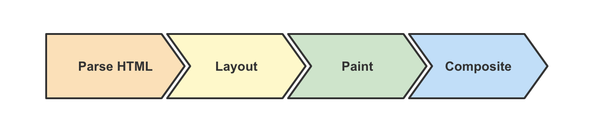

# 浏览器重排(回流)和重绘

## 浏览器渲染

> 浏览器渲染大致分为四个阶段，其中在解析 HTML 后，会依次进入 Layout 和 Paint 阶段。**样式或节点的更改，以及对布局信息的访问等**，都有可能导致重排和重绘。而重排和重绘的过程在**主线程**中进行，这意味着不合理的重排重绘会导致**渲染卡顿，用户交互滞后**等性能问题。

1. Parse HTML：相关引擎分别解析文档和样式表以及脚本，生成 DOM 和 CSSOM ，最终合成为 Render 树。
2. Layout：浏览器通过 Render 树中的信息，以递归的形式计算出每个节点的尺寸大小和在页面中的具体位置。
3. Paint：浏览器将 Render 树中的节点转换成在屏幕上绘制实际像素的指令，这个过程发生在多个图层上。
4. Composite：浏览器将所有层按照一定顺序合并为一个图层并绘制在屏幕上。

## 引发重排和重绘的原因

1. 外观有变化时，会导致**重绘**。相关的样式属性如 `color` `opacity` 等。
2. 布局结构或节点内容变化时，会导致**重排**。相关的样式属性如 `height` `float` `position` 等。
   1. 盒子尺寸和类型。
   2. 定位方案（正常流、浮动和绝对定位）。
   3. 文档树中元素之间的关系。
   4. 外部信息（如视口大小等）。
3. 获取布局信息时，会导致**重排**。相关的方法属性如 `offsetTop` `getComputedStyle` 等。

## 解决方案

1. 对 DOM 进行批量写入和读取（通过虚拟 DOM 或者 DocumentFragment 实现）。
2. 避免对样式频繁操作，了解常用样式属性触发 Layout / Paint / Composite 的[机制](https://csstriggers.com/)，合理使用样式。
3. 合理利用特殊样式属性（如 transform: translateZ(0) 或者 will-change），将渲染层提升为合成层，开启 GPU 加速，提高页面性能。
4. 使用变量对布局信息（如 clientTop）进行缓存，避免因频繁读取布局信息而触发重排和重绘。

另外，可以借助 DevTools Performance 面板来查看产生重排重绘任务占用主线程的情况和调用代码。
