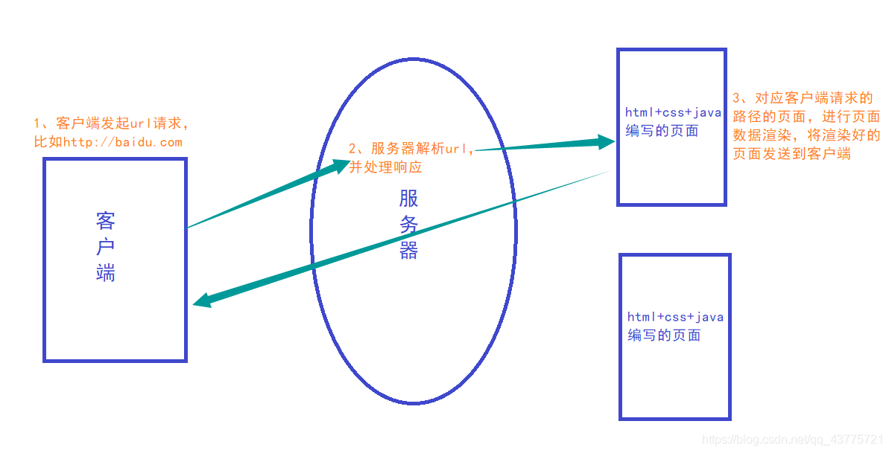
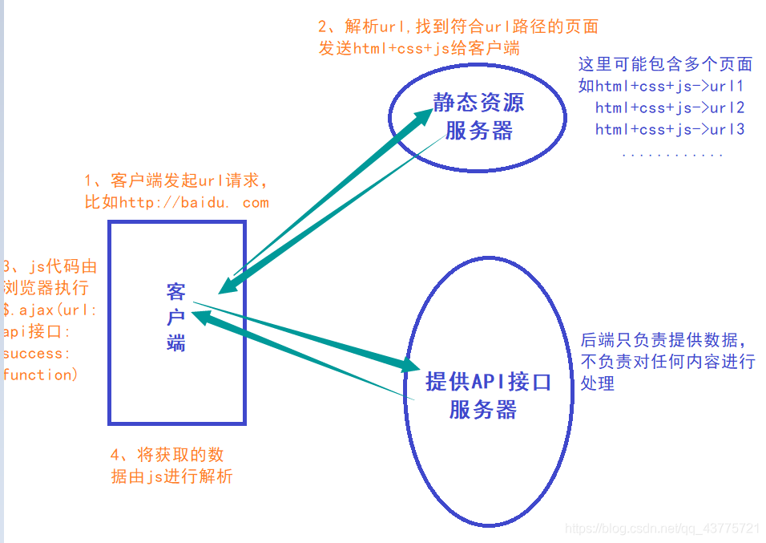
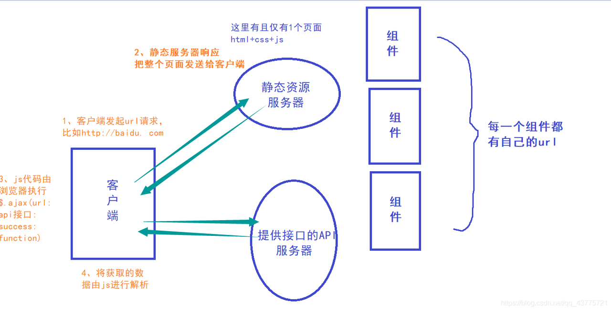

# 路由发展

> 发展经历：
>
> **服务端渲染（后端路由阶段） -> 前后端分离（后端路由阶段） -> SPA 页面（前端路由阶段）**

## 服务端渲染(后端路由)

> **1、后端渲染：服务器直接生产渲染好对应的 HTML 页面, 返回给客户端进行展示。**
>
> **2、后端路由：后端处理 URL 和页面之间的映射关系。**

- 服务端渲染的好处：

> 前端资源消耗少， 所有的数据和模板组合是在后端完成的，因此不占用客户端的运算资源(模板解析)
>
> 首屏加载时间快，因为浏览器获取的就是一个完整的页面，因此获取后浏览器直接可以渲染视图
>
> SEO 优化好, 因为 SEO 蜘蛛在获取页面内容的时候是一个完整的页面内容,可以更好的分析页面内容

- 服务端渲染的坏处:

> 占用太多服务器 资源

## 前后端分离(后端路由)

> **1、随着 Ajax 的出现, 有了前后端分离的开发模式。** **2、后端只提供 API 来返回数据, 前端通过 Ajax 获取数据, 并且可以通过 JavaScript 将数据渲染到页面中。**

- 前端渲染的好处:

> 网络传输数据量小,因为一个完整的页面是通过两次请求获取的
>
> 模板在前端,因此可以通过请求不同的数据改变页面显示结果,进而减少后端渲染时,每次请求都会返回模板解析后的结果，不占用服务器资源

- 前端渲染的坏处:

> 前端资源消耗较多,因为模板的解析和数据的处理都是需要前端处理
>
> 对于 SEO 优化不是特别的友好, 因为搜索引擎蜘蛛获取的是页面模板,没法分析页面全部内容

## SPA 页面(前端路由) **single page web application**

> **1、SPA 页面俗称单页面富应用，最主要的特点就是在前后端分离的基础上加了一层前端路由。** **2、改变 URL，但是页面不进行整体的刷新。**

