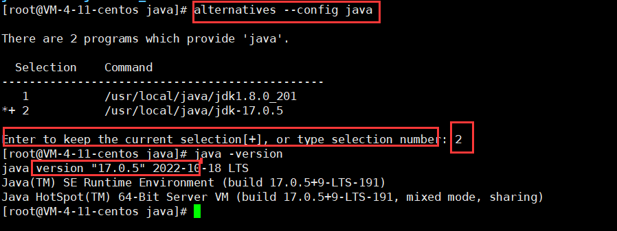
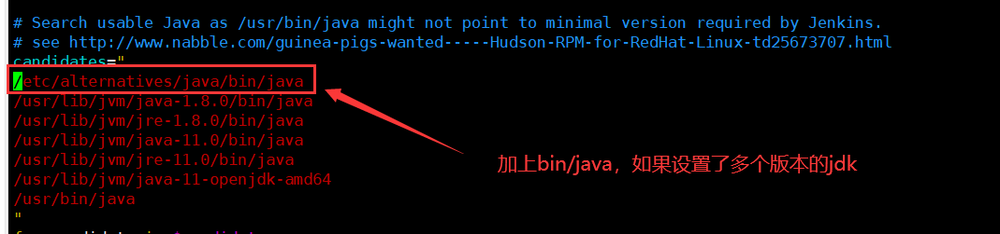

# 项目部署(centOS 7)

## 1. 启动 jar 包

```Shell
# nohup java -jar /*jar名*/ > 输出文件名.out 2>&1 &
# tail -f 输出文件名.out  ==> 打印日志
# ps -ef | grep java(查看进程，这里是查看java进程)
# kill -9 pid 关闭对应进程
```

## 2. 查看开放端口

```Shell
# netstat -anp
# netstat -plunt | grep 3306 // 查看3306的开放情况
```

## 3. 防火墙

```Shell
# systemctl start/restart/stop firewalld // 开启/重启/关闭 防火墙
# firewall-cmd --list-all // 查看防火墙配置信息
# firewall-cmd --list-ports // 查看开放端口
# firewall-cmd --zone=public --query-port=3306/tcp // 查看开放端口
# firewall-cmd --zone=public --add-port=3306/tcp --permanent // 添加开放端口
# firewall-cmd --remove-port=3306/tcp // 删除开放端口
```

## 4. 关于本地客户端一直无法连接服务器 mysql

> Telnet 主机 ip 3306 一直报错无法连接主机

```Shell
# // 首先是在查看mysql的bind-address,一般我们默认给的bind-address是::(* / 0.0.0.0)
（也就是支持所有的ip访问数据库）
# // 出现的问题是： bind-address=127.0.0.1； 改回来就可以啦；
# 如果一直没有解决就重启一下
```

## 5. 使用 Jenkins 自动化部署

> 需要 jdk 环境，当前测试需要的 jdk 版本[11, 17]，由于服务器上使用的 jdk18 所以需要切换版本
>
> 优秀博客： https://blog.csdn.net/Sumuxi9797926/article/details/124972910
>
> https://updates.jenkins.io/update-center.json

- 卸载 jenkins

```Shell
# rpm卸载
rpm -e jenkins
# 检查是否卸载成功
rpm -ql jenkins
# 彻底删除残留文件
find / -iname jenkins | xargs -n 1000 rm -rf
```

### 关于启动 Jenkins 的问题

- Jenkins 默认启动端口是 8080,由于这个端口常用来作为项目部署端口，故此需要需要修改 Jenkins 的端口

```Shell
# vim /etc/sysconfig/jenkins
# 修改
JENKINS_PORT="8089" # 将这个端口号设置为服务器上可用的端口即可
```

- 运行 Jenkins 服务时，出现 jdk 版本不匹配

```Shell
切换版本
```

## 6. Linux 安装多个版本 jdk

> 因为之前安装的 jdk 是直接同 wget 安装的， 按照原来的方法，在官网中找对应的压缩包，进行安装


- 分别为两个版本配置

```Shell
# 命令 --安装 软连接 名称 安装路径 值
alternatives --install /usr/bin/java java /usr/java/jdk1.8.0_201 1
alternatives --install /usr/bin/java java /usr/java/jdk-17.0.5 2
```

- 修改配置文件

```Shell
vim /etc/profile

#这里要写软连接

export JAVA_HOME=/usr/bin/java
export JRE_HOME=${JAVA_HOME}/jre
export CLASSPATH=.:${JAVA_HOME}/lib:${JRE_HOME}/lib
export PATH=${JAVA_HOME}/bin:$PATH


// 刷新一波配置文件
source /etc/profile
```

- 切换 jdk 版本(建议如果原来服务器上安装的是 jdk8 就安装对应 jenkins 版本)

```Shell
# 执行命令，选择对应的值
alternatives --config java
```





## 7. linux 配置 git

https://blog.csdn.net/Jason_Math/article/details/123940302

## 8. 关于 githubt 克隆的需要输入密码(现在输入 token)

https://blog.csdn.net/qq_41646249/article/details/119777084

## 9. 部署 nodejs 项目

> - 安装对应的 node 包，`wget 地址` 即可
> - 安装 pm2，实现关闭服务器的远程连接之后还能继续运行 nodejs 项目；

- Ps:

- - npm script: [npm scripts 使用指南 - 阮一峰的网络日志](http://www.ruanyifeng.com/blog/2016/10/npm_scripts.html)
  - pm2: https://github.com/Unitech/pm2
  - 服务器上运行 nodejs: https://blog.csdn.net/kovlistudio/article/details/82805232

## 10. 通过 github 部署 vitepress

> https://blog.csdn.net/z010202/article/details/127555805
