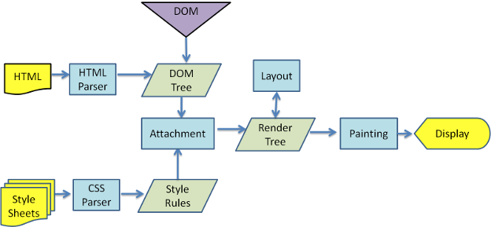
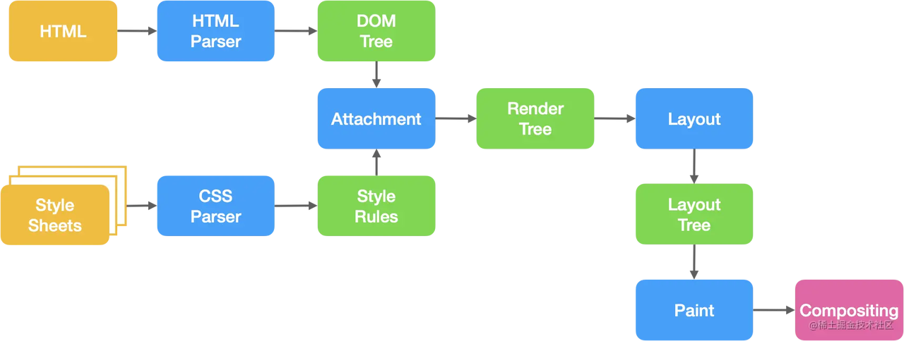

# 前端性能优化-浏览器渲染

## reflow、repaint

**页面的渲染过程(wekit 内核浏览器 render Tree 渲染过程)**



摘至博客：https://segmentfault.com/a/1190000018130499

HTML 解析文件，生成 DOM Tree, Style Sheets 解析 css 文件，生成 CSSOM Tree；

然后 DOM Tree 和 CSSOM Tree 相结合，生成 Render Tree（渲染树）；



重绘(repaint)

> 当渲染树**`render tree`**中的一些元素需要更新样式，但这些样式属性只是改变元素的外观，风格，而不会影响布局的，比如**`background-color`**。则就叫称为**重绘(repaint)**。

回流(reflow)

> 当渲染树`render tree`中的一部分(或全部)因为元素的规模尺寸，布局，隐藏等改变而需要重新构建。这就称为**回流(reflow)**。每个页面至少需要一次回流，就是在页面第一次加载的时候，这时候是一定会发生回流的，因为要构建`render tree`。在回流的时候，浏览器会使渲染树中受到影响的部分失效，并重新构造这部分渲染树，完成回流后，浏览器会重新绘制受影响的部分到屏幕中，该过程称为**重绘**。

- 在 DOM 外，应该尽量少的去操作 DOM

  - ```JavaScript
    for (var i = 0; i < 5; ++i) {
                var li = document.createElement('li');
                li.innerText = 'hello ' + i;
                ul.appendChild(li);
    }

    // 使用DOM片段(文档片段接口)DocumentFragment
    /**
    * 它被作为一个轻量版的 Document 使用，
    就像标准的 document 一样，
    存储由节点（nodes）组成的文档结构。
    与 document 相比，最大的区别是它不是真实 DOM 树的一部分，
    它的变化不会触发 DOM 树的重新渲染，且不会对性能产生影响。
    *
    */


    var fragment = document.createDocumentFragment();
    for (var i = 0; i < 5; ++i) {
        var li = document.createElement('li');
        li.innerText = 'hello ' + i;
        fragment.appendChild(li);
    }
    ul.appendChild(fragment);
    ```

DocumentFragment 节点不属于文档树，在把它插入文档节点之前，随便给他增删节点都不会引起回流

- 在操作 DOM 的时候，将 style 中的 display 设置为‘none’; 设置为 display=none,从 DOM 树中移除，此时操作改节点的时候，就不会出现性能问题；
- 一次修改样式；

  - ```JavaScript
    element.style.color = '#000';
    element.style.fontSize = '16px';

    // 使用class进行修改
    .custom-class {
        color: '#000';
        font-size: 16px;
    }

    element.classList.add('custom-class');
    ```

- 使用缓存，将获取的节点，使用一个变量进行临时保存（**如果需要对 DOM 进行多次访问，尽量使用局部变量缓存该 DOM**）

## css 加载会阻塞 DOM 渲染

> CSSOM 和 DOM 是并行加载的，所以 css 加载不会影响 DOM 解析，但是 render Tree 是需要 CSSOM 和 DOM 一起完成，所以 css 加载会阻塞 DOM 渲染。

### 使用 content-visibility 属性实现只渲染可视区域内容

content-visibility： 只需一行 CSS 代码，让长列表网页的渲染性能提升几倍以上！

content-visibility 属性有三个可选值:

- visible: 默认值。对布局和呈现不会产生什么影响。
- hidden: 元素跳过其内容的呈现。用户代理功能（例如，在页面中查找，按 Tab 键顺序导航等）不可访问已跳过的内容，也不能选择或聚焦。类似于对其内容设置了 display: none 属性。
- auto: 对于用户可见区域的元素，浏览器会正常渲染其内容；对于不可见区域的元素，浏览器会暂时跳过其内容的呈现，等到其处于用户可见区域时，浏览器再渲染其内容。

在做页面渲染时，特别是长列表渲染时候，在用户可视区渲染，非可视区域不渲染对应的子元素内容；

Ps: 这个属性在测试案例中，如果子元素内容特别简单，对于实际渲染反而会出现渲染时间更长，所以这个属性比较实用于一些子元素内容比较复杂的场景；

```CSS
content-visibility:auto;
/* 每个元素的高度值 防止拖动滚动条出现抖动*/
contain-intrinsic-size: 12px;
/* 上面这个属性是下面的合并 */
contain-intrinsic-width: 12px;
contain-intrinsic-height: 12px;
```
