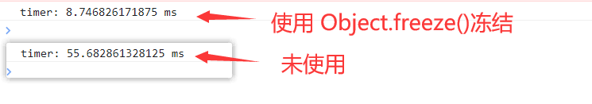
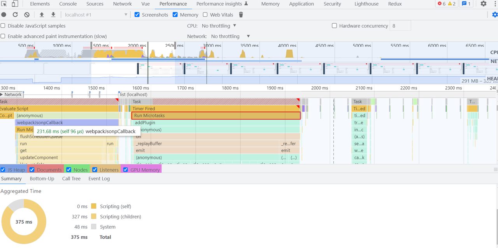
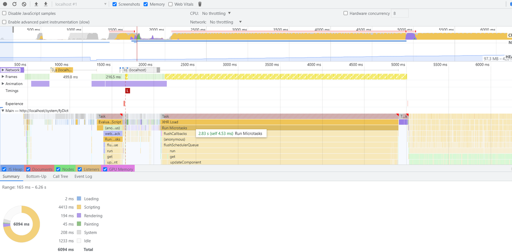
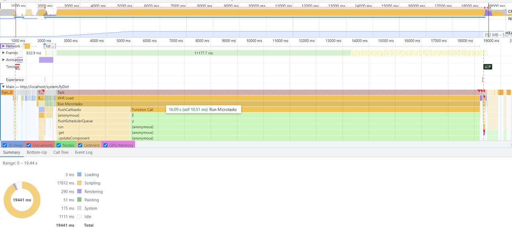

# 虚拟列表相关

> 在实际开发过程中，处理数据列表时，一般采用的是分页进行展示，在一定程度上解决了一次性加载大量数据的网路消耗和浏览器渲染卡顿的问题；但是在有的情况下，为了能够到达更好的页面效果，希望可以不用让用户每次都去点击按钮进入下一页，同时在进行下拉的时候，应适当减少dom节点的增加，这个其实是导致普通列表渲染卡顿的主要原因。对于这些问题的解决，这里引入了**虚拟列表**的概念；

**应用场景**:后台一次性发送上千条或更多数据给前台；

**场景模拟**:用户发起一个请求,后台发送了10w条数据

使用虚拟列表之前:前台需要生成10w个dom节点用来渲染页面

使用虚拟列表之后:前台只需要生成少量dom节点(dom节点数量取决于前端视图需要展示的数量),就可以实现对这10w条数据的视图渲染

**总之**:虚拟列表就是固定dom节点数量,通过修改dom节点的内容而达到不重新增加(或删除)dom节点来实现列表的更新；

## 固定高度的列表项

**实现步骤：**

（1）写一个代表可视区域的div，固定其高度，通过overflow使其允许纵向 Y 轴滚动。

（2）计算区域中可以显示的数据条数。这个用可视区域的高度除以单条数据高度得到。

（3）监听滚动，当滚动条变化时，计算出被卷起的数据的高度。

（4）计算区域内数据的起始索引，也就是区域内的第一条数据：这个用卷起的高度除以单条数据高度可以拿到。

（5）计算区域内数据的结束索引。通过起始索引+可显示的数据的条数可以拿到。

（6）取起始索引和结束索引中间的数据，渲染到可视区域。

（7）计算起始索引对应的数据在整个列表中的偏移位置并设置到列表上。

```HTML
<!DOCTYPE html>
<html lang="en">
  <head>
    <meta charset="UTF-8" />
    <meta http-equiv="X-UA-Compatible" content="IE=edge" />
    <meta name="viewport" content="width=device-width, initial-scale=1.0" />
    <title>实现虚拟列表</title>
    <style>
      .wrapper {
        height: var(--wrapperHeight);
        border: 1px solid #ccc;
        overflow: auto;
      }
      .scroller {
        position: relative;
        height: var(--allHeight);
      }
      .chunk {
        position: absolute;
        top: var(--chunkTop);
      }
    </style>
  </head>
  <body>
    <div class="wrapper">
      <div class="scroller">
        <div class="chunk"></div>
      </div>
    </div>
    <script>
      const wrapper = document.querySelector('.wrapper');
      const scroller = document.querySelector('.scroller');
      const chunk = document.querySelector('.chunk');
      let allData = []; // 总数据
      let allLength = 100000;
      let showData = []; // 可视数据
      let showLength = 0;
      let rowHeight = 50;
      let wrapperHeight = 600;
      let startIndex = 0;
      let endIndex = 0;
      let offsetTop = 0; //偏移量
      let scrollTop = 0;

      wrapper.style.setProperty('--wrapperHeight', wrapperHeight + 'px'); // 设置可视区域容器的高度
      scroller.style.setProperty('--allHeight', allLength * rowHeight + 'px'); // 设置内容的总高度
      // getPropertyValue('wrapperHeight');

      // 构造数据
      function getlist() {
        for (let i = 0; i < allLength; ++i) {
          allData.push(`i am is indexof: ${i + 1}`);
        }
      }
      getlist();
      getShowList();

      // 计算可视区域的数据
      function getShowList() {
        showLength = Math.ceil(wrapperHeight / rowHeight); // 获取可视区域的列表项数量
        startIndex = Math.floor(scrollTop / rowHeight);
        endIndex = startIndex + showLength;
        showData = allData.slice(startIndex, endIndex);
        // 设置数据到视图上
        setDataToView();
        const offsetY = scrollTop - (scrollTop % rowHeight); 
        // 这里需要获取一个能够被rowHeight整除的数来作为item的偏移量，这样随机划动时，
        // 第一条数据都是完整显示的
        offsetTop = offsetY;
        chunk.style.setProperty('--chunkTop', offsetTop + 'px');
      }

      function setDataToView() {
        console.log(showData);
        if (chunk.children?.length > 0) {
          let i = 0;
          for (let item of chunk.children) {
            item.textContent = showData[i];
            ++i;
          }
        } else {
          const fragment = new DocumentFragment();
          for (let i = 0; i < showLength; ++i) {
            const item = document.createElement('div');
            item.style.height = rowHeight + 'px';
            item.textContent = showData[i];
            fragment.append(item);
          }
          chunk.appendChild(fragment);
        }
      }

      // 监听滚动事件
      wrapper.addEventListener('scroll', function (e) {
        const { scrollTop: scrollerTop } = e.target;
        scrollTop = scrollerTop;
        getShowList();
      });
    </script>
  </body>
</html>
```

## 高度不确定的列表项

**[深入【虚拟列表】动态高度、缓冲、异步加载... Vue实现](http://www.xbhp.cn/news/31075.html)**

[「前端进阶」高性能渲染十万条数据(虚拟列表)](https://juejin.cn/post/6844903982742110216#heading-1)

```JavaScript
// 思路
// 高度不确定的列表项，如果能知道它的每一个列表项的高度，得到一个列表数组，那么就可以实现虚拟列表
// 1. 每一个列表项的高度都是动态的，无法在未渲染之前就获取高度信息，可以先假设每一个列表项的高度
// 2. 使用一个位置信息的数组来存放每一个节点的位置信息，初始化阶段每个节点的高度都是预估值，不是真实值
const position = [
            showList.map((item, index) => {
                return {
                            index,
                            height: rowHeight, // 初始阶段预估值
                            top: index * rowHeight,
                            bottom: (index + 1) * rowHeight     
                        }    
            })
      ];
// 4. 
```

> 在线开源： （https://github.com/xiaocheng555/el-table-virtual-scroll）
>
> **vue-virtual-scroll 插件**

## 项目中的性能优化

### 长列表数据优化

使用 `Object.freeze(list)` 冻结基本长列表数据；

这种方案主要是用在vue2项目中，因为默认情况下，定义在data中的变量，都会被vue中的数据劫持机制进行getter/setter设置，倒置要花费大量时间处理数据的响应式；但是在实际业务中，几乎不会对列表数据进行动态修改之类的操作，那么就可以直接使用功能该方法将数据进行冻结，就避免了数据响应式处理，极大降低js脚本执行时间；下图为之际项目中的时间对比：



减少了**80%**的处理时间

参考博客：

https://blog.csdn.net/attach_uzi/article/details/126279393 固定高度时，实现虚拟列表

https://blog.csdn.net/j_bleach/article/details/106891503  树形结构中，实现虚拟列表

https://blog.csdn.net/Dream104/article/details/127324011  界面上只展示一个父节点展开的子节点



**(使用虚拟列表) 提速（****几乎百分百****）**



（使用骨架屏）提速**（68%）**



（原始渲染）