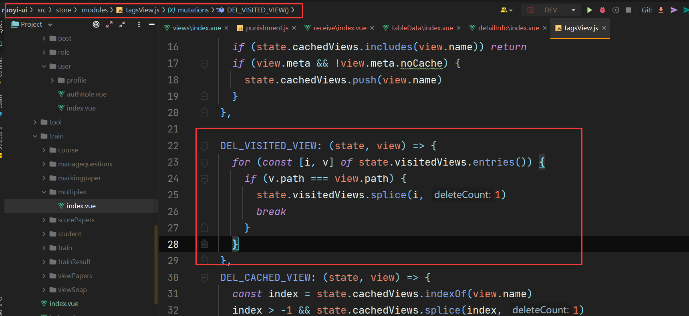
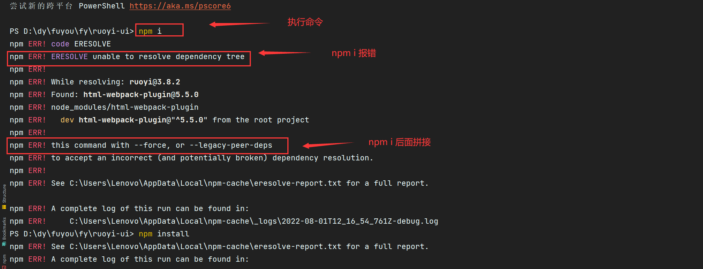

# 项目中遇到的问题

## 1. 使用 el-table 组件时，如何实现表头的合并

> 参考博客: [https://blog.csdn.net/weixin_49668076/article/details/124628953](https://blog.csdn.net/weixin_49668076/article/details/124628953)

**方法:**==使用 el-table 的自定义属性: header-cell-style, 非常好用==

```vue
<script>
export default {
  methods: {
    handerCellStyle() {
      if (rowIndex === 0) {
        //行索引为0代表表头那一行
        if (columnIndex === 10) {
          //列索引，找到你自己要合并的那一列，这个是动态的，根据实际需求来
          this.$nextTick(() => {
            if (document.getElementsByClassName(column.id).length !== 0) {
              document
                .getElementsByClassName(column.id)[0]
                .setAttribute('colSpan', 3); // 这里设置好合并多少列
            }
          });
        }
      }
      if (rowIndex === 0 && columnIndex >= 11) {
        //将相邻的列设为隐藏, 可以是多个
        return { display: 'none' };
      }
      return {
        background: '#b1defd',
        color: '#606266',
        fontWeight: '800',
        textAlign: 'center'
      };
    }
  }
};
</script>
```

## 2. vue 中使用插槽

> 匿名插槽，具名插槽，作用域插槽；这里主要是想解决如何使用插槽传递参数

- **匿名插槽**：使用插槽是没有个插槽指定 name;

  ```vue
  <template>
  	<!--子组件：son-->
  	<div>
          <slot>我是子组件</slot>
      </div>
  </template>

  <template>
  	<!--父组件-->
  	<div>
          <!--默认匹配匿名插槽-->
          <son>父组件中:我是子组件</son>
          <!--也可以写成这样-->
          <son>
              <template>父组件中: 我是子组件</slot>
              <!--或者-->
              <template slot="default">>父组件中: 我是子组件</slot>
              <!--或者-->
              <template #default></slot>
      	</son>
      </div>
  </template>
  ```

- **具名插槽**：具有 name 属性

  ```vue
  <template>
  	<!--子组件：son-->
  	<div>
          <slot name="main">我是子组件</slot>
      </div>
  </template>

  <template>
  	<!--父组件-->
  	<div>
          <!--也可以写成这样-->
          <son>
              <template>父组件中: 我是子组件</slot>
              <!--或者-->
              <template slot="main">>父组件中: 我是子组件</slot>
              <!--或者-->
              <template #main></slot>
      	</son>
      </div>
  </template>
  ```

- **作用域插槽：** 主要是用于插槽传参，现在主要使用 **v-slot**， 目前还是可以使用 'slot-scope'(在 vue2 中可以使用)；

  ```vue
  <template>
    <!--子组件：son-->
    <div>
      <slot name="main" :content="content">我是子组件</slot>
    </div>
  </template>

  <template>
    <!--父组件-->
    <div>
      <template #main="data">我是子组件</template>
      <!--下面这个也是作用域插槽的写法-->
      <template v-slot:main></template>
    </div>
  </template>
  ```

## 3. 关于使用 resetFields()出现的问题

> 如果直接给使用这个方法重置表单，首先会直接将表单赋值为一个空对象，同时会造成重置后的表单无法输入数据；

- 解决方案：需要先给表单设定初始值，这样在使用重置表单的方法时，才不会将 form 对象赋值为空对象；

## 4. js 中关于数组的浅拷贝和深拷贝

> [值得查阅](https://blog.csdn.net/weixin_46074961/article/details/122415014)

- 浅拷贝
  - '='
  - slice
  - concat
  - Object.assign
  - [...] 扩张运算符
- 深拷贝
  - JSON.parse(JSON.stringify(arr))

## 5. vue 中 src 为变量时

> 这里主要是当我们给一个变量赋值为我们存放在 assets 静态资源文件中的图片时，如何将图片加载出来，这里使用==require('url')==

```Vue
// 首先是使用变量的地方


// 给变量赋值复制
imageUrl: reuqire('@/assets/iamges/123.png');
```

## 6. 若依前后端分离中，删除面包屑的方法



## 7. 关于 el-select 无法选中的问题

> 直接强制更新

```vue
this.$forceUpdate(); // 在el-select 中添加@change
```

## 8. Vue 中的**inheritAttrs**属性

> 默认值为 true：此时子组件的根元素上如果有和父组件一样的属性，那么父组件的属性值会覆盖子组件的属性值；
>
> inheritAttrs 为 false 则不会覆盖；
>
> 不想继承所有父组件的内容,同时也不在组件根元素 dom 上显示属性就加上`inheritAttrs: false`,为 true 时是继承所有父组件的值,与 data 同级别。**注意，不想传递给孙组件某个属性，需要子组件用 props 接收。**

## 9. 关于@click 添加多个方法时

> 按从左到右的顺序一次执行，如果第一个是异步方法，那么会同步执行方法

## 10. div 盒子添加 contenteditable='true'属性

> 添加该属性之后可以实现文本输入的功能，可以对输入 html 文本

```vue
<div
  class="div-content editable"
  :contenteditable="true"
  data-placeholder="在这里输入文本..."
>
              {{ rowData.hazardDescribe }}
  </div>

<style>
.editable:empty:before {
  color: #ccc;
  content: attr(data-placeholder); /* 设置伪元素 */
}
</style>
```

## 11. 使用修饰符

> 例： v-model.trim ='' <--- 这个是数据绑定的时候，去除对应值首尾的空格

## 12. 实现局部加载效果

## 13. 使用 !! 符号判断变量是否为 null, undefined, ''

> !!value === ( value != null && value != undefined && value != '' )

## 14. 设置显示固定行的文本

```css
.check-container {
  overflow: hidden;
  text-overflow: ellipsis;
  display: -webkit-box;
  -webkit-line-clamp: 1; // 设置行数
  -webkit-box-orient: vertical;
  word-break: break-all;
}
```

## 15. 使用 XLSX 插件

## 16. 关于使用 v-model 绑定对象后，改变值后，页面不更新

> **原因：Vue 在初始化实例的时候会对属性执行 getter/setter 转化，所以只有在 data 中声明了的对象属性 v-model 的双向数据绑定才会有效**

```js
// 实例化一个Vue对象，data中object.a 是双向绑定的
var vm = new Vue({
  data: {
    object: {
      a: '1'
    }
  }
});

// 假如html中v-model="object.b"
// 在js中进行如下赋值，
this.object.b = '1';
```

**解决方案：**

**方案一：添加属性从而触发 v-model 的双向数据绑定**

```js
1. Vue.set(object, key, value)
例： Vue.set(vm.object, 'b', '1')

2. 使用$set实例方法，参数与方法1相同
例：this.$set(this.object, 'b', '2') // 使用这个方法直接见效果

3. 使用Object.assign(target, object...)  参数说明：第一个为目标对象，后面的是传入对象，同属性名后面的会覆盖前面的对象属性值
例：this.object.b = '2';
   this.object = Object.assign({}, this.object)
注：这种方法相当于将数据拷贝，即改变object这个对象的指针从而触发更新

```

**方案二：赋值完成后进行页面刷新**

```js
1. this.$forceUpdate()   // 该方法会进行页面强制刷新

2. this.$nextTick() + v-if  // 等待所有DOM元素更新完毕之后再次进行一次页面刷新

html:
<template v-if="refresh">  // 在元素上绑定一个用于判断的值，布尔类型即可
	...包含的元素
</template>

js：
data() {
	return {
		refresh: true
	}
}
methods: {
	fresh() {
		this.refresh = false;
		this.$nextTick(() => {
			this.refresh = true
		})
	}
}
在需要刷新的时候调用一下this.fresh()就可以手动实现一次页面的刷新了。

```

## 17. 若依处理清除浮动的方式

```css
.clearfix {
  &:after {
    visibility: hidden;
    display: block;
    font-size: 0;
    content: ' ';
    clear: both;
    height: 0;
  }
}
```

## 18. 关于 vue 中 style 标签的 scoped

> 这个很好的解决了每个页面使用的样式不会影响到其他页面，在那些不同页面使用了相同的样式类名时，使用这个属性就完美地解决了其他文件的 css 影响当前的文件

## 19. 自己封装一个深度搜索方法

```js
export function searchDeptName(deptId, deptNames) {
  // deptId 为目标元素， deptName 树状结构的数组
  if (!Array.isArray(deptNames) || deptNames.length === 0) return null;
  if (deptId) {
    for (let i = 0; i < deptNames.length; ++i) {
      if (deptNames[i].id == deptId) {
        return deptNames[i].label;
      } else if (deptNames[i].children && deptNames[i].children.length > 0) {
        return searchDeptName(deptId, deptNames[i].children);
      }
    }
  }
  return null;
}
```

## 20. 一个节流函数

> 使用闭包

```js
// 定义一个节流函数
function Throttle() {
  var prev = Date.now(); // 获取当前时间戳
  return function (fun, wait) {
    var now = Date.now();
    if (now - prev > wait) {
      fun();
      prev = Date.now();
    }
  };
}
export const throttle = Throttle();
```

## 21. 同时实现 overflow-x , overflow-y

## 22. 前端上传图片之前实现突图片预览

> 采用 window.URL.createOjectURL:

```js
uploadImage(file) {
  // // 创建一个读取对象
  // let fileReader = new FileReader();
  // // 将文件转换为一个二进制对象
  // fileReader.readAsArrayBuffer(file.file);
  // fileReader.onload = (e) => {
  //   // 监听完成后，将二进制字符串转化为Blob对象，并且通过URL.createObjectURL创建一个url，指向该Blob对象
  //   let url = window.URL.createObjectURL(new Blob([e.target.result])); //
  //   this.imageUrl = url;
  // }

}
```

## 23. 关于修改 el-table 中数组元素的值后，值更新而页面不更新的问题

> 给 el-table 添加一个 key 属性

```vue
<el-table :data="tableData" :key="itemKey"></el-table>

<!--每次在给tableData赋值的时候，就为key设置一个随机值，以此就可以实现更新页面-->
```

## 24. 关于 el-table 中实现复选框回显的情况

> [值得阅读](https://www.csdn.net/tags/NtzaYg5sODE3OTktYmxvZwO0O0OO0O0O.html)

> (防止文档被删除，特此拷贝一份)
>
> ### 一、`html`部分如下
>
> 1、`type="selection"`就是现实选框
> 2、`:row-key="getRowKey"`（必须是唯一的字段，例如：id）和`:reserve-selection="true"`是必要的，可以记录选中的数据，翻页也无所谓
>
> ```html
> <el-row justify="center">
>   <el-table
>     ref="multipleTable"
>     :data="productList"
>     :row-key="getRowKey"
>     :cell-style="cellClass"
>     stripe
>     style="width: 100%;"
>     border
>     @selection-change="handleSelectionChange"
>   >
>     <el-table-column
>       min-width="30"
>       :reserve-selection="true"
>       type="selection"
>     />
>     <el-table-column
>       label="货号"
>       min-width="100"
>       align="center"
>       prop="modelDesc"
>     />
>     <el-table-column
>       label="产品名称"
>       min-width="100"
>       align="center"
>       prop="productName"
>     />
>     <el-table-column
>       label="规格型号"
>       min-width="100"
>       align="center"
>       prop="modelName"
>     />
>   </el-table>
> </el-row>
> ```
>
> 其中 getRowKey 必须返回唯一的字段，本例写法如下；可以写在方法下或者 data 中
>
> ```js
> getRowKey(row) {
>   return row.modelId + ''
> },
> ```
>
> 3、做好以上两步之后就是勾选选中项目了；就是遍历 table 数据比较已经选中的数据，表格中对已经选中的做`toggleRowSelection`操作
>
> ```js
> this.productList.forEach((item) => {
>   if (this.multipleSelection.some((data) => data.modelId === item.modelId)) {
>     this.$refs.multipleTable.toggleRowSelection(item, true); //这样就可以了
>   }
> });
> ```
>
> 4、如果这个选择数据列表是以`el-dialog`的形式打开的，那就需要刷新`dialog`，那就不能只是用`visible`属性控制显示隐藏，因为这个`visible`其实是物理隐藏，说白了就是`css`样式控制的显示隐藏；但是回显每次都会触发`selection-change`方法，那么 val 数据会重复，回显的数据和选中的数据不能准确的对应，这时候需要用 v-if 指令控制显示隐藏，仔细想下`v-if`和`v-show`的区别你应该就知道了
>
> ## 二、注意需要考虑因为 toggleRowSelection 导致的重复选中的问题
>
> 在执行 toggleRowSelection 的时候和 selection-change 的时候，要设置标识来区分之前是否已经选中，
>
> 已经选中的 selection 可以通过 this.$refs.Table.selection 获取到，这是一个数组

## 25. 关于 el-form 中只有一个 el-input

> 这个时候会出现的直接在输入框中回车时，会出现页面被整体刷新


**解决方案：**

`el-form`上面添加`@submit.native.prevent`阻止默认事件


## 26. vue-treeselect 下拉数据被遮挡问题

> 解决方案： 项目中用到了 vue-treeselect 组件，加载数据后，下拉框的数据显示不完全，有被遮挡的情况，添加属性 :appendToBody="true" 即可。(**未测试**)

```vue
<treeselect
  :appendToBody="true"
  :options="item.options"
  v-model="formResult[item.columncode]"
  :normalizer="normalizer"
  placeholder="请选择"
  noOptionsText="无数据"
  :disabled="item.isedit == 0"
  @open="selectFocus(item)"
/>
```

## 27. vue-treeselect 组件

**1. 设置默认展开全部**

`:defaultExpandLevel="Infinity"` // ==Infinity== 是表示正无穷

## 28. vue 中使用 keep-alive 的页面解决刷新的问题

> 需求：==当前页面需要缓存状态(比如页面为选项卡的形式，就有几种状态存在，所以可以使用 keep-alive 缓存)， 但是我们在从其他页面回到这个页面时，应该需要从新获取一次数据，因为可能我们在其他地方操作之后将后端数据库的数据更新了，所以我们就要在回到这个页面时更据之前的状态从新获取一次数据==
>
> **解决方案：** 使用 vue 的生命周期的钩子函数`activate()`; 它是在使用 keep-alive 之后，当我们从其他页面进入这个页面时候，才会被执行，初始时不会执行；
>
> 方案弊端： 每次进入这个页面的时候都会进行数据获取，会消耗网络流量

## 29. 关于若依的宝藏路由回退

> `this.$tab.closeOpenPage()` // 这个回退，底层是在进行路由 push，但是，他可以回退到上一个路由的状态下，而不是在 history 单纯的新增一个路由

## 30. 关于 tooltip

> html 原生里面，直接在元素上给 title 属性，就可以实现这个功能呢
>
> 第二种方案是使用 el-tooltip 这个组件，但是默认状态下，这个组件会直接触发事件，显示相应的 tip,在需求中我们需要当内容超出文本域之后才会有对应的弹框

**这里是对 el-tooltip 进行了二次封装，但是这里使用 ref 来获取文本内容，要求在同一个页面下，多次使用这个组件时，需要传递不同的 refName，所以这里对于我们的需求还是有点局限， (动态设置 refName)**

```vue
<template>
  <div class="text-tooltip">
    <el-tooltip
      class="item"
      effect="dark"
      :disabled="isShowTooltip"
      :content="content"
      placement="top"
    >
      <p class="over-flow" :class="className" @mouseover="onMouseOver(refName)">
        <span :ref="refName">{{ content || '-' }}</span>
      </p>
    </el-tooltip>
  </div>
</template>

<script>
export default {
  name: 'textTooltip',
  props: {
    // 显示的文字内容
    content: {
      type: String,
      default: () => {
        return '';
      }
    },
    // 外层框的样式，在传入的这个类名中设置文字显示的宽度
    className: {
      type: String,
      default: () => {
        return '';
      }
    },
    // 为页面文字标识（如在同一页面中调用多次组件，此参数不可重复）
    refName: {
      type: String,
      default: () => {
        return '';
      }
    }
  },
  data() {
    return {
      isShowTooltip: true
    };
  },
  methods: {
    onMouseOver(str) {
      let parentWidth = this.$refs[str].parentNode.offsetWidth;
      let contentWidth = this.$refs[str].offsetWidth;
      // 判断是否开启tooltip功能
      if (contentWidth > parentWidth) {
        this.isShowTooltip = false;
      } else {
        this.isShowTooltip = true;
      }
    }
  }
};
</script>

<style lang="scss" scoped>
.over-flow {
  overflow: hidden;
  white-space: nowrap;
  text-overflow: ellipsis;
}
.wid190 {
  width: 100%;
}
p {
  margin: 0;
}
</style>
```

## 31. 关于 el-table 分页下，索引连续处理

> 使用计算属性处理

```js
export const tableIndex = {
  computed: {
    indexMethod() {
      return (this.pageNum - 1) * this.pageSize + 1;
    }
  }
};
```

```vue
<el-table :data="tableData">
    <el-table-column type="index" :index="indexMethod"></el-table-column>
</el-table>
```

## 32. 关于列表查询

> 当我们在进行列表查询的时候，如果有选项卡的时候，也就是存在多个状态时，如果我们最开始的时候不传递分页参数的话，虽然后端会有默认值，返回给前端，但是前端再进行选项卡切换的时候，会出现同一个请求发多次的情况，所以这里需要注意

## 33. vue-treeselect 中当 children 为空时

> CSDN 拷贝---》 效果显著

```js
normalizer(node) {
  if (node.children && !node.children.length) {
    delete node.children;
  }
  return {
    id: node.id,  //自定义id
    label: node.label,  //自定义label
    //处理children，当children为[]或null时，子节点会展示No sub-options，一般子节点不需要展示这个，所以将children置为0
    children: node.children && node.children.length > 0 ? node.children: 0
    };
  }
}
```

## 34. 关于 npm 安装依赖时报错提示找不到依赖树

> 解决方案： 直接拼接对应的 command



## 35. 关于 git

> 前后端分离项目中，前端一般不会主动提交后端代码，但是有时我们会在本地去修改后端代码，这就造成我们在提交代码的时候，会出现使用有一部分后端代码没有提交，虽然当时不会有什么影响，但是后面发现本地后端代码和远程仓库代码不一样，也就是本地没有更新，目前解决的方法是：git
>
> ==本地提交一次后端代码，然后再进行版本回退，发现本地代码更新了(只试过一次，这个方法有待校验)==

```git
git reflog   ## 查看提交记录
git reset --hard id(提交记录的版本号) 版本回退
```

## 36. 关于后端启动时，端口占用

```
netstat -ano | findstr port(端口号) // 查看进程
taskkill /f /pid 进程号()  // 关闭进程

// 额外
## 查看所有进程
tasklist
```


## 37. 使用 webSocket

[webSocket 的使用](https://blog.csdn.net/weixin_43334673/article/details/123547860)

## 38. 记录一次，关于部署到服务器上的项目，访问 127.0.0.1

> 此时访问到的还是我们本地的地址，但是自己总感觉有点小问题

## 39. 关于 Vue 项目打包部署的时候（生成、测试环境）删除 Console.log

> [相关博客](https://blog.csdn.net/weixin_48585264/article/details/119426851)

```js
chainWebpack(config) {
    config.optimization.minimizer('terser').tap((args) => {
      args[0].terserOptions.compress.drop_console = true
      return args
    })
}
```

## 40. 关于 java 打包部署到服务器时的启动命令

```
# nohup java -jar /*jar名*/ > 输出文件名.out 2>&1 &
# tail -f 输出文件名.out  ==> 打印日志
# ps -ef | grep java(查看进程，这里是查看java进程)
# kill -9 pid 关闭对应进程
```

## 41. 关于建立 webSocket 连接时，处理异步

```js
function checkServerStatus() {
  return new Promise((resolve, reject) => {
    const ws = new WebSocket('ws://127.0.0.1:8080');
    ws.onopen = () => {
      resolve(ws.readyState);
      ws.close();
    };
    ws.onerror = (e) => {
      reject(e);
    };
  });
}
```

## 42. 使用 tinyMCE 富文本插件

**先附上博客**

[tinymce 富文本编辑器（vue）](https://blog.csdn.net/yzding1225/article/details/119561821)

[TinyMCE 菜单配置详解](https://blog.csdn.net/zjiang1994/article/details/79856058)

## 43. 组件中使用多个 el-table 组件时，需要注意

# 44. base64 转换成 formData 对象上传

[](https://blog.csdn.net/weixin_45977625/article/details/122427994)

# 45. 记录一次前端直接下载文件时，出现的问题

> 问题描述： 1. 下载的文件地址是跨域地址，这样如果我们通过 a 标签给下载的文件设置名称时，会发现无法实现；
>
> 2. 下载的文件如果是 pdf, img 等浏览器可以直接识别的文件，浏览器会自动跳转到预览页面；

**解决方案**

```js
/**
 * 使用get请求获取到blob二进制对象
 * 使用 window.URL.createObjectUrl(blob)得到blob的url
 */

export function downloadFile(url, fileName) {
  axios({
    method: 'get',
    url,
    responseType: 'blob'
  }).then((res) => {
    const url = window.URL.createObjectURL(res.data);
    const element = document.createElement('a');
    element.href = url;
    element.setAttribute('target', '_blank');
    -fileName && element.setAttribute('download', fileName);
    element.click();
    element.remove();
  });
}
```

# 46. js 中()运算符：执行单个或多个表达式

```js
let a = 1;
const b = 2;
const c = 4;

// 执行单个或者多个表达式
console.log((++a, b + a, a + b + c)); // 2(++a) => 4(b+a) => 8(b + a + c)
// 返回的是最后一个表单式的值
```

# 47. git commit 规范

> https://blog.csdn.net/fesfsefgs/article/details/109435185

```
feat: 新特性
fix: 修改问题
refactor: 代码重构
docs: 文档修改
style: 代码格式修改, 注意不是 css 修改
test: 测试用例修改
chore: 其他修改, 比如构建流程, 依赖管理.
pref: 性能提升的修改
build: 对项目构建或者依赖的改动
ci: CI 的修改
revert: revert 前一个 commit

```

# 48. 使用 patch-package 给插件打补丁

# 49. 使用 vue 中的 extends 扩展组件

# 50.前端将本地文件转成 url（public 下的文件）

> 当前是要将本地的 pdf 文件转成一个 url 可以访问的文件，然后通过 print-js 打印

```js
// 通过发送
```

# 51. git 版本回退

```
使用git reset回退公共远程分支的版本后，需要其他所有人手动用远程master分支覆盖本地master分支，显然，这不是优雅的回退方法，下面我们使用另个一个命令来回退版本：

git revert HEAD                     //撤销最近一次提交
git revert HEAD~1                   //撤销上上次的提交，注意：数字从0开始
git revert 0ffaacc                  //撤销0ffaacc这次提交
1
2
3
git revert 命令意思是撤销某次提交。它会产生一个新的提交，虽然代码回退了，但是版本依然是向前的，所以，当你用revert回退之后，所有人pull之后，他们的代码也自动的回退了。
但是，要注意以下几点：
1）revert 是撤销一次提交，所以后面的commit id是你需要回滚到的版本的前一次提交
2）使用revert HEAD是撤销最近的一次提交，如果你最近一次提交是用revert命令产生的，那么你再执行一次，就相当于撤销了上次的撤销操作，换句话说，你连续执行两次revert HEAD命令，就跟没执行是一样的
3）使用revert HEAD~1 表示撤销最近2次提交，这个数字是从0开始的
```

> 1. 关于强制回退版本的情况： 使用 git reset --hard version 这种防止回退，造成的影响就是会将后面的版本都删除掉，同时通过实验发现，在实际操作中，还会造成他人代码返回到更久之前的版本；
> 2. 使用 revert 撤销提交记录，这个可以保留所有提交的记录，然后新增一条提交记录，用于撤回提交

---

# 52. 关于 vue.config.js 的配置（基于智慧校园项目的配置）

```js
'use strict';
const path = require('path');

function resolve(dir) {
  return path.join(__dirname, dir);
}

const CompressionPlugin = require('compression-webpack-plugin');

const name = process.env.VUE_APP_TITLE || '智慧校园'; // 网页标题

const port = process.env.port || process.env.npm_config_port || 80; // 端口

// vue.config.js 配置说明
//官方vue.config.js 参考文档 https://cli.vuejs.org/zh/config/#css-loaderoptions
// 这里只列一部分，具体配置参考文档
module.exports = {
  // 部署生产环境和开发环境下的URL。
  // 默认情况下，Vue CLI 会假设你的应用是被部署在一个域名的根路径上
  // 例如 https://www.ruoyi.vip/。如果应用被部署在一个子路径上，你就需要用这个选项指定这个子路径。例如，如果你的应用被部署在 https://www.ruoyi.vip/admin/，则设置 baseUrl 为 /admin/。
  publicPath: process.env.NODE_ENV === 'production' ? '/' : '/',
  // 在npm run build 或 yarn build 时 ，生成文件的目录名称（要和baseUrl的生产环境路径一致）（默认dist）
  outputDir: 'dist',
  // 用于放置生成的静态资源 (js、css、img、fonts) 的；（项目打包之后，静态资源会放在这个文件夹下）
  assetsDir: 'static',
  // 是否开启eslint保存检测，有效值：ture | false | 'error'
  lintOnSave: process.env.NODE_ENV === 'development',
  // 如果你不需要生产环境的 source map，可以将其设置为 false 以加速生产环境构建。
  productionSourceMap: false,
  // webpack-dev-server 相关配置
  devServer: {
    host: '0.0.0.0', // 这样配置可以被外网访问到
    port: port, // 指定监听请求的端口号
    open: true, // 是否在服务启动之后，就打开浏览器，
    proxy: {
      // detail: https://cli.vuejs.org/config/#devserver-proxy
      [process.env.VUE_APP_BASE_API]: {
        target: `http://localhost:8848`,
        changeOrigin: true,
        pathRewrite: {
          ['^' + process.env.VUE_APP_BASE_API]: ''
        }
      }
    },
    disableHostCheck: true
  },
  css: {
    loaderOptions: {
      sass: {
        sassOptions: { outputStyle: 'expanded' }
      }
    }
  },
  configureWebpack: {
    name: name,
    resolve: {
      alias: {
        '@': resolve('src')
      }
    },
    // 添加一个devtool
    devtool: 'source-map',
    plugins: [
      // http://doc.ruoyi.vip/ruoyi-vue/other/faq.html#使用gzip解压缩静态文件
      new CompressionPlugin({
        cache: false, // 不启用文件缓存
        test: /\.(js|css|html)?$/i, // 压缩文件格式
        filename: '[path].gz[query]', // 压缩后的文件名
        algorithm: 'gzip', // 使用gzip压缩
        minRatio: 0.8 // 压缩率小于1才会压缩
      })
    ]
  },
  chainWebpack(config) {
    config.plugins.delete('preload'); // TODO: need test
    config.plugins.delete('prefetch'); // TODO: need test

    // set svg-sprite-loader
    config.module.rule('svg').exclude.add(resolve('src/assets/icons')).end();
    config.module
      .rule('icons')
      .test(/\.svg$/)
      .include.add(resolve('src/assets/icons'))
      .end()
      .use('svg-sprite-loader')
      .loader('svg-sprite-loader')
      .options({
        symbolId: 'icon-[name]'
      })
      .end();

    config.when(process.env.NODE_ENV !== 'development', (config) => {
      config
        .plugin('ScriptExtHtmlWebpackPlugin')
        .after('html')
        .use('script-ext-html-webpack-plugin', [
          {
            // `runtime` must same as runtimeChunk name. default is `runtime`
            inline: /runtime\..*\.js$/
          }
        ])
        .end();
      config.optimization.splitChunks({
        chunks: 'all',
        cacheGroups: {
          libs: {
            name: 'chunk-libs',
            test: /[\\/]node_modules[\\/]/,
            priority: 10,
            chunks: 'initial' // only package third parties that are initially dependent
          },
          elementUI: {
            name: 'chunk-elementUI', // split elementUI into a single package
            priority: 20,
            // the weight needs to be larger than libs and app or it will be packaged into libs 					// or app
            test: /[\\/]node_modules[\\/]_?element-ui(.*)/ // in order to adapt to cnpm
          },
          commons: {
            name: 'chunk-commons',
            test: resolve('src/components'), // can customize your rules
            minChunks: 3, //  minimum common number
            priority: 5,
            reuseExistingChunk: true
          }
        }
      });
      config.optimization.runtimeChunk('single'),
        {
          from: path.resolve(__dirname, './public/robots.txt'), //防爬虫文件
          to: './' //到根目录下
        };
    });
  }
};
```

**关于 devServer 配置**

```js
module.exports = {
  devServer: {
    host: '0.0.0.0', // 配置外网访问
    open: true, // 配置启动时，打开浏览器
    /**
     * 配置打开指定的页面： open: ['/index']
     * 配置打开指定的浏览器：
     * open: {
     *	 app: {
     *		name: 'google-chrome',
     *	 },
     * },
     * 浏览器应用程序名称与平台相关。不要在可重用模块中硬编码它。例如，'Chrome' 在 macOS 是 'Google Chrome'，在 			*	Linux 是 'google-chrome'，在 Windows 是 'chrome'。
     */
    port: 8080 // 监听请求端口， port 配置项不能设置为 null 或者空字符串，要想自动使用一个可用端口请使用 port: 						// 'auto'：
  }
};
```

这里添加一些项目复制粘贴代码

```vue
<template slot="empty">
  <div class="custom__table__empty-data">
    <svg-icon icon-class="noData" style="font-size: 50px" />
    <span style="color: #8c939d">当前状态下暂无数据</span>
  </div>
</template>
```

```css
::v-deep .treeselect-main {
  width: 204px;
  line-height: 34px;

  .vue-treeselect__placeholder {
    line-height: 34px;
  }

  .vue-treeselect__control {
    height: 34px !important;
  }
}
```

**关于 div 可以输入文本时，限制文本长度**

`https://www.cnblogs.com/chensv/p/15656858.html`
