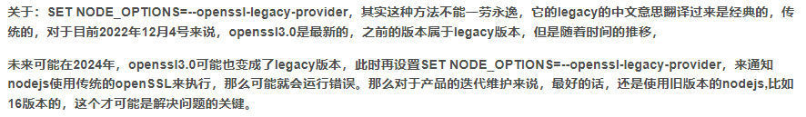

# 项目笔记

关于自己在项目学习的一些笔记

## 对于一些知识的补充

1. ### Patch-package

> 用于给第三方插件打补丁，实现在整个项目中，每个成员使用的这个第三方插件都是被修改的；

**大致用法：**

```JavaScript
// 1. 安装patch-package
npm install patch-package --save-dev

// 2. 修改第三方文件

// 3. 执行打补丁
npx patch-package [依赖文件名]
```

**效果：（执行完命令后，会生成对应的补丁文件）**


**实现项目成员也可以使用修改之后的第三方插件**

```JavaScript
// 4. 在package.json文件中添加执行命令
{
    "script": {
        "postinstall": "patch-package"
       // 作用：当同事执行 npm i 的时候，会自动执行 npm run postinstall 这个命令，也就是执行 patch-package ，这时候就会去读取 patches 目录，并将那些补丁打到对应的 node_modules 包里，从而达到同步修改代码的效果
    }
}
```

**拓展**

`--reverse` 撤回所有补丁 Note: 如果打补丁后，补丁文件被修改过，此操作将失败，此时可以重新安装 node_modules

`--patch-dir` 指定补丁文件所在目录

**最后：**

> 虽然通过给第三方插件打补丁可以根据业务开发实现一定的效果，但是这终究不是一个最终的解决方案，当然在大多数情况下都不是一个较好的方法，我觉得这个大多可以使用在开发环境下，对一些功能的调试等。
>
> 我实际的生产过程中，我们应该遵循开闭原则，对修改关闭，对补充开发，我们应该尽量去补充插件的功能，但是不应该去修改他，一是考虑到插件的迭代，而是降低项目的维护成本。

1. ## 模拟数据

- **[faker](https://github.com/faker-js/faker)**
- mockjs

1. ### 使用 mockjs

> 博客: https://blog.csdn.net/weixin_45616480/article/details/125895522
>
> github 地址： https://github.com/nuysoft/Mock/wiki/Mock.mock()

1. ### 连线： js 库

**neovis.js:** **https://github.com/neo4j-contrib/neovis.js**

1. ## 在 vite 项目中，打包生产环境的静态资源时，出现部署后网站图片打不开

> 查看实际的打包文件发现根本就没有将对应的图片打包进去，当时在项目中发现直接写图片的地址就可以直接加载图片，索性当时就没有直接去搭理它，能用就行了；
>
> 但是，很不幸的是，项目部署上去之后，图片裂开了，当时我整个人也是裂开的，因为时间比较紧了，当时就火急火燎地弄，看网上的博客，看官方文档，但是使用最多的就是 new URL 这个方法；当时尝试使用之后，发现不行（其实当时自己没有仔细看报错信息，是自己参数传错了）；然后陆陆续续去尝试其他方法（使用过哪些也忘得差不多了），最后，终于发现了 new URL 当时参数传错的情况，然后看看官方文档，的确还是自己传错了。
>
> 下面附上官方文档的内容：

1. ## new URL(url, import.meta.url)[¶](https://cn.vitejs.dev/guide/assets.html#new-url-url-import-meta-url)

[import.meta.url](https://developer.mozilla.org/en-US/docs/Web/JavaScript/Reference/Statements/import.meta) 是一个 ESM 的原生功能，会暴露当前模块的 URL。将它与原生的 [URL 构造器](https://developer.mozilla.org/en-US/docs/Web/API/URL) 组合使用，在一个 JavaScript 模块中，通过相对路径我们就能得到一个被完整解析的静态资源 URL：

```JavaScript
const imgUrl = new URL('./img.png', import.meta.url).hrefdocument.getElementById('hero-img').src = imgUrl
```

这在现代浏览器中能够原生使用 - 实际上，Vite 并不需要在开发阶段处理这些代码！

这个模式同样还可以通过字符串模板支持动态 URL：

```JavaScript
function getImageUrl(name) {  return new URL(`./dir/${name}.png`, import.meta.url).href}
```

在生产构建时，Vite 才会进行必要的转换保证 URL 在打包和资源哈希后仍指向正确的地址。然而，这个 URL 字符串必须是静态的，这样才好分析。否则代码将被原样保留、因而在 `build.target` 不支持 `import.meta.url` 时会导致运行时错误。

```JavaScript
// Vite 不会转换这个const imgUrl = new URL(imagePath, import.meta.url).href
```

**注意：无法在 SSR 中使用**

如果你正在以服务端渲染模式使用 Vite 则此模式不支持，因为 **`import.meta.url`** 在浏览器和 Node.js 中有不同的语义。服务端的产物也无法预先确定客户端主机 URL。

1. ## 关于新版本的 node 中，启动项目报错(digital envelope routines: : unsupported)的问题

> 参考： https://blog.csdn.net/fengyuyeguirenenen/article/details/128319228

> 网上搜索的原因是从 node v17 版本开始，就新增了一个 openSSL3.0, **而 OpenSSL3.0 对允许算法和密钥大小增加了严格的限制，可能会对生态系统造成一些影响。故此以前的项目在升级** **[nodejs](https://so.csdn.net/so/search?q=nodejs&spm=1001.2101.3001.7020)** **版本后会报错。**

解决方案：

1. #### 在 package.json 中配置如下：

```JSON
"script": {
    "dev": "SET NODE_OPTIONS=--openssl-legacy-provider && vue-cli-service serve"
}
```

ps： 当然这个命令也可以用在控制台中：

```Shell
# 在项目路径下依次输入如下命令：
# 第一行
SET NODE_OPTIONS=--openssl-legacy-provider
# 回车后输入第二行
vue-cli-service serve
```

1. #### 降低 node 版本到 16 左右

> 使用这种方式的原因主要是因为上面的方法使用只是暂时的，来看下网上的说法：



所以这里，也是比较推荐使用第二种方法，当然进行 node 版本切换，作为 windows 用户，我使用的还是 nvm；

1. ## 查询浏览器及其版本

- print-js 源码中获取浏览器信息方法

```JavaScript
const Browser = {
  // Firefox 1.0+
  isFirefox: () => {
    return typeof InstallTrigger !== 'undefined'
  },
  // Internet Explorer 6-11
  isIE: () => {
    return navigator.userAgent.indexOf('MSIE') !== -1 || !!document.documentMode
  },
  // Edge 20+
  isEdge: () => {
    return !Browser.isIE() && !!window.StyleMedia
  },
  // Chrome 1+
  isChrome: (context = window) => {
    return !!context.chrome
  },
  // At least Safari 3+: "[object HTMLElementConstructor]"
  isSafari: () => {
    return Object.prototype.toString.call(window.HTMLElement).indexOf('Constructor') > 0 ||
        navigator.userAgent.toLowerCase().indexOf('safari') !== -1
  },
  // IOS Chrome
  isIOSChrome: () => {
    return navigator.userAgent.toLowerCase().indexOf('crios') !== -1
  }
}
```

1. ## 在浏览器中根据 url 下载文件

```JavaScript
//
import {saveAs} from 'file-saver'
export function download(url, params, filename) {
  return axios.post(url, params, {
    transformRequest: [(params) => {
      return tansParams(params)
    }],
    headers: {'Content-Type': 'application/x-www-form-urlencoded'},
    responseType: 'blob',
    timeout: 1800000
  }).then(async (data) => {
  /*
       // 验证是否为blob格式
    export async function blobValidate(data) {
         try {
            const text = await data.text();
            JSON.parse(text);
            return false;
          } catch (error) {
            return true;
          }
      }
  */

    const isBlob = await blobValidate(data); // 验证是否为blob格式
    if (isBlob) {
      const blob = new Blob([data]);
      saveAs(blob, filename);
    } else {
      const resText = await data.text();
      const rspObj = JSON.parse(resText);
      const errMsg = errorCode[rspObj.code] || rspObj.msg || errorCode['default']
      Message.error(errMsg);
    }
    downloadLoadingInstance.close();
  }).catch((r) => {
    console.error(r);
    Message.error('下载文件出现错误，请联系管理员！');
    downloadLoadingInstance.close();
  })
}
```

1. ## 使用 bash

> - https://www.51cto.com/article/740743.html
> - https://blog.csdn.net/zz00008888/article/details/122217882
